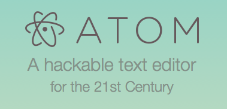

#Live System
To get started, check out: [https://agenatrader.github.io/AgenaIndicator-documentation/site/index.html](https://agenatrader.github.io/AgenaIndicator-documentation/site/index.html)

#Documentation
MkDocs is a fast, simple and downright gorgeous static site generator that's geared towards building project documentation.
Documentation source files are written in [Markdown](https://guides.github.com/features/mastering-markdown/), and configured with a single YAML configuration file.
The tutorials in the sources directory of this repository, are built with mkdocs and publicly hosted on GitHub Pages at [https://agenatrader.github.io/AgenaIndicator-documentation/site/index.html](https://agenatrader.github.io/AgenaIndicator-documentation/site/index.html).

##Getting Started

###Editor
To edit these files you can use the GitHub Online Editor but we recommend to use a separate text editor.
We recommend the text editor *Atom*. You can download it here: [Download Atom](https://atom.io)



###Installation
The following things are prerequisites:
* Install [GitHub Client](https://desktop.github.com) and create a GitHub user
* Install [Python](https://www.python.org/downloads/)
* Install Python package [mkdocs](http://www.mkdocs.org) using pip

###Parsing markdown to static website
Clone the master repository to your local computer.

Tutorials are written in markdown format and stored in the sources directory of this repository.
To parse these markdown files into static websites we need mkdocs to do this work for us. mkdocs will parse these markdown files, translate it into static websites and store it into the site directory.
All configuration is done in a single [YAML configuration file](mkdocs.yml) to configure the parsing process.
Open Console, navigate to your YAML configuration file and build the markdown files using the mkdocs build command.
```bash
mkdocs build
```
This will create a new directory named *site*.
If you are getting a warning that the *site directory* has already created, you can use the `clean` parameter to delete this directory before recreation.
```bash
mkdocs build --clean
```
We have created a branch called *gh-pages* and all data from this branch will be displayed on GitHub Pages.
Commit now your changes into the master repository, sync your repository and *change locally to the branch gh-pages*. Update all changes from master into the branch using the GitHub Client function *upate from master*.

Congrats! We are done. All changes are now online on GitHub Pages.
