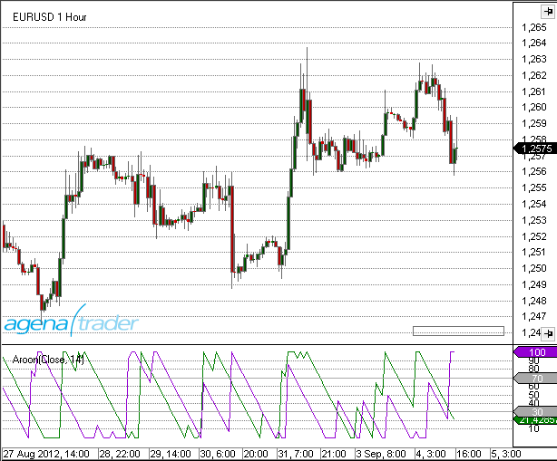
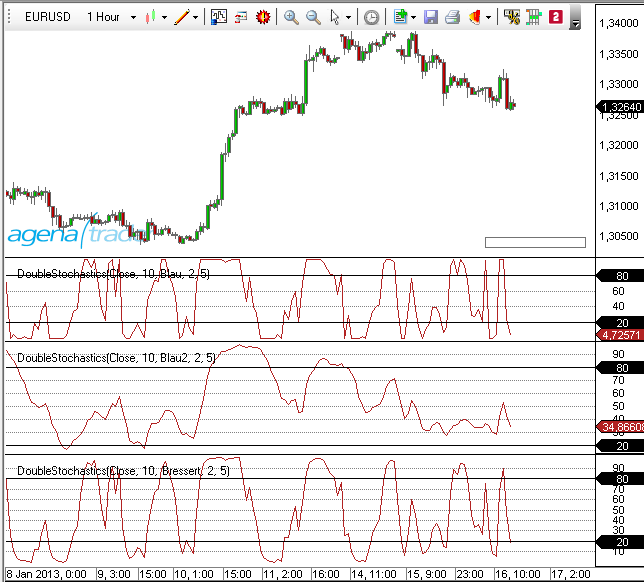
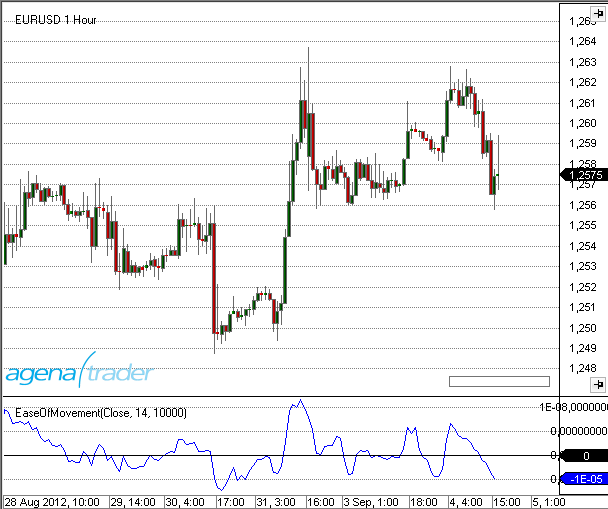
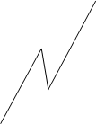
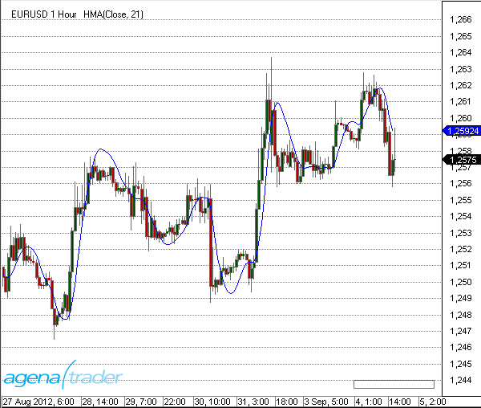
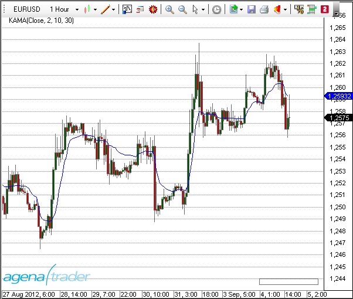
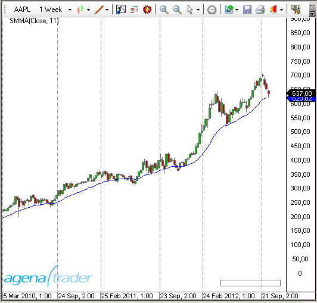
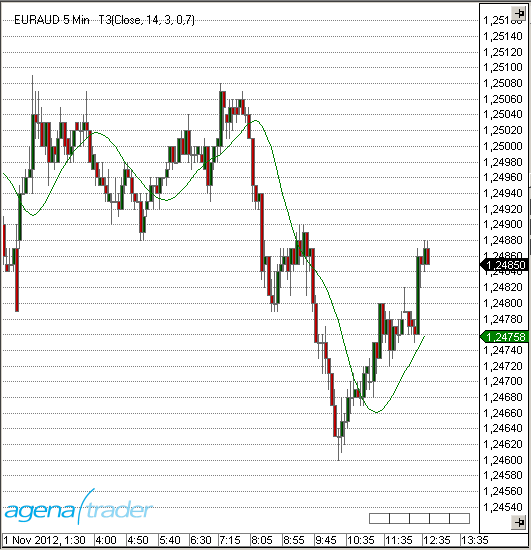
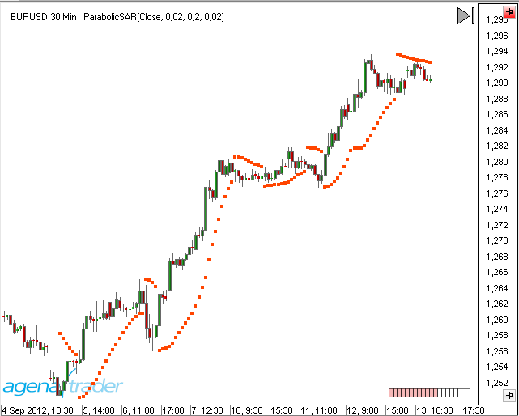

#Indicators & Oscillators

**Trade like the professionals!**

AgenaTrader provides you with a variety of powerful indicators that will assist you with your individual market analysis.

Indicators can be used in

-   Charts
-   Condition Escort
-   AgenaScript

For each indicator you will find a brief description of its interpretation, operation and functionality, a graphical representation on a chart and further technical details for its usage with AgenaScript.


##Accumulation/Distribution (ADL)

### Description

The concept of the Accumulation Distribution Line (ADL) indicator was developed by Marc Chaikin. The ADL is a volume indicator; it represents the money flow. The ADL is a further development of the On-Balance Volume Indicator developed by Joe Granville, which also happens to be one of the first volume indicators.

### Interpretation

There are two interpretations of the ADL:

Confirmation of a trend or

1.  The depiction of [*divergence*]

If the ADL is rising in an uptrend, then money is flowing in the direction of the rising prices, thus the uptrend is confirmed. If the ADL is falling in a downward trend, money is being taken out of the stock, thus confirming the downtrend.

### Further information

VTADWiki: [*http://vtadwiki.vtad.de/index.php/Accumulation\_Distribution\_Linie*]

### Usage

```cs
ADL()
ADL(IDataSeries input)
ADL()[int barsAgo]
ADL(IDataSeries input)[int barsAgo]
```


### Return value

**double**

When using the method with an index (e.g. ADL()\[int barsAgo\] ), the value of the indicator will be outputted for the referenced bar.

### Parameter

input Input data series for the indicator

### Visualization


### Example

```cs
//Testing the direction of the ADL
if (Rising(ADL())
Print("The ADL indicator is rising.");
```


##Adaptive Price Zone (APZ)

### Description

The adaptive price zone is a technical indicator developed by Lee Leibfarth in 2006. The APZ is a volatility-based indicator that appears as a set of bands placed over a price chart. Especially useful in non-trending, choppy markets, the APZ was created to help traders find potential turning points in the markets. The APZ is based on a short-term double-smoothed exponential moving average that reacts quickly to price changes with reduced lag. The bands form a channel that surrounds the average price and tracks the price changes. If the price crosses the upper band of the zone then this will present you with an opportunity to trade a reversal. The opposite is true for the lower band.

### Interpretation

The bigger the price movement, the greater the distance between the upper and lower band will be. The smaller the price movement, the smaller the distance between the bands. More widely spaced bands will indicate increased instability and volatility, whereas closely tuned bands will display reduced volatility. If the price action breaks through the upper or lower band then the APZ will tend to return to its statistical average. This will lead to trading opportunities where the market may try to compensate for imbalances. If the price overshoots the bands for example, as mentioned in the description, then this will present you with a trading opportunity in the opposite direction.

### Further information

[*http://www.investopedia.com/articles/trading/10/adaptive-price-zone-indicator-explained.asp*]

### Usage
```cs
APZ(double barPct, int period)
APZ(IDataSeries input, double barPct, int period)
Upper Band
APZ(double barPct, int period).Upper[int barsAgo]
APZ(IDataSeries input, double barPct, int period).Upper[int barsAgo]
Lower Band
APZ(double barPct, int period).Lower[int barsAgo]
APZ(IDataSeries input, double barPct, int period).Lower[int barsAgo]
```


### Return value

**double**

When using the method with an index (e.g. **APZ**(2, 20)\[**int** barsAgo\] ), the value of the indicator will be outputted for the referenced bar.

### Parameters

barPct Standard deviation

input Input data series for the indicator

period Number of bars included in the calculation

### Visualization


### Example

```cs
//Output for the current values for the upper and lower band of a 20-period APZ
Print("Value for the upper APZ band : " + APZ(2, 20).Upper[0]);
Print("Value for the lower APZ band: " + APZ(2, 20).Lower[0]);
```


##Aroon

### Description

Developed by Tushar Chande in 1995, Aroon is an indicator system that determines whether a stock is trending or not and how strong the trend is. "Aroon" means "Dawn's Early Light" in Sanskrit. Chande chose this name because the indicators are designed to reveal the beginning of a new trend. The Aroon indicators measure the number of periods since the price recorded an x-day high or low. There are two separate indicators: Aroon-Up and Aroon-Down. A 25-day Aroon-Up measures the number of days since a 25-day high. A 25-day Aroon-Down measures the number of days since a 25-day low. In this sense, the Aroon indicators are quite different from typical [momentum oscillators], which focus on price relative to time. Aroon is unique because it focuses on time relative to price. Chartists can use the Aroon indicators to spot emerging trends, identify consolidations, define correction periods and anticipate reversals. **(Source: Stockcharts.com)**

### Interpretation

The Aroon indicators fluctuate above/below a centerline (50) and are bound between 0 and 100. These three levels are important for interpretation. At its most basic, the bulls have the edge when Aroon-Up is above 50 and Aroon-Down is below 50. This indicates a greater propensity for new x-day highs than lows. The converse is true for a downtrend. The bears have the edge when Aroon-Up is below 50 and Aroon-Down is above 50.

A surge to 100 indicates that a trend may be emerging. This can be confirmed with a decline in the other Aroon indicator. For example, a move to 100 in Aroon-Up combined with a decline below 30 in Aroon-Down shows upside strength. Consistently high readings mean prices are regularly hitting new highs or new lows for the specified period. Prices are moving consistently higher when Aroon-Up remains in the 70-100 range for an extended period. Conversely, consistently low readings indicate that prices are seldom hitting new highs or lows. Prices are NOT moving lower when Aroon-Down remains in the 0-30 range for an extended period. This does not mean prices are moving higher though. For that we need to check Aroon-Up.

### Further information

VTAD: [*http://stockcharts.com/school/doku.php?id=chart\_school:technical\_indicators:aroon*]

### Usage

```cs
Aroon(int period)
Aroon(IDataSeries input, int period)
//For the upper value
Aroon(int period).Up[int barsAgo]
Aroon(IDataSeries input, int period).Up[int barsAgo]
//For the lower value
Aroon(int period).Down[int barsAgo]
Aroon(IDataSeries input, int period).Down[int barsAgo]
```


### Return value

**double**

When using this method with an index (e.g. **Aroon**(20)\[**int** barsAgo\] ) the value of the indicator will be displayed for the last referenced bar.

### Parameters

input Input data series for the indicator

period Number of bars taken into consideration when calculating the values

### Visualization



### Example

```cs
//Output of the current up or down values for the 20 period Aroon
Print("Current value for Aroon Up is : " + Aroon(20).Up[0]);
Print("Current value for Aroon Down is: " + Aroon(20).Down[0]);
```


##Aroon Oscillator

### Description

The Aroon Oscillator is calculated by subtracting the Aroon Down from the Aroon Up. These two indicators are usually plotted together for easy comparison, but chartists can also view the difference of these two indicators with the Aroon Oscillator. This indicator fluctuates between -100 and +100 with zero as the middle line. A bullish trend bias is present when the oscillator is positive, while a bearish trend bias exists when the oscillator is negative. Chartists can also expand the bull-bear threshold to identify stronger signals.

### Interpretation

The Aroon Oscillator is ideally used as a trend filter and trend strength indicator. It is used analogously to the ADX Indicator.

### Usage

```cs
AroonOscillator(int period)
AroonOscillator(IDataSeries input, int period)
AroonOscillator(int period)[int barsAgo]
AroonOscillator(IDataSeries input, int period)[int barsAgo]
```


### Return value

**double**

When using this method with an index such as (**AroonOcsillator**(20)\[**int** barsAgo\] ), the value of the indicator will be outputted for the bar that was referenced.

### Parameters

input Input data series for the indicator

period Number of bars taken into consideration for the calculations

### Visualization


### Example

```cs
//Output for the current value for a 20 period Aroon Oscillator
Print("Value for the oscillator is: " + AroonOscillator(20)[0]);
```


##Average Directional Index (ADX)

### Description

The Average Directional Index (ADX), Minus Directional Indicator (-DI) and Plus Directional Indicator (+DI) represent a group of directional movement indicators that form a trading system developed by Welles Wilder. Wilder designed ADX with commodities and daily prices in mind, but these indicators can also be applied to stocks. The Average Directional Index (ADX) measures trend strength without regard to trend direction. The other two indicators, Plus Directional Indicator (+DI) and Minus Directional Indicator (-DI), complement ADX by defining trend direction. Used together, chartists can determine both the **direction** and **strength** of the trend.

Wilder features the Directional Movement indicators in his 1978 book, [**New Concepts in Technical Trading Systems**]. This book also includes details on Average True Range (ATR), the Parabolic SAR system and [*RSI*]. Despite being developed before the computer age, Wilder's indicators are incredibly detailed in their calculation and have stood the test of time.

### Interpretation

The Average Directional Index (ADX) is used to measure the strength or weakness of a trend, not the actual direction. Directional movement is defined by +DI and -DI. In general, the bulls have the edge when +DI is greater than -DI, while the bears have the edge when -DI is greater. Crosses of these directional indicators can be combined with ADX for a complete trading system.

It should be kept in mind that Wilder was a commodity and currency trader. The examples in his books are based on these instruments, not stocks. This does not mean his indicators cannot be used with stocks. Some stocks have price characteristics similar to commodities, which tend to be more volatile with short and strong trends. Stocks with low volatility may not generate signals based on Wilder's parameters. Chartists will likely need to adjust the indicator settings or the signal parameters according to the characteristics of the security.

### Further information

Wikipedia: [*http://de.wikipedia.org/wiki/Average\_Directional\_Movement\_Index*]

### Usage

```cs
ADX(int period)
ADX(IDataSeries input, int period)
ADX(int period)[int barsAgo]
ADX(IDataSeries input, int period)[int barsAgo]
```


### Return value

**double**

When using this method with an index (e.g. **ADX**(20)\[**int** barsAgo\] ), the value of the indicator will be outputted for the referenced bar.

### Parameters

input Input data series for the indicator

period Number of bars included in the calculation

### Visualization


### Example

```cs
//Output of the current value of a 20 period ADX
Print("Value of the ADX: " + ADX(20)[0]);
```


##Average Directional Movement Rating (ADXR)

### Description

This is the ADX Indicator plus the ADX of n days ago divided by 2.
(Current ADX + ADX n days ago) / 2

### Interpretation

The oscillator moves along a guiding line that typically has a value of 20. When the ADXR rises above 20, a trend exists. If the ADXR is below 20, no trend exists and the market is moving sideways.
Welles Wilder recommends buying into the market at a value of 25 and higher, and holding the position as long as the value remains above 20.

### Usage

```cs
ADXR(int interval, int period)
ADXR(IDataSeries input, int interval, int period)
ADXR(int interval, int period)[int barsAgo]
ADXR(IDataSeries input, int interval, int period)[int barsAgo]
```


### Return value

**double**

When using this method with an index (e.g. **ADXR**(10, 14)\[**int** barsAgo\]), the value of the indicator will be outputted for the referenced bar.

### Parameters

input Input data series for the indicator

interval Interval between the first ADX value and the current ADX value

period Number of bars included in the calculation

### Visualization


### Example

```cs
//Output of the current value of the ADXR
Print("Value of the ADXR: " + ADXR(10, 14)[0]);
```


##Average True Range (ATR)

### Description & Interpretation

Developed by J. Welles Wilder, the Average True Range (ATR) is an indicator that measures [*volatility*]. As with most of his indicators, Wilder designed ATR with commodities and daily prices in mind. Commodities are frequently more volatile than stocks. They are often subject to gaps and limit moves, which occur when a commodity opens up or down its maximum allowed move for the session. A volatility formula based only on the high-low range would fail to capture volatility from gap or limit moves. Wilder created Average True Range to capture this "missing" volatility. It is important to remember that ATR does not provide an indication of price direction, just volatility.

Wilder features ATR in his 1978 book, [**New Concepts in Technical Trading Systems**]. This book also includes the Parabolic SAR, RSI and the Directional Movement Concept (ADX). Despite being developed before the computer age, Wilder's indicators have stood the test of time and remain extremely popular.

Wilder started with a concept called **True Range (TR)**, which is defined as the greatest of the following:

-   Method 1: current high minus the current low
-   Method 2: current high minus the previous close (absolute value)
-   Method 3: current Low minus the previous close (absolute value)

Absolute values are used to ensure positive numbers. After all, Wilder was interested in measuring the distance between two points, not the direction. If the current period's high is above the prior period's high and the low is below the prior period's low, then the current period's high-low range will be used as the True Range. This is an outside day that would use method 1 to calculate the TR. This is pretty straightforward. Methods 2 and 3 are used when there is a gap or an inside day. A gap occurs when the previous close is greater than the current high (signaling a potential gap down or limit move) or the previous close is lower than the current low (signaling a potential gap up or limit move). The image below shows examples of when methods 2 and 3 are appropriate.

### Further information

VTAD: [*http://vtadwiki.vtad.de/index.php/Average\_True\_Range*]

### Usage

```cs
ATR(int period)
ATR(IDataSeries input, int period)
ATR(int period)[int barsAgo]
ATR(IDataSeries input, int period)[int barsAgo]
```


### Return value

**double**

When using this method with an index (e.g. **ATR**(14)\[**int** barsAgo\] ), the value of the indicator will be outputted for the referenced bar.

### Parameters

input Input data series for the indicator

period Number of bars included in the calculation

### Visualization


### Example

```cs
//Output of the current value of a 14 period ATR
Print("The current ATR value is: " + ATR(14)[0]);
```


##Balance of Power (BOP)

### Description

The Balance of Power indicator was developed by Igor Livshin in August 2001. The BOP indicator represents the strengths of the buyers (bulls) vs. the sellers (bears). It oscillates between -100 and 100.
BOP = (close - open) / (high - low)

### Interpretation

A directional change of the BOP can be interpreted as a warning signal and will generally be followed by a price change.

### Usage

```cs
BOP(int smooth)
BOP(IDataSeries input, int smooth)
BOP(int smooth)[int barsAgo]
BOP(IDataSeries input, int smooth)[int barsAgo]
```


### Return value

**double**

When using this method with an index (e.g. **BOP**(5)\[**int** barsAgo\] ), the value of the indicator will be outputted for the referenced bar.

### Parameters

input Input data series for the indicator

smooth Settings for the smoothing

### Visualization


### Example

```cs
//Output of the value for the BOP with a smoothing of 5 periods
Print("The Balance of Power value is: " + BOP(5));
```


##Bollinger Bands

### Description & Interpretation

Developed by John Bollinger, Bollinger Bands® are volatility bands placed above and below a moving average. Volatility is based on the [standard deviation], which changes as volatility increases and decreases. The bands automatically widen when volatility increases and narrow when volatility decreases. This dynamic nature of Bollinger Bands also means they can be used on different securities with the standard settings. For signals, Bollinger Bands can be used to identify M-Tops and W-Bottoms or to determine the strength of the trend.

**Bollinger Bands consist of a middle band with two outer bands.** The middle band is a simple moving average that is usually set at 20 periods. A simple moving average is used because the standard deviation formula also uses a simple moving average. The look-back period for the standard deviation is the same as for the simple moving average. The outer bands are usually set 2 standard deviations above and below the middle band. Settings can be adjusted to suit the characteristics of particular securities or trading styles. Bollinger recommends making small incremental adjustments to the standard deviation multiplier. Changing the number of periods for the moving average also affects the number of periods used to calculate the standard deviation. Therefore, only small adjustments are required for the standard deviation **multiplier**. An increase in the moving average period would automatically increase the number of periods used to calculate the standard deviation and would also warrant an increase in the standard deviation **multiplier**. With a 20-day SMA and 20-day Standard Deviation, the standard deviation multiplier is set at 2. Bollinger suggests increasing the standard deviation multiplier to 2.1 for a 50-period SMA and decreasing the standard deviation multiplier to 1.9 for a 10-period SMA.

Bollinger Bands reflect direction with the 20-period SMA and volatility with the upper/lower bands. As such, they can be used to determine if prices are relatively high or low. **According to Bollinger, the bands should contain 88-89% of price action, which makes a move outside the bands significant.** Technically, prices are relatively high when above the upper band and relatively low when below the lower band. However, relatively high should not be regarded as bearish or as a sell signal. Likewise, relatively low should not be considered bullish or as a buy signal. Prices are high or low for a reason. As with other indicators, Bollinger Bands are not meant to be used as a stand-alone tool. Chartists should combine Bollinger Bands with basic trend analysis and other indicators for confirmation. (Source: Stockcharts)

The calculation is performed in the following manner:

Upper band = middle band + 2 standard deviations
Middle band = average of 20 periods
Lower band = middle period – 2 standard deviations

More information can be found here: [*BollingerMTF*], [*Bollinger Percent %B*], [*Bollinger Bands Width*]

### Further information

VTAD: [*http://vtadwiki.vtad.de/index.php/Bollinger\_B%C3%A4nder*]

Book "Technische Indikatoren - simplified" by Oliver Paesler (German only)

### Usage

```cs
Bollinger(double numStdDev, int period)
Bollinger(IDataSeries input, double numStdDev, int period)
//For the upper band
Bollinger(double numStdDev, int period).Upper[int barsAgo]
Bollinger(IDataSeries input, double numStdDev, int period).Upper[int barsAgo]
//For the lower band
Bollinger(double numStdDev, int period).Lower[int barsAgo]
Bollinger(IDataSeries input, double numStdDev, int period).Lower[int barsAgo]
```


### Return value

**double**

When using this method with an index (e.g. **Bollinger**(2, 20)\[**int** barsAgo\] ), the value of the indicator will be displayed for the referenced bar.

### Parameters

input Input data series for the indicator

numStdDev Standard deviation

period Number of bars included in the calculation

### Visualization


### Example

```cs
//Output of the value for the upper Bollinger Band
Print("Value of the upper band: " + Bollinger(2, 20).Upper[0]);
//Middle band
Print("Value of the middle band: " + Bollinger(2, 20)[0]);
//Lower band
Print("Value of the lower band: " + Bollinger(2, 20).Lower[0]);
```


##Bollinger Percent B (%b)

### Description

Bollinger %b is an important indicator derived from John Bollinger's original Bollinger Bands indicator. %b depicts the location of the most recent close price in relation to the Bollinger Bands as well as to what degree it is above or below any of the bands.
The Bollinger Percent B equation can be constructed as:
Percent B = ((Close - Bollinger Lower Band) / (Bollinger Upper Band - Bollinger Lower Band))\*100
If the close price is equal to the upper Bollinger Band, %b will be 100 (percent). If the close price is equal to the lower Bollinger Band, %b will be 0.0 (percent). A %b value of 50 means the close price is equal to the middle Bollinger Band.
Furthermore, readings above 100 and below 0 indicate that the close price is outside of the Bollinger Bands by a corresponding percentage of the Bollinger Bandwidth. A %b value of 125 means that the close price is above the upper Bollinger Band by 25% of the Bandwidth. A %b value of -25 means that the close price is below the lower Bollinger Band by 25% of the Bandwidth.

See [*Bollinger Bands*], [*BBWidth*][*Bollinger Bands Width*]

**An additional application: normalizing indicators**

Bollinger bands and thus the %b indicator can be applied not only to the prices of stocks, futures etc. but also to time series with fundamental data, volume data and other indicators. This is especially interesting when you need to know if a value is relatively high or low; in this case, the %b indicator will offer you a different perspective. If you want to know whether the volume of a stock is exceedingly high or low you can simply apply it to the volume data.
John Bollinger sees the application of the %b onto other indicators as one of the most important aspects of the indicator. If you want to normalize an indicator with %b, it is important to first calculate the indicator (e.g. the RSI) using the %b for the calculation of the indicator instead of the price data. The application of the %b essentially unfolds in the same manner as the application of Bollinger bands onto the indicator itself. The intersection points between the bands and the indicators will thus be 1 and 0. Essentially, the relative position of the original indicator will be displayed in relation to its upper and lower bands. Thus the boundaries of the original indicator will be removed.
John Bollinger himself wrote that: “You’re defining a high or low point on a relative basis, this may allow you to gain a deeper insight and understanding not provided by traditional indicators and guidelines.”
John Bollinger provides several parameters for the %b calculation, such as 40-day periods and a factor of 2.0 for a 9-day RSI, and a 50-day period with a factor of 2.1 for the calculation of %b.

(Sources: Oliver Paesler: "Technische Indikatoren - simplified" and John Bollinger: "Bollinger Bänder")

(Source: [*tradesignalonline*])

### Further information

VTAD: [*http://vtadwiki.vtad.de/index.php/Bollinger\_B%C3%A4nder*]

Book "Technische Indikatoren - simplified" by Oliver Paesler (German only)

### Usage

```cs
BollingerPercentB(int period, double numStdDev)
BollingerPercentB(IDataSeries input, int period, double numStdDev)
BollingerPercentB(int period, double numStdDev) [int barsAgo]
BollingerPercentB(IDataSeries input, int period, double numStdDev)[int barsAgo]
```


### Return value

**double**

When using this method with an index (e.g. **BollingerPercentB**(20, 2)\[**int** barsAgo\] ), the value of the indicator will be outputted for the referenced bar.

### Parameters

input Input data series for the indicator

period Number of bars included in the calculation

numStdDev Standard deviation

### Visualization


### Example

//Output for the value of Bollinger %B

**Print**("Value of the Bollinger Percent B is: " + **BollingerPercentB**(20, 2)\[0\]);

##Bollinger Band Width (BBWidth)

### Description

Bollinger Band Width is an indicator derived from Bollinger Bands. In his book, *Bollinger on Bollinger Bands*, John Bollinger refers to Bollinger Band Width as one of two indicators that can be derived from Bollinger Bands. The other indicator is %B.

Band Width measures the percentage difference between the upper band and the lower band. Band Width decreases as Bollinger Bands narrow and increases as Bollinger Bands widen. Because Bollinger Bands are based on the standard deviation, falling Band Width reflects decreasing volatility and rising Band Width reflects increasing volatility.

### Interpretation

John Bollinger uses the Band Width to recognize rising and falling trends. Most trends have their origins within sideway market movements that generally have a low volatility. If a breakout is accompanied by a sudden rise in the Band Width, this means that there is definite support for the move.

### Further information

VTAD: [*http://vtadwiki.vtad.de/index.php/Bollinger\_B%C3%A4nder*]

Book "Technische Indikatoren - simplified" by Oliver Paesler (German only)

### Usage

```cs
BBWidth(double numStdDev, int period)
BBWidth(IDataSeries input, double numStdDev, int period)
BBWidth(double numStdDev, int period)[int barsAgo]
BBWidth(IDataSeries input, double numStdDev, int period)[int barsAgo]
For the value of the upper Band Width
BBWidth(double numStdDev, int period).BandWidth
BBWidth(IDataSeries input, double numStdDev, int period).BandWidth
BBWidth(double numStdDev, int period).BandWidth[int barsAgo]
BBWidth(IDataSeries input, double numStdDev, int period).BandWidth[int barsAgo]
For the value of the trigger line (threshold)
BBWidth(double numStdDev, int period).Threshold
BBWidth(IDataSeries input, double numStdDev, int period).Threshold
BBWidth(double numStdDev, int period).Threshold[int barsAgo]
BBWidth(IDataSeries input, double numStdDev, int period).Threshold[int barsAgo]
```


### Return value

**double**

When using the method with an index (e.g. **BBWidth**(2, 20)\[**int** barsAgo\] ), the value of the indicator will be outputted for the referenced bar.

### Parameters

input Input data series for the indicator

period Number of bars included in the calculation

numStdDev Standard deviation

### Visualization


### Example

```cs
//Output for the values of Bollinger Band Width
Print("The value of the Bollinger Band Width is: " + BBWidth(2, 20).BandWidth[0]);
//Output for the values for the signal line
Print("The value of the signal line is: " + BBWidth(2, 20).Threshold[0]);
```


##Bollinger MTF (MultiTimeFrame)

### Description

This is the multi-timeframe version of the Bollinger Bands. Its primary use is for intraday trading. Multi-timeframe means that the indicator is calculated in a different timeframe than that displayed in the chart. Displaying an hourly Bollinger band on a 5-minute timeframe would not be possible with the standard Bollinger band indicator. This is where the MTF comes into play.
BollingerMTF can only be used for display in the chart and cannot be applied/implemented in AgenaScript.

### Visualization

The image shows a 5-minute chart with a 60-minute Bollinger band


##BuySellPressure

### Description

The BuySellPressure indicator shows the buy or sell pressure for the current bar. In addition, these trades are classified as “buy” or “sell”. For this classification, a “buy” is assumed whenever the transaction has occurred at or above the ask. Inside trades are ignored.

**Caution:
This is a real-time indicator. It will only work on and with real-time data and cannot therefore be used for historical information.**

**When the properties dialog for the indicator is open and changes are made, then the indicator must be reloaded. Doing so will delete all previously accumulated data.**

See [*BuySellVolume*].

### Usage

```cs
BuySellPressure()
BuySellPressure(IDataSeries input)
For the values of buy pressure
BuySellPressure().BuyPressure[int barsAgo]
BuySellPressure(IDataSeries input).BuyPressure[int barsAgo]
For the values of sell Pressure
BuySellPressure().SellPressure[int barsAgo]
BuySellPressure(IDataSeries input).SellPressure[int barsAgo]
```


### Return value

**double**

When using this method with an index (e.g. **BuySellPressure**().BuyPressure\[**int** barsAgo\] ), the value of the indicator will be outputted for the referenced bar.

**Caution:
**If BuySellPressure is used with EoD data, the value 50 will always be outputted.
- BuySellPressure().SellPressure\[0\] = 50
- BuySellPressure().SellPressure\[0\] = 50

### Parameters

input Input data series for the indicator

### Visualization


### Example

```cs
protected override void Initialize()
{
BuySellPressure().CalculateOnBarClose = false;
}
protected override void OnBarUpdate()
{
if (Close[0] > DonchianChannel(20).Upper[5])
{
if (Historical || BuySellPressure().BuyPressure[0] > 70)
EnterLong();
}
}
```


##BuySellVolume

### Description

The BuySellVolume indicator shows the current buy or sell pressure based on the volume. For this, trades are classified as “buy” or “sell”. For this classification, a “buy” is assumed whenever the transaction is executed at or above the ask. A transaction at or below the bid is deemed a “sell”.

**Caution: This is a real-time indicator and will not work with historical data.**

Similar conditions as with the [*BuySellPressure*] apply.

### Usage


```cs
BuySellVolume BuySellVolume()
BuySellVolume BuySellVolume(IDataSeries input)
```


### Return value

**double**

When using this method with an index (e.g. **BuySellVolume**().BuyVolume\[**int** barsAgo\] ), the value of the indicator will be outputted for the referenced bar.

### Parameter

input Input data series for the indicator

### Visualization


### Example

```cs
//Output for the BuySellVolume
Print("The BuySellVolume is: " + BuySellVolume()[0]);
```


##CandleStickPattern

### Description

This indicator searches for specific candlestick formations.

### Further information

Explanations of the formations and their interpretations can be found here:
[*http://en.wikipedia.org/wiki/Candlestick\_pattern*]

### Usage

```cs
CandleStickPattern(ChartPattern pattern, int trendStrength)
CandleStickPattern(IDataSeries input, ChartPattern pattern, int trendStrength)
CandleStickPattern(ChartPattern pattern, int trendStrength)[int barsAgo]
CandleStickPattern(IDataSeries input, ChartPattern pattern, int trendStrength)[int barsAgo]
```


### Return value

**double**

0 – Pattern not existent
1 – Pattern existent

When using this method with an index (e.g. **CandleStickPattern**(...)\[**int** barsAgo\] ), the value of the indicator will be outputted for the referenced bar.

### Parameters

|               |                                                                                                                                                                                                                    |
|---------------|--------------------------------------------------------------------------------------------------------------------------------------------------------------------------------------------------------------------|
| input         | Input data series for the indicator                                                                                                                                                                                |
| pattern       | Possible values are:                                                                                                                                                                                               
                 ChartPattern.BearishBeltHold                                                                                                                                                                                        

                 ChartPattern.BearishEngulfing                                                                                                                                                                                       

                 ChartPattern.BearishHarami                                                                                                                                                                                          

                 ChartPattern.BearishHaramiCross                                                                                                                                                                                     

                 ChartPattern.BullishBeltHold                                                                                                                                                                                        

                 ChartPattern.BullishEngulfing                                                                                                                                                                                       

                 ChartPattern.BullishHarami                                                                                                                                                                                          

                 ChartPattern.BullishHaramiCross                                                                                                                                                                                     

                 ChartPattern.DarkCloudCover                                                                                                                                                                                         

                 ChartPattern.Doji                                                                                                                                                                                                   

                 ChartPattern.DownsideTasukiGap                                                                                                                                                                                      

                 ChartPattern.EveningStar                                                                                                                                                                                            

                 ChartPattern.FallingThreeMethods                                                                                                                                                                                    

                 ChartPattern.Hammer                                                                                                                                                                                                 

                 ChartPattern.HangingMan                                                                                                                                                                                             

                 ChartPattern.InvertedHammer                                                                                                                                                                                         

                 ChartPattern.MorningStart                                                                                                                                                                                           

                 ChartPattern.PiercingLine                                                                                                                                                                                           

                 ChartPattern.RisingThreeMethods                                                                                                                                                                                     

                 ChartPattern.ShootingStar                                                                                                                                                                                           

                 ChartPattern.StickSandwich                                                                                                                                                                                          

                 ChartPattern.ThreeBlackCrows                                                                                                                                                                                        

                 ChartPattern.ThreeWhiteSoldiers                                                                                                                                                                                     

                 ChartPattern.UpsideGapTwoCrows                                                                                                                                                                                      

                 ChartPattern.UpsideTasukiGap                                                                                                                                                                                        |
| trendStrength | Signifies the number of bars to the left and right of the swing high or swing low that are used to identify a trend. The value 0 turns off the search, meaning that the only thing searched for is chart patterns. |

### Visualization


### Example

**if** (**CandelStickPattern**(ChartPattern.ShootingStar, 5)\[0\] == 1)

**Print**("Pattern ShootingStar found!");

##ChaikinMoneyFlow (CMF)

### Description

The Chaikin Money Flow Index was developed by Marc Chaikin. It is a volume indicator that attempts to answer the following question: Where does the money flow into? Into the stock = accumulation, and out of the stock = distribution. Obviously, this applies not only to stocks/shares but also to other instruments. Chaikin attempts to expand on and improve the On-Balance Volume created by Granville. With the CMF, the position of the closing price within the trading range is placed in relation to the volume. Basically, this means that the trading volume is multiplied by the price. The trading volume shows the amount of money that has “flowed” into the stock or has been “removed”; the indicator merely displays whether it has been accumulated (buying pressure) or has been removed (distribution). (Source: VTAD)

### Interpretation

The CMF oscillates around the zero line and is shown in a separate window with an open scale. Should the CMF be located above the zero line, then it can be interpreted as accumulation. If higher highs are being created, then the buying pressure is increasing. The reverse is true for the selling pressure. The Chaikin Money Flow should always be used in combination with other methods of technical analysis.

### Further information

VTAD: [*http://vtadwiki.vtad.de/index.php/Chaikin\_Money\_Flow*]

### Usage

```cs
ChaikinMoneyFlow(int period)
ChaikinMoneyFlow(IDataSeries input, int period)
ChaikinMoneyFlow(int period)[int barsAgo]
ChaikinMoneyFlow(IDataSeries input, int period)[int barsAgo]
```


### Return value

**double**

When using this method with an index (e.g. **ChaikinMoneyFlow**(21)\[**int** barsAgo\] ), the value of the indicator will be outputted for the referenced bar.

### Parameters

input Input data series for the indicator

period Number of bars included in the calculation

### Visualization


### Example

//Output for the Money Flow value

**Print**("The Chaikin Money Flow value is: " + **ChaikinMoneyFlow**(21)\[0\]);

##Chaikin Oscillator

### Description

The Chaikin Oscillator is a volume indicator that shows if new highs are accompanied by new volumes. The Chaikin Oscillator is a simple MACD applied to the accumulation/distribution line. What is calculated is the difference between a 3-day exponential moving average and a 10-day exponential smoothed average for the accumulation/distribution line.

### Interpretation

The interpretation of the Chaikin Oscillator is similar to the principle of the accumulation/distribution. All an oscillator does is show the changes in liquidity for the instrument.

### Usage

```cs
ChaikinOscillator(int fast, int slow)
ChaikinOscillator(IDataSeries input, int fast, int slow)
ChaikinOscillator(int fast, int slow)[int barsAgo]
ChaikinOscillator(IDataSeries input, int fast, int slow)[int barsAgo]
```


### Return value

**double**

When using this method with an index (e.g. **ChaikinOscillator**(3, 10)\[**int** barsAgo\] ), the value of the indicator will be outputted for the referenced bar.

### Parameters

input Input data series for the indicator

fast Number of bars included in the calculation for the fast EMA

slow Number of bars included in the calculation for the slow EMA

### Visualization


### Example

```cs
//Output for the oscillator for the fast and slow values of 3 and 10
Print("The Chaikin Oscillator value is: " + ChaikinOscillator(3, 10)[0]);
```


##ChaikinVolatility (CVL)

### Description

The Chaikin Volatility Indicator is one of several indicators that attempt to measure the fluctuations of price movements.
Chaikin uses the daily price range (daily high minus daily low) as the fundamental measure of volatility. It is implied that a widening range is associated with a higher volatility.

### Interpretation

The indicator oscillates around the zero line and fluctuates between a scale of +100 to -100. It can be used on a daily chart as well as on a weekly or monthly chart. All values above the zero line represent rising volatility, and the gradient of the rise implies the seriousness of potential floors forming. The Chaikin Volatility is not specifically used to define exact signals, but is considered as more of an assisting tool in the trading system.

### Usage

```cs
ChaikinVolatility(int fast, int slow)
ChaikinVolatility(IDataSeries input, int fast, int slow)
ChaikinVolatility(int fast, int slow)[int barsAgo]
ChaikinVolatility(IDataSeries input, int fast, int slow)[int barsAgo]
```


### Return value

**double**

When using this method with an index (e.g. **ChaikinVolatility**(14)\[**int** barsAgo\] ), the value of the indicator will be outputted for the referenced bar.

### Parameters

input Input data series for the indicator

period Number of bars included in the calculations

### Visualization


### Example

```cs
//Chaikin output for a period of 14
Print("The value of the Chaikin Volatility is: " + ChaikinVolatility(14)[0]);
```


##Chande Momentum Oscillator (CMO)

### Description

The CMO is a technical momentum indicator invented by the technical analyst Tushar Chande. It is created by calculating the difference between the sum of all recent gains and the sum of all recent losses and then dividing the result by the sum of all price movement over the period. This oscillator is similar to other momentum indicators such as the Relative Strength Index and the Stochastic Oscillator, since it is also range-bound (+100 and -100).

### Interpretation

**
**The security is deemed overbought when the momentum oscillator is above +50 and oversold when it is below -50. Many technical traders add a nine-period moving average to this oscillator to act as a signal line. Bullish signals are generated when the oscillator crosses above the signal, and bearish signals are generated when the oscillator crosses down through the signal.

### Further information

[*http://www.boersenwissen.de/content/content\_bin/cont\_bin18.html*]

### Usage

```cs
CMO(int period)
CMO(IDataSeries input, int period)
CMO(int period)[int barsAgo]
CMO(IDataSeries input, int period)[int barsAgo]
```


### Return value

**double**

When using this method with an index (e.g. **CMO**(14)\[**int** barsAgo\] ), the value of the indicator will be issued for the referenced bar.

### Parameters

input Input data series for the indicator

period Number of bars included in the calculations

### Visualization


### Example

```cs
//Output for the value of the Chande Momentum Oscillator
Print("The current value for the Chande Momentum Oscillator is: " + CMO(14)[0]);
```


##Commodity Channel Index (CCI)

### Description

Developed by Donald Lambert and featured in *Commodities* magazine in 1980, the Commodity Channel Index (CCI) is a versatile indicator that can be used to identify a new trend or warn of extreme conditions. Lambert originally developed CCI to identify cyclical turns in commodities, but the indicator can also be successfully applied to indices, ETFs, stocks and other securities. In general, CCI measures the current price level relative to an [*average*] price level over a given period of time. CCI is relatively high when prices are far above their average. CCI is relatively low when prices are far below their average. In this manner, CCI can be used to identify overbought and oversold levels.

### Interpretation

CCI measures the difference between a security's price change and its average price change. High positive readings indicate that prices are well above their average, which is a show of strength. Low negative readings indicate that prices are well below their average, which is a show of weakness.

The Commodity Channel Index (CCI) can be used as either a coincident or leading indicator. As a coincident indicator, surges above +100 reflect strong price action that can signal the start of an uptrend. Plunges below -100 reflect weak price action that can signal the start of a downtrend.

As a [*leading indicator*][momentum oscillators], chartists can look for overbought or oversold conditions that may foreshadow a mean reversion. Similarly, bullish and bearish divergences can be used to detect early momentum shifts and anticipate trend reversals.

### Further information

VTAD: [*http://vtadwiki.vtad.de/index.php/Commodity\_Channel\_Index*]

### Usage

```cs
CCI(int period)
CCI(IDataSeries input, int period)
CCI(int period)[int barsAgo]
CCI(IDataSeries input, int period)[int barsAgo]
```


### Return value

**double**

When using this method with an index (e.g. **CCI**(14)\[**int** barsAgo\] ), the value of the indicator will be issued for the referenced bar.

### Parameters

input Input data series for the indicator

period Number of bars included in the calculations

### Visualization


### Example
```cs
//Output for the CCI value calculated using 14 periods
Print("The value of the Commodity Channel Index is: " + CCI(14));
```


##Darvas Boxes

### Description

The Darvas boxes are a trading strategy developed in 1956 by former ballroom dancer Nicolas Darvas. Darvas' trading technique involved buying into stocks that were trading at new 52-week highs with correspondingly high volumes.
A Darvas box is created when the price of a stock rises above the previous 52-week high, but then falls back to a price not far from that high. If the price falls too much, it can be a signal of a false breakout, otherwise the lower price is used as the bottom of the box and the high as the top.

A box consists of a top and a lower boundary (floor). Each new box is set up based on a previous box, causing a “stair” formation to be depicted.
If a stock does not form a new high after three consecutive days, then the high is marked as the upper boundary. After this, the floor is determined based on the lowest price.

### Interpretation

This system is similar to a trend-following channel breakout system. As soon as one of these boxes breaks out, a new buy or sell signal is generated.

### Further information

Here you can read about a trading system based on the Darvas boxes. (German only)

[*http://www.eusdoni.de/index.php?option=com\_content&view=article&catid=13:eusdoni-version-3&id=42:darvas-boxen*]

### Usage

```cs
Darvas()
Darvas(IDataSeries input)
For the upper Box boundary
Darvas().Upper[int barsAgo]
Darvas(IDataSeries input).Upper[int barsAgo]
Returns the lower value
Darvas().Lower[int barsAgo]
Darvas(IDataSeries input).Lower[int barsAgo]
```


### Return value

**double**

When using this method with an index (e.g. **Darvas**()\[**int** barsAgo\] ), the value of the indicator will be issued for the referenced bar.

### Parameter

input Input data series for the indicator

### Visualization


### Example

```cs
//Output for the values for the upper markings (box top)
Print("The upper boundary for the Darvas box is: " + Darvas().Upper[0]);
//Lower markings
Print("The lower boundary for the Darvas box is: " + Darvas().Lower[0]);
```


##Directional Movement (DM)

### Description

The Directional Movement indicator is identical to the ADX, the only difference being that the +DM and -DM values are calculated. These will later on be used for the DMI.

### Interpretation

The Directional Movement indicator is positive when the difference between the highs is at its largest.

### Further information

See: Directional Movement Index ([*DMI*])

### Usage

```cs
DM(int period)
DM(IDataSeries input, int period)
DM(int period)[int barsAgo]
DM(IDataSeries input, int period)[int barsAgo]
For the value of +DM
DM(int period).DiPlus[int barsAgo]
DM(IDataSeries input, int period).DiPlus[int barsAgo]
For the value of -DM
DM(int period).DiMinus[int barsAgo]
DM(IDataSeries input, int period).DiMinus[int barsAgo]
```


### Return value

**double**

When using this method with an index (e.g. **DM**(14).DiPlus\[**int** barsAgo\] ), the value of the indicator will be issued for the referenced bar.

### Parameters

input Input data series for the indicator

period Number of bars included in the calculations

### Visualization


### Example

```cs
//Output of the DM values
Print("The current +DM value is: " + DM(14).DiPlus[0]);
Print("The current –DM value is: " + DM(14).DiMinus[0]);
```


##Donchian Channel

### Description

The Donchian channel is also known as the 4-week-rule and works in the following manner: when the current price peaks above the high of the past 4 weeks, a new long position is opened. If a short position is open at the time, then this is closed. The reverse applies to shorts.
The trading system for the Donchian channel is a pure trend-following system based on the concept “buy when it’s strong, sell when it’s weak”. This breakout system was also used by the “Turtles”. With this indicator, the highs and lows of the last n days are displayed as lines above and below the price development. The 20 days represent 4 weeks.

### Further information

VTAD: [*http://vtadwiki.vtad.de/index.php/Donchian\_Channel*]

### Usage
```cs
DonchianChannel(int period)
DonchianChannel(IDataSeries input, int period)
Upper band
DonchianChannel(int period).Upper[int barsAgo]
DonchianChannel(IDataSeries input, int period).Upper[int barsAgo]
Middle band
DonchianChannel(int period)[int barsAgo]
DonchianChannel(IDataSeries input, int period)[int barsAgo]
Lower band
DonchianChannel(int period).Lower[int barsAgo]
DonchianChannel(IDataSeries input, int period).Lower[int barsAgo]
```


### Return value

**double**

When using this method with an index (e.g. **DonchianChannel**(14)\[**int** barsAgo\] ), the value of the indicator will be issued for the referenced bar.

### Parameters

input Input data series for the indicator

period Number of bars included in the calculations

### Visualization


### Example

```cs
//Output for the values of the Donchian Channel
Print("The upper band is at: " + DonchianChannel(14).Upper[0]);
Print("The middle band is at: " + DonchianChannel(14)[0]);
Print("The lower band is at: " + DonchianChannel(14).Lower[0]);
```


##Directional Movement Index (DMI)

### Description

The Directional Movement concept was developed by Welles Wilder Jr. in 1978. The concept contains the following components:

Directional Movement Index (DMI)

Average Directional Movement Index ([*ADX*])

True Range ([*TR*])

The Directional Movement Index is a precursor to the Average Directional Movement Index. The DMI shows the percentual strengths of the trend-favoring price movements. The standard application is the smoothed ADX.

### Interpretation

The DMI shows the strength of the trend, but not the trend direction. This means that it is particularly suited as a filter for trading systems employing the Parabolic SAR, for example, in order to filter out sideways phases. When the DMI rises (especially above 25), a trend is displayed; anything below that is recognized as a sideways phase. The +DI and the –DI point towards a trend. An uptrend is classified when the +DI is above the –DI. The further apart they drift, the stronger the trend.

### Further information

VTAD: [*http://vtadwiki.vtad.de/index.php/DMI\_-\_Directional\_Movement\_Index*]

### Usage

```cs
DMI(int period)
DMI(IDataSeries input, int period)
DMI(int period)[int barsAgo]
DMI(IDataSeries input, int period)[int barsAgo]
```


### Return value

**double**

When using this method with an index (e.g. **DMI**(20)\[**int** barsAgo\] ), the value of the indicator will be issued for the referenced bar.

### Parameters

input Input data series for the indicator

period Number of bars included in the calculations

### Visualization


### Example
```cs
//Output for the DMI
Print("The current DMI value is: " + DMI(20)[0]);
```


##Double Stochastics (DSS)

### Description

The Double Smoothed Stochastic (DSS) was developed by W. Blau. It is a double-smoothed stochastic indicator. After some time, it was further developed by W. Bressert as a variant of the double-smoothed stochastic. This indicator reacts more sensitively towards smaller changes in the price movements and produces more signals than the one developed by Blau. The Bressert version exemplifies extreme zones with more clarity than the Blau version.

Irrespective of the various calculation methods, the DSS always remains within a scale of 0 to 100. The extreme zones are the same in the developed stochastics as the original stochastics. The upper extreme area is marked at 80 and the lower extreme zone at 20. These values cannot be changed. For many applications, it is smart to add an additional middle line at 50 and to adapt this to the necessary circumstances.

### Interpretation

Values above 80 are seen as overbought, and below 20 as oversold. In addition, signals are produced by the signal line’s behavior and movements into and out of the extreme zones.

### Usage

```cs
DoubleStochastics(int period)
DoubleStochastics(int period)[int barsAgo]
DoubleStochastics(int period, DoubleStochasticsMode mode, int EMA-Period1)
DoubleStochastics(IDataSeries input, int period, DoubleStochasticsMode mode, int EMA-Period1)
DoubleStochastics(int period, DoubleStochasticsMode mode, int EMA-Period1)[int barsAgo]
DoubleStochastics(IDataSeries input, int period, DoubleStochasticsMode mode, int EMA-Period1)[int barsAgo]
DoubleStochastics(int period, DoubleStochasticsMode mode, int EMA-Period1, int EMA-Period2)
DoubleStochastics(IDataSeries input, int period, DoubleStochasticsMode mode, int EMA-Period1, int EMA-Period2)
DoubleStochastics(int period, DoubleStochasticsMode mode, int EMA-Period1, int EMA-Period2)[int barsAgo]
DoubleStochastics(IDataSeries input, int period, DoubleStochasticsMode mode, int EMA-Period1, int EMA-Period2)[int barsAgo]
For the value of %K
DoubleStochastics(int period).K[int barsAgo]
DoubleStochastics(IDataSeries input, int period).K[int barsAgo]
DoubleStochastics(int period, DoubleStochasticsMode mode, int EMA-Period1).K[int barsAgo]
DoubleStochastics(IDataSeries input, int period, DoubleStochasticsMode mode, int EMA-Period1).K[int barsAgo]
DoubleStochastics(int period, DoubleStochasticsMode mode, int EMA-Period1, int EMA-Period2).K[int barsAgo]
DoubleStochastics(IDataSeries input, int period, DoubleStochasticsMode mode, int EMA-Period1, int EMA-Period2).K[int barsAgo]
```


### Return value

**double**

When using this method with an index (e.g. **DoubleStochastics**(...)\[**int** barsAgo\] or **DoubleStochastics**(...).K\[**int** barsAgo\]), the value of the indicator will be issued for the referenced bar.

### Parameters

input Input data series for the indicator

period Number of bars included in the calculations (default: 10)

mode Method of calculation, possible inputs are Blau, Blau2, Bressert

EMA-Period1 Periods for the EMA

EMA-Period2 Periods for the second EMA

### Visualization



### Example

```cs
//Output for %K
Print("The value of the DSS Bressert %K is: " + DoubleStochastics(10, DoubleStochasticsMode.Bressert, 2)[0]);
```


##Dynamic Momentum Index (DMIndex)

### Description

The Dynamic Momentum Index was developed by Tushar Chande. It is a specific variation of the Relative Strength Index.
Chande altered the Dynamic Momentum Index in such a way that the period settings automatically change themselves based on the various factors. He achieved this by coupling it to the RSI so that a volatility component is present. This component is defined based on a 5-day standard deviation of the closing prices. This is then compared to the 10-day average of a 5-day standard deviation.

### Interpretation

If the DMI is inside the oversold zone, it is reasonable to assume that prices are going to start to fall.

### Further and more concise information

VTAD: [*http://vtadwiki.vtad.de/index.php/Dynamic\_Momentum\_Index*]

### Usage

```cs
DMIndex(int smooth)
DMIndex(IDataSeries input, int smooth)
DMIndex(int smooth)[int barsAgo]
DMIndex(IDataSeries input, int smooth)[int barsAgo]
```


### Return value

**double**

When using this method with an index (e.g. **DMIndex**(3)\[**int** barsAgo\] ), the value of the indicator will be issued for the referenced bar.

### Parameters

input Input data series for the indicator

smooth Smoothing settings

### Visualization


### Example

```cs
//Output of the value for the DMIndex Indicator with a smoothing factor of 3
Print("The current value for the DMIndex is: " + DMIndex(3)[0]);
```


##Ease of Movement (EOM)

### Description

Developed by Richard Arms, Ease of Movement (EMV) is a volume-based oscillator that fluctuates above and below the zero line. As its name implies, it is designed to measure the "ease" of price movement. Arms created [Equivolume] charts to visually display price ranges and volume. Ease of Movement takes Equivolume to the next level by quantifying the price/volume relationship and showing the results as an oscillator. In general, prices are advancing with relative ease when the oscillator is in positive territory. Conversely, prices are declining with relative ease when the oscillator is in negative territory.

### Interpretation

When the EOM is moving away from the zero line (marker) then an impulse has begun in that direction. During a breakout onto the opposite side of the zero line, it is recommended to enter with the trend direction.

### Further information

[*http://www.volumen-analyse.de*]

### Usage

```cs
EaseOfMovement(int smoothing, int volDivisor)
EaseOfMovement(IDataSeries input, int smoothing, int volDivisor)
EaseOfMovement(int smoothing, int volDivisor)[int barsAgo]
EaseOfMovement(IDataSeries input, int smoothing, int volDivisor)[int barsAgo]
```


### Return value

**double**

When using this method with an index (e.g. **EaseOfMovement**(14, 10000)\[**int** barsAgo\] ), the value of the indicator will be issued for the referenced bar.

### Parameters

input Input data series for the indicator

smoothing Smoothing settings

volDivisor For calculation of the box ratio (see “Calculation” below)

### Visualization



### Calculation

Midpoint = (High + Low) / 2
MidpointMove = Midpoint \[today\] – Midpoint \[yesterday\]
BoxRatio = Volume / (High – Low)
Ease = MidpointMove / Box Ratio

### Example

```cs
//Output for the values of the EOM line
Print("The value for the Ease of Movement is: " + EaseOfMovement(14, 10000)[0]);
```


##Fisher Transform

### Description

This indicator was developed by the physicist John Ehlers in 2002. The aim of the indicator is to illustrate turning points. This is achieved by using the Inverse Fisher Transform, which changes indicators in such a way that the movements are less random and the signal quality is improved. The transform compresses or stretches the input values of the function in such a way that the output is highly likely to be between -1 and 1. This results in a clearly identifiable pattern where even indicators such as the RSI become clearer and more precise.

### Interpretation

A system using the Fisher Transform can be found here:
[*https://www.prorealtime.com/de/pdf/probacktest.pdf*]

### Parameters

input Input data series for the indicator

period Number of bars included in the calculations

### Return value

**double**

When using this method with an index (e.g. **FisherTransform**(10)\[**int** barsAgo\] ), the value of the indicator will be issued for the referenced bar.

### Usage
```cs
FisherTransform(int period)
FisherTransform(IDataSeries input, int period)
FisherTransform(int period)[int barsAgo]
FisherTransform(IDataSeries input, int period)[int barsAgo]
```


### Visualization


### Example

```cs
//Output values for the Fisher Transform
Print("The current value for the Fisher Transform is: " + FisherTransform(10)[0]);
```


##Forecast Oscillator (FOSC)

### Description

The Forecast Oscillator compares the current price with the value returned by the Time Series Forecast study. It is calculated as a percentage ratio of the difference between the close price and the value of the Time Series Forecast for the previous bar.

When the oscillator shows positive values, it suggests that the Time Series Forecast has underestimated the price, and negative values indicate that the actual price is lower than what was predicted by the TSF. Normally, the Forecast Oscillator line is also accompanied by an SMA to search for the oscillator reversals.

### Further information

FMLabs: [*http://www.fmlabs.com/reference/default.htm?url=ForecastOscillator.htm*]

### Parameters

input Input data series for the indicator

period Number of bars included in the calculations

### Return value

**double**

When using this method with an index (e.g. **FOSC**(14)\[**int** barsAgo\] ), the value of the indicator will be issued for the referenced bar.

### Usage

```cs
FOSC(int period)
FOSC(IDataSeries input, int period)
FOSC(int period)[int barsAgo]
FOSC(IDataSeries input, int period)[int barsAgo]
```


### Visualization


### Examples

```cs
//Output for the Forecast Oscillator
Print("The current value for the Forecast Oscillator is: " + FOSC(14)[0]);
//Determining the future market direction
if (FOSC(14)[0] > 0)
Print("The FOSC is bigger than zero, which indicates rising price movements.");
```


##HighestHighIndex()

### Description

Highest High Index prints the index of the bars with the highest high within a predefined number of periods. It differentiates from the HighestBar() function in that it can be visualized within the chart.

See [*HighestHighPrice()*], [*LowestLowPrice()*], *[LowestLowIndex]()*,
*HighestBar()*, *LowestBar()*.

### Usage

```cs
HighestHighIndex(int BarsBack)
HighestHighIndex(int BarsBack)[int barsAgo]
```


### Return value

**double**

When using this method with an index (e.g. **HighestHighIndex**(14)\[**int** barsAgo\] ), the value of the indicator will be issued for the referenced bar.

### **Parameter**

BarsBack Number of periods in which the highest high will be searched for

### Visualization


### Example

```cs
// How many bars back is the bar with the highest high of the last 14 bars located?
Print("The highest high in the last 14 bars was " + HighestHighIndex(14)[0] + " bars ago.");
```


##HighestHighPrice()

### Description

Highest High Price displays the highest high reached within a specified number of periods.

In contrast to the *HighestBar()*, this is an indicator that can be displayed within the chart.

See [*HighestHighIndex()*], [*LowestLowPrice()*], *[LowestLowIndex]()*,
*HighestBar()*, *LowestBar()*.

### Usage

```cs
HighestHighPrice(int BarsBack)
HighestHighPrice(int BarsBack)[int barsAgo]
```


### Return value

**double**

When using this method with an index (e.g. **HighestHighPrice**(14)\[**int** barsAgo\] ), the value of the indicator will be outputted for the referenced bar.

### Parameter

BarsBack Number of periods in which the highest high will be searched for

### Visualization


### Example
```cs
// What was the value of the highest high in the last 14 periods?
Print("The highest high for the last 14 bars is " + HighestHighPrice(14)[0]);
```


##IchimokuCloud

The Ichimoku Cloud, also known as Ichimoku Kinko Hyo, is a versatile indicator that defines support and resistance, identifies trend direction, gauges momentum and provides trading signals. Ichimoku Kinko Hyo translates into "one look equilibrium chart". With one look, chartists can identify the trend and look for potential signals within that trend. The indicator was developed by Goichi Hosoda, a journalist, and published in his 1969 book. Even though the Ichimoku Cloud may seem complicated when viewed on the price chart, it is actually a straight-forward indicator that is very usable. It was, after all, created by a journalist, not a rocket scientist! Moreover, the concepts are easy to understand and the signals are well-defined.

**1. Tenkan Sen – conversion line
**This is the median value of the 9-period high and the 9-period low.

**2. Kinjun Sen – the baseline
**This is the midpoint of the 26-period high and low.

**3. Chikou Span – lagging span**
This is the closing price plotted 26 days in the past.

**4. Senkou Span A – the first leading line
**This is the midpoint between the conversion line and the baseline. The leading Span A forms one of the two cloud boundaries. It is referred to as leading because it is plotted 26 periods in the future and thus forms the faster cloud boundary.

**5. Senkou Span B – the second leading line
**This is the midpoint of the 52-day high-low range projected 26 periods into the future, and forms the slower cloud boundary.

**Kumo – cloud
**The cloud (Kumo) is the area between Senkou Span A and Senkou Span B. This area is highlighted in color and thus forms a cloud shape.

**Caution:**

Since the cloud is drawn „into the future“ you must shift the time axis to the left in order to be able to see it.

### Interpretation

Similarly to the smoothing averages, the Ichimoku indicator will create a bullish signal when the Tenkan Sen crosses over the Kinjun Sen from below.

### Further information

[*http://de.wikipedia.org/wiki/Ichimoku*]

[*http://www.forexabode.com/technical-analysis/ichimoku-cloud*]

[*http://stockcharts.com/school/doku.php?id=chart\_school:technical\_indicators:ichimoku\_cloud*]

[*http://www.forexonlinegeheimnisse.com/ichimoku-kinko-hyo-teil-i\#top*] (Part 1, German)
[*http://www.forexonlinegeheimnisse.com/ichimoku-kinko-hyo-teil-ii-das-perfekte-kauf-oder-verkaufssignal\#top*] (Part 2, German)

### Usage

```cs
IchimokuCloud(int periodFast, int periodMedium, int periodSlow)
IchimokuCloud(IDataSeries input, int periodFast, int periodMedium, int periodSlow)
TenkanSen
IchimokuCloud(int periodFast, int periodMedium, int periodSlow).TenkanSen[int barsAgo]
IchimokuCloud(IDataSeries input, int periodFast, int periodMedium, int periodSlow).TenkanSen[int barsAgo]
KijunSen
IchimokuCloud(int periodFast, int periodMedium, int periodSlow).KijunSen[int barsAgo]
IchimokuCloud(IDataSeries input, int periodFast, int periodMedium, int periodSlow).KijunSen[int barsAgo]
ChikouSpan
IchimokuCloud(int periodFast, int periodMedium, int periodSlow).ChikouSpan[int barsAgo]
IchimokuCloud(IDataSeries input, int periodFast, int periodMedium, int periodSlow).ChikouSpan[int barsAgo]
SenkouSpanA
IchimokuCloud(int periodFast, int periodMedium, int periodSlow).SenkouSpanA[int barsAgo]
IchimokuCloud(IDataSeries input, int periodFast, int periodMedium, int periodSlow).SenkouSpanA[int barsAgo]
SenkouSpanB
IchimokuCloud(int periodFast, int periodMedium, int periodSlow).SenkouSpanB[int barsAgo]
IchimokuCloud(IDataSeries input, int periodFast, int periodMedium, int periodSlow).SenkouSpanB[int barsAgo]
```


### Return value

**double**

When using this method with an index (e.g. **IchimokuCloud**(9,26,52)\[**int** barsAgo\] ), the value of the indicator will be issued for the referenced bar.

### Parameters

input Input data series for the indicator

periodFast Period setting for the Tenkan line. Default: 9

periodMedium Period setting for the Kijun line. Default: 29

periodSlow Number of periods used for the calculation of the Chikou line. Default: 52

### Visualization


##InsideBarsMT

**The installation of the Technical Analysis Package is required in order to access this indicator.**

### Description

This indicator displays inside bars as defined by Michael Voigt in his book.

The settings are modifiable, and additional adjustments are possible. In addition, there are several data series used in stop calculations for self-developed indicators and strategies.

### Interpretation

Inside bars are bars whose body (open-close) are located within the high-low span of the previous bar. The previous bar is generally called an outside bar.
Inside bars will sometimes reflect sideways phases, and will also display trend corrections of lower timeframes. When trading inside bars, the stop is placed at the high or low of the previous period. If the high or low of the previous candle is unsuitable, then the high or low of an older candle is used.

### Usage

```cs
InsideBarsMT().isInsideBar[int barsAgo]
InsideBarsMT().isOutsideBar[int barsAgo]
InsideBarsMT().HighBeforeOutsideBar[int barsAgo]
InsideBarsMT().LowBeforeOutsideBar[int barsAgo]
```


### Settings

-   **InsideBarsMT**().isInsideBar\[**int** barsAgo\]

Will return “true” if the referenced bar is an inside bar, otherwise “false”

-   **InsideBarsMT**().isOutsideBar\[**int** barsAgo\]

Will return “true” if the previous bar is an outside bar

-   **InsideBarsMT**().HighBeforeOutsideBar\[**int** barsAgo\]

Will output the high of the bar preceding the outside bar

-   **InsideBarsMT**().LowBeforeOutsideBar\[**int** barsAgo\]

Will return the low of the bar preceding the outside bar

### Visualization


###  “Tolerance” parameter

In the image below you will see a longer “phase” where the market is within an inside bar. The bar marked with the arrow opens the low of the outside bar. If the open of the green candle had been a tick lower, then the marked bar would not be an inside bar and the red bar would clearly not be an outside bar.
The tolerance parameter defines the number of ticks by which the inside bars may “breach” the high-low span of the outside bar and still be recognized as an inside bar.

Tolerance default setting = 0.


### Example

```cs
double StopPrice;
protected override void OnBarUpdate()
{
// Open position when SMAs cross
if (CrossAbove(SMA(10),SMA(20),1) && Position.MarketPosition == PositionType.Flat)
EnterLong();
// If the current bar is an inside bar, modify the stop
if (InsideBarsMT().isInsideBar[0])
StopPrice = InsideBarsMT().LowBeforeOutsideBar[0];
else
// Use different stop method
}
```


##Keltner Channel

### Description

Keltner Channels are volatility-based envelopes set above and below an exponential moving average. This indicator is similar to Bollinger Bands, which use the standard deviation to set the bands. Instead of using the standard deviation, Keltner Channels use the Average True Range (ATR) to set channel distance. The channels are typically set two Average True Range values above and below the 20-day EMA. The exponential moving average dictates direction and the Average True Range sets channel width. Keltner Channels are a trend-following indicator used to identify reversals with channel breakouts and channel direction. Channels can also be used to identify overbought and oversold levels when the trend is flat.

In his 1960 book, *How to Make Money in Commodities*, Chester Keltner introduced the "Ten-Day Moving Average Trading Rule," which is credited as the original version of Keltner Channels. This original version started with a 10-day SMA of the typical price {(H+L+C)/3)} as the centerline. The 10-day SMA of the high-low range was added and subtracted to set the upper and lower channel lines. Linda Bradford Raschke introduced the newer version of Keltner Channels in the 1980s. Like Bollinger Bands, this new version used a volatility-based indicator, Average True Range (ATR), to set channel width. (Source: StockCharts.com)
Middle line = 20-day exponential moving average
Upper channel line: 20-day EMA + (2x ATR(10))
Lower channel line: 20-day EMA – (2xATR(10))

### Interpretation

Indicators based on channels, bands and envelopes are designed to encompass most price action. Therefore, moves above or below the channel lines warrant attention because they are relatively rare. Trends often start with strong moves in one direction or another. A surge above the upper channel line shows extraordinary strength, while a plunge below the lower channel line shows extraordinary weakness. Such strong moves can signal the end of one trend and the beginning of another.

With an exponential [*moving average*][*average*] as their foundation, the Keltner Channels are a trend-following indicator. As with moving averages and trend-following indicators, Keltner Channels lag price action. The direction of the moving average dictates the direction of the channel. In general, a downtrend is present when the channel moves lower, while an uptrend exists when the channel moves higher. The trend is flat when the channel moves sideways.

A channel upturn and break above the upper trend line can signal the start of an uptrend. A channel downturn and break below the lower trend line can signal the start a downtrend. Sometimes a strong trend does not take hold after a channel breakout and prices oscillate between the channel lines. Such trading ranges are marked by a relatively flat moving average. The channel boundaries can then be used to identify overbought and oversold levels for trading purposes.

### Further information

VTAD: http://vtadwiki.vtad.de/index.php/Keltner\_Channel

### Usage
```cs
KeltnerChannel(double offsetMutiplier, int period)
KeltnerChannel(IDataSeries input, double offsetMutiplier, int period)
Returns midline value
KeltnerChannel(double offsetMutiplier, int period)[int barsAgo]
KeltnerChannel(IDataSeries input, double offsetMutiplier, int period)[int barsAgo]
Returns upper band value
KeltnerChannel(double offsetMutiplier, int period).Upper[int barsAgo]
KeltnerChannel(IDataSeries input, double offsetMutiplier, int period).Upper[int barsAgo]
Returns lower band value
KeltnerChannel(double offsetMutiplier, int period).Lower[int barsAgo]
KeltnerChannel(IDataSeries input, double offsetMutiplier, int period).Lower[int barsAgo]
```


### Return value

**double**

When using this method with an index (e.g. **KeltnerChannel**(1.5, 15)\[**int** barsAgo\] ), the value of the indicator will be issued for the referenced bar.

### Parameters

input Input data series for the indicator

offsetMultiplier Multiplier for the SMA

period Number of bars included in the calculations

### Visualization


### Calculation

diff.**Set**(High\[0\] - Low\[0\]);

**double** middle = **SMA**(Typical, Period)\[0\];

**double** offset = **SMA**(diff, Period)\[0\] \* offsetMultiplier;

**double** upper = middle + offset;

**double** lower = middle - offset;

### Example

```cs
//Current value for the Keltner Channel based on 15 periods
Print("Current value of the upper Keltner Channel band: " + KeltnerChannel(1.5, 15).Upper[0]);
Print("Current value of the middle Keltner Channel band: " + KeltnerChannel(1.5, 15)[0]);
Print("Current value of the lower Keltner Channel band: " + KeltnerChannel(1.5, 15).Lower[0]);
```


##KeyReversalUp

### Description

KeyReversalUp searches within a specified number of periods for turning points defined as such:

1. The current close is higher than the previous close
2. The current low is smaller than or equal to the last low of the last n bars

See [*KeyReversalDown*], [*KeyReversalUpAtSMA*], [*KeyReversalDownAtSMA*], [*KeyReversalUpAtEMA*], [*KeyReversalDownAtEMA*].

### Parameters

input Input data series for the indicator
period Number of bars included in the calculations

### Return value

**double**

0 – No reversal information available
1 – Reversal information available

### Usage
```cs
KeyReversalUp(int period)
KeyReversalUp(IDataSeries input, int period)
KeyReversalUp(int period)[int barsAgo]
KeyReversalUp(IDataSeries input, int period)[int barsAgo]
```


### Example

// Search for an entry opportunity (longs)

**if** (**KeyReversalUp**(10)\[0\] == 1)

**Print**("A long reversal formation has occurred.");

##KeyReversalDown

### Description

KeyReversalDown searches within a specified number of periods for turning points defined as such:

1. The current close is lower than the previous close
2. The current high is higher than or equal to the highest high of the last n bars

See [*KeyReversalUp*], [*KeyReversalUpAtSMA*], [*KeyReversalDownAtSMA*], [*KeyReversalUpAtEMA*], [*KeyReversalDownAtEMA*].

### Parameters

input Input data series for the indicator
period Number of bars included in the calculations

### Return value

**double**

0 – No reversal information available
1 – Reversal information available

### Usage
```cs
KeyReversalDown(int period)
KeyReversalDown(IDataSeries input, int period)
KeyReversalDown(int period)[int barsAgo]
KeyReversalDown(IDataSeries input, int period)[int barsAgo]
```


### Example

```cs
// Look for a short entry
if (KeyReversalDown(10)[0] == 1)
Print("A short reversal formation has occurred.");
```


##KeyReversalUpAtSMA

### Description

KeyReversalUpAtSMA searches within a specified number of periods for turning points defined as such:

1. The current close is higher than the previous close
2. The current low is smaller than or equal to the lowest low within n bars
3. The current low has touched or breached an SMA

See [*KeyReversalUp*], [*KeyReversalDown*], [*KeyReversalDownAtSMA*], [*KeyReversalUpAtEMA*], [*KeyReversalDownAtEMA*].

### Parameters

input Input data series for the indicator
period Number of bars included in the calculations
SMAperiod Number of periods included in the calculation of the SMA

### Return value

**double**

0 – No reversal information
1 – Reversal information found

### Usage

```cs
KeyReversalUpAtSMA(int period, int SMAperiod)
KeyReversalUpAtSMA(IDataSeries input, int period, int SMAperiod)
KeyReversalUpAtSMA(int period, int SMAperiod)[int barsAgo]
KeyReversalUpAtSMA(IDataSeries input, int period, int SMAperiod)[int barsAgo]
```


### Example

```cs
// Look for a long entry
if (KeyReversalUpAtSMA(10)[0] == 1)
Print("A long reversal formation has occurred.");
```


##KeyReversalDownAtSMA

### Description

KeyReversalDownAtSMA searches within a specified number of periods for a turning point defined as such:

1. The current close is lower than the previous close
2. The current high is higher than or equal to the highest high within the last n periods
3. The current high has touched or breached an SMA

See [*KeyReversalUp*], [*KeyReversalDown*], [*KeyReversalUpAtSMA*], [*KeyReversalUpAtEMA*], [*KeyReversalDownAtEMA*].

### Parameters

input Input data series for the indicator
period Number of bars included in the calculations
SMAperiod Number of periods included in the SMA calculation

### Return value

**double**

0 – No reversal formation found
1 – Reversal formation present

### Usage
```cs
KeyReversalDownAtSMA(int period, int SMAperiod)
KeyReversalDownAtSMA(IDataSeries input, int period, int SMAperiod)
KeyReversalDownAtSMA(int period, int SMAperiod)[int barsAgo]
KeyReversalDownAtSMA(IDataSeries input, int period, int SMAperiod)[int barsAgo]
```


### Example

```cs
// Search for a short entry
if (KeyReversalDownAtSMA(10)[0] == 1)
Print("A short reversal formation has occurred.");
```


##KeyReversalUpAtEMA

### Description

KeyReversalUpAtEMA searches within a specified number of periods for a reversal formation defined as such:

1. The current close is higher than the previous close
2. The current low is smaller than or equal to the lowest low within the last n bars
3. The current low has touched or breached an EMA

See [*KeyReversalUp*], [*KeyReversalDown*], [*KeyReversalUpAtSMA*], [*KeyReversalDownAtSMA*], [*KeyReversalDownAtEMA*].

### Parameters

input Input data series for the indicator
period Number of bars included in the calculations
EMAperiod Number of periods included in the EMA calculation

### Return value

**double**

0 – No reversal information found
1 – Reversal information found

### Usage
```cs
KeyReversalUpAtEMA(int period, int EMAperiod)
KeyReversalUpAtEMA(IDataSeries input, int period, int EMAperiod)
KeyReversalUpAtEMA(int period, int EMAperiod)[int barsAgo]
KeyReversalUpAtEMA(IDataSeries input, int period, int EMAperiod)[int barsAgo]
```


### Example

```cs
// Search for a long entry
if (KeyReversalUpAtEMA(10)[0] == 1)
Print("A long reversal formation has occurred.");
```


##KeyReversalDownAtEMA

### Description

KeyReversalDownAtEMA searches within a specified number of periods for a reversal formation defined as such:

1. The current close is lower than the previous close
2. The current high is larger than or equal to the highest high of the last n bars
3. The current high has touched or breached an EMA

See [*KeyReversalUp*], [*KeyReversalDown*], [*KeyReversalUpAtSMA*], [*KeyReversalDownAtSMA*], [*KeyReversalUpAtEMA*].

### Parameters

input Input data series for the indicator
period Number of bars included in the calculations
EMAperiod Number of periods used to calculate the EMA

### Return value

**double**

0 – No reversal formation found

1 – Reversal formation found

### Usage

```cs
KeyReversalDownAtEMA(int period, int EMAperiod)
KeyReversalDownAtEMA(IDataSeries input, int period, int EMAperiod)
KeyReversalDownAtEMA(int period, int EMAperiod)[int barsAgo]
KeyReversalDownAtEMA(IDataSeries input, int period, int EMAperiod)[int barsAgo]
```


### Example

```cs
// Search for a short entry
if (KeyReversalDownAtEMA(10)[0] == 1)
Print("A short reversal formation has occurred.");
```


##Linear Regression

### Description

The linear regression is used for trend determination. The prices are set as dependent variables and time is set as an independent variable. Using the method to determine the smallest square, a straight line is placed through the price movements in such a way that the distance between the prices and the line deviates minimally. This method also establishes a trend between two points in time. The regression line is found in the middle of the price channel.
The indicator provides the end values of multiple linear regression trend lines. Every point along this indicator is thus an end value of a linear regression trend line. The result is similar to a smoothing average, with the difference being that the regression line has less lag.

See [*R-Squared*], [*LinRegSlope*], [*LinRegIntercept*].

### Further information

[*http://www.vtad.de/sites/files/forschung/vtad\_Award\_2011\_Joachim\_Lenz\_Veroeffentlichung.pdf*]

### Interpretation

The linear regression indicator is used as a prognosis tool for the future developments of the instrument. If the prices are rising or falling steadily, then it can be expected that they will return to a more realistic/reasonable level. In other words: the indicator shows where the price should be, a deviation from the regression is assumed to be short-lived and to be corrected soon.

### Usage

```cs
LinReg(int period)
LinReg(IDataSeries input, int period)
LinReg(int period)[int barsAgo]
LinReg(IDataSeries input, int period)[int barsAgo]
```


### Return value

**double**

When using this method with an index (e.g. **LinReg**(14)\[**int** barsAgo\] ), the value of the indicator will be issued for the referenced bar.

### Parameters

input Input data series for the indicator

period Number of bars included in the calculations

### Visualization


### Example

```cs
//Show the current values of the regression line
Print("The current value for the linear regression is: " + LinReg(14)[0]);
```


##LinRegIntercept

### Description

The Linear Regression Intercept delivers the value of the regression constant, meaning the mathematical intersection of the regression line with the price axis.

A straight line can be accurately determined by using the slope and intercept values.

See [*Linear Regression*], [*R-Squared,*][*R-Squared*] [*LinRegSlope*].

### Interpretation

The indicator is not used by itself, but is simply a component of trading systems that analyze trade trends with the help of the linear regression.

### Usage

```cs
LinRegIntercept(int period)
LinRegIntercept(IDataSeries input, int period)
LinRegIntercept(int period)[int barsAgo]
LinRegIntercept(IDataSeries input, int period)[int barsAgo]
```


### Return value

**double**

When using this method with an index (e.g. **LinRegIntercept**(14)\[**int** barsAgo\] ), the value of the indicator will be issued for the referenced bar.

### Parameters

input Input data series for the indicator

period Number of bars included in the calculations

### Visualization


### Example
```cs
//Show current value
Print("The current value of the regression constant is: " + LinRegIntercept(14)[0]);
```


##LinRegSlope

### Description

The Linear Regression Slope delivers the slope of the linear regression line. It is a measurement of the “elevation” of the regression line.

See [*Linear Regression*], [*R-Squared*], [*LinRegIntercept*].

### Interpretation

Simply put: in an uptrend, the elevation is positive and facing upwards. The opposite applies to downtrends.
This indicator is not very useful for determining overbought or oversold areas, but can be used to measure the strength of a trend. It should be used in combination with other indicators to identify potential entries.

### Usage

```cs
LinRegSlope(int period)
LinRegSlope(IDataSeries input, int period)
LinRegSlope(int period)[int barsAgo]
LinRegSlope(IDataSeries input, int period)[int barsAgo]
```


### Return value

**double**

When using this method with an index (e.g. **LinRegSlope**(14)\[**int** barsAgo\] ), the value of the indicator will be issued for the referenced bar.

### Parameters

input Input data series for the indicator

period Number of bars included in the calculations

### Visualization


### Example

```cs
//Current value for the slope:
Print("The current value for the inclination of the linear regression line is: " + LinRegSlope(14)[0]);
```


##LowestLowIndex()

### Description

LowestLowIndex outputs the index of the bar with the lowest low within a specified number of periods.

In contrast to LowestBar(), this indicator can be displayed within a chart.

See [*HighestHighPrice()*], [*HighestHighIndex()*], [*LowestLowPrice()*],
*HighestBar()*, *LowestBar()*.

### Usage

```cs
LowestLowIndex(int BarsBack)
LowestLowIndex(int BarsBack)[int barsAgo]
```


### Return value

**double**

When using this method with an index (e.g. **LowestLowIndex**(14)\[**int** barsAgo\] ), the value of the indicator will be issued for the referenced bar.

**Parameter**

BarsBack Number of periods within which the highest high shall be searched for

### Visualization


### Example
```cs
// How many bars back is the lowest low of the last 14 bars located?
Print("The lowest low of the last 14 bars was " + LowestLowIndex(14)[0] + " bars ago.");
```


##LowestLowPrice()

### Description

LowestLowPrice outputs the value of the lowest low within a specified number of periods.

In contrast to LowestBar(), this indicator can be displayed within the chart.

See [*HighestHighPrice()*], [*HighestHighIndex()*], *[LowestLowIndex]()*,
*HighestBar()*, *LowestBar()*.

### Usage

```cs
LowestLowPrice(int BarsBack)
LowestLowPrice(int BarsBack)[int barsAgo]
```


### Return value

**double**

When using this method with an index (e.g. **LowestLowPrice**(14)\[**int** barsAgo\] ), the value of the indicator will be issued for the referenced bar.

### Parameter

BarsBack Number of periods within which the low will be searched for

### Visualization


### Example

```cs
// What value did the lowest low of the last 14 periods have?
Print("The lowest low of the last 14 bars is " + LowestLowPrice(14)[0]);
```


##MACD

### Description

Developed by Gerald Appel in the late seventies, the Moving Average Convergence-Divergence (MACD) indicator is one of the simplest and most effective momentum indicators available. The MACD turns two trend-following indicators, [moving averages][*average*], into a momentum oscillator by subtracting the longer moving average from the shorter moving average. As a result, the MACD offers the best of both worlds: trend following and momentum. The MACD fluctuates above and below the zero line as the moving averages converge, cross and diverge. Traders can look for signal line crossovers, centerline crossovers and divergences to generate signals. Because the MACD is unbounded, it is not particularly useful for identifying overbought and oversold levels. The MACD line is the 12-day [Exponential Moving Average][*average*] (EMA) less the 26-day EMA. Closing prices are used for these moving averages. A 9-day EMA of the MACD line is plotted with the indicator to act as a signal line and identify turns. The MACD histogram represents the difference between MACD and its 9-day EMA, the signal line. The histogram is positive when the MACD line is above its signal line and negative when the MACD line is below its signal line.

The values of 12, 26 and 9 are the typical settings used with the MACD, however other values can be substituted depending on your trading style and goals.

### Interpretation

As its name implies, the MACD is all about the convergence and divergence of the two moving averages. Convergence occurs when the moving averages move towards each other. Divergence occurs when the moving averages move away from each other. The shorter moving average (12-day) is faster and responsible for most MACD movements. The longer moving average (26-day) is slower and less reactive to price changes in the underlying security.

The MACD line oscillates above and below the zero line, which is also known as the centerline. These crossovers signal that the 12-day EMA has crossed the 26-day EMA. The direction, of course, depends on the direction of the moving average cross. Positive MACD indicates that the 12-day EMA is above the 26-day EMA. Positive values increase as the shorter EMA diverges further from the longer EMA. This means upside momentum is increasing. Negative MACD values indicate that the 12-day EMA is below the 26-day EMA. Negative values increase as the shorter EMA diverges further below the longer EMA. This means downside [momentum] is increasing. Signal line crossovers are the most common MACD signals. The signal line is a 9-day EMA of the MACD line. As a moving average of the indicator, it trails the MACD and makes it easier to spot MACD turns. A bullish crossover occurs when the MACD turns up and crosses above the signal line. A bearish crossover occurs when the MACD turns down and crosses below the signal line. Crossovers can last a few days or a few weeks, it all depends on the strength of the move.

Due diligence is required before relying on these common signals. Signal line crossovers at positive or negative extremes should be viewed with caution. Even though the MACD does not have upper and lower limits, chartists can estimate historical extremes with a simple visual assessment. It takes a strong move in the underlying security to push momentum to an extreme. Even though the move may continue, momentum is likely to slow and this will usually produce a signal line crossover at the extremities. Volatility in the underlying security can also increase the number of crossovers.

### Further information

VTAD: [*http://vtadwiki.vtad.de/index.php/MACD*]

### Usage

```cs
MACD(int fast, int slow, int smooth)
MACD(IDataSeries input, int fast, int slow, int smooth)
For the value of the MACD line
MACD(int fast, int slow, int smooth)[int barsAgo]
MACD(IDataSeries input, int fast, int slow, int smooth)[int barsAgo]
For the value of the signal line
MACD(int fast, int slow, int smooth).Avg[int barsAgo]
MACD(IDataSeries input, int fast, int slow, int smooth).Avg[int barsAgo]
For the difference between the MACD and the signal line
MACD(int fast, int slow, int smooth).Diff[int barsAgo]
MACD(IDataSeries input, int fast, int slow, int smooth).Diff[int barsAgo]
```


### Return value

**double**

When using this method with an index (e.g. **MACD**(12,26,9)\[**int** barsAgo\] ), the value of the indicator will be issued for the referenced bar.

### Parameters

input Input data series for the indicator

fast Number of periods for the fast EMA calculation

slow Number of periods for the slow EMA calculation

smooth Number of periods for the EMA calculation of the signal line

### Visualization


### Example

```cs
//Show the current values for the MACD
Print("The current value for the MACD line is: " + MACD(12,26,9)[0]);
Print("The current value for the signal line is: " + MACD(12,26,9).Avg[0]);
Print("The difference between the MACD and the signal line is: " + MACD(12,26,9).Diff[0]);
```


##MAEnvelopes

### Description

Moving Average Envelopes are percentage-based envelopes set above and below a moving average. The moving average, which forms the base for this indicator, can be a simple or exponential moving average. Each envelope is then set the same percentage above or below the moving average. This creates parallel bands that follow price action. With a moving average as the base, Moving Average Envelopes can be used as a trend-following indicator. However, this indicator is not limited to just trend following. The envelopes can also be used to identify overbought and oversold levels when the trend is relatively flat.

Indicators based on channels, bands and envelopes are designed to encompass most price action. Therefore, moves above or below the envelopes warrant attention. Trends often start with strong moves in one direction or another. A surge above the upper envelope shows extraordinary strength, while a plunge below the lower envelope shows extraordinary weakness. Such strong moves can signal the end of one trend and the beginning of another.

With a [*moving average*][*average*] as its foundation, Moving Average Envelopes are a natural trend-following indicator. As with moving averages, the envelopes will lag price action. The direction of the moving average dictates the direction of the channel. In general, a downtrend is present when the channel moves lower, while an uptrend exists when the channel moves higher. The trend is flat when the channel moves sideways.

Sometimes a strong trend does not take hold after an envelope break and prices move into a trading range. Such trading ranges are marked by a relatively flat moving average. The envelopes can then be used to identify overbought and oversold levels for trading purposes. A move above the upper envelope denotes an overbought situation, while a move below the lower envelope marks an oversold condition.

### Usage

```cs
MAEnvelopes(double envelopePercentage, MAEnvelopesMAType maType, int period)
MAEnvelopes(IDataSeries input, double envelopePercentage, MAEnvelopesMAType maType, int period)
For the upper band
MAEnvelopes(double envelopePercentage, MAEnvelopesMAType maType, int period).Upper[int barsAgo]
MAEnvelopes(IDataSeries input, double envelopePercentage, MAEnvelopesMAType maType, int period).Upper[int barsAgo]
For the middle band
MAEnvelopes(double envelopePercentage, MAEnvelopesMAType maType, int period).Middle[int barsAgo]
MAEnvelopes(IDataSeries input, double envelopePercentage, MAEnvelopesMAType maType, int period).Middle[int barsAgo]
For the lower band
MAEnvelopes(double envelopePercentage, MAEnvelopesMAType maType, int period).Lower[int barsAgo]
MAEnvelopes(IDataSeries input, double envelopePercentage, MAEnvelopesMAType maType, int period).Lower[int barsAgo]
```


### Return value

**double**

When using this method with an index (e.g. **MAEnvelopes**(14,SMA,1.5)\[**int** barsAgo\] ), the value of the indicator will be issued for the referenced bar.

### Parameters

input Input data series for the indicator

period Number of bars included in the calculations

envelopePercentage Distance of the upper and lower bands from the middle line in percent

maType Type of moving average used, possible choices are:
- EMA
- HMA
- SMA (default)
- TMA
- TEMA
- WMA

### Visualization


### Usage

```cs
//Value output for the upper band
Print("Upper band of the MA Envelope: " + MAEnvelopes(1.5, MAEnvelopesMAType.SMA, 14).Upper[0]);
//Value output for the middle band
Print("Middle band of the MA Envelope: " + MAEnvelopes(1.5, MAEnvelopesMAType.SMA, 14).Middle[0]);
//Value output for the lower band
Print("Lower band of the MA Envelope: " + MAEnvelopes(1.5, MAEnvelopesMAType.SMA, 14).Lower[0]);
```


##MarketPhases

**The installation of the Technical Analysis Package is required in order to access this indicator.**

### Description

The Market Phases Indicator is another important component of the Technical Analysis Package. It is based on integrated trend detection for the relevant trading market phases.

The market phases are defined according to the book series “*Der Händler*” (“The Trader”) by Michael Voigt.

**Phase 3:**

The market is located far away from the movement; a correction is imminent.



**Phase 4:**

The market is in correction mode. The original trend direction has not yet resumed. During the uptrend, further lows may occur, and in a downtrend, further highs may occur.


**Phase 5:**

The market is coming out of the correction and will resume its trend direction.


**Phase 5+**

The market is in Phase 5. In addition, the sub-trend is confirming a 1-2-3 pattern.


**Phase 5+ (Prom Queen)**

The term Prom Queen is also taken from the book series “*Der Händler*”. A 5+ trend phase is classified by an uptrend correction move running up to point 2. The correction zone is marked in grey in the following image.


Market phases 1, 2, 6, and 9 are not relevant for successful trading.

### Depiction in the chart

No parameters are required.


### Usage in AgenaScript

The indicator provides the following values for the market phases:

Phase 3: 3

Phase 4: 4

Phase 5: 5

Phase 5+ 55

Prom Queen 66

In a downtrend, the values are prefixed with a “-“ sign. If the market phase is not defined, then the value 0 is returned.

**MarketPhases**(**int** trendSize)\[barsAgo\]

**Parameter**

trendsize: trend size from 0 .. 3

**Caution:**

For a comparison of double values such as: **if** (**MarketPhases**(1)\[0\] == 55) ...we recommend that you use the following instead: **bool** goLong = Math.**Abs**(**MarketPhases**(1)\[0\] - 55) &lt;= Double.Epsilon;

### Usage within the Condition Escort

When using market phases within AgenaScript, the indicator provides a data series that has the aforementioned values of +/-3, 4, 5, 55, 66.

You can use the indicator as a filter by using the signals of other indicators when they are inside the market phases 55 or 66 (long):


##Momentum (MOM)

### Description

Momentum is one of the more popular indicators. Many traders swear by this rather simple indicator, because it measures the attenuation of the motion without having to use complex formulas.
The momentum indicator is representative of a whole family of indicators that measure the strength of a movement. Other representatives in this case are RSI or CCI etc. In the illustration below, the indicator is a graph that oscillates about a zero point. There is no fixed scale in percentage terms. The value can be removed quite far from the zero point; this generally happens when the price makes an unusually strong jump, thus the indicator primarily shows the direction in which the current prices are moving to.

### Interpretation

Entry signals are generated when the indicator crosses the zero line.

See [*ROC*].

### Further information

<Wikipedia:> [*http://de.wikipedia.org/wiki/Momentum\_%28Chartanalyse%29*]

### Usage

```cs
Momentum(int period)
Momentum (IDataSeries input, int period)
Momentum (int period)[int barsAgo]
Momentum (IDataSeries input, int period)[int barsAgo]
```


### Return value

**double**

When using this method with an index (e.g. **Momentum**(14)\[**int** barsAgo\] ), the value of the indicator will be issued for the referenced bar.

### Parameters

input Input data series for the indicator

period Number of bars included in the calculations

### Visualization


### Example

```cs
//Output of the values for the momentum indicator.
Print("The current value for the momentum is " + Momentum(14)[0]);
```


##Money Flow Index (MFI)

### Description

The Money Flow Index (MFI) is an oscillator that uses both price and volume to measure buying and selling pressure. Created by Gene Quong and Avrum Soudack, MFI is also known as volume-weighted [RSI][*RSI*]. MFI starts with the typical price for each period. Money flow is positive when the typical price rises (buying pressure) and negative when the typical price declines (selling pressure). A ratio of positive and negative money flow is then plugged into an RSI formula to create an oscillator that moves between zero and one hundred. As a momentum oscillator tied to volume, the Money Flow Index (MFI) is best suited to identify reversals and price extremes with a variety of signals.

### Interpretation

The MFI is interpreted similarly to the RSI indicator. The MFI’s decisive factor is much stronger than the RSI’s when it comes to trend direction, due to the fact that volume is included in the calculation.

### Further information

VTAD: [*http://vtadwiki.vtad.de/index.php/ Money\_Flow\_Index*]

### Usage

```cs
MFI(int period)
MFI(IDataSeries input, int period)
MFI(int period)[int barsAgo]
MFI(IDataSeries input, int period)[int barsAgo]
```


### Return value

**double**

When using this method with an index (e.g. **MFI**(14)\[**int** barsAgo\] ), the value of the indicator will be issued for the referenced bar.

### Parameters

input Input data series for the indicator

period Number of bars included in the calculations

### Visualization


### Example
```cs
//Current MFI value
Print("The current value for the MFI is: " + MFI(14)[0]);
```


##Moving Averages

### Variants

[*DEMA*] - Double Exponential Moving Average

[*EMA*] - Exponential Moving Average

[*HMA*] - Hull Moving Average

[*KAMA*] - Kaufman's Adaptive Moving Average

[*MAMA*] - Mesa Adaptive Moving Average

[*SMA*] - Simple Moving Average

[*TEMA*] - Triple Exponential Moving Average

[*TMA*] - Triangular Moving Average

[*TRIX*] - Triple Exponential Moving Average

[*T3*] - Triple Exponential Moving Average

[*VMA*] - Variable Moving Average

[*VWMA*] - Volume Weighted Moving Average

[*WMA*][*VMA*] - Weighted Moving Average

[*ZLEMA*] - Zero Lag Exponential Moving Average

### Interpretation

The arithmetic average, also known as the moving average or simple moving average, smoothes the progression of the price for better trend detection. Moving averages are trend-following indicators; they follow the course and do not lead. Rising averages show uptrends, whereas falling averages display downtrends.
By varying the period input, the time delay of the average can be changed. The smaller the period interval, the quicker the reaction time will be, but as a consequence, the smoothing effect will also be diminished. The opposite is true when increasing the period selection. The most popular choices are: 38, 50, 100 and 200 days. The 200-day moving average in particular has a significant importance for institutional traders, since it displays the long-term trend. 200 trading days are equal to a trading year. When the 200 MA is broken, then buy/sell signals are generated.

### Applications

**Crossing of two averages**

The integration of multiple moving averages is used to identify trend sequences and minimize the number of false signals. When two arithmetic averages are used, whereby one is a short-term and the other a long-term, more interesting signals can be generated. One such application can be seen with Richard Donchian’s methodologies, such as using the 5 and 20-day averages.
The Double Crossover Method generates signals in the following way:

If the short-term average crosses the long-term average from below, this is called a Golden Cross, and a buy signal is generated. Higher trading volume reinforces the quality of the signal. The long-term average works as a support line in an uptrend.

If the short-term average crosses the long-term average from above, this is called a Death Cross. It generates a sell signal. Higher trading volume reinforces the signal quality. In a downtrend, the long-term average functions as a resistance line.

**Crossing of three moving averages**

Another method is to use three moving averages (Triple Crossover Method). This method was presented by R.C Allen, who used the 4, 9, and 18-day averages and suggested that a trend change is hinted at when the 4MA crosses the 9MA from bottom to top. An entry is only recommended when all lines are above the 18-day period. An exit is initiated when the 4-day MA moves below the 9-day MA.

(Source: VTAD)

##DEMA - Double Exponential Moving Average

### Description

The DEMA is a technical indicator developed by Patrick Mulloy. The calculation is based on a simple as well as a double exponential moving average.

### Interpretation

The DEMA is a fast-working moving average that reacts quicker to market changes. The DEMA may be used as a stand-alone indicator or in tandem with other indicators.
The general interpretations are the same as for regular moving averages.

### Usage

```cs
DEMA(int period)
DEMA(IDataSeries input, int period)
DEMA(int period)[int barsAgo]
DEMA(IDataSeries input, int period)[int barsAgo]
```


### Return value

**double**

When using this method with an index (e.g. **DEMA**(20)\[**int** barsAgo\] ), the value of the indicator will be issued for the referenced bar.

### Parameters

input Input data series for the indicator

period Number of bars included in the calculations

### Visualization


### Calculation

Value.**Set**(2 \* **EMA**(Inputs\[0\], Period)\[0\] - **EMA**(**EMA**(Inputs\[0\], Period), Period)\[0\]);

### Example

```cs
//Output the values for the DEMA
Print("The current DEMA value is " + DEMA(20)[0]);
```


##EMA - Exponential Moving Average

### Description

Exponential moving averages reduce the lag by applying more weight to recent prices. The weighting applied to the most recent price depends on the number of periods in the moving average. There are three steps to calculating an exponential moving average. First, calculate the simple moving average. An exponential moving average (EMA) has to start somewhere, so a simple moving average is used as the previous period's EMA in the first calculation. Second, calculate the weighting multiplier. Third, calculate the exponential moving average. The formula below is for a 10-day EMA.

### Interpretation

The EMA is used by many traders in the most varying of timeframes. It is especially meaningful within the 15, 60 and 240-minute charts. The EMA 200 line is also especially popular with traders.

If the price rises sharply and moves away quickly from the respective EMA line, it is possible to enter countertrend positions in order to profit from the potential return to the moving average.
General interpretations of the moving averages also apply to the EMA.

### Usage

```cs
EMA(int period)
EMA(IDataSeries input, int period)
EMA(int period)[int barsAgo]
EMA(IDataSeries input, int period)[int barsAgo]
```


### Return value

**double**

When using this method with an index (e.g. **EMA**(20)\[**int** barsAgo\] ), the value of the indicator will be issued for the referenced bar.

### Parameters

input Input data series for the indicator

period Number of bars included in the calculations

### Visualization


### Calculation

Value.**Set**(CurrentBar == 0 ? Input\[0\] : Input\[0\] \* (2.0 / (1 + Period)) + (1 - (2.0 / (1 + Period))) \* Value\[1\]);

### Example
```cs
//Output the value for the EMA
Print("The current EMA value is " + EMA(20)[0]);
```


##EMA MTF (MultiTimeFrame)

### Description

The EMA MTF indicator is the multi-timeframe variant of the standard EMA indicator.

Essentially, this indicator allows you to calculate in a different timeframe than whichever timeframe the chart is currently in.

For more information, see [*EMA*].

Also see [*BollingerMTF*], [*SmaMTF*].

### Visualization

A 5-minute chart with an EMA(20) calculated with hourly bars as the underlying input:


##HMA - Hull Moving Average

### Description

The Hull Moving Average was developed by Alan Hull and is a fast-working moving average that eliminates most of the delays/lags (zero lag). The calculation is performed using various weighted moving averages, which is why the smoothing effect is partially diminished. Hull’s methodology is to use square roots of the period instead of the period itself.

### Interpretation

The same interpretations as for the moving averages apply to the HMA, the only major distinction being the reduced lag. See [*Moving Averages*].

### Usage
```cs
HMA(int period)
HMA(IDataSeries input, int period)
HMA(int period)[int barsAgo]
HMA(IDataSeries input, int period)[int barsAgo]
```


### Return value

**double**

When using this method with an index (e.g. **HMA**(21)\[**int** barsAgo\] ), the value of the indicator will be issued for the referenced bar.

### Parameters

input Input data series for the indicator

period Number of bars included in the calculations

### Visualization



### Calculation

**double** value1 = 2 \* **WMA**(Inputs\[0\], (**int**)(Period / 2))\[0\];

**double** value2 = **WMA**(Inputs\[0\], Period)\[0\];

diffSeries.**Set**(value1 - value2);

Value.**Set**(**WMA**(diffSeries, (**int**) Math.**Sqrt**(Period))\[0\]);

### Example

```cs
//Output the value for the HMA
Print("The current HMA value is " + HMA(21)[0]);
```


##KAMA - Kaufman's Adaptive Moving Average

### Description

The KAMA is based on an EMA in which the weight of the price changes that are to come is controlled by a trend efficiency ratio. The efficiency ratio (the squared efficiency factor) is a measure that can also be used on its own. The trend efficiency is defined as the ratio of the absolute price change from the beginning to the end of the period, and the sum of the absolute daily price changes. At higher trending efficiencies (meaning straight price movements) without much variation, the additional price will have a higher weighting, which corresponds to a shorter day period setting. Lower trending frequencies will have a smaller weighting.

### Interpretation

Kaufman mentions that a rising KAMA value can be interpreted as a buying signal, whilst falling KAMA values assume the prices to be falling.
Kaufman also defines a maximum and minimum value for the calculation of the smoothing components. The efficiency ratio is converted using specified maximum and minimum values, which are applied to newly incoming price changes. Kaufman uses 2 (short period) as a minimum value and 30 (long period) as a maximum value. The number of days for the determination of the efficiency ratio is one of the more important parameters for the KAMA.

For a more general interpretation of moving averages, please see the following chapter: [*Moving Averages*].

### Further information

[*http://www.investor-verlag.de/boersenwissen/kama/*]

### Usage

```cs
KAMA(int fast, int period, int slow)
KAMA(IDataSeries input, int fast, int period, int slow)
KAMA(int fast, int period, int slow)[int barsAgo]
KAMA(IDataSeries input, int fast, int period, int slow)[int barsAgo]
```


### Return value

**double**

When using this method with an index (e.g. **KAMA**(2,10,30)\[**int** barsAgo\] ), the value of the indicator will be issued for the referenced bar.

### Parameters

input Input data series for the indicator

period Number of bars included in the calculations

fast Short period

slow Long period

### Visualization



### Example

```cs
//Output for the value of the Kaufman Moving Average(KAMA)
Print("The current value of the KAMA is " + KAMA(2,10,30)[0]);
```


##MAMA - Mesa Adaptive Moving Average

### Description

The MAMA indicator is an automatically adapting moving average whose period length is determined via various complex calculations.
This indicator originates from publications by John Ehlers and is relatively hard to understand. Ehlers calculates cycles for the price movements to determine length and intensity of individual trend phases. Based on the length of the cycles, the weighting factor for the moving average can be established in varying ways.

**FAMA
**This indicator is a second line that is known as FAMA in various publications. This line is similar to the underlying exponential moving average and acts as a trigger line.

### Interpretation

For more concise information, we recommend that you read Ehler’s paper.

General information about moving averages can be found here: [*Moving Averages*].

### Further information

[*http://www.tradesignalonline.com/de/lexicon/view.aspx?id=MAMA+adaptive+Moving+Average*]

### Usage

```cs
MAMA(double fastLimit, double slowLimit)
MAMA(IDataSeries input, double fastLimit, double slowLimit)
MAMA(double fastLimit, double slowLimit)[int barsAgo]
MAMA(IDataSeries input, double fastLimit, double slowLimit)[int barsAgo]
Value of the Following Adaptive Moving Average (FAMA)
MAMA(double fastLimit, double slowLimit).Fama[int barsAgo]
MAMA(IDataSeries input, double fastLimit, double slowLimit).Fama[int barsAgo]
```


### Return value

**double**

When using this method with an index (e.g. **MAMA**(0.5,0.05)\[**int** barsAgo\] ), the value of the indicator will be issued for the referenced bar.

### Parameters

input Input data series for the indicator

fastLimit Upper limit for the alpha value

slowLimit Lower limit for the alpha value

### Visualization


### Example

```cs
//Output values for (MAMA)
Print("The current value for the MAMA is " + MAMA(0.5, 0.05)[0]);
//Output values for (FAMA)
Print("The current value for the FAMA is " + MAMA(0.5, 0.05).Fama[0]);
```


##SMA - Simple Moving Average

### Description

The SMA is the “mother of all averages” and represents the easiest way to display the trend direction of a chart. Viewed from a mathematical perspective, this is the arithmetic mean of a number of individual lengths.
The term “moving” comes from the fact that for this method of establishing an average, the oldest value is always sacrificed to make way for the currently incoming price change. Fundamentally speaking, the length of the period affects the intensity of the smoothing. Shorter periods (e.g. 10 days) will result in the indicator following the price changes relatively closely.

The simple moving average has a couple of drawbacks, which is why several permutations of this indicator have been developed over the course of the years. Primarily, one of the biggest drawbacks is the lagging nature of the indicator and the equal weighting for all data inputs across the time intervals.

More general interpretations and meanings can be found here: [*Moving Averages*].

### Further information

[*http://www.forex-trading-online.de/indikatoren/simple-moving-average-sma*]

[*http://vtadwiki.vtad.de/index.php/SMA\#Average-Off-Berechnungsverfahren\_.28MMA.29*]

### Usage

```cs
SMA(int period)
SMA(IDataSeries input, int period)
SMA(int period)[int barsAgo]
SMA(IDataSeries input, int period)[int barsAgo]
```


### Return value

**double**

When using this method with an index (e.g. **SMA**(14)\[**int** barsAgo\] ), the value of the indicator will be issued for the referenced bar.

### Parameters

input Input data series for the indicator

period Number of bars included in the calculations

### Visualization


### Calculation

Value.**Set**((last + Input\[0\] - Input\[Period\]) / Math.**Min**(CurrentBar, Period));

### Example
```cs
//Output of the SMA value
Print("The current SMA value is " + SMA(14)[0]);
```


##SMA MTF (MultiTimeFrame)

### Description

Just like the other multi-timeframe indicator variations, this allows you to display the SMA of a specific timeframe on a chart of a different timeframe.

See [*BollingerMTF*], [*EmaMTF*].

### Visualization

The image shows a 5-minute chart with an SMA (14) calculated on 4-hour bars


##SMMA - Smoothed Moving Average

### Description

The Smoothed Moving Average is a combination of the Simple Moving Average and the Exponential Moving Average. It is generally only used for higher period amounts/inputs.
Generally speaking, it has about half of the value of an EMA, meaning that an SMMA(20) is similar to an EMA(40).

### Interpretation

For more general information about moving averages, please see [*Moving Averages*].

The SMMA is often used with the [*SuperTrend*] indicator.

### Further information

[*http://www2.wealth-lab.com/wiki/SMMA.ashx*]

### Usage

```cs
SMMA(int period)
SMMA(IDataSeries input, int period)
SMMA(int period)[int barsAgo]
SMMA(IDataSeries input, int period)[int barsAgo]
```


### Return value

**double**

When using this method with an index (e.g. **SMMA**(14)\[**int** barsAgo\] ), the value of the indicator will be issued for the referenced bar.

### Parameters

input Input data series for the indicator

period Number of bars included in the calculations

### Visualization



### Example

```cs
//Output for the value of the SMMA
Print("The current SMMA value is " + SMMA(14)[0]);
```


##TEMA - Triple Exponential Moving Average

### Description

The Triple Exponential Moving Average is a combination of a single EMA, a double EMA and a triple EMA. The combination improves the delay between the indicator and the price movements. TEMA is relatively efficient at smoothing the price changes.

More information about moving averages in general can be found here: [*Moving Averages*].

### Usage

```cs
TEMA(int period)
TEMA(IDataSeries input, int period)
TEMA(int period)[int barsAgo]
TEMA(IDataSeries input, int period)[int barsAgo]
```


### Return value

**double**

When using this method with an index (e.g. **TEMA**(14)\[**int** barsAgo\] ), the value of the indicator will be issued for the referenced bar.

### Parameters

input Input data series for the indicator

period Number of bars included in the calculations

### Visualization


### Example

```cs
//Output for the Triple Exponential Moving Average
Print("The current TEMA value is " + TEMA(14)[0]);
```


##TMA - Triangular Moving Average

###

### Description

The Triangular Moving Average is a specifically weighted average with a special smoothing component. The weightings are not linear but are assigned a triangular pattern. The weighting for a 7-period average would thus be 1,2,3,4,3,2,1. The median value of the time series will be given more weight, and the newest i.e. oldest data less.

### Usage
```cs
TMA(int period)
TMA(IDataSeries input, int period)
TMA(int period)[int barsAgo]
TMA(IDataSeries input, int period)[int barsAgo]
```


### Return value

**double**

When using this method with an index (e.g. **TMA**(14)\[**int** barsAgo\] ), the value of the indicator will be issued for the referenced bar.

### Parameters

input Input data series for the indicator

period Number of bars included in the calculations

### Visualization


### Example

```cs
//Output for the value of the TMA
Print("The current value for the TMA is " + TMA(14)[0]);
```


##TRIX - Triple Exponential Moving Average

### Description

The TRIX indicator was developed by Jack Hutson. It is a 1-day rate-of-change indicator, meaning that day 2 is divided by day 1, day 3 by day 2 and so on, and this is applied to a triple exponential moving average of the closing prices. The result is a zero line fluctuating oscillator which, based on its stability, is used as trend indicator.

### Interpretation

A buy signal is created when the TRIX indicator crosses the zero line from bottom to top. A sell signal is generated when the zero line is broken in a downwards direction.

### Usage

```cs
TRIX(int period, int signalPeriod)
TRIX(IDataSeries input, int period, int signalPeriod)
TRIX(int period, int signalPeriod)[int barsAgo]
TRIX(IDataSeries input, int period, int signalPeriod)[int barsAgo]
For the signal line
TRIX(int period, int signalPeriod).Signal[int barsAgo]
TRIX(IDataSeries input, int period, int signalPeriod).Signal[int barsAgo]
```


### Return value

**double**

When using this method with an index (e.g. **TRIX**(14, 3)\[**int** barsAgo\] ), the value of the indicator will be issued for the referenced bar.

### Parameters

input Input data series for the indicator

period Number of bars included in the calculations

signal period Number of bars included in the signal line calculation

### Visualization


### Example

```cs
//Output for the TRIX EMA
Print("The current TRIX value is " + TRIX(14, 3)[0]);
//Output for the TRIX signal line
Print("The current TRIX value is " + TRIX(14, 3).Signal[0]);
```


##T3 - Triple Exponential Moving Average

### Description

The Triple Exponential Moving Average T3 (also known as the T3MA) indicator is calculated using the weighted sums of a simple EMA, a double EMA, and a triple EMA. This results in a very smooth, soft indicator line.
The number of iterations can be set using the parameter tCount.
The calculation is the same as that of the DEMA, the only difference being that here, a volume factor is added. It accepts values between 0 and 1 (default: 0.7).

### Usage

```cs
T3(int period, int tCount, double vFactor)
T3(IDataSeries input, int period, int tCount, double vFactor)
T3(int period, int tCount, double vFactor)[int barsAgo]
T3(IDataSeries input, int period, int tCount, double vFactor)[int barsAgo]
```


### Return value

**double**

When using this method with an index (e.g. **T3**(14,3,0.7)\[**int** barsAgo\] ), the value of the indicator will be issued for the referenced bar.

### Parameters

input Input data series for the indicator

period Number of bars included in the calculations

tCount Number of iterations for the smoothing

vFactor Volume factor (multiplier)

### Visualization



### Example
```cs
//Output of the value for the T3 indicator
Print("The current T3 value is " + T3(14, 3, 0.7)[0]);
```


##VMA - Variable Moving Average

### Description

The Variable Moving Average is an EMA that automatically applies smoothing to the fluctuations in the market. The sensitivity grows as more weight is placed on “fresher” data.

By automatically regulating the smoothing constant, the VMA attempts to eliminate the drawbacks of other moving averages. Thus the VMA can be used for most of the market conditions, and in some cases is even better than other averages.

**Caution
**The VMA is not to be confused with the Volume Moving Average (VolMA)!

### Usage

```cs
VMA(int period, int volatilityPeriod)
VMA(IDataSeries input, int period, int volatilityPeriod)
VMA(int period, int volatilityPeriod)[int barsAgo]
VMA(IDataSeries input, int period, int volatilityPeriod)[int barsAgo]
```


### Return value

**double**

When using this method with an index (e.g. **VMA**(9,9)\[**int** barsAgo\] ), the value of the indicator will be issued for the referenced bar.

### Parameters

input Input data series for the indicator

period Number of bars included in the calculations

volatility period Number of bars included in the calculation for the signal line

### Visualization


### Example
```cs
//Output the VMA value
Print("The current VMA value is " + VMA(9, 9)[0]);
```


##VWMA - Volume Weighted Moving Average

### Description

VWMA is a non-cumulated smoothed average. This moving average is weighted based on the various volumes for the periods.

### Usage
```cs
VWMA(int period)
VWMA(IDataSeries input, int period)
VWMA(int period)[int barsAgo]
VWMA(IDataSeries input, int period)[int barsAgo]
```


### Return value

**double**

When using this method with an index (e.g. **VWMA**(14)\[**int** barsAgo\] ), the value of the indicator will be issued for the referenced bar.

### Parameters

input Input data series for the indicator

period Number of bars included in the calculations

### Visualization


### Example
```cs
//Output for the VWMA
Print("The current VWMA value is " + VWMA(14)[0]);
```


##WMA - Weighted Moving Average

### Description

The Weighted Moving Average is the most well-known of the weighted averages. It is used to identify and react to price changes more quickly. Current prices are given higher weighting than older values. An additional advantage is that bad signals in sideways markets are minimized. The WMA smoothes the price changes and allows for more efficient trade identification.

### Further information

[*http://www.tradesignalonline.com/de/lexicon/view.aspx?id=Moving+Average+Weighted+%28WMA%29*]

### Usage

```cs
WMA(int period)
WMA(IDataSeries input, int period)
WMA(int period)[int barsAgo]
WMA(IDataSeries input, int period)[int barsAgo]
```


### Return value

**double**

When using this method with an index (e.g. **WMA**(14)\[**int** barsAgo\] ), the value of the indicator will be issued for the referenced bar.

### Parameters

input Input data series for the indicator

period Number of bars included in the calculations

### Visualization


### Example
```cs
//Output for the WMA
Print("The current value of the WMA is " + WMA(14)[0]);
```


##ZLEMA - Zero Lag Exponential Moving Average

### Description

The Zero Lag Exponential Moving Average is another variant of the EMA. Here, zero lag means no delay i.e. the indicator adapts more closely to the price changes. The indicator achieves this by taking out older price data and reducing the cumulative effect to minimize the lag.

### Further information

FMLabs: [*http://www.fmlabs.com/reference/default.htm?url=ZeroLagExpMA.htm*]

### Usage

```cs
ZLEMA(int period)
ZLEMA(IDataSeries input, int period)
ZLEMA(int period)[int barsAgo]
ZLEMA(IDataSeries input, int period)[int barsAgo]
```


### Return value

**double**

When using this method with an index (e.g. **ZLEMA**(14)\[**int** barsAgo\] ), the value of the indicator will be issued for the referenced bar.

### Parameters

input Input data series for the indicator

period Number of bars included in the calculations

### Visualization


### Example

```cs
//Output for the value of the Zero Lag Exponential Moving Average
Print("The current ZLEMA value is " + ZLEMA(14)[0]);
```


##nBarsUp

### Description

The nBarsUp indicator searched for a specific number of rising closing prices.
In addition, other conditions can be added to the search, such as:
Continuously rising bars, i.e. close &lt; open (red candles)
Continuously rising highs
Continuously rising lows

See [*NBarsDown*].

### Usage
```cs
NBarsUp(int barCount, bool BarUp, bool higherHigh, bool higherLow)
NBarsUp(IDataSeries input, int barCount, bool BarUp, bool higherHigh, bool higherLow)
NBarsUp(int barCount, int barCount, bool BarUp, bool higherHigh, bool higherLow)[int barsAgo]
NBarsUp(IDataSeries input, int barCount, bool BarUp, bool higherHigh, bool higherLow)[int barsAgo]
```


### Return value

**double**

When using this method with an index (e.g. **NBarsUp**(...)\[**int** barsAgo\] ), the value of the indicator will be issued for the referenced bar.

1 – The condition applies
0 – The condition does not apply

### Parameters

input Input data series for the indicator

barCount Number of successively rising closing prices

barUp Additional condition (true): each close must be higher than the open (green bar)

higherHigh Additional condition (true): continuously rising highs

higherLow Additional condition (true): continuously rising lows

### Visualization


### Example

```cs
// Look for 3 successively rising closing prices
if (NBarsUp(3, true, true, true)[0] == 1)
Print("3 successively higher closing prices have occurred.");
```


##nBarsDown

### Description

The nBarsDown indicator searches for a specific number of falling closing prices.

In addition, the following conditions can be included in the search:

- Continuously falling bars
- Continuously falling highs
- Continuously falling lows

### Usage

```cs
NBarsDown(int barCount, bool BarDown, bool lowerHigh, bool lowerLow)
NBarsDown(IDataSeries input, int barCount, bool BarDown, bool lowerHigh, bool lowerLow)
NBarsDown(int barCount, bool BarDown, bool lowerHigh, bool lowerLow)[int barsAgo]
NBarsDown(IDataSeries input, bool barCount, int BarDown, bool lowerHigh, bool lowerLow)[int barsAgo]
```


### Return value

**double**

When using this method with an index (e.g. **NBarsDown**(...)\[**int** barsAgo\] ), the value of the indicator will be issued for the referenced bar.

1 – The condition applies
0 – The condition does not apply

### Parameters

input Input data series for the indicator

barCount Required number of successively lower closing prices

barDown Additional condition (true): each close must be lower than the open

lowerHigh Additional condition (true): continuously falling highs

lowerLow Additional condition (true); continuously falling lows

### Visualization


### Example
```cs
NBarsDown(int barCount, bool BarDown, bool lowerHigh, bool lowerLow)
NBarsDown(IDataSeries input, int barCount, bool BarDown, bool lowerHigh, bool lowerLow)
NBarsDown(int barCount, bool BarDown, bool lowerHigh, bool lowerLow)[int barsAgo]
NBarsDown(IDataSeries input, bool barCount, int BarDown, bool lowerHigh, bool lowerLow)[int barsAgo]
```


##OnBalanceVolume (OBV)

### Description

The On Balance Volume Indicator shows the buy or sell pressure. The volume is cumulatively added for each day with a positive close, and subtracted for days with a close smaller than the open.

### Interpretation

Granville theorized that volume precedes price. OBV rises when volume on up days outpaces volume on down days. OBV falls when volume on down days is stronger. A rising OBV reflects positive volume pressure that can lead to higher prices. Conversely, falling OBV reflects negative volume pressure that can foreshadow lower prices. Granville noted in his research that OBV would often move before price. Expect prices to move higher if OBV is rising while prices are either flat or moving down. Expect prices to move lower if OBV is falling while prices are either flat or moving up.

The absolute value of OBV is not important. Chartists should instead focus on the characteristics of the OBV line. First define the trend for OBV. Second, determine if the current trend matches the trend for the underlying security. Third, look for potential support or resistance levels. Once broken, the trend for OBV will change and these breaks can be used to generate signals. Also notice that OBV is based on closing prices. Therefore, closing prices should be considered when looking for divergences or support/resistance breaks. And finally, volume spikes can sometimes throw off the indicator by causing a sharp move that will require a settling period. (Source: Stockcharts.com)

### Usage

```cs
OBV()
OBV(IDataSeries input)
OBV()[int barsAgo]
OBV(IDataSeries input)[int barsAgo]
```


### Return value

**double**

When using this method with an index (e.g. **OBV**()\[**int** barsAgo\] ), the value of the indicator will be issued for the referenced bar.

### Parameter

input Input data series for the indicator

### Visualization


### Example
```cs
//Output the value for the On Balance Volume (OBV)
Print("The current value for the OBV is " + OBV()[0]);
```


##OutsideBars

### Description

The indicator Outside Bars is an outdated version of the [*InsideBarsMT*].

##P123

**The installation of the Technical Analysis Package is required in order to access this indicator.**

### Description

The P123 indicator’s purpose is to automatically detect a 1,2,3 pattern.

**The following features stand out:**

Innovative recognition of 4 differing trend sizes

Points 1, 2, and 3 are recognized at the bar

Recognition of the continuation of a trend in the same direction as a trend break

Fully automatic adjustment of the search algorithm for all market conditions (no additional settings/inputs necessary)

Adaptive workflow, it adjusts to the fluctuations in volatility

Clear view while at the same time displaying the various trend sizes

Usable within the Condition Escort and AgenaScript

The trend sizes are defined as follows:

T0 = large trend

T1 = middle-sized trend

T2 = small trend

T3 = smallest trend size

The smallest trend size (T3) is not detectable on all trading instruments. Point 2 is often situated at the high of a bar, and point 3 at the low of the same bar. Depending on the timeframe and the fluctuation range, T0 and T1 are fused into one.

The indicator identifies the selected timeframe of the chart, and all trends and trend sizes are labeled accordingly. In times of low volatility, the trend recognition is more sensitive, and the opposite is true for higher volatility. The adaptive methods ensure a balanced recognition of trend sizes.

**Important tip:**

In some cases the large trend (T0) is not visible, which may sometimes be due to the fact that not enough candles are visible within the chart. A minimum of 500 candles should be loaded in order to ensure this is not the case.

### Interpretation

Trading signals often form at points 2 & 3: at point 3 as entry signals into a correction phase within a confirmed trend, and at point 2 as a sub-trend in the trend direction of the superior trade.
The definition of a trend at points 1 to 3 can be read in "[*Das große Buch der Markttechnik*]" by Michael Voigt (German only).

### Visualization in the chart

The parameter input settings define which trend sizes are shown in the chart and whether or not they are connected by a line.

For the default settings, the trend T2 is enabled by default.

The depiction in the chart may change with the changing market movements. If the market moves below the last point 3 and breaks the uptrend, the point is marked with a “3?”. The newly created low becomes the new point 2 and the last point 2 becomes point 1.


The parameter settings are not relevant for the display in the chart and are primarily used for the Condition Escort.

The depiction in the chart is primarily influenced by the settings “Display 123” and “Display Lines”.


The settings highlighted in yellow have no influence on the chart. No changes need to be made.

### Usage in AgenaScript

When using P123 in AgenaScript, multiple public variables are available.

A notation such as \[barsAgo\] is not available for this. Parameter occurrences are used in the following manner:

**P123**(**int** trendSize). ... &lt;&lt;a public variable, see below&gt;&gt;

**P123**(**int** trendSize, **int** occurrence). ...

|                   |                                                                                                                                   |
|-------------------|-----------------------------------------------------------------------------------------------------------------------------------|
| Trend Direction   | 1 = uptrend -1 = downtrend 0 = no trend                                                                                           |
| IsTrendValid      | true = confirmed trend with a point sequence of at least 1 - 2 - 3 - 2                                                            

                     false = no confirmed trend (phases 1 and 2)                                                                                        |
| LastPoint         | last point of a trend, 1, 2 or 3                                                                                                  |
| LastPointPrice    | outputs the price value of the last market point                                                                                  |
| LastPointDateTime | outputs the date and time of the last market point                                                                                |
| P1Price           | outputs the value of the last point 1                                                                                             |
| P1DateTime        | outputs the value and date/time of the last point 1                                                                               |
| P2Price           | outputs the value of the last point 2                                                                                             |
| P2DateTime        | outputs the time and date of point 2                                                                                              |
| TempP3Price       | putputs the value of the temporary point “3?”                                                                                     |
| TempP3DateTime    | outputs the time and date of the temporary point “3?”                                                                             |
| ValidP3Price      | outputs the value of the last point 3. This is used as a stop placement. When this point is breached, a trend change is confirmed |
| ValidP3DateTime   | outputs the date and time for the last valid point 3                                                                              |

**Parameters**

trendsize: trend size from 0 .. 3

occurrence the occurrences of the youngest to the oldest point

**Example**

```cs
private void PrintOutTrendProperties(int trendSize)
{
// Reverse order of prints fills output window in correct order
Print("");
Print("valid P3 date: " + P123(trendSize).ValidP3DateTime);
Print("valid P3 price: " + P123(trendSize).ValidP3Price);
Print("temp P3 date: " + P123(trendSize).TempP3DateTime);
Print("temp P3 price: " + P123(trendSize).TempP3Price);
Print("P2 date: " + P123(trendSize).P2DateTime);
Print("P2 price: " + P123(trendSize).P2Price);
Print("P1 date: " + P123(trendSize).P1DateTime);
Print("P1 price: " + P123(trendSize).P1Price);
Print("last point date: " + P123(trendSize).LastPointDateTime);
Print("last point price: " + P123(trendSize).LastPointPrice);
Print("last point: " + P123(trendSize).LastPoint);
Print("is trend valid: " + P123(trendSize).IsTrendValid);
Print("trend direction: " + P123(trendSize).TrendDirection);
}
```


### Utilization within the Condition Escort

All public variables are available to you inside the Condition Escort as data series; they can be found under „Series & Output Values“.
The name has an underscore (“\_“) suffix in order to differentiate it.

The parameters “trendSize” and “occurrence” can be found within the Condition Escort.

##Parabolic SAR

### Description

Developed by Welles Wilder, the Parabolic SAR refers to a price and time-based trading system. Wilder called this the "Parabolic Time/Price System." SAR stands for "stop and reverse," which is the actual indicator used in the system. **SAR trails price as the trend extends over time.** The indicator is below prices when prices are rising and above prices when prices are falling. In this regard, the indicator stops and reverses when the price trend reverses and breaks above or below the indicator.

Wilder introduced the Parabolic Time/Price System in his 1978 book, *New Concepts in Technical Trading Systems*. This book also includes RSI, Average True Range (ATR), and the Directional Movement Concept (ADX). Despite being developed before the computer age, Wilder's indicators have stood the test of time and remain extremely popular.

SAR follows price and can be considered a trend-following indicator. Once a downtrend reverses and starts up, SAR follows prices like a trailing stop. The stop continuously rises as long as the uptrend remains in place. In other words, SAR never decreases in an uptrend and continuously protects profits as prices advance. The indicator acts as a guard against the propensity to lower a stop-loss. Once price stops rising and reverses below SAR, a downtrend starts and SAR is above the price. SAR follows prices lower like a trailing stop. The stop continuously falls as long as the downtrend extends. Because SAR never rises in a downtrend, it continuously protects profits on short positions. (Source: Stockcharts.com)

### Further information

VTAD: [*http://vtadwiki.vtad.de/index.php/Parabolic\_SAR*]

Wikipedia: [*http://en.wikipedia.org/wiki/Parabolic\_SAR*]

### Usage
```cs
ParabolicSAR(double acceleration, double accelerationStep, double accelerationMax)
ParabolicSAR(IDataSeries input, double acceleration, double accelerationStep, double accelerationMax)
ParabolicSAR(double acceleration, double accelerationStep, double accelerationMax)[int barsAgo]
ParabolicSAR(IDataSeries input, double acceleration, double accelerationStep, double accelerationMax)[int barsAgo]
```


### Return value

**double**

When using this method with an index (e.g. **ParabolicSAR**(...)\[**int** barsAgo\] ), the value of the indicator will be issued for the referenced bar.

### Parameters

|                  |                                     |
|------------------|-------------------------------------|
| acceleration     | Acceleration                        |
| accelerationStep | Increment of the acceleration       |
| accelerationMax  | Maximum acceleration                |
| input            | Input data series for the indicator |

### Visualization



### Example

```cs
//Output of the value for the PSAR
Print("The current value for the Parabolic SAR is " + ParabolicSAR(0.02, 0.2, 0.02)[0]);
```

##Percentage Price Oscillator (PPO)

### Description

The Percentage Price Oscillator shows the percentual difference between two moving averages.

The PPO is classed as a momentum indicator and is similar in its construction to the MACD.

### Interpretation

The PPO can be used for divergence analysis. The divergences have the advantage of having a higher percentual hit rate. On the downside, they often appear too early and thus are hard for newer traders to assess properly.

### Usage
```cs
PPO(int fast, int slow, int smooth)
PPO(IDataSeries input, int fast, int slow, int smooth)
PPO(int fast, int slow, int smooth)[int barsAgo]
PPO(IDataSeries input, int fast, int slow, int smooth)[int barsAgo]
For the smoothed value
PPO(int fast, int slow, int smooth).Smoothed[int barsAgo]
PPO(IDataSeries input, int fast, int slow, int smooth).Smoothed[int barsAgo]
```


### Return value

**double**

When using this method with an index (e.g. **PPO**(12,26,9)\[**int** barsAgo\] ), the value of the indicator will be issued for the referenced bar.

### Parameters

input Input data series for the indicator

fast Number of bars for the calculation of the fast EMA

slow Number of bars for the calculation of the slow EMA

smooth Number of bars for the calculation of the EMA signal line

### Visualization


### Example

```cs
//Output for the PPO
Print("The current value for the PPO is " + PPO(12, 26, 9)[0]);
//Output for the value of the PPO smoothed
Print("The current value for the PPO is " + PPO(12, 26, 9).Smoothed[0]);
```


##PercentEnvelopes

### Description

The Percent Envelopes indicator draws an upper band and a lower band around a predetermined value with a distance of a given percentual value.
The entry value can be a data series of your choosing (highs, lows, the closing price, another indicator etc.).

It is permitted to use an SMA as the entry value. The upper and the lower bands will then be displayed with a distance of 1.5%.

### Interpretation

Similarly to the Bollinger Bands, the Percent Envelope indicator can be used to make buy or sell decisions and to determine whether the price is under- or overvalued.

The Percent Envelope should never be used to make decisions based solely on the output, but should be used in conjunction with other indicators to confirm signals.

### Usage

```cs
PercentEnvelopes(double percent)
PercentEnvelopes(IDataSeries input, double percent)
For the upper band
PercentEnvelopes(double percent).UpperPercentBand[int barsAgo]
PercentEnvelopes(IDataSeries input, double percent).UpperPercentBand[int barsAgo]
For the lower band
PercentEnvelopes(double percent).LowerPercentBand[int barsAgo]
PercentEnvelopes(IDataSeries input, double percent).LowerPercentBand[int barsAgo]
```


### Return value

**double**

When using this method with an index (e.g. **PercentEnvelopes**(2)\[**int** barsAgo\] ), the value of the indicator will be issued for the referenced bar.

### Parameters

input Input data series for the indicator

percent Difference in % for the bands (from the input value)

### Visualization


### Example

```cs
//Output for the upper band
Print("Value of the upper percent band is: " + PercentEnvelopes(3).UpperPercentBand[0]);
//Output for the lower band
Print("Value of the lower percent band is: " + PercentEnvelopes(3).LowerPercentBand[0]);
```

##Pivot Points

### Description

Pivot Points are based on the price zone approach developed by Dr. Bruce Gould, which has been refined over the years. While the price zones were originally calculated based on the price developments of the last 2-3 years, the practical concept of pivot points is based on the calculation of price zones in the daily chart, with the previous day’s periods as the basis. The aim is to define price levels that can be used as potential resistance (R1..R3) or support zones (S1..S3).
The indicator can be calculated using the following methods:
Classic, Floor, Woodie, Camarilla, Fibonacci. The calculatory steps are outlined below.
The Classic and Floor methods are often wrongly named within literature, which is why in AgenaTrader you will find that the Classic method is labeled as “Floor” and vice versa.
The indicator shows the pivot points for intraday charts, and the “ShowPrices” parameter allows you to display the price on the levels. The “DaysBack” parameter allows you to set the number of periods in the past that should be used for the calculation. The line coloring can be defined manually.

### Interpretation

Traders prefer to sell above the resistance lines 1 & 2 (e.g. to build up short positions), and to start building up tactical long positions at the support lines.

### Further information

[*http://www.finanznachrichten.de/nachrichten-2008-01/9833653-was-sind-pivot-punkte-und-wie-kann-ich-sie-handeln-005.htm*]

[*http://www.aktienboard.com/forum/f38/7-kapitel-pivot-points-t36428/*]

[*http://www.forexschule.com/schule/wie-man-mit-hilfe-von-pivot-punkten-handelt-50*]

### Usage

```cs
PivotPoints()
PivotPoints(PivotPointsMode mode)
PivotPoints(PivotPointsMode mode, int LineWidth, bool ShowPrices, int DaysBack, Color RColor, Color PPColor, Color SColor)
PivotPoints(IDataSeries input, PivotPointsMode mode, int LineWidth, bool ShowPrices, int DaysBack, Color RColor, Color PPColor, Color SColor)
PivotPoints()[barsAgo]
PivotPoints(PivotPointsMode mode)[barsAgo]
PivotPoints(PivotPointsMode mode, int LineWidth, bool ShowPrices, int DaysBack, Color RColor, Color PPColor, Color SColor)[barsAgo]
PivotPoints(IDataSeries input, PivotPointsMode mode, int LineWidth, bool ShowPrices, int DaysBack, Color RColor, Color PPColor, Color SColor)[barsAgo]
```


### Return value

This class has the following public methods (as data series), which all return double values:

**PP, S1, S2, S3, R1, R2 ,R3**

### Example:

```cs
PivotPoints().PP[int barsAgo]
PivotPoints(PivotPointsMode.Classic).S3[int barsAgo]
```


### Parameters

|                 |                                                                                   |
|-----------------|-----------------------------------------------------------------------------------|
| input           | Input data series for the indicator                                               |
| PivotPointsMode | Calculatory method                                                                

                   PivotPointsMode.Classic                                                            

                   PivotPointsMode.Floor                                                              

                   PivotPointsMode.Woodie                                                             

                   PivotPointsMode.Camarilla                                                          

                   PivotPointsMode.Fibonacci                                                          

                   Default: floor                                                                     |
| LineWidth       | Default: 1                                                                        |
| ShowPrices      | Shows prices next to the lines                                                    

                   Default: false                                                                     |
| DaysBack        | The number of historical periods to be included in the display of the pivot lines

                   Default: 0                                                                         |
| RColor          | Resistance line color                                                             |
| PPColor         | Pivot line color                                                                  |
| SColor          | Support line color                                                                |

### Visualization


### Example

```cs
//Output current pivot point
Print("The floor pivot point is located at: " + PivotPoints()[0]);
//Output first support (S1)
Print("The first pivot support (S1) is at: " + PivotPoints().S1[0]);
```


### Calculation

H=yesterday’s high, L=yesterday’s low, O=yesterday’s open, C=yesterday’s close

Range = H-L

**Classic**

pp = (H + L + C)/3

r1 = 2\*pp - L

s1 = 2\*pp - H

r2 = pp - s1 + r1

s2 = pp - r1 + s1

r3 = H + 2\*(pp - L)

s3 = L - 2\*(H - pp)

**Floor**

pp = (H + L + C)/3

r1 = 2\*pp - L

s1 = 2\*pp - H

r2 = pp + Range

s2 = pp - Range

r3 = pp + 2\*Range

s3 = pp - 2\*Range

**Woodie**

pp = (H + L + 2\*C)/4

r1 = 2\*pp - L

s1 = 2\*pp - H

r2 = pp + H - L

s2 = pp - H + L

r3 = 0.0

s3 = 0.0

**Camarilla**

pp = (H + L + C)/3

r1 = C + Range \* 1.1 / 12

s1 = C - Range \* 1.1 / 12

r2 = C + Range \* 1.1 / 6

s2 = C - Range \* 1.1 / 6

r3 = C + Range \* 1.1 / 4

s3 = C - Range \* 1.1 / 4

**Fibonacci**

pp = (H + L + C)/3

r1 = pp + 0.382 \* Range

s1 = pp - 0.382 \* Range

r2 = pp + 0.618 \* Range

s2 = pp - 0.618 \* Range

r3 = pp + 0.764 \* Range

s3 = pp - 0.764 \* Range

##Polarized Fractal Efficiency (PFE)

### Description

Developed by Hans Hannula, the PFE is categorized as a momentum indicator, and uses the methods of fractal geometry and the chaos theory to establish the price efficiency of the movements.

### Interpretation

When the PFE zigzags around the zero line, no trend is present. If the PFE is equally formed and running above the zero line, the market is in an uptrend. The higher the value, the stronger the uptrend.

### Usage

```cs
PFE(int period)
PFE(IDataSeries input, int period)
PFE(int period)[int barsAgo]
PFE(IDataSeries input, int period)[int barsAgo]
```

### Return value

**double**

When using this method with an index (e.g. **PFE**(20)\[**int** barsAgo\] ), the value of the indicator will be issued for the referenced bar.

### Parameters

input Input data series for the indicator

period Number of bars included in the calculations

### Visualization


### Example
```cs
//Output for the value of the Polarized Fractal Efficiency (PFE)
Print("The current value for the PFE is: " + PFE(20)[0]);
```


##Price Oscillator

### Description

The Price Oscillator is an indicator based on the difference between two moving averages. The difference is accounted for in absolute values and not in percentages.

### Usage

```cs
PriceOscillator(int fast, int slow, int smooth)
PriceOscillator(IDataSeries input, int fast, int slow, int smooth)
PriceOscillator(int fast, int slow, int smooth)[int barsAgo]
PriceOscillator(IDataSeries input, int fast, int slow, int smooth)[int barsAgo]
```


### Return value

**double**

When using this method with an index (e.g. **PriceOscillator**(12,26,9)\[**int** barsAgo\] ), the value of the indicator will be issued for the referenced bar.

### Parameters

input Input data series for the indicator

fast Number of bars used for the calculation of the fast EMA

slow Number of bars used for the calculation of the slow EMA

smooth Number of bars used for the calculation of the EMA signal line

### Visualization


### Example

```cs
//Output for the value of the price oscillator
Print("The current value for the PPO is " + PriceOscillator(12, 26, 9)[0]);
//Output for the value of the smooth price oscillator
Print("The current value for the smooth is " + PriceOscillator(12, 26, 9).Smoothed[0]);
```


##Range

### Description

Range outputs the span/difference between the high and the low in ticks for each bar. Range is always larger than or equal to 0.

### Usage

```cs
Range()
Range(IDataSeries input)
Range()[int barsAgo]
Range(IDataSeries input)[int barsAgo]
```


### Return value

**double**

When using this method with an index (e.g. **Range**()\[**int** barsAgo\] ), the range value for the referenced bar will be outputted.

### Parameter

input Input data series for the indicator

### Visualization


### Example

```cs
//Output for the value of the range
Print("The current bar has a range of: " + Range()[0]);
//Identical output
Print("The current bar has a range of: " + High[0] - Low[0]);
```


##Range Indicator (RIND)

### Description

The Range Indicator (RIND) was developed by Jack Weinberg and published in 1954 for the first time. The indicator compares the span (range) between the high and low on an intraday basis to the span (range) between the current closing price and the previous day’s closing price.

### Interpretation

When the span between the current close and the previous days close is bigger than the intraday span between high and low, the indicator will display a high value. This signals a potential trend change...

### Further information

[*http://www.fmlabs.com/reference/default.htm?url=RangeIndicator.htm*]

### Usage

```cs
RIND(int periodQ, int smooth)
RIND(IDataSeries input, int periodQ, int smooth)
RIND(int periodQ, int smooth)[int barsAgo]
RIND(IDataSeries input, int periodQ, int smooth)[int barsAgo]
```


### Return value

**double**

When using this method with an index (e.g. **RIND**(3,10)\[**int** barsAgo\] ), the value of the indicator will be issued for the referenced bar.

### Parameters

input Input data series for the indicator

periodQ Number of bars used for the short-term stochastic

smooth Number of bars used for smoothing the indicator (using an EMA)

### Visualization


### Example
```cs
//Output
Print("The current value for the PFE is: " + RIND(3, 10)[0]);
```


##Rate of Change (ROC)

### Description

The Rate of Change Indicator is a simple and effective momentum oscillator that measures the relative percentual change of the prices from one period to the next.
The calculation compares the current price to the price of n periods ago.

### Interpretation

As long as the ROC is above 0, the uptrend is intact.
As long as the ROC is below 0, the downtrend is intact.
Divergences between the indicator and the price development can hint to a trend change.

### Further information

VTAD: [*http://vtadwiki.vtad.de/index.php/RoC*]

### Usage

```cs
ROC(int period)
ROC(IDataSeries input, int period)
ROC(int period)[int barsAgo]
ROC(IDataSeries input, int period)[int barsAgo]
```


### Return value

**double**

When using this method with an index (e.g. **ROC**(14)\[**int** barsAgo\] ), the value of the indicator will be issued for the referenced bar.

### Parameters

input Input data series for the indicator

period Number of bars included in the calculations

### Visualization


### Example

```cs
//Output of the value for the ROC indicator
Print("The current ROC value is: " + ROC(14)[0]);
```


##Relative Spread Strength (RSS)

### Description

The Relative Spread Strength Indicator was developed in 2006 and calculates the value of the RSI based on the difference of two SMAs.

### Interpretation

Values above 70 and below 30 mean that the price has the potential of turning. Trades should not be entered into at these points. When it comes to extreme values, you might want to check smaller timeframes for clearer trading signals.

In the long-term analysis, the following methodology should be applied:

- below 30: long entry
- above 70: for more than 5 days: exit long

- above 95: short entry
- below 30: for more than 5 days: exit short

### Usage

```cs
RSS(int eMA1, int eMA2, int length)
RSS(IDataSeries input, int eMA1, int eMA2, int length)
RSS(int eMA1, int eMA2, int length)[int barsAgo]
RSS(IDataSeries input, int eMA1, int eMA2, int length)[int barsAgo]
```


### Return value

**double**

When using this method with an index (e.g. **RSS**(10,40,5)\[**int** barsAgo\] ), the value of the indicator will be issued for the referenced bar.

### Parameters

input Input data series for the indicator

length Number of bars used in the calculation

eMA1 Number of periods for the first EMA

eMA2 Number of periods for the second EMA

### Visualization


### Example
```cs
//Output for the RSS
Print("The current RSS is " + RSS (10, 40, 5)[0]);
```


##Relative Strength Index (RSI)

### Description

The RSI was developed by J. Welles Wilder and is one of the more popular and useful Momentum Oscillators. It compares the size of the most recent winnings with the size of the most recent losses. This means that it evaluates the relationships between the up and down closing prices. The information is depicted between 0 and 100.

### Interpretation

Traditionally, and according to Wilder, RSI is considered overbought when above 70 and oversold when below 30. Signals can also be generated by searching for divergences, failure swings and centerline crossovers. RSI can also be used to identify the general trend. These traditional levels can also be adjusted to better fit the security or analytical requirements. Raising overbought to 80 or lowering oversold to 20 will reduce the number of overbought/oversold readings. Short-term traders sometimes use 2-period RSI to look for overbought readings above 80 and oversold readings below 20.

### Further information

[*http://technische-analyse.eu/index.php?title=RSI*]

### Usage

```cs
RSI(int period, int smooth)
RSI(IDataSeries input, int period, int smooth)
RSI(int period, int smooth)[int barsAgo]
RSI(IDataSeries input, int period, int smooth)[int barsAgo]
For the average value
RSI(int period, int smooth).Avg[int barsAgo]
RSI(IDataSeries input, int period, int smooth).Avg[int barsAgo]
```


### Return value

**double**

When using this method with an index (e.g. **RSI**(14,3)\[**int** barsAgo\] ), the value of the indicator will be issued for the referenced bar.

### Parameters

input Input data series for the indicator

period Number of bars included in the calculations

smooth Number of periods for the smoothing

### Visualization


### Example

```cs
//Output for the RSI
Print("The current value for the RSI is: " + RSI(14, 3)[0]);
//Output for the average line
Print("The current value for the AVG line is: " + RSI(14, 3).Avg[0]);
```


##Relative Strength Levy (RSL)

### Description

The concept of the Relative Strength according to Levy is that the past developments contribute greatly to the strength that will be found in the future. Essentially, the current performance is compared to the performance of the past.

The calculation is carried out by taking the weekly closes (or daily closes) and dividing these by the arithmetic mean of the closing prices of the inspected period. The result is then balanced around the 10 marker, and a sorted list is created where the first place is filled with the value of the highest RSL.

### Usage

```cs
RSL(int period)
RSLDataSeries input, int period)
RSLnt period)[int barsAgo]
RSL(IDataSeries input, int period)[int barsAgo]
```


### Return value

**double**

When using this method with an index (e.g. **RSL**(27)\[**int** barsAgo\] ), the value of the indicator will be issued for the referenced bar.

### Parameters

input Input data series for the indicator

period Number of bars included in the calculations

### Visualization


### Example
```cs
//RSL value output
Print("The Relative Strength as calculated by Levy is " + RSL(27)[0]);
```


##Relative Volatility Index (RVI)

### Description

The Relative Volatility Index (RVI) is similar to the RSI indicator. Developed by Donald Dorsey, it is similar to the RSI, but uses the standard deviation instead of the daily price span.
The standard deviation over a period of 10 is used to determine the underlying volatility of the instrument. The RSI indicator is used on the results. The end result is shown on a scale of 1 to 100. Applying the RSI normalizes the results.

### Interpretation

Values above 50 assume an increase in volatility. Values below 50 imply a drop in volatility. Dorsey recommends using the indicator as a filter for other indicators.

### Further information

[*http://vtadwiki.vtad.de/index.php/Relative\_Volatility\_Index\_%28RVI%29*]

### Usage
```cs
RVI(int period)
RVI(IDataSeries input, int period)
RVI(int period)[int barsAgo]
RVI(IDataSeries input, int period)[int barsAgo]
```


### Return value

**double**

When using this method with an index (e.g. **RVI**(14)\[**int** barsAgo\] ), the value of the indicator will be issued for the referenced bar.

### Parameters

input Input data series for the indicator

period Number of bars included in the calculations

### Visualization


### Example

```cs
//Output of the RVI value
Print("The current value for the RVI is: " + RVI(14)[0]);
```


##ReversalBars

**The installation of the Technical Analysis Package is required in order to access this indicator.**

### Description

The Reversal Bars indicator assists you in finding reversal bars within the chart.
The indicator has a plot and will output the value of 1 for long reversal bars, -1 for short reversal bars and 0 for none. You are able to make several changes such as colors, display arrows etc.

### Interpretation

The interpretation of reversal bars is described in M. Voight’s book.

### Usage

```cs
Reversalbars()
Reversalbars(IDataSeries input)
Reversalbars()[int barsAgo]
Reversalbars(IDataSeries input)[int barsAgo]
Reversalbars(int tolerance)
Reversalbars(IDataSeries input, int tolreance)
Reversalbars(int tolerance)[int barsAgo]
Reversalbars(IDataSeries input, int tolerance)[int barsAgo]
```


### Return value

**double**

1 = long reversal bar

-1 = short reversal bar

0 = no reversal bar

When using this method with an index (e.g. **Reversalbars**()\[**int** barsAgo\] ), the value of the indicator will be issued for the referenced bar.

### Parameters

input Input data series for the indicator

tolerance See the following description below

### Visualization


### The tolerance parameter

The reversal bars must exceed their previous bars by at least 1 tick. The tolerance parameter allows you to define/add a certain number of ticks; the parameter is set to 0 by default, but in a sideways market this will lead to a relatively large number of reversal bars being marked.


### Example

```cs
// Set CalculateOnBarClose = true !!
if (Reversalbars()[0] == 1.0)
Print("The last bar is a long reversal bar.");
```


##R-Squared

### Description

The R-Squared indicator is one of the indicators belonging to the linear regression series. R-Squared is the correlation coefficient that describes the quality of the linear regression line.

R-Squared derives its name from the calculation, since the value is the square of the correlation coefficient, which in the discipline of mathematics is prefixed with the Greek letter Rho (P).

See [*Linear Regression*], [*LinRegSlope*], [*LinRegIntercept*].

### Interpretation

The value of the oscillator fluctuates between 0 and 1. By default, the upper boundary line is located at 0.75, and the lower border is at 0.2.
If the prices are in a sideways movement, the data is scattered around the regression line. R-Squared will have a value of 0 in the aforementioned situation.
In a strong trend phase, the prices will remain within a tight range for an extended period of time; if these are located close to the regression line then the R-Squared indicator will have a value of 1. Stanley Kroll and Tuchar Chande used the correlation coefficient as a trend filter in their book “*The new technical trader*”.

### Further information

[*http://www.blastchart.com/Community/IndicatorGuide/Indicators/LinearRegressionRSquared.aspx*]

### Usage

```cs
RSquared(int period)
RSquared(IDataSeries input, int period)
RSquared(int period)[int barsAgo]
RSquared(IDataSeries input, int period)[int barsAgo]
```


### Return value

**double**

When using this method with an index (e.g. **RSquared**(8)\[**int** barsAgo\] ), the value of the indicator will be issued for the referenced bar.

### Parameters

input Input data series for the indicator

period Number of bars included in the calculations

### Visualization


### Example

```cs
//Output for the value of R-Squared
Print("The current value of R-Squared is: " + RSquared(8)[0]);
```


##StandardDeviation(StdDev)

### Description

The Standard Deviation  (StdDev) is a tool used in statistics and probability calculation, and is a measurement of the dispersion of the values of a random variable around its median value. The Standard Deviation is used to calculate many indicators, such as the Bollinger Bands etc.

### Interpretation

A lower standard deviation implies that the data points are located very close to their median value. The trading application assumes that prices will return to their median value.

### Further information

VTAD: [*http://vtadwiki.vtad.de/index.php/Standard\_Abweichung*]

### Usage

```cs
StdDev (int period)
StdDev (IDataSeries input, int period)
StdDev (int period)[int barsAgo]
StdDev (IDataSeries input, int period)[int barsAgo]
```


### Return value

**double**

When using this method with an index (e.g. **StdDev**(14)\[**int** barsAgo\] ), the value of the indicator will be issued for the referenced bar.

### Parameters

input Input data series for the indicator

period Number of bars included in the calculations

### Visualization


### Example
```cs
//Output for the StdDev
Print("The current value for the standard deviation is: " + StdDev(14)[0]);
```


##Standard Error (StdError)

### Description

The Standard Error Bands were developed by Jon Anderson, and are similar to the Bollinger Bands, except that their calculation is different. The bands are created by an upper and a lower boundary around a middle line, also known as the linear regression.
The subtraction of two standard errors from the final value of the regression line results in the lower standard error band. Since individual closing prices can have a vast influence on the values of the bands, it is necessary to smooth the data using a Simple Moving Average.

### Interpretation

One of the applications of the standard error bands is the tightening of the bands when prices rise/fall. If the bands tighten, it signifies that a trend is currently in place. A strong trend will continue to tighten the bands.

### Further information

[*http://www.forexrealm.com/technical-analysis/technical-indicators/standard-error-bands.html*]

### Usage

```cs
StdError(int period)
StdError(IDataSeries input, int period)
StdError(int period)[int barsAgo]
StdError(IDataSeries input, int period)[int barsAgo]
Upper band
StdError(int period).Upper[int barsAgo]
StdError(IDataSeries input, int period).Upper[int barsAgo]
Lower band
StdError(int period).Lower[int barsAgo]
StdError(IDataSeries input, int period).Lower[int barsAgo]
```


### Return value

**double**

When using this method with an index (e.g. **StdError**(21)\[**int** barsAgo\] ), the value of the indicator will be issued for the referenced bar.

### Parameters

input Input data series for the indicator

period Number of bars included in the calculations

### Visualization


### Example

```cs
//Output for the values of the middle line
Print("The middle line is currently at: " + StdError(21)[0]);
//Output for the lower band
Print("The lower band of the standard error is currently at: " + StdError(21).Lower[0]);
//output for the upper band
Print("The upper band of the standard error is currently at: " + StdError(21).Upper[0]);
```


##Stochastics

### Description

The stochastic indicator was developed by George C. Lane in the 1950s. It belongs to the class “momentum indicators” (oscillators) and represents the current closing price in relation to a high or low area over a defined number of periods.
The stochastic indicator is based on the observation that in an uptrend, the closing price is close to the daily high, while in a downtrend, the closing price is closer to the daily low.
The stochastic indicator consists of two exponential Average Lines (%K and %D), both of which range between 0 and 100.
There are two types of stochastic: the classic slow stochastic and the fast stochastic.

**Fast stochastic:
**The %D line is the smoothing average of the %K line

**Slow stochastic:
**The %D is the basis on which the smoothing average is calculated. The slow stochastic smoothes the fast stochastic, thus stabilizing the oscillator.

### Interpretation

The closing prices found in the upper area imply an accumulation (buying pressure); the lower area represents selling pressure.
The stochastic indicator is a classic oscillator, and is primarily used in sideways markets in order to determine the reversal points. Days with a stable trend will not provide the indicator with any relevant or valuable results/information.

### Further information

VTAD: [*http://vtadwiki.vtad.de/index.php/Stochastik*]

### Usage
```cs
Stochastics(int periodD, int periodK, int smooth)
Stochastics(IDataSeries input, int periodD, int periodK, int smooth)
For the %D line
Stochastics(int periodD, int periodK, int smooth).D[int barsAgo]
Stochastics(IDataSeries input, int periodD, int periodK, int smooth).D[int barsAgo]
For the %K line
Stochastics(int periodD, int periodK, int smooth).K[int barsAgo]
Stochastics(IDataSeries input, int periodD, int periodK, int smooth).K[int barsAgo]
```


### Return value

**double**

When using this method with an index (e.g. **Stochastics**(7,14,3)\[**int** barsAgo\] ), the value of the indicator will be issued for the referenced bar.

### Parameters

input Input data series for the indicator

periodD Number of periods to be used for the %K smoothing

periodK Number of bars included in the %K calculation

smooth Number of periods for the smoothing of %D

### Visualization


### Example

```cs
//Output for the %K line
Print("The stochastic line %K is currently at: " + Stochastics(3, 14, 7).K[0]);
//Output for the %D line
Print("The stochastic line %D is currently at: " + Stochastics(3, 14, 7).D[0]);
```


##Stochastics Fast

### Description

See stochastics.

### Interpretation

Closing prices that are constantly in the upper area indicate accumulation (i.e. buying pressure), whilst the distribution (i.e. selling pressure) is shown by an indicator value in the lower area.

### Further information

VTAD: [*http://vtadwiki.vtad.de/index.php/Stochastik*]

[*http://www.charttec.de/html/indikator\_stochastics.php*]

### Usage

```cs
StochasticsFast(int periodD, int periodK)
StochasticsFast(IDataSeries input, int periodD, int periodK)
For the %D line
StochasticsFast(int periodD, int periodK).D[int barsAgo]
StochasticsFast(IDataSeries input, int periodD, int periodK).D[int barsAgo]
For the %K line
StochasticsFast(int periodD, int periodK).K[int barsAgo]
StochasticsFast(IDataSeries input, int periodD, int periodK).K[int barsAgo]
```


### Return value

**double**

When using this method with an index (e.g. **StochasticsFast**(7,14)\[**int** barsAgo\] ), the value of the indicator will be issued for the referenced bar.

### Parameters

input Input data series for the indicator

periodD Number of periods for the smoothing of %K

periodK Number of periods included in the calculation of %K

### Visualization


### Example

```cs
//Output for the %K line of the fast stochastic
Print("The stochastic line %K is currently at: " + StochasticsFast(3, 14).K[0]);
//Output %D line
Print("The stochastic line %D is currently at: " + StochasticsFast(3, 14).D[0]);
```


##Stochastics RSI (StochRSI)

### Description

This is a calculation of the stochastic based on of the RSI indicator.

### Interpretation

The indicator provides fast and precise extreme values/points in the price movements. The StochRSI can be used as a trend filter in higher timeframes as well as a tool for better entry timing.

### Further information

[*http://www.investopedia.com/terms/s/stochrsi.asp\#axzz263tizhIG*]

### Usage

```cs
StochRSI(int period)
StochRSI(IDataSeries input, int period)
StochRSI(int period)[int barsAgo]
StochRSI(IDataSeries input, int period)[int barsAgo]
```


### Return value

**double**

When using this method with an index (e.g. **StochRSI**(14)\[**int** barsAgo\] ), the value of the indicator will be issued for the referenced bar.

### Parameters

input Input data series for the indicator

period Number of bars included in the calculations

### Visualization


### Example
```cs
//Output for the StochRSI
Print("The current value for the StochRSI is: " + StochRSI(14)[0]);
```


##Summation (SUM)

### Description

Summation is the sum over a specific number of periods.

### Usage

```cs
SUM(int period)
SUM(IDataSeries input, int period)
SUM(int period)[int barsAgo]
SUM(IDataSeries input, int period)[int barsAgo]
```


### Return value

**double**

When using this method with an index (e.g. **SUM**(14)\[**int** barsAgo\] ), the value of the indicator will be issued for the referenced bar.

### Parameters

input Input data series for the indicator

period Number of bars included in the calculations

### Visualization


### Example
```cs
// Sum of the volume for the last 10 trading days
Print(SUM(Volume,10)[0]);
```


##SuperTrend

### Description

The SuperTrend indicator was developed by a French trader and is similar to the Parabolic Stop and Reverse System (Parabolic SAR). It is based on the median values of the candles and measures the volatility as a span between high and low, ignoring potential price gaps. Originating from a starting value, the indicator will continue to run in one direction until the market turns direction in combination with rising volatility. The indicator then changes its starting value to that of the counter-direction. The indicator is programmed so that only the trend direction can initiate a change. Dropping volatility and movements against a trend direction will lead to the indicator moving along horizontally.

### Interpretation

There are multiple interpretations and applications for the SuperTrend. Forex traders prefer to trade the crosses directly. This way, the system will continuously be inside the market and only needs to be complemented by a stop and further trading logic settings.
Analytically speaking, the SuperTrend indicator is only able to provide information about the current trend. If the market is above the indicator, then an uptrend exists, otherwise a downtrend is in force.
The indicator can be used as an exit for additional trading systems, meaning that an open position can be closed if a trend change occurs.

### Usage

```cs
SuperTrend(SuperTrendMode stMode, int length, double multiplier, SuperTrendMAType maType, int smooth)
SuperTrend(IDataSeries input, SuperTrendMode stMode, int length, double multiplier, SuperTrendMAType maType, int smooth)
SuperTrend(SuperTrendMode stMode, int length, double multiplier, SuperTrendMAType maType, int smooth)[int barsAgo]
SuperTrend(IDataSeries input, SuperTrendMode stMode, int length, double multiplier, SuperTrendMAType maType, int smooth)[int barsAgo]
For the values of the uptrend:
SuperTrend(SuperTrendMode stMode, int length, double multiplier, SuperTrendMAType maType, int smooth).UpTrend[int barsAgo]
SuperTrend(IDataSeries input, SuperTrendMode stMode, int length, double multiplier, SuperTrendMAType maType, int smooth).UpTrend[int barsAgo]
For the values of the downtrend:
SuperTrend(SuperTrendMode stMode, int length, double multiplier, SuperTrendMAType maType, int smooth).DownTrend[int barsAgo]
SuperTrend(IDataSeries input, SuperTrendMode stMode, int length, double multiplier, SuperTrendMAType maType, int smooth).DownTrend[int barsAgo]
```


### Return value

**double**

When using this method with an index (e.g. **SuperTrend**(...).UpTrend\[**int** barsAgo\] ), the value of the indicator will be issued for the referenced bar.

### Parameters

|            |                                                                                                                                                                        |
|------------|------------------------------------------------------------------------------------------------------------------------------------------------------------------------|
| input      | Input data series for the indicator                                                                                                                                    |
| maType     | For the calculation of the MA, the following methods can be used:                                                                                                      

              SuperTrendMAType.HMA                                                                                                                                                    

              SuperTrendMAType.SMA                                                                                                                                                    

              SuperTrendMAType.SMMA                                                                                                                                                   

              SuperTrendMAType.TEMA                                                                                                                                                   

              SuperTrendMAType.TMA                                                                                                                                                    

              SuperTrendMAType.VMA                                                                                                                                                    

              SuperTrendMAType.VWMA                                                                                                                                                   

              SuperTrendMAType.WMA                                                                                                                                                    

              Also see: [*HMA*], [*SMA*], [*SMMA*], [*TEMA*], [*TMA*], [*VMA*], [*VWMA*], [*WMA*][*VMA*].                                                                             

              Default: HMA                                                                                                                                                            |
| multiplier | This is a multiplier for the internal calculation of the offset. This is only used when the method is set to ATR and DualThrust.                                       
              (In the adaptive mode, the multiplier uses the Homodyne Discriminator)                                                                                                  

              Default: 2.618                                                                                                                                                          |
| Period     | Number of bars used for the calculation of the moving average                                                                                                          

              Default: 14                                                                                                                                                             |
| smooth     | Values for additional smoothing                                                                                                                                        
              If no smoothing is necessary, this value can be set to 1                                                                                                                

              Default: 14                                                                                                                                                             |
| stMode     | The following methods can be chosen:                                                                                                                                   

              SuperTrendMode.ATR,                                                                                                                                                     

              SuperTrendMode.DualThrust,                                                                                                                                              

              SuperTrendMode.Adaptive                                                                                                                                                 

              The Period Parameter will have a huge influence when the DualThrustMode is selected. The smaller the period, the tighter the indicator will follow price developments.  
              Default: SuperTrendMode.ATR                                                                                                                                             |

### Visualization


### Example

```cs
if (Close[0] > SuperTrend(SuperTrendMode.ATR, 14, 2.618, MovingAverageType.HMA, 14).UpTrend[0])
Print("The market is in an uptrend.");
if (Close[0] < SuperTrend(SuperTrendMode.ATR, 14, 2.618, MovingAverageType.HMA, 14).DownTrend[0])
Print("The market is in a downtrend.");
```


##SupportResistanceAreas

### Description

The Support Resistance Areas indicator draws support and resistance areas for the chart. There are 4 types of supports and resistances available, all distinguished by varying colors.

Support due to a lower high (ColorLowerHigh)

Support due to a lower low (ColorLowerLow)

Resistance due to a higher high (ColorHigherHigh)

Resistance due to a higher low (ColorHigherLow)

### Interpretation

S/R zones play an important role in technical analysis. Clearly defined and identifiable support areas provide favorable entry opportunities, while resistance areas provide target zones to exit those trades.
Once broken, these areas tend to reverse their function, meaning that a broken support zone becomes a resistance zone.

[*http://finanzportal.wiwi.uni-saarland.de/tech/Kapitel5\_4.htm*]

### Parameters

|                   |                                                                                                  |
|-------------------|--------------------------------------------------------------------------------------------------|
| ATRRangeFactor    | Settings for the width of the support/resistance area as calculated by the ATR.                  
                     The smallest configurable value is 0.1; default is 0.3                                            |
| Levels            | This setting defines how many S/R zones of the same type are displayed. The default is 3         |
| Opacity           | Transparency of the bars to be drawn into the chart; 0 (transparent) – 255 (completely visible).
                     Default is 70                                                                                     |
| SensibilityFactor | Defines the sensitivity of the S/R search.                                                       
                     The smallest setting is 1; the default is 5                                                       |

### Visualization


##Swing

### Description

The swing indicator draws a line at the swing highs or swing lows based on the strength of these points. The strength is determined by the number of bars to the left and right of the extreme point.
Methods for these indicators can be used for other scripts.

### Interpretation

The methods for these indicators can be used in scripts to determine the last extreme point and its corresponding price value. The highs and lows of these points may then be used as entry, stop or target markers.

### Usage
```cs
For a high
Swing(int strength).SwingHighBar(int barsAgo, int instance, int lookBackPeriod)
Swing(IDataSeries input, int strength).SwingHighBar(int barsAgo, int instance, int lookBackPeriod)
For a low
Swing(int strength).SwingLowBar(int barsAgo, int instance, int lookBackPeriod)
Swing(IDataSeries input, int strength).SwingLowBar(int barsAgo, int instance, int lookBackPeriod)
```


### Return value

**double**

When using this method with an index (e.g. **Swing**(5)\[**int** barsAgo\] ), the value of the indicator will be issued for the referenced bar.

**When the current bar is smaller than the parameter strength, or if no swing high/low has been found, the return value is -1.**

### Parameters

|                |                                                                                                              |
|----------------|--------------------------------------------------------------------------------------------------------------|
| barsAgo        | Starting point for the search                                                                                |
| input          | Input data series for the indicator                                                                          |
| instance       | The number of occurrences of extreme points (1 is the last occurrence, 2 is the second last occurrence etc.) |
| length         | Number of bars included in the calculation                                                                   |
| lookBackPeriod | Number of bars in the past in which swing points will be searched for (search area)                          |
| strength       | Number of bars to the left and right of the extreme points                                                   |

### Visualization


### Example

```cs
// Position and price of the last swing high
int barsAgo = Swing(5).SwingHighBar(0, 1, 10);
Print("The last swing high was " + barsAgo + " bars ago.");
Print("The last swing high was at " + High[barsAgo]);
```


##Time-Series-Forecast (TSF)

### Description

The Time-Series-Forecast is similar to a moving average. The trend is established according to a regression equation using the smallest square formula. The aim is to extrapolate the future price movements based on the currently existing data.

### Interpretation

The TSF reacts faster than the moving averages. These always have time delays when depicting the pre-existing trends. The TSF formula never allows the distance to the current price to become too large, thus permitting sharper trade reversal recognition.

An entry is placed when the price breaks the TSF line from bottom to top.

### Further information

[*http://en.wikipedia.org/wiki/Time\_series*]

### Usage

```cs
TSF(int forecast, int period)
TSF(IDataSeries input, int forecast, int period)
TSF(int forecast, int period)[int barsAgo]
TSF(IDataSeries input, int forecast, int period)[int barsAgo]
```


### Return value

**double**

When using this method with an index (e.g. **TSF**(3,14)\[**int** barsAgo\] ), the value of the indicator will be issued for the referenced bar.

### Parameters

forecast Number of bars used for the forecast

input Input data series for the indicator

period Number of bars included in the calculations

### Visualization


### Example

```cs
//Output the TSF values
Print("The current value for the TSF is: " + TSF(3, 14)[0]);
```


##Tools

##Constant Lines

### Description

The Constant Lines tool draws up to four freely configurable horizontal lines within the chart. It is generally used to mark specific price levels in order to keep track of them.

### Usage

```cs
ConstantLines(double line1Value, double line2Value, double line3Value, double line4Value)
ConstantLines(double line1Value, double line2Value, double line3Value, double line4Value)[barsAgo]
ConstantLines(double line1Value, double line2Value, double line3Value, double line4Value).Line1[barsAgo]
ConstantLines(double line1Value, double line2Value, double line3Value, double line4Value).Line2[barsAgo]
ConstantLines(double line1Value, double line2Value, double line3Value, double line4Value).Line3[barsAgo]
ConstantLines(double line1Value, double line2Value, double line3Value, double line4Value).Line4[barsAgo]
```

### Return value

**double**

When using this method with an index (e.g. **ConstantLines**(1,2,3,4)\[**int** barsAgo\] ), the value of the indicator will be issued for the referenced bar.

### Visualization


##CurrentDayOHL

### Description

This function outputs the values for the open, high and low of the current day (session).

CurrentDayOHL is designed to be used with intraday data series.

See [*PriorDayOHLC*], [*DayLines*].

### Parameter

input Input data series for the indicator

### Return value

**double**

When using this method with an index (e.g. **CurrentDayOHL**.CurrentOpen(...)\[**int** barsAgo\] ), the value of the indicator will be issued for the referenced bar.

### Usage

```cs
CurrentDayOHL()
CurrentDayOHL(IDataSeries input)
For the open value
CurrentDayOHL().CurrentOpen[int barsAgo]
CurrentDayOHL(IDataSeries input).CurrentOpen[int barsAgo]
For the high value
CurrentDayOHL().CurrentHigh[int barsAgo]
CurrentDayOHL(IDataSeries input).CurrentHigh[int barsAgo]
For the low value
CurrentDayOHL().CurrentLow[int barsAgo]
CurrentDayOHL(IDataSeries input).CurrentLow[int barsAgo]
```


### Visualization


### Example

```cs
Print("The low of the current session is at " + CurrentDayOHL().CurrentLow[0]);
```


##Daily Performance

### Description

The Daily Performance indicator provides information about the changes in the price movements based on either a close in the past or an open for the current day compared to the current price level.

The performance can be displayed in points, ticks, percent, or a currency value.

Colors and other settings can be freely selected.

See [*Momentum*], [*ROC*].

**Regarding usage with a scanner:
**To get a list of your favorite stocks and their daily percentual changes, please set CalculateOnBarClose to “False”, TimeFrame to “1 Day”, Calculation mode to “Percent” and Days ago to “0”.


The result will look similar to this:


###

### Usage

```cs
DailyPerformance(DailyPerformanceReference reference, DailyPerformanceCalculationMode mode, int daysAgo)
DailyPerformance(IDataSeries input,DailyPerformanceReference reference, DailyPerformanceCalculationMode mode, int daysAgo)
DailyPerformance(DailyPerformanceReference reference, DailyPerformanceCalculationMode mode, int daysAgo)[int barsAgo]
DailyPerformance(IDataSeries input,DailyPerformanceReference reference, DailyPerformanceCalculationMode mode, int daysAgo)[int barsAgo]
```


### Return value

**double**

When using this method with an index (e.g. **DailyPerformance**(...)\[**int** barsAgo\] ), the value of the indicator will be issued for the referenced bar.

### Parameters

input Input data series for the indicator

reference Possible values are:
- DailyPerformanceReference.TodaysOpen
- DailyPerformanceReference.PreviousClose

mode Possible values are:
- DailyPerformanceCalculationMode.Points
- DailyPerformanceCalculationMode.Ticks
- DailyPerformanceCalculationMode.Percent
- DailyPerformanceCalculationMode.Currency

daysAgo Number of days in the past

### Visualization


### Example

```cs
//How many ticks are between today’s open and the current price?
DailyPerformance(DailyPerformanceReference.TodaysOpen, DailyPerformanceCalculationMode.Ticks, 1)[0]
//By how much percent did the stock rise/fall since the last closing price?
DailyPerformance(DailyPerformanceReference.PreviousClose, DailyPerformanceCalculationMode.Percent, 1)[0]
//By how many points/ticks did the future deviate from the start of the trading week to the current value?
DailyPerformance(DailyPerformanceReference.PreviousClose, DailyPerformanceCalculationMode.Points, 3)[0]
//How many EURO/USD does the performance equal?
DailyPerformance(DailyPerformanceReference.PreviousClose, DailyPerformanceCalculationMode.Currency, 3)[0]
//How big is the overnight gap in comparison to the opening price?
DailyPerformance(DailyPerformanceReference.PreviousClose, DailyPerformanceCalculationMode.Points, 1)[0]
```


##DayLines

### Description

The DayLines indicator draws lines for yesterday’s high, low, and close, as well as the current day’s open. These lines often provide a reaction to the market.

Each line can be turned on/off, and the colors and line strengths are freely configurable.

See [*CurrentDayOHL*], [*PriorDayOHLC*].

### Visualization


##DayLinesAdv

### Description

The DayLinesAdv draws horizontal lines for yesterday’s high, low, and close, as well as the current day’s open.

[*CurrentDayOHL*], [*PriorDayOHLC*].

**DaysBack parameter**

The DaysBack parameter sets the number of days in the past for which the lines are to be placed onto the chart.

**Include Weekends parameter
**
This parameter manages the interaction with weekend price data. If IncludeWeekends = true, the price data for a trading session resulting from the weekend data is added to the last trading session.

This is generally applicable to traders in different time zones. For example, a trader located in Germany will receive EURUSD data that beginning on Sunday evenings in America.
To add the couple of hours that are transcribed on Sunday to the previous Friday’s session, you simply need to set IncludeWeekends = true.
The first picture shows IncludeWeekends = false:


The second picture shows Include Weekends = true:


**Show Prices parameter
**If set to “true”, prices are displayed in addition to the line itself.


**Extend high lines and Extend low lines parameters**. If set to “true”, the highs and lows that have not yet been „breached“ by the price will be extended onto the right-hand side of the chart using dotted lines.


##GetDayBar

### Description

The function GetDayBar() provides all values (open, high, low, close, time, median, typical, volume, and weighted) for a specific day (session) in the past or for the current session.
GetDayBar() is not recommended for use inside the chart. DayLinesAdv should be used for this purpose instead.
GetDayBar is primarily used as a high-performance replacement for [*PriorDayOHLC()*][*PriorDayOHLC*].

Some data feed providers also offer historical data. If this is the case, we recommend that you use GetDayBar. If intraday data is offered, it is still ok to use *[PriorDayOHLC()][*PriorDayOHLC*].*

If the output data varies, the primary culprit is generally assumed to be the difference between Session Begin and Session End.

### Parameters

daysAgo Number of days in the past
(0 for the current value)

### Return value

DateTime for time
double for all other values

For **daysAgo = 0,** the following applies:
Close = current price (for CalculateOnBarClose = false)
Time = time of the current day’s open
All other values are calculated using intraday data.

### Usage

```cs
GetDayBar (int daysAgo)
```


### Example

```cs
[TimeFrameRequirements("1 day")]
public class xy : UserIndicator
{
int daysAgo = 5;
double historicalClose = Instrument.Round2TickSize(GetDayBar(daysAgo).Close);
...
}
protected override void OnStartUp()
{
Print("The closing price from " + daysAgo + " days ago was at " + historicalClose);
}
```


**Important:**
**The attribute *TimeFrameRequirements* must also always be used for the class doing the calling up (in the above example, class xy) if the indicator uses *Multibars.**

##Info

### Description

Info is not an indicator in the classic sense, but can be considered as more of a tool.
The background of the chart may (depending on the underlying instrument) display additional information.

### Visualization


##Maximum (MAX)

### Description

Max (MAX) outputs the highest value for a specified number of periods.

### Usage
```cs
MAX(int period)
MAX (IDataSeries input, int period)
MAX (int period)[int barsAgo]
MAX (IDataSeries input, int period)[int barsAgo]
```


### Return value

**double**

When using this method with an index (e.g. **MAX**(Close, 10)\[**int** barsAgo\] ), the value of the indicator will be issued for the referenced bar.

### Parameters

input Input data series for the indicator

period Number of bars included in the calculations

### Visualization


### Example

```cs
// Output of the highest value of the last 20 periods
// The output is identical to high [HighestBar(High,20)]
Print("The highest value of the last 20 periods is " + MAX(High, 20)[0]);
```


##Minimum (MIN)

### Description

Minimum (MIN) provides the smallest value for a specified number of periods.

### Usage

```cs
MIN (int period)
MIN (IDataSeries input, int period)
MIN (int period)[int barsAgo]
MIN (IDataSeries input, int period)[int barsAgo]
```


### Return value

**double**

When using this method with an index (e.g. **MIN**(Close, 10)\[**int** barsAgo\] ), the value of the indicator will be issued for the referenced bar.

### Parameters

input Input data series for the indicator

period Number of bars included in the calculations

### Visualization


### Example

```cs
// Outputs the lowest value for the last 20 periods
Print("The lowest value of the last 20 periods is " + MIN(Low, 20)[0]);
```


##MTFBoxes

### Description

MTFBoxes draws a colored area behind the bars that represent a candle of a higher timeframe.

This allows you to draw an hourly candle inside a 5-minute chart. The area contains all 5-minute bars located within the hourly candle.

If the candle of the higher timeframe is rising, the area turns greener. A Doji will be colored in grey.

### Parameters

TimeFrame Timeframe of the “virtual” candle (second, minute, hour, day, week, month)
TimeFrameValue Value of the timeframe (number)

### Visualization


##PriceLine

### Description

PriceLine is considered as more of a tool rather than an indicator.

A horizontal line is placed within the chart on top of the current market price.

The colors and line widths can be freely modified.

### Visualization


##PriorDayOHLC

### Description

The function PriorDayOHLC displays the values for the previous day’s (or the previous session’s) open, high, low, and close.
PriorDayOHLC is intended for use with the intraday data series.

<span id="PriorDayOHLCext" class="anchor"></span>**PriorDayOHLCext**
For people in different time zones, PriorDayOHLCext allows you to set the IncludeWeekend parameter to “true” so that all data originating from a Saturday or Sunday is treated as if it belongs to the previous Friday’s session.

See [*CurrentDayOHL*], [*DayLines*].

### Parameter

input Input data series for the indicator

### Return value

**double**

When using this method with an index (e.g. **PriorDayOHLC**().PriorHigh\[**int** barsAgo\] ), the value of the indicator will be issued for the referenced bar.

### Usage

```cs
PriorDayOHLC()
PriorDayOHLC(IDataSeries input)
For the value of open
PriorDayOHLC().PriorOpen[int barsAgo]
PriorDayOHLC(IDataSeries input).PriorOpen[int barsAgo]
For the value of high
PriorDayOHLC().PriorHigh[int barsAgo]
PriorDayOHLC(IDataSeries input).PriorHigh[int barsAgo]
For the value of low
PriorDayOHLC().PriorLow[int barsAgo]
PriorDayOHLC(IDataSeries input).PriorLow[int barsAgo]
For the value of close
PriorDayOHLC().PriorClose[int barsAgo]
PriorDayOHLC(IDataSeries input).PriorClose[int barsAgo]
```


### Visualization


### Example

```cs
// Value from the previous trading day
Print("Yesterday’s open was " + PriorDayOHLC().PriorOpen[0]);
Print("Yesterday’s high was " + PriorDayOHLC().PriorHigh[0]);
Print("Yesterday’s low was " + PriorDayOHLC().PriorLow[0]);
Print("Yesterday’s close was " + PriorDayOHLC().PriorClose[0]);
```


##PriorDayOHLCext

See *[PriorDayOHLC][*PriorDayOHLC*].*

##SessionBreakLines

### Description

The indicator SessionBreakLines draws a vertical line at the first candle of a new trading session.
What is special about this indicator is that you can manually set how the so-called “weekend sessions” should be handled. If the parameter IncludeWeekends is set to “true”, then the Sunday sessions will be added to the Friday’s session.
See [*PriorDayOHLCext*].

### Visualization


##ShowBidAsk

### Description

The indicator ShowBidAsk shows the current bid and ask prices as well as the corresponding volume within the lower half of the chart. Changes in volume are also displayed even if a trade has not occurred.

### Visualization


##TickCounter

### Description

TickCounter provides information about the current number of ticks contained within the bar.
The indicator can count starting from 0, but can also count down from a predefined number to 0. The value can be displayed either as absolute or a percentage.
The indicator will only work with candle charts in which the bars are constructed based on a fixed number of ticks.

When programming your own scripts, please use Bars, TickCount or Bars, PercentComplete.

### Visualization


##True Strength Index (TSI)

### Description

The True Strength Index (TSI) is a momentum indicator and is used as an indicator for the trend direction and the display of overbought/oversold situations.
Typically, momentum oscillators are early/preemptive indicators of price changes, and moving averages are characteristically known to lag behind the price. The TSI combines the advantages of both indicator groups.

### Interpretation

The TSI line moves between 100 and -100. Most values are between +25 and -25. These trigger lines can be used to anticipate overbought or oversold situations. A rising TSI signals an uptrend, while falling TSI suggests a downtrend.

### Further information

[*http://en.wikipedia.org/wiki/True\_strength\_index*]

### Usage

```cs
TSI(int fast, int slow)
TSI(IDataSeries input, int fast, int slow)
TSI(int fast, int slow)[int barsAgo]
TSI(IDataSeries input, int fast, int slow)[int barsAgo]
```


### Return value

**double**

When using this method with an index (e.g. **TSI**(3,14)\[**int** barsAgo\] ), the value of the indicator will be issued for the referenced bar.

### Parameters

input Input data series for the indicator

fast Number of bars included in the calculation of the fast EMA

slow Number of bars included in the calculation of the slow EMA

### Visualization


### Example

```cs
//Output of the current value for the True Strength Index (TSI)
Print("The current value for the TSI is " + TSI(3, 14)[0]);
```


##Ultimate Oscillator

### Description

The Ultimate Oscillator was developed by Larry Williams and published in 1985 for the first time. The indicator is calculated using the weighted sum of three oscillators in various timeframes. The three timeframes represent short-term, middle and long-term market cycles. The typical period lengths are 7, 14 and 28. The value of the indicator fluctuates between 0 and 100. Values above 70 are overbought, and values below 30 are oversold.

### Interpretation

Williams defined the following criteria for a buy signal:

A bullish divergence between price and oscillator can be observed, meaning that the market makes a new low but the oscillator remains unchanged.

While this divergence is forming, the oscillator falls below 30.

The oscillator will then resume its upward move towards the high at which it peaked before the divergence began forming.

The buy signal is created when the price breaches that last high.

The long position is closed if the oscillator rises above 70 or if the oscillator rises above 50 and then falls back below 45.
A sell signal consists of bearish divergences forming above 70. These positions are closed once the 30 level marker is breached.

### Usage

```cs
UltimateOscillator(int fast, int intermediate, int slow)
UltimateOscillator(IDataSeries input, int fast, int intermediate, int slow)
UltimateOscillator(int fast, int intermediate, int slow)[int barsAgo]
UltimateOscillator(IDataSeries input, int fast, int intermediate, int slow)[int barsAgo]
```


### Return value

**double**

When using this method with an index (e.g. **UltimateOscillator** (5)\[**int** barsAgo\] ), the value of the indicator will be issued for the referenced bar.

### Parameters

|              |                                                                   |
|--------------|-------------------------------------------------------------------|
| input        | Input data series for the indicator                               |
| fast         | Number of bars for the calculation of the short-term oscillator   |
| intermediate | Number of bars for the calculation of the intermediate oscillator |
| slow         | Number of bars for the calculation of the slow indicator          |

### Visualization


### Example

```cs
// Output of the values for the UltimateOscillator with settings of 7,14,28
Print("The current value for the Ultimate Oscillator is " + UltimateOscillator(7, 14, 28)[0]);
```


##Volume (VOL)

### Description

This is the volume for the shares, futures, ETFs etc. traded within a certain time period.

### Further information

[*http://de.wikipedia.org/wiki/Volumenanalyse*]

### Usage

```cs
VOL()
VOL(IDataSeries input)
VOL()[int barsAgo]
VOL(IDataSeries input)[int barsAgo]
```


### Return value

**double**

When using this method with an index (e.g. **VOL**()\[**int** barsAgo\] ), the value of the indicator will be issued for the referenced bar.

### Parameter

input Input data series for the indicator

### Visualization


### Example
```cs
//Output of the current volume
Print("The current volume is " + VOL()[0]);
```


##Volume Moving Average (VOLMA)

### Description

The Volume Moving Average is calculated by applying an exponential moving average to the respective volume of each individual period, i.e. their EMA (volume).

**Caution:
**In literature, the abbreviation for the Variable Moving Average (VMA) is often confused with the Volume Moving Average (VOLMA).

### Interpretation

The VOLMA indicator helps you to find and assess the relative volume of a period.

Some simple guidelines should be followed:

The volume should be above the VOLMA at a break

After a volume spike (high), an exhaustion phase will kick in. The exhaustion can lead to a complete reversal of the price movement. Generally speaking, however, this is simply a resting phase

After three successive volume spikes, it becomes much less likely that the situation will continue in the same direction

Here, you can find more general information about *Moving Averages*.

### Further information

<http://www.volumen-analyse.de>

### Usage

```cs
VOLMA(int period)
VOLMA(IDataSeries input, int period)
VOLMA(int period)[int barsAgo]
VOLMA(IDataSeries input, int period)[int barsAgo]
```


### Return value

**double**

When using this method with an index (e.g. **VOLMA**(14)\[**int** barsAgo\] ), the value of the indicator will be issued for the referenced bar.

### Parameters

input Input data series for the indicator

period Number of bars included in the calculations

### Visualization


### Example
```cs
//Output for the value of the Volume Moving Average (VOLMA)
Print("The current VOLMA value is " + VOLMA(14)[0]);
```


##Volume Oscillator

### Description

The Volume Oscillator uses the difference between the moving averages based on the trading volume. The result is similar to the MACD or any other oscillator where moving averages are applied.

### Interpretation

The Volume Oscillator is used to determine the trend strength. If developments in the price of the share are accompanied by disproportionate volume oscillator values, this should be regarded as highly relevant. In this way, the indicator can be used to filter out false signals.
Values above zero mean that the shortest moving average of the volume is above the long-term moving average. Rising prices with a higher short-term volume indicate a bullish scenario.

### Usage

```cs
VolumeOscillator(int fast, int slow)
VolumeOscillator(IDataSeries input, int fast, int slow)
VolumeOscillator(int fast, int slow)[int barsAgo]
VolumeOscillator(IDataSeries input, int fast, int slow)[int barsAgo]
```


### Return value

**double**

When using this method with an index (e.g. **VolumeOszillator**(12,26)\[**int** barsAgo\] ), the value of the indicator will be issued for the referenced bar.

### Parameters

input Input data series for the indicator

fast Number of bars for the calculation of the fast moving average

slow Number of bars for the calculation of the slow moving average

### Visualization


### Example

```cs
//Output of the current value for the Volume Oscillator
Print("The current value for the Volume Oscillator is: " + VolumeOszillator(12,26)[0]);
```


##Volume Profile

### Description

The VolumeProfile indicator shows the real-time volume profile in the form of a vertical histogram on the chart. Each bar inside the histogram represents the cumulative traded volume for a specific price level. The bar at which the calculations have started are marked with a “\#” symbol.
The histogram bars have different coloring: executions at or above the ask are interpreted as buys and are colored in green. Trades at or below the bid are interpreted as sells and are colored in red. Neutral executions are colored in grey.
The indicator only works with a real-time data feed. After you make changes in the properties window, the indicator will be restarted and all calculated values up to this point will be lost.

See: [*VolumeZones*]

### Interpretation

Prices with especially high trading volume will have a more satiated accumulation and distribution at their respective levels. This leads to price resistance/support zones being formed.

### Visualization


##Volume Rate of Change (VROC)

### Description

The Volume Rate of Change (VROC) is identical to the ROC indicator, with the primary difference being that instead of price data, the volume data (VOL) is used. In addition, a smoothing component is applied.
Interpretation

Rising prices are accompanied by a rising VROC within the positive area.
A shrinking VROC during rising prices may hint to a trend change about to occur.

### Further information

[*http://www.shareholder24.de/boersensoftware-wiki/pages/viewpage.action?pageId=9207904*]

### Usage

```cs
VROC(int period, int smooth)
VROC(IDataSeries input, int period, int smooth)
VROC(int period, int smooth)[int barsAgo]
VROC(IDataSeries input, int period, int smooth)[int barsAgo]
```


### Return value

**double**

When using this method with an index (e.g. **VROC**(14,3)\[**int** barsAgo\] ), the value of the indicator will be issued for the referenced bar.

### Parameters

input Input data series for the indicator

period Number of bars included in the calculations

smooth Number of Bars included in the calculation for the smoothing

### Visualization


### Example

```cs
//Output of the current value for the Volume ROC
Print("The current value for the Volume ROC is: " + VROC(14, 3)[0]);
```


##VolumeUpDown

### Description

This indicator is a variant of the volume indicator. The only difference is that the volume bars are colored depending on whether the price movement creates an up bar or a down bar.
A rising bar displays the volume in green.
A falling bar displays the volume in red.
A Doji (open = close) displays the volume in blue.

### Usage

```cs
VolumeUpDown()
VolumeUpDown(IDataSeries input)
VolumeUpDown()[int barsAgo]
VolumeUpDown(IDataSeries input)[int barsAgo]
```


### Return value

**double**

When using this method with an index (e.g. **VolumeUpDown**()\[**int** barsAgo\] ), the value of the indicator will be issued for the referenced bar.

### Parameter

input Input data series for the indicator

### Visualization


### Example

```cs
//Output of the current volume
Print("The current volume is " + VolumeUpDown()[0]);
```


##Volume Zones

### Description

The Volume Zones indicator draws a histogram on the left side of the chart containing the historical volume.
The length of the bars represents the cumulative volume. The price series (open, high, low etc.) can be configured using the properties dialog box.
A rising bar (close above open) colors the bar green. Falling bars are colored in red.
The indicator is intended for use with historical data only. To see volume changes in real-time, please consider using the VolumeProfile.

### Visualization

##Williams %R

### Description

Developed by Larry Williams, Williams %R is a momentum indicator that is the inverse of the Fast [Stochastic Oscillator]. Also referred to as %R, Williams %R reflects the level of the close relative to the highest high for the look-back period. In contrast, the Stochastic Oscillator reflects the level of the close relative to the lowest low. %R corrects for the inversion by multiplying the raw value by -100. As a result, the Fast Stochastic Oscillator and Williams %R produce the exact same lines, only the scaling is different. Williams %R oscillates between 0 to -100. Readings from 0 to -20 are considered overbought. Readings from -80 to -100 are considered oversold. Unsurprisingly, signals derived from the Stochastic Oscillator are also applicable to Williams %R. (Source: Stockcharts.com)

### Interpretation

As with the Stochastic Oscillator, Williams %R reflects the level of the close relative to the high-low range over a given period of time. Assume that the highest high equals 110, the lowest low equals 100 and the close equals 108. The high-low range is 10 (110 - 100), which is the denominator in the %R formula. The highest high less the close equals 2 (110 - 108), which is the numerator. 2 divided by 10 equals 0.20. Multiply this number by -100 to get -20 for %R. Williams %R would equal -30 if the close was 103 (0.30 x -100).

The centerline, -50, is an important level to watch. Williams %R moves between 0 and -100, which makes -50 the midpoint. Think of it as the 50 yard line in football. The offense has a higher chance of scoring when it crosses the 50 yard line. The defense has an edge as long as it prevents the offense from crossing the 50 yard line. A Williams %R cross above -50 signals that prices are trading in the upper half of their high-low range for the given look-back period. This suggests that the cup is half full. Conversely, a cross below -50 means prices are trading in the bottom half of the given look-back period. This suggests that the cup is half empty.

Low readings (below -80) indicate that the price is near its low for the given time period. High readings (above -20) indicate that the price is near its high for the given time period.

### Further information

[*http://www.broker-test.de/finanzwissen/technische-analyse/williams-percent-r/*]

### Usage
```cs
WilliamsR(int period)
WilliamsR(IDataSeries input, int period)
WilliamsR(int period)[int barsAgo]
WilliamsR(IDataSeries input, int period)[int barsAgo]
```


### Return value

**double**

When using this method with an index (e.g. **WilliamsR**(14)\[**int** barsAgo\] ), the value of the indicator will be issued for the referenced bar.

### Parameters

input Input data series for the indicator

period Number of bars included in the calculations

### Visualization


### Example

```cs
WilliamsR(int period)
WilliamsR(IDataSeries input, int period)
WilliamsR(int period)[int barsAgo]
WilliamsR(IDataSeries input, int period)[int barsAgo]
```


##ZigZag

### Description

The ZigZag indicator finds extreme points for various timeframes. These are found using threshold values that you can define yourself. The threshold values define the extent to which the market direction must change before the ZigZag line changes its orientation and creates another extreme point.

### Interpretation

The previous extreme values (local highs or lows) are ideally suited for either entries or stop targets.

**Caution:** The ZigZag is not an indicator in the common sense. Position and direction of the zigzag can change retrospectively (repainting indicator).

### Further information

[*http://www.robotrading.de/indikatoren/zig-zag-indikator-zeigt-hoch-und-tief-punkte-im-forex-markt*]

### Usage
```cs
For the upper extreme value
ZigZag(DeviationType deviationType, double deviationValue, bool useHighLow).ZigZagHigh[int barsAgo]
ZigZag(IDataSeries input, DeviationType deviationType, double deviationValue, bool useHighLow).ZigZagHigh[int barsAgo]
For the lower extreme value
ZigZag(DeviationType deviationType, double deviationValue, bool useHighLow).ZigZagLow[int barsAgo]
ZigZag(IDataSeries input, DeviationType deviationType, double deviationValue, bool useHighLow).ZigZagLow[int barsAgo]
```


### Return value

**double**

When using this method with an index (e.g. **ZigZag**(...)\[**int** barsAgo\] ), the value of the indicator will be issued for the referenced bar.

A return value of 0 indicates that no high or low point has been found yet.

### Parameters

|                |                                                                                                                    |
|----------------|--------------------------------------------------------------------------------------------------------------------|
| input          | Input data series for the indicator                                                                                |
| deviationType  | The change in points or percent                                                                                    

                  DeviationType.Points and                                                                                            
                  DeviationType.Percent                                                                                               |
| deviationValue | Value of the deviation                                                                                             |
| useHighLow     | Defines whether the high/low of a bar will be used for extreme values or if you want to use closing prices instead |

### Visualization


### Example

```cs
//Output of the market value for the last high point
Print("The last high of the ZigZag indicator was at " + ZigZag(DeviationType.Percent, 1, true).ZigZagHigh[0]);
// Output of the market value for the last low point
Print("The last low of the ZigZag indicator was at " + ZigZag(DeviationType.Percent, 1, true).ZigZagLow[0]);
```

