#Indicators & Oscillators

**Trade like the professionals!**

AgenaTrader provides you with a variety of powerful indicators that will assist you with your individual market analysis.

Indicators can be used in
-   Charts
-   Condition Escort
-   AgenaScript

For each indicator you will find a brief description of its interpretation, operation and functionality, a graphical representation on a chart and further technical details for its usage with AgenaScript.


##Accumulation/Distribution (ADL)
### Description
The Accumulation Distribution LevelLine (ADL) indicator was developed by Marc Chaikin. The ADL is a volume indicator that represents the money flow. The ADL is an improvement of the On-Balance Volume Indicator created by Joe Granville, which was actually one of the very first volume indicators.

### Interpretation
There are two interpretations of the ADL:

Confirmation of a trend or

1.  The depiction of *divergence*

If the ADL is rising in an uptrend, then money is flowing in the direction of the rising prices, thus the uptrend is confirmed. If the ADL is falling in a downward trend, money is being taken out of the stock, thus confirming the downtrend.

### Further information
[vtadwiki.vtad.de](http://vtadwiki.vtad.de/index.php/Accumulation_Distribution_Linie)

### Usage
```cs
ADL()
ADL(IDataSeries input)
ADL()[int barsAgo]
ADL(IDataSeries input)[int barsAgo]
```

### Return value
**double**

When using the method with an index (e.g. ADL()\[int barsAgo\] ), the value of the indicator will be outputted for the referenced bar.

### Parameter
input Input data series for the indicator

### Visualization


### Example
```cs
//Testing the direction of the ADL
if (IsSerieRising(ADL())
Print("The ADL indicator is rising.");
```

##Adaptive Price Zone (APZ)
### Description
This is a technical indicator developed by Lee Leibfarth in 2006. The Adaptive Price Zone is a volatility-based indicator shown as a set of bands laid over a price chart. The APZ, which is particularly useful in non-trending, choppy markets, was developed with the aim of helping traders to find potential turning points in the markets. The APZ is based on a short-term, double-smoothed EMA that reacts rapidly to price changes with reduced lag. It works in the following way: the bands create a channel that envelopes the average price and tracks price changes. If the price crosses over the upper band of the zone, this creates an opportunity for the trader to trade a reversal. For the lower band, the reverse is true.


### Interpretation
The bigger the price movement, the greater the distance between the upper and lower band will be. The smaller the price movement, the smaller the distance between the bands. More widely spaced bands will indicate increased instability and volatility, whereas closely tuned bands will display reduced volatility. If the price action breaks through the upper or lower band then the APZ will tend to return to its statistical average. This will lead to trading opportunities where the market may try to compensate for imbalances. If the price overshoots the bands for example, as mentioned in the description, then this will present you with a trading opportunity in the opposite direction.

### Further information
<http://www.investopedia.com/articles/trading/10/adaptive-price-zone-indicator-explained.asp>

### Usage
```cs
APZ(double barPct, int period)
APZ(IDataSeries input, double barPct, int period)
Upper Band
APZ(double barPct, int period).Upper[int barsAgo]
APZ(IDataSeries input, double barPct, int period).Upper[int barsAgo]
Lower Band
APZ(double barPct, int period).Lower[int barsAgo]
APZ(IDataSeries input, double barPct, int period).Lower[int barsAgo]
```

### Return value
**double**

When using the method with an index (e.g. **APZ**(2, 20)\[**int** barsAgo\] ), the value of the indicator will be outputted for the referenced bar.

### Parameters
barPct Standard deviation

input Input data series for the indicator

period Number of bars included in the calculation

### Visualization


### Example
```cs
//Output for the current values for the upper and lower band of a 20-period APZ
Print("Value for the upper APZ band : " + APZ(2, 20).Upper[0]);
Print("Value for the lower APZ band: " + APZ(2, 20).Lower[0]);
```

##Aroon
### Description
Aroon, an indicator system that determines whether or not a stock is trending and how strong this trend is, was developed by Tushar Chande in 1995. Its name is derived from the Sanskrit “dawn’s early light”. Chande used this name to signify the indicators’ purpose of revealing the start of a new trend. These indicators measure the number of periods since the last time the price recorded an x-day high or low. There are two distinct indicators: the Aroon-Up and Aroon-Down, whereby a 50-day Aroon-Up measures the number of days since a 50-day high, and a 50-day Aroon-Down measures the days since a 50-day low. This makes the Aroon indicators significantly different from the usual momentum oscillators, which concentrate on price in relation to time. What makes Aroon indicators unique is that they focus on time in relation to price. Aroon indicators can be used to detect emerging trends, identify consolidations, anticipate reversals and define correction periods.

### Interpretation
The Aroon indicators fluctuate above/below a centerline (50) and are bound between 0 and 100. These three levels are important for interpretation. At its most basic, the bulls have the edge when Aroon-Up is above 50 and Aroon-Down is below 50. This indicates a greater propensity for new x-day highs than lows. The converse is true for a downtrend. The bears have the edge when Aroon-Up is below 50 and Aroon-Down is above 50.

A surge to 100 indicates that a trend may be emerging. This can be confirmed with a decline in the other Aroon indicator. For example, a move to 100 in Aroon-Up combined with a decline below 30 in Aroon-Down shows upside strength. Consistently high readings mean prices are regularly hitting new highs or new lows for the specified period. Prices are moving consistently higher when Aroon-Up remains in the 70-100 range for an extended period. Conversely, consistently low readings indicate that prices are seldom hitting new highs or lows. Prices are NOT moving lower when Aroon-Down remains in the 0-30 range for an extended period. This does not mean prices are moving higher though. For that we need to check Aroon-Up.

### Further information
<http://stockcharts.com/school/doku.php?id=chart\_school:technical\_indicators:aroon>

### Usage
```cs
Aroon(int period)
Aroon(IDataSeries input, int period)
//For the upper value
Aroon(int period).Up[int barsAgo]
Aroon(IDataSeries input, int period).Up[int barsAgo]
//For the lower value
Aroon(int period).Down[int barsAgo]
Aroon(IDataSeries input, int period).Down[int barsAgo]
```

### Return value
**double**

When using this method with an index (e.g. **Aroon**(20)\[**int** barsAgo\] ) the value of the indicator will be displayed for the last referenced bar.

### Parameters
input Input data series for the indicator

period Number of bars taken into consideration when calculating the values

### Visualization


### Example
```cs
//Output of the current up or down values for the 20 period Aroon
Print("Current value for Aroon Up is : " + Aroon(20).Up[0]);
Print("Current value for Aroon Down is: " + Aroon(20).Down[0]);
```

## Aroon Oscillator
### Description
This oscillator is calculated by subtracting the Aroon-Down from the Aroon-Up. Usually, these two indicators are plotted next to each other for easy comparison, but traders can also view the difference between the two indicators using the Aroon oscillator, which can fluctuate between -100 and +100, with zero as the middle line. When the oscillator is positive, this indicates a bullish trend bias, whilst when the oscillator is negative, this shows a bearish trend bias. Chartists also have the option to extend the bull-bear threshold to spot stronger signals.

### Interpretation
The Aroon Oscillator is ideally used as a trend filter and trend strength indicator. It is used analogously to the ADX Indicator.

### Usage
```cs
AroonOscillator(int period)
AroonOscillator(IDataSeries input, int period)
AroonOscillator(int period)[int barsAgo]
AroonOscillator(IDataSeries input, int period)[int barsAgo]
```

### Return value
**double**

When using this method with an index such as (**AroonOcsillator**(20)\[**int** barsAgo\] ), the value of the indicator will be outputted for the bar that was referenced.

### Parameters
input Input data series for the indicator

period Number of bars taken into consideration for the calculations

### Visualization


### Example
```cs
//Output for the current value for a 20 period Aroon Oscillator
Print("Value for the oscillator is: " + AroonOscillator(20)[0]);
```

##Average Directional Index (ADX)
### Description
The ADX is part of a group of directional movement indicators that make up a trading system developed by Welles Wilder: the Average Directional Index, Minus Directional Indicator (-DI) and Plus Directional Indicator (+DI). Wilder designed ADX with daily prices and commodities in mind; however, these indicators can also be applied to stocks. The Average Directional Index measures the trend strength without taking trend direction into account, while the -DI and +DI complement the ADX by defining the trend direction. When used together, traders can find out both the direction and the strength of the trend.

Wilder talks about the Directional Movement indicators in his 1978 book, New Concepts in Technical Trading Systems, which also features details of Average True Range (ATR), the Parabolic SAR system and the RSI. Although he developed them before the computer age, Wilder’s indicators are extremely detailed in their calculation and are still equally effective today.


### Interpretation
The Average Directional Index (ADX) is used to measure the strength or weakness of a trend, not the actual direction. Directional movement is defined by +DI and -DI. In general, the bulls have the edge when +DI is greater than -DI, while the bears have the edge when -DI is greater. Crosses of these directional indicators can be combined with ADX for a complete trading system.

It should be kept in mind that Wilder was a commodity and currency trader. The examples in his books are based on these instruments, not stocks. This does not mean his indicators cannot be used with stocks. Some stocks have price characteristics similar to commodities, which tend to be more volatile with short and strong trends. Stocks with low volatility may not generate signals based on Wilder's parameters. Chartists will likely need to adjust the indicator settings or the signal parameters according to the characteristics of the security.

### Further information
<http://de.wikipedia.org/wiki/Average\_Directional\_Movement\_Index>

### Usage
```cs
ADX(int period)
ADX(IDataSeries input, int period)
ADX(int period)[int barsAgo]
ADX(IDataSeries input, int period)[int barsAgo]
```

### Return value
**double**

When using this method with an index (e.g. **ADX**(20)\[**int** barsAgo\] ), the value of the indicator will be outputted for the referenced bar.

### Parameters
input Input data series for the indicator

period Number of bars included in the calculation

### Visualization


### Example
```cs
//Output of the current value of a 20 period ADX
Print("Value of the ADX: " + ADX(20)[0]);
```

##Average Directional Movement Rating (ADXR)
### Description
The ADXR is the ADX indicator plus the ADX from n days ago divided by 2. Written as an equation, it looks like this: (current ADX + ADX n days ago) / 2.

### Interpretation
The oscillator moves along a guiding line that typically has a value of 20. When the ADXR rises above 20, a trend exists. If the ADXR is below 20, no trend exists and the market is moving sideways.
Welles Wilder recommends buying into the market at a value of 25 and higher, and holding the position as long as the value remains above 20.

### Usage
```cs
ADXR(int interval, int period)
ADXR(IDataSeries input, int interval, int period)
ADXR(int interval, int period)[int barsAgo]
ADXR(IDataSeries input, int interval, int period)[int barsAgo]
```

### Return value
**double**

When using this method with an index (e.g. **ADXR**(10, 14)\[**int** barsAgo\]), the value of the indicator will be outputted for the referenced bar.

### Parameters
input Input data series for the indicator

interval Interval between the first ADX value and the current ADX value

period Number of bars included in the calculation

### Visualization


### Example
```cs
//Output of the current value of the ADXR
Print("Value of the ADXR: " + ADXR(10, 14)[0]);
```

##Average True Range (ATR)
### Description & Interpretation
The Average True Range (ATR), which was developed by J. Welles Wilder, is an indicator that measures volatility. As is true for most of his indicators, Wilder designed the ATR with commodities and daily prices in mind. Commodities are often more volatile than stocks, and frequently experience gaps and limit moves, which happen when a commodity opens up or down its maximum allowed move for the session. A volatility formula that was based on the high-low range only would be unable to capture volatility from gap or limit moves. Wilder, therefore, developed the Average True Range to capture this "missing" volatility. Keep in mind that ATR does not provide an indication of price direction, but merely volatility.

The ATR is featured in Wilder’s 1978 book, New Concepts in Technical Trading Systems, which also goes into detail about the Parabolic SAR, RSI and the Directional Movement Concept (ADX). Despite having been developed before the computer age, Wilder's indicators are equally functional today and remain extremely popular.


The starting point for Wilder was a concept called **True Range (TR)**, which is defined as the greatest of the following:
-   Method 1: current high minus the current low
-   Method 2: current high minus the previous close (absolute value)
-   Method 3: current Low minus the previous close (absolute value)

Absolute values are used for ensuring positive numbers, since Wilder was interested in measuring the distance between two points, not the direction. If the current period's high is above the prior period's high and the low is below the prior period's low, then the current period's high-low range will be used as the True Range. This is an outside day that would use method 1 to calculate the TR, and is quite straightforward. Methods 2 and 3 are used whenever there is a gap or inside day. A gap occurs when the previous close is greater than the current high (indicating a potential gap down or limit move) or the previous close is lower than the current low (indicating a potential gap up or limit move). The image below shows examples of when methods 2 and 3 are appropriate.

### Further information
VTAD: <http://vtadwiki.vtad.de/index.php/Average\_True\_Range>

### Usage
```cs
ATR(int period)
ATR(IDataSeries input, int period)
ATR(int period)[int barsAgo]
ATR(IDataSeries input, int period)[int barsAgo]
```

### Return value
**double**

When using this method with an index (e.g. **ATR**(14)\[**int** barsAgo\] ), the value of the indicator will be outputted for the referenced bar.

### Parameters
input Input data series for the indicator

period Number of bars included in the calculation

### Visualization


### Example
```cs
//Output of the current value of a 14 period ATR
Print("The current ATR value is: " + ATR(14)[0]);
```

##Balance of Power (BOP)
### Description
The developer of the Balance of Power indicator was Igor Livshin, who came up with the BOP in August 2001. The BOP indicator represents the strength of the buyers (bulls) vs. the sellers (bears), and oscillates between -100 and 100. The calculation of the BOP = (close - open) / (high - low).

### Interpretation
A directional change of the BOP can be interpreted as a warning signal and will generally be followed by a price change.

### Usage
```cs
BOP(int smooth)
BOP(IDataSeries input, int smooth)
BOP(int smooth)[int barsAgo]
BOP(IDataSeries input, int smooth)[int barsAgo]
```

### Return value
**double**

When using this method with an index (e.g. **BOP**(5)\[**int** barsAgo\] ), the value of the indicator will be outputted for the referenced bar.

### Parameters
input Input data series for the indicator

smooth Settings for the smoothing

### Visualization
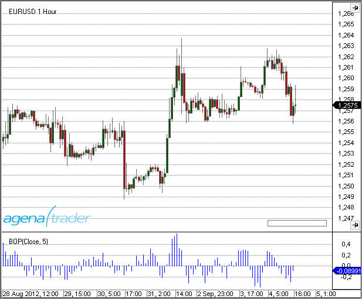

### Example
```cs
//Output of the value for the BOP with a smoothing of 5 periods
Print("The Balance of Power value is: " + BOP(5));
```

##Bollinger Bands
### Description & Interpretation
Bollinger Bands®, which were developed by John Bollinger, are volatility bands that are placed above and below a moving average. The volatility is based on the standard deviation, which fluctuates as volatility increases and decreases. An increase in volatility causes the bands to automatically widen, and a decrease in volatility causes them to automatically narrow. The Bollinger Bands’ dynamic nature means that they can also be used on different securities with the standard settings. When it comes to signals, Bollinger Bands can be used to identify M-Tops and W-Bottoms, or for determining a trend’s strength.

**Bollinger Bands are made up of a middle band with two outer bands.** The middle band is a simple moving average that is normally set to 20 periods. The reason a simple moving average is used is that the standard deviation formula also uses a simple moving average. The look-back period for the standard deviation is the same as for the simple moving average. The outer bands are generally set 2 standard deviations above and below the middle band, but settings can be adjusted to suit the characteristics of specific securities or trading styles. Bollinger recommends making small, incremental adjustments to the standard deviation multiplier. Changing the number of periods for the moving average also has an effect on the number of periods used to calculate the standard deviation, which is why only small adjustments are required for the standard deviation multiplier. An increase in the moving average period would also automatically increase the number of periods used for calculating the standard deviation, as well as warranting an increase in the standard deviation multiplier. With a 20-day SMA and 20-day Standard Deviation, the standard deviation multiplier is set at 2. Bollinger recommends increasing the standard deviation multiplier to 2.1 for a 50-period SMA and decreasing the standard deviation multiplier to 1.9 for a 10-period SMA.
**Bollinger Bands reflect direction with the 20-period SMA and volatility with the upper/lower bands**. This means that they can be used to determine whether prices are relatively high or low. Bollinger maintains that the bands should contain 88-89% of price action, rendering a move outside the bands very significant. Technically, prices are relatively high when above the upper band and relatively low when below the lower band. However, relatively high should not be seen as bearish or as a sell signal. Likewise, relatively low should not be regarded as bullish or as a buy signal, since prices are high or low for a reason. As with other indicators, Bollinger Bands are not designed to be used as a stand-alone tool. Traders should combine Bollinger Bands with basic trend analysis and other indicators to confirm a trend.

The calculation is performed in the following manner:

Upper band = middle band + 2 standard deviations
Middle band = average of 20 periods
Lower band = middle period – 2 standard deviations

More information can be found here: [*BollingerMTF*](#bollingermtf), [*Bollinger Percent %B*](#bollinger-percent-b-b), [*Bollinger Bands Width*](#bollinger-band-width-bbwidth)

### Further information
VTAD: [http://vtadwiki.vtad.de/index.php/Bollinger_B%C3%A4nder](http://vtadwiki.vtad.de/index.php/Bollinger_B%C3%A4nder)

Book "Technische Indikatoren - simplified" by Oliver Paesler (German only)

### Usage
```cs
Bollinger(double numStdDev, int period)
Bollinger(IDataSeries input, double numStdDev, int period)
//For the upper band
Bollinger(double numStdDev, int period).Upper[int barsAgo]
Bollinger(IDataSeries input, double numStdDev, int period).Upper[int barsAgo]
//For the lower band
Bollinger(double numStdDev, int period).Lower[int barsAgo]
Bollinger(IDataSeries input, double numStdDev, int period).Lower[int barsAgo]
```

### Return value
**double**

When using this method with an index (e.g. **Bollinger**(2, 20)\[**int** barsAgo\] ), the value of the indicator will be displayed for the referenced bar.

### Parameters
input Input data series for the indicator

numStdDev Standard deviation

period Number of bars included in the calculation

### Visualization


### Example
```cs
//Output of the value for the upper Bollinger Band
Print("Value of the upper band: " + Bollinger(2, 20).Upper[0]);
//Middle band
Print("Value of the middle band: " + Bollinger(2, 20)[0]);
//Lower band
Print("Value of the lower band: " + Bollinger(2, 20).Lower[0]);
```

##Bollinger Percent B (%b)
### Description
Bollinger %b is an important indicator that is derived from John Bollinger's original Bollinger Bands indicator. %b represents the location of the most recent close price in relation to the Bollinger Bands as well as to what degree it is above or below any of the bands. The Bollinger Percent B equation can be constructed in the following way: Percent B = ((Close - Bollinger Lower Band) / (Bollinger Upper Band - Bollinger Lower Band)) * 100. If the close price is the same as the upper Bollinger Band, %b will be 100 (percent). If the close price is the same as the lower Bollinger Band, %b will be 0.0 (percent). A %b value of 50 indicates that the close price is equal to the middle Bollinger Band. What is more, readings above 100 and below 0 show that the close price is outside of the Bollinger Bands by a corresponding percentage of the Bollinger Bandwidth. A %b value of 125 means that the close price is above the upper Bollinger Band by 25% of the Bandwidth, while a %b value of -25 means that the close price is below the lower Bollinger Band by 25% of the Bandwidth.

See [*Bollinger Bands*](#bollingerbands), [*BBWidth*](#bbwidth)

**An additional application: normalizing indicators**

Bollinger bands, and therefore the %b indicator, can be applied not only to the prices of stocks, futures etc., but also to time series with fundamental data, volume data and other indicators. This is particularly interesting when you need to know whether a value is relatively high or low – in this case, the %b indicator offers you a different perspective. If you wish to find out whether the volume of a stock is exceedingly high or low, you can simply apply it to the volume data. John Bollinger regards the application of the %b onto other indicators as one of the most important aspects of the indicator. If you wish to normalize an indicator with %b, it is important to first calculate the indicator (e.g. the RSI) with the help of the %b for the calculation of the indicator instead of the price data. The application of the %b essentially works in the same way as the application of Bollinger bands onto the indicator itself. The intersection points between the bands and the indicators will therefore be 1 and 0. In principle, the relative position of the original indicator is displayed in relation to its upper and lower bands. This means that the boundaries of the original indicator will be removed. John Bollinger himself wrote: “You’re defining a high or low point on a relative basis, this may allow you to gain a deeper insight and understanding not provided by traditional indicators and guidelines.” John Bollinger provides several parameters for the %b calculation, such as 40-day periods and a factor of 2.0 for a 9-day RSI, and a 50-day period with a factor of 2.1 for the calculation of %b.

(Sources: Oliver Paesler: "Technische Indikatoren - simplified" and John Bollinger: "Bollinger Bänder")

(Source: *tradesignalonline*)

### Further information
VTAD: [http://vtadwiki.vtad.de/index.php/Bollinger_B%C3%A4nder](http://vtadwiki.vtad.de/index.php/Bollinger_B%C3%A4nder)

Book "Technische Indikatoren - simplified" by Oliver Paesler (German only)

### Usage
```cs
BollingerPercentB(int period, double numStdDev)
BollingerPercentB(IDataSeries input, int period, double numStdDev)
BollingerPercentB(int period, double numStdDev) [int barsAgo]
BollingerPercentB(IDataSeries input, int period, double numStdDev)[int barsAgo]
```

### Return value
**double**

When using this method with an index (e.g. **BollingerPercentB**(20, 2)\[**int** barsAgo\] ), the value of the indicator will be outputted for the referenced bar.

### Parameters
input Input data series for the indicator

period Number of bars included in the calculation

numStdDev Standard deviation

### Visualization


### Example
//Output for the value of Bollinger %B

**Print**("Value of the Bollinger Percent B is: " + **BollingerPercentB**(20, 2)\[0\]);

##Bollinger Band Width (BBWidth)
### Description
This indicator is derived from Bollinger Bands. John Bollinger refers to Bollinger Band Width as one of two indicators that one can derive from Bollinger Bands; the other indicator is %B.
The Band Width measures the percentage difference between the upper and the lower band. It decreases as Bollinger Bands narrow, and increases as they widen. Since Bollinger Bands are based on the standard deviation, falling Band Width reflects decreasing volatility and rising Band Width reflects the opposite.


### Interpretation
John Bollinger uses the Band Width to recognize rising and falling trends. Most trends have their origins within sideway market movements that generally have a low volatility. If a breakout is accompanied by a sudden rise in the Band Width, this means that there is definite support for the move.

### Further information
VTAD: [*http://vtadwiki.vtad.de/index.php/Bollinger\_B%C3%A4nder*](http://vtadwiki.vtad.de/index.php/Bollinger_B%C3%A4nder)

Book "Technische Indikatoren - simplified" by Oliver Paesler (German only)

### Usage
```cs
BBWidth(double numStdDev, int period)
BBWidth(IDataSeries input, double numStdDev, int period)
BBWidth(double numStdDev, int period)[int barsAgo]
BBWidth(IDataSeries input, double numStdDev, int period)[int barsAgo]

//For the value of the upper Band Width
BBWidth(double numStdDev, int period).BandWidth
BBWidth(IDataSeries input, double numStdDev, int period).BandWidth
BBWidth(double numStdDev, int period).BandWidth[int barsAgo]
BBWidth(IDataSeries input, double numStdDev, int period).BandWidth[int barsAgo]

//For the value of the trigger line (threshold)
BBWidth(double numStdDev, int period).Threshold
BBWidth(IDataSeries input, double numStdDev, int period).Threshold
BBWidth(double numStdDev, int period).Threshold[int barsAgo]
BBWidth(IDataSeries input, double numStdDev, int period).Threshold[int barsAgo]
```

### Return value
**double**

When using the method with an index (e.g. **BBWidth**(2, 20)\[**int** barsAgo\] ), the value of the indicator will be outputted for the referenced bar.

### Parameters
input Input data series for the indicator

period Number of bars included in the calculation

numStdDev Standard deviation

### Visualization


### Example
```cs
//Output for the values of Bollinger Band Width
Print("The value of the Bollinger Band Width is: " + BBWidth(2, 20).BandWidth[0]);
//Output for the values for the signal line
Print("The value of the signal line is: " + BBWidth(2, 20).Threshold[0]);
```

##Bollinger MTF (MultiTimeFrame)
### Description
The Bollinger MTF is the multi-timeframe version of the Bollinger Bands, and its main use is in intraday trading. Multi-timeframe means that the indicator is calculated in a separate timeframe than that which is displayed in the chart. With the standard Bollinger band indicator, displaying an hourly Bollinger band in a 5-minute timeframe would not be possible – this is the point at which the MTF becomes useful. BollingerMTF can only be used for display in the chart and cannot be applied/implemented in AgenaScript.

### Visualization
The image shows a 5-minute chart with a 60-minute Bollinger band

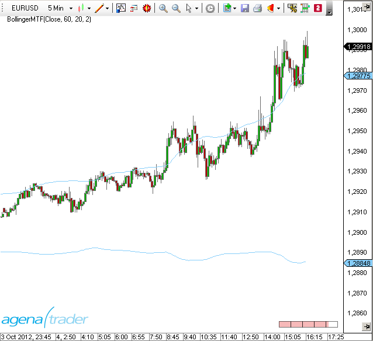

##BuySellPressure
### Description
The BuySellPressure indicator displays the buy or sell pressure for the current bar. Furthermore, these trades are classified as "buy" or “sell”. For this classification, a "buy" is assumed any time the transaction has occurred at or above the ask. Inside trades are not taken into account.

**Caution:
This is a real-time indicator. It will only work on and with real-time data and cannot therefore be used for historical information.**

**When the properties dialog for the indicator is open and changes are made, then the indicator must be reloaded. Doing so will delete all previously accumulated data.**

See [*BuySellVolume*](#buysellvolume).

### Usage
```cs
BuySellPressure()
BuySellPressure(IDataSeries input)

//For the values of buy pressure
BuySellPressure().BuyPressure[int barsAgo]
BuySellPressure(IDataSeries input).BuyPressure[int barsAgo]

//For the values of sell Pressure
BuySellPressure().SellPressure[int barsAgo]
BuySellPressure(IDataSeries input).SellPressure[int barsAgo]
```

### Return value
**double**

When using this method with an index (e.g. **BuySellPressure**().BuyPressure\[**int** barsAgo\] ), the value of the indicator will be outputted for the referenced bar.

**Caution:**
**If BuySellPressure is used with EoD data, the value 50 will always be outputted.**
-   BuySellPressure().SellPressure\[0\] = 50
-   BuySellPressure().SellPressure\[0\] = 50

### Parameters
input Input data series for the indicator

### Visualization


### Example
```cs
protected override void OnInit()
{
  BuySellPressure().CalculateOnClosedBar = false;
}

protected override void OnCalculate()
{
  if (Close[0] > DonchianChannel(20).Upper[5])
  {
    if (IsHistoricalMode || BuySellPressure().BuyPressure[0] > 70)
    OpenLong();
  }
}
```

##BuySellVolume
### Description
This indicator shows us the current buy or sell pressure based on the volume. For this, trades are classified as "buy" or "sell", whereby for the classification, a "buy" is assumed any time the transaction is executed at or above the ask. A transaction at or below the bid is considered a "sell".

**Caution: This is a real-time indicator and will not work with historical data.**

Similar conditions as with the [*BuySellPressure*](#buysellpressure) apply.

### Usage
```cs
BuySellVolume BuySellVolume()
BuySellVolume BuySellVolume(IDataSeries input)
```

### Return value
**double**

When using this method with an index (e.g. **BuySellVolume**().BuyVolume\[**int** barsAgo\] ), the value of the indicator will be outputted for the referenced bar.

### Parameter
input Input data series for the indicator

### Visualization


### Example
```cs
//Output for the BuySellVolume
Print("The BuySellVolume is: " + BuySellVolume()[0]);
```

##CandleStickPattern
### Description
The CandleStickPattern indicator looks for specific candlestick formations.


### Further information
Explanations of the formations and their interpretations can be found here: [http://en.wikipedia.org/wiki/Candlestick_pattern](http://en.wikipedia.org/wiki/Candlestick_pattern)

### Usage
```cs
CandleStickPattern(ChartPattern pattern, int trendStrength)
CandleStickPattern(IDataSeries input, ChartPattern pattern, int trendStrength)
CandleStickPattern(ChartPattern pattern, int trendStrength)[int barsAgo]
CandleStickPattern(IDataSeries input, ChartPattern pattern, int trendStrength)[int barsAgo]
```

### Return value
**double**

0 – Pattern not existent
1 – Pattern existent

When using this method with an index (e.g. **CandleStickPattern**(...)\[**int** barsAgo\] ), the value of the indicator will be outputted for the referenced bar.

### Parameters
|               |                                                                                                                                                                                                                    |
|---------------|-------------------------------------------------------------------------------------------------------------------------------------------------------------------------------------------------------------------|
| InSeries      | Input data series for the indicator
|
| pattern       | Possible values are:
                ChartPattern.BearishBeltHold
                 ChartPattern.BearishEngulfing
                 ChartPattern.BearishHarami
                 ChartPattern.BearishHaramiCross
                 ChartPattern.BullishBeltHold
                ChartPattern.BullishEngulfing
                ChartPattern.BullishHarami
                ChartPattern.BullishHaramiCross  
                ChartPattern.DarkCloudCover
                ChartPattern.Doji
                ChartPattern.DownsideTasukiGap
                ChartPattern.EveningStar
                ChartPattern.FallingThreeMethods
                ChartPattern.Hammer
                ChartPattern.HangingMan
                ChartPattern.InvertedHammer
                ChartPattern.MorningStart
                ChartPattern.PiercingLine
                ChartPattern.RisingThreeMethods
                ChartPattern.ShootingStar
                ChartPattern.StickSandwich
                ChartPattern.ThreeBlackCrows
                ChartPattern.ThreeWhiteSoldiers
                ChartPattern.UpsideGapTwoCrows
                ChartPattern.UpsideTasukiGap    |
| trendStrength | Signifies the number of bars to the left and right of the swing high or swing low that are used to identify a trend. The value 0 turns off the search, meaning that the only thing searched for is chart patterns. |

### Visualization


### Example
```cs
if (CandelStickPattern(ChartPattern.ShootingStar, 5)[0] == 1)
Print("Pattern ShootingStar found!");
```

##ChaikinMoneyFlow (CMF)
### Description
Marc Chaikin was the one to develop the Chaikin Money Flow Index, which is a volume indicator that tries to find an answer to the following question: Where is the money flowing into? Into the stock = accumulation, and out of the stock = distribution. Clearly, this applies not only to stocks/shares but also to other instruments. With this, Chaikin attempts to expand on and improve the On-Balance Volume that was developed by Granville. Using the CMF, the position of the closing price within the trading range is placed in relation to the volume. What this essentially means is that the trading volume is multiplied by the price. The trading volume displays the amount of money that has “flowed” into the stock or has been “removed” from the stock; the indicator simply displays whether it has been accumulated (buying pressure) or removed (distribution).

### Interpretation
The CMF oscillates around the zero line and is shown in a separate window with an open scale. Should the CMF be located above the zero line, then it can be interpreted as accumulation. If higher highs are being created, then the buying pressure is increasing. The reverse is true for the selling pressure. The Chaikin Money Flow should always be used in combination with other methods of technical analysis.

### Further information
VTAD: <http://vtadwiki.vtad.de/index.php/Chaikin\_Money\_Flow>

### Usage
```cs
ChaikinMoneyFlow(int period)
ChaikinMoneyFlow(IDataSeries input, int period)
ChaikinMoneyFlow(int period)[int barsAgo]
ChaikinMoneyFlow(IDataSeries input, int period)[int barsAgo]
```

### Return value
**double**

When using this method with an index (e.g. **ChaikinMoneyFlow**(21)\[**int** barsAgo\] ), the value of the indicator will be outputted for the referenced bar.

### Parameters
input Input data series for the indicator

period Number of bars included in the calculation

### Visualization
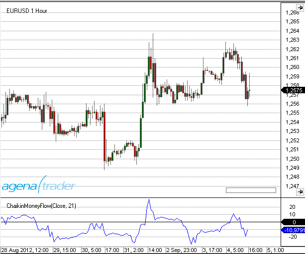

### Example
```cs
//Output for the Money Flow value
Print("The Chaikin Money Flow value is: " + ChaikinMoneyFlow(21)[0]);
```

##Chaikin Oscillator
### Description
The Chaikin Oscillator is a volume indicator that lets the trader know whether new highs are also accompanied by new volumes. This oscillator is a simple MACD that is applied to the accumulation/distribution line. Hereby, the difference between a 3-day exponential moving average and a 10-day exponential smoothed average for the accumulation/distribution line is calculated.

### Interpretation
The interpretation of the Chaikin Oscillator is similar to the principle of the accumulation/distribution. All an oscillator does is show the changes in liquidity for the instrument.

### Usage
```cs
ChaikinOscillator(int fast, int slow)
ChaikinOscillator(IDataSeries input, int fast, int slow)
ChaikinOscillator(int fast, int slow)[int barsAgo]
ChaikinOscillator(IDataSeries input, int fast, int slow)[int barsAgo]
```

### Return value
**double**

When using this method with an index (e.g. **ChaikinOscillator**(3, 10)\[**int** barsAgo\] ), the value of the indicator will be outputted for the referenced bar.

### Parameters
input Input data series for the indicator

fast Number of bars included in the calculation for the fast EMA

slow Number of bars included in the calculation for the slow EMA

### Visualization


### Example
```cs
//Output for the oscillator for the fast and slow values of 3 and 10
Print("The Chaikin Oscillator value is: " + ChaikinOscillator(3, 10)[0]);
```

##ChaikinVolatility (CVL)
### Description
The Chaikin Volatility Indicator is one of a few indicators that are designed to try and measure price movement fluctuations. Chaikin takes the daily price range (daily high minus daily low) as the fundamental measure of volatility. With this indicator, a widening range is, by implication, associated with a higher volatility.

### Interpretation
The indicator oscillates around the zero line and fluctuates between a scale of +100 to -100. It can be used on a daily chart as well as on a weekly or monthly chart. All values above the zero line represent rising volatility, and the gradient of the rise implies the seriousness of potential floors forming. The Chaikin Volatility is not specifically used to define exact signals, but is considered as more of an assisting tool in the trading system.

### Usage
```cs
ChaikinVolatility(int fast, int slow)
ChaikinVolatility(IDataSeries input, int fast, int slow)
ChaikinVolatility(int fast, int slow)[int barsAgo]
ChaikinVolatility(IDataSeries input, int fast, int slow)[int barsAgo]
```

### Return value
**double**

When using this method with an index (e.g. **ChaikinVolatility**(14)\[**int** barsAgo\] ), the value of the indicator will be outputted for the referenced bar.

### Parameters
input Input data series for the indicator

period Number of bars included in the calculations

### Visualization


### Example
```cs
//Chaikin output for a period of 14
Print("The value of the Chaikin Volatility is: " + ChaikinVolatility(14)[0]);
```

##Chande Momentum Oscillator (CMO)
### Description
The CMO is one of several indicators created by the technical analyst Tushar Chande; it is a technical momentum indicator. This indicator arises from calculating the difference between the total of all recent gains and the total of all recent losses, and then dividing this result by the total of all price movement over the given period. This oscillator shares similarities with other momentum indicators such as the Relative Strength Index and the Stochastic Oscillator, because it is also range-bound (+100 and -100).

### Interpretation
**The security is deemed overbought when the momentum oscillator is above +50 and oversold when it is below -50. Many technical traders add a nine-period moving average to this oscillator to act as a signal line. Bullish signals are generated when the oscillator crosses above the signal, and bearish signals are generated when the oscillator crosses down through the signal.**

### Further information
<http://www.boersenwissen.de/content/content\_bin/cont\_bin18.html>

### Usage
```cs
CMO(int period)
CMO(IDataSeries input, int period)
CMO(int period)[int barsAgo]
CMO(IDataSeries input, int period)[int barsAgo]
```

### Return value
**double**

When using this method with an index (e.g. **CMO**(14)\[**int** barsAgo\] ), the value of the indicator will be issued for the referenced bar.

### Parameters
input Input data series for the indicator

period Number of bars included in the calculations

### Visualization


### Example
```cs
//Output for the value of the Chande Momentum Oscillator
Print("The current value for the Chande Momentum Oscillator is: " + CMO(14)[0]);
```
##Climactic Distance
### Description
The Climactic Distance indicator was invented and developed by Gilbert Kreuzthaler, CEO of Include IT GmbH and founder of AgenaTrader.com. This indicator is used in the Location Point Trading system. It calculates the median course of the current and historical candle at a distance to the simple moving average (SMA) of the last 20 periods. Additionally, it also measures the average course deviation within the last 80 periods. If the median course exceeds the top or bottom course deviation, the market is deemed climactic, and this influences the trading decisions made in Location Point Trading.

### Calcualtion
Black line in the middle: SMA 20
Green moving line: Median Kurs
Red upper and lower line: Average course deviation oft he last 80 periods.

### More information
[https://www.facebook.com/Location-Point-Trading-344217482287592/?fref=ts](https://www.facebook.com/Location-Point-Trading-344217482287592/?fref=ts)

### Usage
```cs
ClimacticDistance(int sMAPeriod, int thresholdPercent)
ClimacticDistance(IDataSeries InSeries, int sMAPeriod, int thresholdPercent)
ClimacticDistance(int period, int tresholdPercent, Color climacticColor)
ClimacticDistance(IDataSeries InSeries, int sMAPeriod, int thresholdPercent, Color climacticColor)
//Upper band
ClimacticDistance(int sMAPeriod, int thresholdPercent).Upper[int barsAgo]
ClimacticDistance(IDataSeries InSeries, int sMAPeriod, int thresholdPercent).Upper[int barsAgo]
ClimacticDistance(int period, int tresholdPercent, Color climacticColor).Upper[int barsAgo]
ClimacticDistance(IDataSeries InSeries, int sMAPeriod, int thresholdPercent, Color climacticColor).Upper[int barsAgo]
//Lower band
ClimacticDistance(int sMAPeriod, int thresholdPercent).Lower[int barsAgo]
ClimacticDistance(IDataSeries InSeries, int sMAPeriod, int thresholdPercent).Lower[int barsAgo]
ClimacticDistance(int period, int tresholdPercent, Color climacticColor).Lower[int barsAgo]
ClimacticDistance(IDataSeries InSeries, int sMAPeriod, int thresholdPercent, Color climacticColor).Lower[int barsAgo]

//MovingAverage
ClimacticDistance(int sMAPeriod, int thresholdPercent).MovingAverage[int barsAgo]
ClimacticDistance(IDataSeries InSeries, int sMAPeriod, int thresholdPercent).MovingAverage[int barsAgo]
ClimacticDistance(int period, int tresholdPercent, Color climacticColor).MovingAverage[int barsAgo]
ClimacticDistance(IDataSeries InSeries, int sMAPeriod, int thresholdPercent, Color climacticColor).MovingAverage[int barsAgo]
//Distance
ClimacticDistance(int sMAPeriod, int thresholdPercent).Distance[int barsAgo]
ClimacticDistance(IDataSeries InSeries, int sMAPeriod, int thresholdPercent).Distance[int barsAgo]
ClimacticDistance(int period, int tresholdPercent, Color climacticColor).Distance[int barsAgo]
ClimacticDistance(IDataSeries InSeries, int sMAPeriod, int thresholdPercent, Color climacticColor).Distance[int barsAgo]
```
### Return value
**double**

### Parameters
Int

### Visualization
Image

### Example
```cs
//Output of the value for the Upper climactic distance line
Print(“Value of the upper band: “ + ClimacticDistnance(20, 80).Upper[0]);
//Output of the value for the Lower climactic distance line
Print(“Value of the upper band: “ + ClimacticDistnance(20, 80).Lower[0]);
//Output of the value for the Distance climactic distance line
Print(“Value of the upper band: “ + ClimacticDistnance(20, 80).Distance[0]);
//Output of the value for the Moving Average climactic distance line
Print(“Value of the upper band: “ + ClimacticDistnance(20, 80).MovingAverage[0]);
```

##Commodity Channel Index (CCI)
### Description
The Commodity Channel Index (CCI), which was created by Donald Lambert and actually featured in Commodities magazine in 1980, is a versatile indicator that can be used for identifying a new trend or as a warning of extreme conditions. Lambert originally developed the CCI as a means to identify cyclical turns in commodities – however, the indicator can also successfully be applied to ETFs, indices, stocks and various other securities. In general, what CCI does is to measure the current price level relative to an average price level over a specified period of time. When prices are well above their average, CCI is relatively high. When prices are far below their average, CCI is relatively low. This is how CCI can be used for identifying overbought and oversold levels.

### Interpretation
CCI measures the difference between a securitys price change and its average price change. High positive readings indicate that prices are well above their average, which is a show of strength. Low negative readings indicate that prices are well below their average, which is a show of weakness.

The Commodity Channel Index (CCI) can be used as either a coincident or leading indicator. As a coincident indicator, surges above +100 reflect strong price action that can signal the start of an uptrend. Plunges below -100 reflect weak price action that can signal the start of a downtrend.

As a *leading indicator*, *momentum oscillators*, chartists can look for overbought or oversold conditions that may foreshadow a mean reversion. Similarly, bullish and bearish divergences can be used to detect early momentum shifts and anticipate trend reversals.

### Further information
VTAD: [http://vtadwiki.vtad.de/index.php/Commodity_Channel_Index](http://vtadwiki.vtad.de/index.php/Commodity_Channel_Index)

### Usage
```cs
CCI(int period)
CCI(IDataSeries input, int period)
CCI(int period)[int barsAgo]
CCI(IDataSeries input, int period)[int barsAgo]
```

### Return value
**double**

When using this method with an index (e.g. **CCI**(14)\[**int** barsAgo\] ), the value of the indicator will be issued for the referenced bar.

### Parameters
input Input data series for the indicator

period Number of bars included in the calculations

### Visualization


### Example
```cs
//Output for the CCI value calculated using 14 periods
Print("The value of the Commodity Channel Index is: " + CCI(14));
```
##COTAggregatedIndexPositionDisaggregated
**The installation of the Technical Analysis Package is required in order to access this indicator.**

### Description
This indicator also works in the same way as the COTAggregatedIndexPositionLegacy; for interpretation and more detailed information, please read more under  [*COTAggregatedIndexPositionLegacy*](#COTAggregatedIndexPositionLegacy). The difference here, in turn, consists in the usage of the detailed disaggregated data for calculating the indicator.

For the COTAggregatedIndexPositionDisaggregated, the following parameters are available:

- AddIndices: 
  - **DowJones:** select [True] if the positions of the DowJones should be added to the overall result. 
  - **Nasdaq100:** select [True] if the positions of the Nasdaq100 should be added to the overall result. 
  - **Russell2000:** select [True] if the positions of the Russell2000 should be added to the overall  result. 
  - **SP500:**  select [True] if the positions of the SP500 should be added to the overall result.
  
- Categories: Financial
  - Here you can only select the categories of the Financials, since this indicator addresses 4 financial markets. However, you can load the indicator in Financials AND Commodities.
  - Select [True] for the categories for which the positions for the selected markets should be added up and displayed.
  
- Data base:
  - **ReportType:** see [*COTReportLegacy*](#COTReportLegacy) – CotType
  
- Display:
  - **LongPosition:** select [True] to display the long positions of the desired market participants 
  - **ShortPosition:** select [True] to display the short positions of the desired market participants 
  - **NetPosition:** select [True] to display the net positions of the desired market participants

### Parameters
to be announced

### Return value
to be announced

### Usage
to be announced

### Visualization


### Example
to be announced


##COTCommercialIndex
**The installation of the Technical Analysis Package is required in order to access this indicator.**

### Description
The CommercialIndex is a very telling COT indicator. It puts two of the most important COT-parameters in relation to each other – the net position of the commercials to the open interest. These values are normalized and subsequently outputted. A high value of the CommercialIndex shows strong buying behavior of the commercials, whereas a low value shows strong sell pressure from the commercials. The parameters are similarly structured as with the COTReport. 

The following parameters are available for the COTCommercialIndex:

- **CotType**: see [*COTReportLegacy*](#COTReportLegacy) – CotType
- **ReportType:** see [*COTReportLegacy*](#COTReportLegacy) – ReportType
- **StochasticPeriod:** see [*COTReportLegacy*](#COTReportLegacy)  – ComparativePeriod
- **OpenInterestType:** Here you can choose between [Native/Stochastic], which determines whether absolute values or the stochastic values of the positions of the commercials should be used for the calculation. The default setting is “Native”; do not change this if you wish to keep the informative value of the indicator.

### Parameters
to be announced

### Return value
to be announced

### Usage
to be announced

### Visualization


### Example
to be announced

##COTOpenInterestDisaggregated
**The installation of the Technical Analysis Package is required in order to access this indicator.**

### Description
This indicator corresponds to the mode of operation of the COTOpenInterestLegacy, instead using, however, the more finely broken down data of the disaggregated reports. For the functionality and interpretation of the open interest, please read more under see [*COTOpenInterestLegacy*](#COTOpenInterestLegacy).
 The calculation also occurs analogously to the legacy reports, and since for each long contract, there must also be a market participant on the short side, two calculation methods are possible (here for commodity futures):
 
1) Producer[Long] + SwapDealer[Long] + SwapDealer[Spread] + ManagedMoney[Long] + ManagedMoney[Spread] + OtherReportables[Long] + OtherReportables[Spread] + NonReportable[Long] = OpenInterest 

2) Producer[Short] + SwapDealer[Short] + SwapDealer[Spread] + ManagedMoney[Short] + ManagedMoney[Spread] + OtherReportables[Short] + OtherReportables[Spread] + NonReportable[Short] = OpenInterest

The following parameters are available for the COTOpenInterestDisaggregated:

- **Categories: Commodity** 
  - **OpenInterest_Comm:** (=total OpenInterest for Commodities) 
      - [Absolute]: outputs the OpenInterest as an absolute number
      - [Stochastic]: OpenInterest as an oscillator with values between 0-100 
      - [None]: no output for the OpenInterest.
  - **%ofOIProd Long/Short/Spread:** (=Percent of OpenInterest for Producer Long/Short/Spread – Position) – select [True] if this value should be displayed. This here is the percentage that the positions of the producers have of the overall OpenInterest. A value of 0.5, for example, means that the producers have built up long positions in the size of 50% of the entire OpenInterest.
  -  **%ofOISwapDealer Long/Short/Spread:** (=Percent of OpenInterest for SwapDealers Long/Short/Spread – Position) – select [True] if this value should be displayed.
  - **%ofOIManagedMoney Long/Short/Spread**: (=Percent of OpenInterest for ManagedMoney Long/Short/Spread – Position) – select [True] if this value should be displayed. 
  - **%ofOIComOther Long/Short/Spread:** (=Percent of OpenInterest for Other Traders in Commodities Long/Short/Spread – Position) – select [True] if this value should be displayed. 
  - **%ofOIComNonreportables Long/Short/Spread**: (=Percent of OpenInterest for NonReportables in Commodites Long/Short/Spread – Position) select [True] if this value should be displayed.
- **Categories: Financial**
  - All parameters work analogously to the settings under “Categories: Commodity”; the only difference lies in the division into various groups of market participants
- **Data base:** 
  - **CotType:** [*COTReportLegacy*](#COTReportLegacy) - CotType 
  - **ReportType:** [*COTReportLegacy*](#COTReportLegacy) - ReportType 
  - **StochasticPeriod:** [*COTReportLegacy*](#COTReportLegacy) – ComparativePeriod

### Parameters
to be announced

### Return value
to be announced

### Usage
to be announced

### Visualization


### Example
to be announced

##COTOpenInterestLegacy
**The installation of the Technical Analysis Package is required in order to access this indicator.**

### Description
The open interest specifies the number of all currently held contracts; a high open interest, therefore, indicates that the market participants have great interest in this value; vice versa, low open interest shows that a value has only few held contracts and therefore little activity from the market participants. 
There are two options for calculating the OpenInterest:

 1) Commercial[Long] + NonCommercial[Long] + NonCommercial[Spread] + NonReportable[Long] = OpenInterest
 2) Commercial[Short] + NonCommercial[Short] + NonCommercial[Spread] + NonReportable[Short] = OpenInterest

Since for every long contract, there is also a market participant on the short side, both calculation methods yield exactly the same value. Additional info: with the CFTC, the open interest is not calculated; the CFTC can simply see the open interest by counting all contracts that are open in the market. With known open interest, the NonReportable positions are then calculated, since the following equation must be valid: TotalReportable + NonReportable = OpenInterest. TotalReportable and OpenInterest are known, allowing the NonReportables to be calculated.

The following parameters are available for the OpenInterestLegacy:

- **CotType:** [*COTReportLegacy*](#COTReportLegacy) – CotType

- **ReportType:** [*COTReportLegacy*](#COTReportLegacy) – ReportType

- **StochasticPeriod:** [*COTReportLegacy*](#COTReportLegacy)– ComparativePeriod 

- **IsNative:** outputs the OpenInterest as an absolute number, just as it is read out from the CFTC reports

- **IsStochastic:** the OpenInterest is outputted and calculated as an oscillator with values between 0-100. With the StochasticPeriod, you can set with which period the Stochastic should be calculated.

- **IsCommercialLong/IsCommercialShort:** select [True] if you would like to have the data for the NonCommercials displayed. The outputted values are percentages; if, for example, you set IsCommercialLong=True, the percentage of long positions of the Commercials that make up the total OpenInterest is outputted. A value of 0.5, for example, means that the OpenInterest consists of 50% long positions of the Commercials, which can be considered a very large long position of the Commercials.

- **IsNonCommercialLong/IsNonCommercialShort:** if you select [True], the percentage of NonCommercial long positions i.e. NonCommercial short positions that make up the total OpenInterest is outputted.

- **IsNonReportableLong/IsNonReportableShort:** if you select [True], the percentage of NonReportable long positions i.e. NonReportable short positions that make up the total OpenInterest it outputted.

- **IsTotalReportableLong/IsTotalReportableShort:** if you select [True], the percentage of TotalReportable long positions i.e. TotalReportable short positions that make up the total OpenInterest is outputted. (TotalReportable = Commercials+NonCommercials).


### Parameters
to be announced

### Return value
to be announced

### Usage
to be announced

### Visualization


### Example
to be announced


##COTReportDisaggregated
**The installation of the Technical Analysis Package is required in order to access this indicator.**

### Description
The COTReportDisaggregated accesses the detailed disaggregated reports of the CFTC, which have been published since 2009 and can be regarded as a further development of the legacy reports. The necessity for improvement has resulted in the drastically changing and constantly developing market environment since the introduction of the COT reports in 1986. 
The market participants are now divided more subtly and are organized into 5 categories. These 5 categories vary according to whether we are dealing with a commodity future or a financial future.


The market participants are now divided more subtly and are organized into 5 categories. These 5 categories vary according to whether we are dealing with a commodity future or a financial future.

The **commodity futures** are divided into the following groups: 

- Producer/Merchant/Processor/User 
- SwapDealers o ManagedMoney 
- Other Reportables 
- Nonreportables 
- You can find more information about the classification of the commodities [HERE](http://www.cftc.gov/idc/groups/public/@commitmentsoftraders/documents/file/disaggregatedcotexplanatorynot.pdf)

For the **financial futures**, there are the following groups: 

- Dealer/Intermediary 
- AssetManager/Institutional 
- Leveraged Funds 
- Other Reportables 
- Nonreportabes
- You can find more information about the classification of the financials [HERE](http://www.cftc.gov/idc/groups/public/@commitmentsoftraders/documents/file/tfmexplanatorynotes.pdf)

The following parameters are available for the COTReportDisaggregated:

 - **Categories Commodity/Categories Financial:** 
   - Select [True] for the groups that you would like to have displayed in the chart. If you have opened a commodity chart, only settings made under “Categories Commodity” will be taken into account, and vice versa if you have opened a financial chart.

- **Database:**
  - **CotType:** [*COTReportLegacy*](#COTReportLegacy) – CotType
  - **IndexType:** [*COTReportLegacy*](#COTReportLegacy) – IndexType
  - **ReportType:** [*COTReportLegacy*](#COTReportLegacy) – ReportType
  - **StochasticPeriod:** [*COTReportLegacy*](#COTReportLegacy)– ComparativePeriod 

- **Display:** 
  - **LongPosition:** select [True] to display the long positions of the desired market participants 
  - **ShortPosition:** select [True] to display the short positions of the desired market participants 
  - **NetPosition:** select [True] to display the net positions of the desired market participants

### Parameters
to be announced

### Return value
to be announced

### Usage
to be announced

### Visualization


### Example
to be announced


##COTReportLegacy
**The installation of the Technical Analysis Package is required in order to access this indicator.**

### Description
This indicator is the core element of the COT analysis, with which one can directly display the pure data that the indicator reads from the reports published weekly by the CFTC (www.cftc.gov/CommitmentsofTraders). 
The published reports can be viewed by every market participant. The legacy data is published in the so called short reports you can find on the CFTC-website. The following parameters are available in the COTReportLegacy:

- **Comparative Period:** with this setting, you can enter a comparative period with which the stochastic display is calculated (=StochasticPeriod). The system only triggers this parameter when “IndexType = Stochastic” is set.

- **CotType:** under [All/Other/Old], select which contracts should be used for the display; more details are available [HERE](http://www.cftc.gov/MarketReports/CommitmentsofTraders/ExplanatoryNotes/index.htm)

- **IndexType:** choose between [Absolute/Stochastic] as to how the values should be outputted.
  - Absolute = the values are outputted in whole numbers, just as they are read out from the reports. 
  - Stochastic = the values are outputted and calculated as an oscillator with values between 0-100. With the ComparativePeriod, you can set with which period the Stochastic should be calculated.
 
- **ReportType:** under this parameter, you select whether the data from the reports should be read out only for futures, or for futures + options.

- **ReturnType:** 
  - Net: outputs the net position (=LongContracts – ShortContracts) of the selected market participants
  - Long/Short: outputs the long i.e. short contracts of the selected market participants
  - OI: outputs the total OpenInterest of this instrument; for a more precise and advanced display of the OpenInterest, please use the indicator OpenInterestLegacy
  
 - **ShowCommercials:** select [True] if you would like to have the data for the Commercials displayed. For detailed information on the definition of which market participants are classified as Commercials, please have a look [HERE](http://www.cftc.gov/MarketReports/CommitmentsofTraders/ExplanatoryNotes/index.htm)
 
 - **ShowNonCommercials:** select [True] if you would like to have the data for the NonCommercials displayed. For detailed information on the definition of which market participants are classified as NonCommercials please have a look at the link provided above.
 
 - **ShowNonReportables:** select [True] if you would like to have the data for the NonReportables displayed. For detailed information on the definition of which market participants are classified as NonCommercials please have a look at the link provided above.


### Parameters
to be announced

### Return value
to be announced

### Usage
to be announced

### Visualization


### Example
to be announced


##COTStockDummy
**The installation of the Technical Analysis Package is required in order to access this indicator.**

### Description
This indicator attempts to simulate the behavior of the commercials in stock markets using a special algorithm. The values are outputted as Stochastic, meaning that they oscillate between values of 0-100. The interpretation of this indicator is analogous to
the interpretation of the commercial data in the standard COT indicators. The output of this indicator should be confirmed with other indicators; you must be aware that we are not talking about real COT data from market participants, but about calculations from the price data. As for the COT data, an analysis in the weekly chart is also recommended for the COTStockDummy.

The following parameters are available for the COTStockDummy:

- **ComparativePeriod:** input period for the stochastic calculation
- **Stochastic:** [True] outputs normalized values (values between 0-100)
- **Period:** this is a period that is necessary for calculating the data. If you do not have detailed information about how this indicator works, please leave this period on the default setting.

### Parameters
to be announced

### Return value
to be announced

### Usage
to be announced

### Visualization
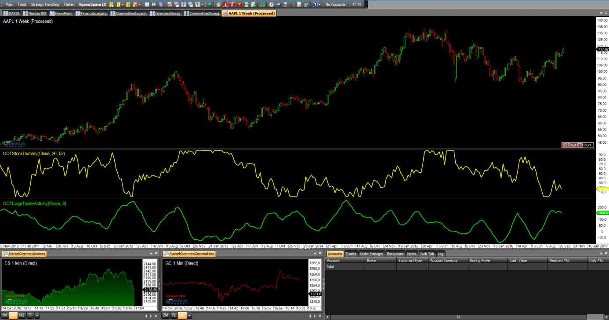

### Example
to be announced

##COTLargeTraderActivity
**The installation of the Technical Analysis Package is required in order to access this indicator.**

### Description
The COTLargeTraderActivity indicator, like the COTStockDummy, is based not on real COT data, but instead on algorithmically calculated outputs. This indicator attempts to simulate the behavior of the large traders in markets for which no COT data is available. Here, the interpretation takes place analogously to the analysis of the NonCommercials in the standard COT indicators.As with the COTStockDummy, we point out that other indicators should be consulted, since we are not dealing with real COT data.

The following parameters are available for the COTLargeTraderActivity:

- **Period:** this is a period that is necessary for calculating the data. If you do not have detailed information about how this indicator works, please leave this period on the default setting.

### Parameters
to be announced

### Return value
to be announced

### Usage
to be announced

### Visualization


### Example
to be announced


## Darvas Boxes
### Description
Former ballroom dancer Nicolas Darvas developed the Darvas boxes as a trading strategy in 1956. Darvas' trading technique consisted of buying into stocks that were trading at new 52-week highs, with accordingly high volumes. When a stock price rises above the previous 52-week high, but then proceeds to fall back to a price not far from that high, a Darvas box is formed. If the price falls too far, this can signify a false breakout. Otherwise, however, the lower price is used as the bottom of the box and the higher price as the top.
A box is made up of an upper boundary (top) and a lower boundary (floor). Each new box is created based on a previous box, depicting a “stair” formation.
If a new high is not formed after three consecutive days, then the high is labeled as the upper boundary. Following this, the floor is specified based on the lowest price.


### Interpretation
This system is similar to a trend-following channel breakout system. As soon as one of these boxes breaks out, a new buy or sell signal is generated.

### Further information
Here you can read about a trading system based on the Darvas boxes. (German only)
[http://www.eusdoni.de/index.php?option=com_content&view=article&catid=13:eusdoni-version-3&id=42:darvas-boxen](http://www.eusdoni.de/index.php?option=com_content&view=article&catid=13:eusdoni-version-3&id=42:darvas-boxen)

### Usage
```cs
Darvas()
Darvas(IDataSeries input)

//For the upper Box boundary
Darvas().Upper[int barsAgo]
Darvas(IDataSeries input).Upper[int barsAgo]

//Returns the lower value
Darvas().Lower[int barsAgo]
Darvas(IDataSeries input).Lower[int barsAgo]
```

### Return value
**double**

When using this method with an index (e.g. **Darvas**()\[**int** barsAgo\] ), the value of the indicator will be issued for the referenced bar.

### Parameter
input Input data series for the indicator

### Visualization


### Example
```cs
//Output for the values for the upper markings (box top)
Print("The upper boundary for the Darvas box is: " + Darvas().Upper[0]);
//Lower markings
Print("The lower boundary for the Darvas box is: " + Darvas().Lower[0]);
```

##Directional Movement (DM)
### Description
The Directional Movement indicator is almost identical to the ADX, with the only difference that the +DM and -DM values are also calculated. These values are then later on used for the DMI.

### Interpretation
The Directional Movement indicator is positive when the difference between the highs is at its largest.

### Further information
See: Directional Movement Index ([*DMI*](#directional-movement-index-dmi))

### Usage
```cs
DM(int period)
DM(IDataSeries input, int period)
DM(int period)[int barsAgo]
DM(IDataSeries input, int period)[int barsAgo]
//For the value of +DM
DM(int period).DiPlus[int barsAgo]
DM(IDataSeries input, int period).DiPlus[int barsAgo]
//For the value of -DM
DM(int period).DiMinus[int barsAgo]
DM(IDataSeries input, int period).DiMinus[int barsAgo]
```

### Return value
**double**

When using this method with an index (e.g. **DM**(14).DiPlus\[**int** barsAgo\] ), the value of the indicator will be issued for the referenced bar.

### Parameters
input Input data series for the indicator

period Number of bars included in the calculations

### Visualization


### Example
```cs
//Output of the DM values
Print("The current +DM value is: " + DM(14).DiPlus[0]);
Print("The current –DM value is: " + DM(14).DiMinus[0]);
```

##Donchian Channel
### Description
The Donchian channel can also be called the “4-week-rule”; this is how it works: when the current price reaches a peak above the high of the past 4 weeks, a new long position is opened. If a short position is open simultaneously, it is closed. This works vice versa with shorts. The  Donchian channel trading system is a purely trend-following system based on the concept “buy when it is strong, sell when it is weak”. The famous “Turtles” also employed this breakout system. This indicator displays the highs and lows of the last n days as lines above and below the price development. 20 days represent 4 weeks.

### Further information
VTAD: <http://vtadwiki.vtad.de/index.php/Donchian\_Channel>

### Usage
```cs
DonchianChannel(int period)
DonchianChannel(IDataSeries input, int period)

//Upper band
DonchianChannel(int period).Upper[int barsAgo]
DonchianChannel(IDataSeries input, int period).Upper[int barsAgo]

//Middle band
DonchianChannel(int period)[int barsAgo]
DonchianChannel(IDataSeries input, int period)[int barsAgo]

//Lower band
DonchianChannel(int period).Lower[int barsAgo]
DonchianChannel(IDataSeries input, int period).Lower[int barsAgo]
```

### Return value
**double**

When using this method with an index (e.g. **DonchianChannel**(14)\[**int** barsAgo\] ), the value of the indicator will be issued for the referenced bar.

### Parameters
input Input data series for the indicator

period Number of bars included in the calculations

### Visualization


### Example
```cs
//Output for the values of the Donchian Channel
Print("The upper band is at: " + DonchianChannel(14).Upper[0]);
Print("The middle band is at: " + DonchianChannel(14)[0]);
Print("The lower band is at: " + DonchianChannel(14).Lower[0]);
```

##Directional Movement Index (DMI)
### Description
Welles Wilder Jr. developed the Directional Movement concept in 1978. His concept includes the following components:

Directional Movement Index (DMI)

Average Directional Movement Index ([*ADX*](#average-directional-index-adx))

True Range (TR)

The Directional Movement Index comes before the Average Directional Movement Index. The DMI shows the strengths of the trend-favoring price movements in percentages. Its standard application is the smoothed ADX.

### Interpretation
The DMI shows the strength of the trend, but not the trend direction. This means that it is particularly suited as a filter for trading systems employing the Parabolic SAR, for example, in order to filter out sideways phases. When the DMI rises (especially above 25), a trend is displayed; anything below that is recognized as a sideways phase. The +DI and the –DI point towards a trend. An uptrend is classified when the +DI is above the –DI. The further apart they drift, the stronger the trend.

### Further information
VTAD: [http://vtadwiki.vtad.de/index.php/DMI_-_Directional_Movement_Index](http://vtadwiki.vtad.de/index.php/DMI_-_Directional_Movement_Index)

### Usage
```cs
DMI(int period)
DMI(IDataSeries input, int period)
DMI(int period)[int barsAgo]
DMI(IDataSeries input, int period)[int barsAgo]
```

### Return value
**double**

When using this method with an index (e.g. **DMI**(20)\[**int** barsAgo\] ), the value of the indicator will be issued for the referenced bar.

### Parameters
input Input data series for the indicator

period Number of bars included in the calculations

### Visualization


### Example
```cs
//Output for the DMI
Print("The current DMI value is: " + DMI(20)[0]);
```

##Double Stochastics (DSS)
### Description
William Blau was the developer of the Double Smoothed Stochastic (DSS), which is a double-smoothed stochastic indicator. After a while, it was improved upon by Walter Bressert as a variation of the double-smoothed stochastic. Smaller changes in the price movements cause this indicator to react more sensitively, and it also produces more signals than the one Blau developed. The Bressert version therefore also illustrates extreme zones more clearly than the Blau version.

Regardless of the various calculation methods used, the DSS always stays within a scale of 0 to 100. The extreme zones in the developed stochastics are the same as for the original stochastics. The upper extreme area is marked at 80, and the lower extreme zone at 20 - these values cannot be changed. For many applications, it is wise to include an additional middle line at 50, and to adapt this to the circumstances as needed.

### Interpretation
Values above 80 are seen as overbought, and below 20 as oversold. In addition, signals are produced by the signal line’s behavior and movements into and out of the extreme zones.

### Usage
```cs
DoubleStochastics(int period)
DoubleStochastics(int period)[int barsAgo]
DoubleStochastics(int period, DoubleStochasticsMode mode, int EMA-Period1)
DoubleStochastics(IDataSeries input, int period, DoubleStochasticsMode mode, int EMA-Period1)
DoubleStochastics(int period, DoubleStochasticsMode mode, int EMA-Period1)[int barsAgo]
DoubleStochastics(IDataSeries input, int period, DoubleStochasticsMode mode, int EMA-Period1)[int barsAgo]
DoubleStochastics(int period, DoubleStochasticsMode mode, int EMA-Period1, int EMA-Period2)
DoubleStochastics(IDataSeries input, int period, DoubleStochasticsMode mode, int EMA-Period1, int EMA-Period2)
DoubleStochastics(int period, DoubleStochasticsMode mode, int EMA-Period1, int EMA-Period2)[int barsAgo]
DoubleStochastics(IDataSeries input, int period, DoubleStochasticsMode mode, int EMA-Period1, int EMA-Period2)[int barsAgo]

//For the value of %K
DoubleStochastics(int period).K[int barsAgo]
DoubleStochastics(IDataSeries input, int period).K[int barsAgo]
DoubleStochastics(int period, DoubleStochasticsMode mode, int EMA-Period1).K[int barsAgo]
DoubleStochastics(IDataSeries input, int period, DoubleStochasticsMode mode, int EMA-Period1).K[int barsAgo]
DoubleStochastics(int period, DoubleStochasticsMode mode, int EMA-Period1, int EMA-Period2).K[int barsAgo]
DoubleStochastics(IDataSeries input, int period, DoubleStochasticsMode mode, int EMA-Period1, int EMA-Period2).K[int barsAgo]
```

### Return value
**double**

When using this method with an index (e.g. **DoubleStochastics**(...)\[**int** barsAgo\] or **DoubleStochastics**(...).K\[**int** barsAgo\]), the value of the indicator will be issued for the referenced bar.

### Parameters
input Input data series for the indicator

period Number of bars included in the calculations (default: 10)

mode Method of calculation, possible inputs are Blau, Blau2, Bressert

EMA-Period1 Periods for the EMA

EMA-Period2 Periods for the second EMA

### Visualization


### Example
```cs
//Output for %K
Print("The value of the DSS Bressert %K is: " + DoubleStochastics(10, DoubleStochasticsMode.Bressert, 2)[0]);
```

##Dynamic Momentum Index (DMIndex)
### Description
The Dynamic Momentum Index, which was developed by Tushar Chande, is a specific variant of the Relative Strength Index. Chande changed the Dynamic Momentum Index in such a way that, based on various factors, the period settings automatically adjust themselves, which he achieved by coupling it to the RSI in order for a volatility component to be present. The definition of this volatility component is based on a 5-day standard deviation of the closing prices. This, in turn, is then compared to the 10-day average of a 5-day standard deviation.

### Interpretation
If the DMI is inside the oversold zone, it is reasonable to assume that prices are going to start to fall.

### Further and more concise information
VTAD: <http://vtadwiki.vtad.de/index.php/Dynamic\_Momentum\_Index>

### Usage
```cs
DMIndex(int smooth)
DMIndex(IDataSeries input, int smooth)
DMIndex(int smooth)[int barsAgo]
DMIndex(IDataSeries input, int smooth)[int barsAgo]
```

### Return value
**double**

When using this method with an index (e.g. **DMIndex**(3)\[**int** barsAgo\] ), the value of the indicator will be issued for the referenced bar.

### Parameters
input Input data series for the indicator

smooth Smoothing settings

### Visualization


### Example
```cs
//Output of the value for the DMIndex Indicator with a smoothing factor of 3
Print("The current value for the DMIndex is: " + DMIndex(3)[0]);
```

##Ease of Movement (EOM)
### Description
Ease of Movement (EMV) is a volume-based oscillator created by Richard Arms that constantly moves above and below the zero line. It is intended to measure the "ease" of price movement, as suggested by the name. Arms developed Equivolume charts in order to visually display price ranges and volume. Ease of Movement expands upon Equivolume by quantifying the price/volume relationship and displaying the results in the form of an oscillator. Generally, when the oscillator is in a positive area, prices are advancing with relative ease. On the other hand, when the oscillator is in negative territory, prices are falling with relative ease.

### Interpretation
When the EOM is moving away from the zero line (marker) then an impulse has begun in that direction. During a breakout onto the opposite side of the zero line, it is recommended to enter with the trend direction.

### Further information
<http://www.volumen-analyse.de>

### Usage
```cs
EaseOfMovement(int smoothing, int volDivisor)
EaseOfMovement(IDataSeries input, int smoothing, int volDivisor)
EaseOfMovement(int smoothing, int volDivisor)[int barsAgo]
EaseOfMovement(IDataSeries input, int smoothing, int volDivisor)[int barsAgo]
```

### Return value
**double**

When using this method with an index (e.g. **EaseOfMovement**(14, 10000)\[**int** barsAgo\] ), the value of the indicator will be issued for the referenced bar.

### Parameters
input Input data series for the indicator

smoothing Smoothing settings

volDivisor For calculation of the box ratio (see “Calculation” below)

### Visualization


### Calculation
Midpoint = (High + Low) / 2
MidpointMove = Midpoint \[today\] – Midpoint \[yesterday\]
BoxRatio = Volume / (High – Low)
Ease = MidpointMove / Box Ratio

### Example
```cs
//Output for the values of the EOM line
Print("The value for the Ease of Movement is: " + EaseOfMovement(14, 10000)[0]);
```

##Fisher Transform
### Description
The physicist John Ehlers created the Fisher Transform in 2002. The intention of the indicator is to show where there are turning points, which can be achieved with the help of the Inverse Fisher Transform. This changes indicators in such a way that the movements are less random, and the signal quality is clearer. The Fisher Transform either stretches or compresses the input values of the function so that the output is very likely to be between -1 and 1. This gives us a clearly identifiable pattern where even indicators such as the RSI become better defined and more precise.

### Interpretation
A system using the Fisher Transform can be found here:
<https://www.prorealtime.com/de/pdf/probacktest.pdf>

### Parameters
input Input data series for the indicator

period Number of bars included in the calculations

### Return value
**double**

When using this method with an index (e.g. **FisherTransform**(10)\[**int** barsAgo\] ), the value of the indicator will be issued for the referenced bar.

### Usage
```cs
FisherTransform(int period)
FisherTransform(IDataSeries input, int period)
FisherTransform(int period)[int barsAgo]
FisherTransform(IDataSeries input, int period)[int barsAgo]
```

### Visualization


### Example
```cs
//Output values for the Fisher Transform
Print("The current value for the Fisher Transform is: " + FisherTransform(10)[0]);
```

##Forecast Oscillator (FOSC)
### Description
The FOSC makes a comparison of the current price against the value returned by the Time Series Forecast study. It is calculated as a percentage ratio of the difference between the close price and the Time Series Forecast value for the previous bar.

When this oscillator displays positive values, it hints that the Time Series Forecast has underestimated the price, whereas negative values suggest that the TSF has overestimated the price. Usually, an SMA also accompanies the Forecast Oscillator line in the search for oscillator reversals.

### Further information
FMLabs: <http://www.fmlabs.com/reference/default.htm?url=ForecastOscillator.htm>

### Parameters
input Input data series for the indicator

period Number of bars included in the calculations

### Return value
**double**

When using this method with an index (e.g. **FOSC**(14)\[**int** barsAgo\] ), the value of the indicator will be issued for the referenced bar.

### Usage
```cs
FOSC(int period)
FOSC(IDataSeries input, int period)
FOSC(int period)[int barsAgo]
FOSC(IDataSeries input, int period)[int barsAgo]
```

### Visualization


### Examples
```cs
//Output for the Forecast Oscillator
Print("The current value for the Forecast Oscillator is: " + FOSC(14)[0]);

//Determining the future market direction
if (FOSC(14)[0] > 0)
Print("The FOSC is bigger than zero, which indicates rising price movements.");
```

##HighestHighIndex()
### Description
The Highest High Index prints the index for the bars with the highest high within a specified number of periods. It is slightly different from the GetSerieHighestValue() function in that it can be visualized within the chart.

See [*HighestHighPrice()*](#highesthighprice), [*LowestLowPrice()*](#lowestlowprice), [*LowestLowIndex*](#lowestlowindex), [*GetSerieHighestValue()*](#getseriehighestvalue), [*GetSerieLowestValue()*](#getserielowestvalue).

### Usage
```cs
HighestHighIndex(int BarsBack)
HighestHighIndex(int BarsBack)[int barsAgo]
```

### Return value
**double**

When using this method with an index (e.g. **HighestHighIndex**(14)\[**int** barsAgo\] ), the value of the indicator will be issued for the referenced bar.

### **Parameter**
BarsBack Number of periods in which the highest high will be searched for

### Visualization


### Example
```cs
// How many bars back is the bar with the highest high of the last 14 bars located?
Print("The highest high in the last 14 bars was " + HighestHighIndex(14)[0] + " bars ago.");
```

##HighestHighPrice()
### Description
Highest High Price shows the highest high achieved within a predefined number of periods.

Unlike the GetSerieHighestValue(), this indicator can be displayed within the chart.

See [*HighestHighIndex()*](#highesthighindex), [*LowestLowPrice()*](#lowestlowprice), [*LowestLowIndex*](#lowestlowindex), [*GetSerieHighestValue()*](#getseriehighestvalue), [*GetSerieLowestValue()*](#getserielowestvalue).

### Usage
```cs
HighestHighPrice(int BarsBack)
HighestHighPrice(int BarsBack)[int barsAgo]
```

### Return value
**double**

When using this method with an index (e.g. **HighestHighPrice**(14)\[**int** barsAgo\] ), the value of the indicator will be outputted for the referenced bar.

### Parameter
BarsBack Number of periods in which the highest high will be searched for

### Visualization


### Example
```cs
// What was the value of the highest high in the last 14 periods?
Print("The highest high for the last 14 bars is " + HighestHighPrice(14)[0]);
```

##IchimokuCloud
### Description
The Ichimoku Cloud, also called Ichimoku Kinko Hyo, is a very adaptable indicator that defines support and resistance, gauges momentum, identifies trend direction and provides trading signals. Ichimoku Kinko Hyo literally means "one look equilibrium chart". With just one look, traders can identify the trend and search for possible signals in that trend. The indicator was developed by the journalist Goichi Hosoda, and published in his 1969 book. Although the Ichimoku Cloud may appear complicated when looked at on the price chart, it is in fact a simple indicator that can be implemented very well – a tribute to the fact that its inventor was a journalist! What is more, the concepts are easily understandable and the signals well-defined.

**1. Tenkan Sen** – conversion line This is the median value of the 9-period high and the 9-period low.
**2. Kinjun Sen** – the baseline This is the midpoint of the 26-period high and low.
**3. Chikou Span** – lagging span This is the closing price plotted 26 days in the past.
**4. Senkou Span A** – the first leading line This is the midpoint between the conversion line and the baseline. The leading Span A forms one of the two cloud boundaries. It is referred to as leading because it is plotted 26 periods in the future and thus builds the faster cloud boundary.
**5. Senkou Span B** – the second leading line This is the midpoint of the 52-day high-low range projected 26 periods into the future, forming the slower cloud boundary.
Kumo – cloud The cloud (Kumo) is the area between Senkou Span A and Senkou Span B. This area is highlighted in color, forming a cloud shape.

**Caution:**
Because the cloud is drawn “into the future”, it is necessary to shift the time axis to the left in order to view it.

### Interpretation
Similarly to the smoothing averages, the Ichimoku indicator will create a bullish signal when the Tenkan Sen crosses over the Kinjun Sen from below.

### Further information
<http://de.wikipedia.org/wiki/Ichimoku>

<http://www.forexabode.com/technical-analysis/ichimoku-cloud>

<http://stockcharts.com/school/doku.php?id=chart\_school:technical\_indicators:ichimoku\_cloud>

<http://www.forexonlinegeheimnisse.com/ichimoku-kinko-hyo-teil-i\#top> (Part 1, German)

<http://www.forexonlinegeheimnisse.com/ichimoku-kinko-hyo-teil-ii-das-perfekte-kauf-oder-verkaufssignal\#top> (Part 2, German)

### Usage
```cs
IchimokuCloud(int periodFast, int periodMedium, int periodSlow)
IchimokuCloud(IDataSeries input, int periodFast, int periodMedium, int periodSlow)

//TenkanSen
IchimokuCloud(int periodFast, int periodMedium, int periodSlow).TenkanSen[int barsAgo]
IchimokuCloud(IDataSeries input, int periodFast, int periodMedium, int periodSlow).TenkanSen[int barsAgo]

//KijunSen
IchimokuCloud(int periodFast, int periodMedium, int periodSlow).KijunSen[int barsAgo]
IchimokuCloud(IDataSeries input, int periodFast, int periodMedium, int periodSlow).KijunSen[int barsAgo]

//ChikouSpan
IchimokuCloud(int periodFast, int periodMedium, int periodSlow).ChikouSpan[int barsAgo]
IchimokuCloud(IDataSeries input, int periodFast, int periodMedium, int periodSlow).ChikouSpan[int barsAgo]

//SenkouSpanA
IchimokuCloud(int periodFast, int periodMedium, int periodSlow).SenkouSpanA[int barsAgo]
IchimokuCloud(IDataSeries input, int periodFast, int periodMedium, int periodSlow).SenkouSpanA[int barsAgo]

//SenkouSpanB
IchimokuCloud(int periodFast, int periodMedium, int periodSlow).SenkouSpanB[int barsAgo]
IchimokuCloud(IDataSeries input, int periodFast, int periodMedium, int periodSlow).SenkouSpanB[int barsAgo]
```

### Return value
**double**

When using this method with an index (e.g. **IchimokuCloud**(9,26,52)\[**int** barsAgo\] ), the value of the indicator will be issued for the referenced bar.

### Parameters
input Input data series for the indicator

periodFast Period setting for the Tenkan line. Default: 9

periodMedium Period setting for the Kijun line. Default: 29

periodSlow Number of periods used for the calculation of the Chikou line. Default: 52

### Visualization


##InsideBarsMT
**The installation of the Technical Analysis Package is required in order to access this indicator.**

### Description
InsideBarsMT displays inside bars as defined by Michael Voigt in his book.
The settings can be modified, and additional adjustments are also possible. Furthermore, there are several data series used in stop calculations for self-developed indicators and strategies.

### Interpretation
Inside bars are bars whose body (open-close) are located within the high-low span of the previous bar. The previous bar is generally called an outside bar.
Inside bars will sometimes reflect sideways phases, and will also display trend corrections of lower timeframes. When trading inside bars, the stop is placed at the high or low of the previous period. If the high or low of the previous candle is unsuitable, then the high or low of an older candle is used.

### Usage
```cs
InsideBarsMT().isInsideBar[int barsAgo]
InsideBarsMT().isOutsideBar[int barsAgo]
InsideBarsMT().HighBeforeOutsideBar[int barsAgo]
InsideBarsMT().LowBeforeOutsideBar[int barsAgo]
```

### Settings
-   **InsideBarsMT**().isInsideBar\[**int** barsAgo\]

Will return “true” if the referenced bar is an inside bar, otherwise “false”

-   **InsideBarsMT**().isOutsideBar\[**int** barsAgo\]

Will return “true” if the previous bar is an outside bar

-   **InsideBarsMT**().HighBeforeOutsideBar\[**int** barsAgo\]

Will output the high of the bar preceding the outside bar

-   **InsideBarsMT**().LowBeforeOutsideBar\[**int** barsAgo\]

Will return the low of the bar preceding the outside bar

### Visualization


### Tolerance parameter
In the image below you will see a longer “phase” where the market is within an inside bar. The bar marked with the arrow opens the low of the outside bar. If the open of the green candle had been a tick lower, then the marked bar would not be an inside bar and the red bar would clearly not be an outside bar.
The tolerance parameter defines the number of ticks by which the inside bars may “breach” the high-low span of the outside bar and still be recognized as an inside bar.

Tolerance default setting = 0.


### Example
```cs
double StopPrice;
protected override void OnCalculate()
{
// Open position when SMAs cross
if (CrossAbove(SMA(10),SMA(20),1) && Position.PositionType == PositionType.Flat)
OpenLong();
// If the current bar is an inside bar, modify the stop
if (InsideBarsMT().isInsideBar[0])
StopPrice = InsideBarsMT().LowBeforeOutsideBar[0];
else
// Use different stop method
}
```

##Keltner Channel
### Description
Keltner Channels are volatility-based envelopes placed above and below an EMA. This indicator shares similarities with Bollinger Bands, where the bands are set using the standard deviation. Here, instead of using the standard deviation, Keltner Channels use the Average True Range (ATR) to set the channel distance. Typically, the channels are set two Average True Range values above and two ATRs below the 20-day EMA. The EMA determines the direction and the Average True Range dictates the channel width. Keltner Channels form a trend-following indicator that is applied with the aim of identifying reversals with channel breakouts and channel direction. The channels can also be used to spot overbought and oversold levels when the trend is flat.
In his 1960 book, *How to Make Money in Commodities,* Chester Keltner featured the "Ten-Day Moving Average Trading Rule," credited as the original version of Keltner Channels. This version started off with a 10-day SMA of the typical price {(H+L+C)/3)} as the center line. The 10-day SMA of the high-low range was added and subtracted to set the upper and lower channel lines respectively. Linda Bradford Raschke then brought in the more recent version of Keltner Channels in the 1980s. Similarly to Bollinger Bands, this new version made use of a volatility-based indicator, Average True Range (ATR), to set channel width.
Middle line = 20-day exponential moving average
Upper channel line: 20-day EMA + (2x ATR(10))
Lower channel line: 20-day EMA – (2xATR(10))


### Interpretation
Indicators based on channels, bands and envelopes are designed to encompass most price action. Therefore, moves above or below the channel lines warrant attention because they are relatively rare. Trends often start with strong moves in one direction or another. A surge above the upper channel line shows extraordinary strength, while a plunge below the lower channel line shows extraordinary weakness. Such strong moves can signal the end of one trend and the beginning of another.

With an exponential *moving average*, *average* as their foundation, the Keltner Channels are a trend-following indicator. As with moving averages and trend-following indicators, Keltner Channels lag price action. The direction of the moving average dictates the direction of the channel. In general, a downtrend is present when the channel moves lower, while an uptrend exists when the channel moves higher. The trend is flat when the channel moves sideways.

A channel upturn and break above the upper trend line can signal the start of an uptrend. A channel downturn and break below the lower trend line can signal the start a downtrend. Sometimes a strong trend does not take hold after a channel breakout and prices oscillate between the channel lines. Such trading ranges are marked by a relatively flat moving average. The channel boundaries can then be used to identify overbought and oversold levels for trading purposes.

### Further information
VTAD: <http://vtadwiki.vtad.de/index.php/Keltner\_Channel>

### Usage
```cs
KeltnerChannel(double offsetMutiplier, int period)
KeltnerChannel(IDataSeries input, double offsetMutiplier, int period)

//Returns midline value
KeltnerChannel(double offsetMutiplier, int period)[int barsAgo]
KeltnerChannel(IDataSeries input, double offsetMutiplier, int period)[int barsAgo]

//Returns upper band value
KeltnerChannel(double offsetMutiplier, int period).Upper[int barsAgo]
KeltnerChannel(IDataSeries input, double offsetMutiplier, int period).Upper[int barsAgo]

//Returns lower band value
KeltnerChannel(double offsetMutiplier, int period).Lower[int barsAgo]
KeltnerChannel(IDataSeries input, double offsetMutiplier, int period).Lower[int barsAgo]
```

### Return value
**double**

When using this method with an index (e.g. **KeltnerChannel**(1.5, 15)\[**int** barsAgo\] ), the value of the indicator will be issued for the referenced bar.

### Parameters
input Input data series for the indicator

offsetMultiplier Multiplier for the SMA

period Number of bars included in the calculations

### Visualization


### Calculation
diff.**Set**(High\[0\] - Low\[0\]);

**double** middle = **SMA**(Typical, Period)\[0\];

**double** offset = **SMA**(diff, Period)\[0\] \* offsetMultiplier;

**double** upper = middle + offset;

**double** lower = middle - offset;

### Example
```cs
//Current value for the Keltner Channel based on 15 periods
Print("Current value of the upper Keltner Channel band: " + KeltnerChannel(1.5, 15).Upper[0]);
Print("Current value of the middle Keltner Channel band: " + KeltnerChannel(1.5, 15)[0]);
Print("Current value of the lower Keltner Channel band: " + KeltnerChannel(1.5, 15).Lower[0]);
```

##KeyReversalUp
### Description
The KeyReversalUp indicator searches within a predefined number of periods to find turning points with the following characteristics:
1	The current close is higher than the previous close
2	The current low is smaller than or equal to the last low of the last n bars

See [*KeyReversalDown*](#keyreversaldown), [*KeyReversalUpAtSMA*](#keyreversalupatsma), [*KeyReversalDownAtSMA*](#keyreversaldownatsma), [*KeyReversalUpAtEMA*](#keyreversalupatema), [*KeyReversalDownAtEMA*](#keyreversaldownatema).


### Parameters
input Input data series for the indicator
period Number of bars included in the calculations

### Return value
**double**

0 – No reversal information available
1 – Reversal information available

### Usage
```cs
KeyReversalUp(int period)
KeyReversalUp(IDataSeries input, int period)
KeyReversalUp(int period)[int barsAgo]
KeyReversalUp(IDataSeries input, int period)[int barsAgo]
```

### Example
```cs
// Search for an entry opportunity (longs)
if (KeyReversalUp(10)[0] == 1)
Print("A long reversal formation has occurred.");
```

##KeyReversalDown
### Description
KeyReversalDown searches within a predefined number of periods to find turning points with the following characteristics:

1	The current close is lower than the previous close
2	The current high is higher than or equal to the highest high of the last n bars

See [*KeyReversalUp*](#keyreversalup), [*KeyReversalUpAtSMA*](#keyreversalupatsma), [*KeyReversalDownAtSMA*](#keyreversaldownatsma), [*KeyReversalUpAtEMA*](#keyreversalupatema), [*KeyReversalDownAtEMA*](#keyreversaldownatema).


### Parameters
input Input data series for the indicator
period Number of bars included in the calculations

### Return value
**double**

0 – No reversal information available
1 – Reversal information available

### Usage
```cs
KeyReversalDown(int period)
KeyReversalDown(IDataSeries input, int period)
KeyReversalDown(int period)[int barsAgo]
KeyReversalDown(IDataSeries input, int period)[int barsAgo]
```

### Example
```cs
// Look for a short entry
if (KeyReversalDown(10)[0] == 1)
Print("A short reversal formation has occurred.");
```

##KeyReversalUpAtSMA
### Description
KeyReversalUpAtSMA searches within a predefined number of periods to find turning points with the following characteristics:

1	The current close is higher than the previous close
2	The current low is smaller than or equal to the lowest low within n bars
3	The current low has touched or breached an SMA

See [*KeyReversalUp*](#keyreversalup), [*KeyReversalDown*](#keyreversaldown), [*KeyReversalDownAtSMA*](#keyreversaldownatsma), [*KeyReversalUpAtEMA*](#keyreversalupatema), [*KeyReversalDownAtEMA*](#keyreversaldownatema).


### Parameters
input Input data series for the indicator
period Number of bars included in the calculations
SMAperiod Number of periods included in the calculation of the SMA

### Return value
**double**

0 – No reversal information
1 – Reversal information found

### Usage
```cs
KeyReversalUpAtSMA(int period, int SMAperiod)
KeyReversalUpAtSMA(IDataSeries input, int period, int SMAperiod)
KeyReversalUpAtSMA(int period, int SMAperiod)[int barsAgo]
KeyReversalUpAtSMA(IDataSeries input, int period, int SMAperiod)[int barsAgo]
```

### Example
```cs
// Look for a long entry
if (KeyReversalUpAtSMA(10)[0] == 1)
Print("A long reversal formation has occurred.");
```

##KeyReversalDownAtSMA
### Description
KeyReversalDownAtSMA searches within a predefined number of periods to find a turning point with the following characteristics:

1	The current close is lower than the previous close
2	The current high is higher than or equal to the highest high within the last n periods
3	The current high has touched or breached an SMA

See [*KeyReversalUp*](#keyreversalup), [*KeyReversalDown*](#keyreversaldown), [*KeyReversalUpAtSMA*](#keyreversalupatsma), [*KeyReversalUpAtEMA*](#keyreversalupatema), [*KeyReversalDownAtEMA*](#keyreversaldownatema).


### Parameters
input Input data series for the indicator
period Number of bars included in the calculations
SMAperiod Number of periods included in the SMA calculation

### Return value
**double**

0 – No reversal formation found
1 – Reversal formation present

### Usage
```cs
KeyReversalDownAtSMA(int period, int SMAperiod)
KeyReversalDownAtSMA(IDataSeries input, int period, int SMAperiod)
KeyReversalDownAtSMA(int period, int SMAperiod)[int barsAgo]
KeyReversalDownAtSMA(IDataSeries input, int period, int SMAperiod)[int barsAgo]
```

### Example
```cs
// Search for a short entry
if (KeyReversalDownAtSMA(10)[0] == 1)
Print("A short reversal formation has occurred.");
```

##KeyReversalUpAtEMA
### Description
KeyReversalUpAtEMA searches within a predefined number of periods to find a reversal formation with the following characteristics:

1	The current close is higher than the previous close
2	The current low is smaller than or equal to the lowest low within the last n bars
3	The current low has touched or breached an EMA

See [*KeyReversalUp*](#keyreversalup), [*KeyReversalDown*](#keyreversaldown), [*KeyReversalUpAtSMA*](#keyreversalupatsma), [*KeyReversalDownAtSMA*](#keyreversaldownatsma), [*KeyReversalDownAtEMA*](#keyreversaldownatema).

### Parameters
input Input data series for the indicator
period Number of bars included in the calculations
EMAperiod Number of periods included in the EMA calculation

### Return value
**double**

0 – No reversal information found
1 – Reversal information found

### Usage
```cs
KeyReversalUpAtEMA(int period, int EMAperiod)
KeyReversalUpAtEMA(IDataSeries input, int period, int EMAperiod)
KeyReversalUpAtEMA(int period, int EMAperiod)[int barsAgo]
KeyReversalUpAtEMA(IDataSeries input, int period, int EMAperiod)[int barsAgo]
```

### Example
```cs
// Search for a long entry
if (KeyReversalUpAtEMA(10)[0] == 1)
Print("A long reversal formation has occurred.");
```

##KeyReversalDownAtEMA
### Description
KeyReversalDownAtEMA searches within a predefined number of periods to find a reversal formation with the following characteristics:

1	The current close is lower than the previous close
2	The current high is larger than or equal to the highest high of the last n bars
3	The current high has touched or breached an EMA

See [*KeyReversalUp*](#keyreversalup), [*KeyReversalDown*](#keyreversaldown), [*KeyReversalUpAtSMA*](#keyreversalupatsma), [*KeyReversalDownAtSMA*](#keyreversaldownatsma), [*KeyReversalUpAtEMA*](#keyreversalupatema).

### Parameters
input Input data series for the indicator
period Number of bars included in the calculations
EMAperiod Number of periods used to calculate the EMA

### Return value
**double**

0 – No reversal formation found

1 – Reversal formation found

### Usage
```cs
KeyReversalDownAtEMA(int period, int EMAperiod)
KeyReversalDownAtEMA(IDataSeries input, int period, int EMAperiod)
KeyReversalDownAtEMA(int period, int EMAperiod)[int barsAgo]
KeyReversalDownAtEMA(IDataSeries input, int period, int EMAperiod)[int barsAgo]
```

### Example
```cs
// Search for a short entry
if (KeyReversalDownAtEMA(10)[0] == 1)
Print("A short reversal formation has occurred.");
```

##KlingerVolumeOscillator
**The installation of the Technical Analysis Package is required in order to access this indicator.**

### Description
The KlingerVolumeOscillator is a technical indicator that was developed by Stephen Klinger in order to determine long-term trends of the money flow. At the same time, the indicator is sensitive enough to also identify short-term fluctuations, thereby giving the trader the possibility to detect even short-term reversals in the market. The indicator compares the influent and effluent volume of an instrument with its price movements, and is outputted as an oscillator. A signal line (13-period moving average) is used for generating signals. Divergences in the KlingerVolumeOscillator in comparison to the price movement can also be used for entry and exit decisions. A bullish signal is formed when the KlingerVolumeOscillator start to rise while the price continues to fall; the opposite goes for a bearish signal.

### Parameters
to be announced

### Return value
to be announced

### Usage
to be announced

### Visualization


### Example
to be announced

##Linear Regression
### Description
Linear Regression is used to determine trends. Here, the prices are set as dependent variables, and time is set as an independent variable. Using the method for determination of the smallest square, a straight line is placed through the price movements in such a way that the distance between the prices and the line deviates as little as possible. Using this method also establishes a trend between two points in time. The regression line can be found in the middle of the price channel, and the indicator provides the end values of multiple linear regression trend lines. Each point along this indicator is therefore an end value of a linear regression trend line. What results is quite similar to a smoothing average, with the difference that the regression line exhibits less lag.

See [*R-Squared*](#r-squared), [*LinRegSlope*](#linregslope), [*LinRegIntercept*](#linregintercept).

### Further information
<http://www.vtad.de/sites/files/forschung/vtad\_Award\_2011\_Joachim\_Lenz\_Veroeffentlichung.pdf>

### Interpretation
The linear regression indicator is used as a prognosis tool for the future developments of the instrument. If the prices are rising or falling steadily, then it can be expected that they will return to a more realistic/reasonable level. In other words: the indicator shows where the price should be, a deviation from the regression is assumed to be short-lived and to be corrected soon.

### Usage
```cs
LinReg(int period)
LinReg(IDataSeries input, int period)
LinReg(int period)[int barsAgo]
LinReg(IDataSeries input, int period)[int barsAgo]
```

### Return value
**double**

When using this method with an index (e.g. **LinReg**(14)\[**int** barsAgo\] ), the value of the indicator will be issued for the referenced bar.

### Parameters
input Input data series for the indicator

period Number of bars included in the calculations

### Visualization


### Example
```cs
//Show the current values of the regression line
Print("The current value for the linear regression is: " + LinReg(14)[0]);
```

##LinRegIntercept
### Description
The Linear Regression Intercept outputs the value of the regression constant, i.e. the mathematical intersection of where the regression line meets the price axis.

A straight line can be accurately determined with the help of the slope and intercept values.

See [*Linear Regression*](#linearregression), [*R-Squared*](#r-squared) [*LinRegSlope*](#linregslope).

### Interpretation
The indicator is not used by itself, but is simply a component of trading systems that analyze trade trends with the help of the linear regression.

### Usage
```cs
LinRegIntercept(int period)
LinRegIntercept(IDataSeries input, int period)
LinRegIntercept(int period)[int barsAgo]
LinRegIntercept(IDataSeries input, int period)[int barsAgo]
```

### Return value
**double**

When using this method with an index (e.g. **LinRegIntercept**(14)\[**int** barsAgo\] ), the value of the indicator will be issued for the referenced bar.

### Parameters
input Input data series for the indicator

period Number of bars included in the calculations

### Visualization


### Example
```cs
//Show current value
Print("The current value of the regression constant is: " + LinRegIntercept(14)[0]);
```

##LinRegSlope
### Description
The Linear Regression Slope outputs the slope of the linear regression line, and is a measurement of the regression line’s “elevation”.

See [*Linear Regression*](#linearregression), [*R-Squared*](#r-squared), [*LinRegIntercept*](#linregintercept).

### Interpretation
Simply put: in an uptrend, the elevation is positive and facing upwards. The opposite applies to downtrends.
This indicator is not very useful for determining overbought or oversold areas, but can be used to measure the strength of a trend. It should be used in combination with other indicators to identify potential entries.

### Usage
```cs
LinRegSlope(int period)
LinRegSlope(IDataSeries input, int period)
LinRegSlope(int period)[int barsAgo]
LinRegSlope(IDataSeries input, int period)[int barsAgo]
```

### Return value
**double**

When using this method with an index (e.g. **LinRegSlope**(14)\[**int** barsAgo\] ), the value of the indicator will be issued for the referenced bar.

### Parameters
input Input data series for the indicator

period Number of bars included in the calculations

### Visualization


### Example
```cs
//Current value for the slope:
Print("The current value for the inclination of the linear regression line is: " + LinRegSlope(14)[0]);
```

##LowestLowIndex()
### Description
LowestLowIndex delivers the index of the bar with the lowest low within a predefined number of periods.

Differently to GetSerieLowestValue(), one can display this indicator within a chart.

See [*HighestHighPrice()*](#highesthighprice), [*HighestHighIndex()*](#highesthighindex), [*LowestLowPrice()*](#lowestlowprice),
*GetSerieHighestValue()*, *GetSerieLowestValue()*.

### Usage
```cs
LowestLowIndex(int BarsBack)
LowestLowIndex(int BarsBack)[int barsAgo]
```

### Return value
**double**

When using this method with an index (e.g. **LowestLowIndex**(14)\[**int** barsAgo\] ), the value of the indicator will be issued for the referenced bar.

**Parameter**

BarsBack Number of periods within which the highest high shall be searched for

### Visualization


### Example
```cs
// How many bars back is the lowest low of the last 14 bars located?
Print("The lowest low of the last 14 bars was " + LowestLowIndex(14)[0] + " bars ago.");
```

##LowestLowPrice()
### Description
LowestLowPrice delivers the value of the lowest low within a predefined number of periods.

Unlike the GetSerieLowestValue(), this indicator can be viewed within the chart.

See [*HighestHighPrice()*](#highesthighprice), [*HighestHighIndex()*](#highesthighindex), *[LowestLowIndex]()*,
*GetSerieHighestValue()*, *GetSerieLowestValue()*.

### Usage
```cs
LowestLowPrice(int BarsBack)
LowestLowPrice(int BarsBack)[int barsAgo]
```

### Return value
**double**

When using this method with an index (e.g. **LowestLowPrice**(14)\[**int** barsAgo\] ), the value of the indicator will be issued for the referenced bar.

### Parameter
BarsBack Number of periods within which the low will be searched for

### Visualization


### Example
```cs
// What value did the lowest low of the last 14 periods have?
Print("The lowest low of the last 14 bars is " + LowestLowPrice(14)[0]);
```

##MACD
### Description
The Moving Average Convergence-Divergence (MACD) indicator, developed by Gerald Appel in the late 70s, is one of the simplest, most effective momentum indicators out there. The MACD makes two trend-following indicators, moving averages, average, become a momentum oscillator by subtracting the longer moving average from the shorter moving average. As a result of this, the MACD offers great advantages: trend following and momentum. The MACD moves above and below the zero line as the moving averages converge, cross and diverge again. Signal line crossovers, centerline crossovers and divergences are things that traders can keep an eye out for to generate signals. Since the MACD is unbounded, it is not especially useful for identifying overbought or oversold levels. The MACD line is the 12-day Exponential Moving Average (EMA) minus the 26-day EMA, and closing prices are used for these moving averages. A 9-day EMA of the MACD line is plotted with the indicator acting as a signal line and identifying turns. The MACD histogram shows the difference between the MACD and its 9-day EMA, i.e. the signal line. When the MACD line is above its signal line, the histogram is positive, and vice versa when the MACD line is below its signal line.

The typical settings used with the MACD are the values 12, 26 and 9. However, other values can also be used depending on the trading style and goals in mind.


### Interpretation
As its name implies, the MACD is all about the convergence and divergence of the two moving averages. Convergence occurs when the moving averages move towards each other. Divergence occurs when the moving averages move away from each other. The shorter moving average (12-day) is faster and responsible for most MACD movements. The longer moving average (26-day) is slower and less reactive to price changes in the underlying security.

The MACD line oscillates above and below the zero line, which is also known as the centerline. These crossovers signal that the 12-day EMA has crossed the 26-day EMA. The direction, of course, depends on the direction of the moving average cross. Positive MACD indicates that the 12-day EMA is above the 26-day EMA. Positive values increase as the shorter EMA diverges further from the longer EMA. This means upside momentum is increasing. Negative MACD values indicate that the 12-day EMA is below the 26-day EMA. Negative values increase as the shorter EMA diverges further below the longer EMA. This means downside [momentum](#momentum) is increasing. Signal line crossovers are the most common MACD signals. The signal line is a 9-day EMA of the MACD line. As a moving average of the indicator, it trails the MACD and makes it easier to spot MACD turns. A bullish crossover occurs when the MACD turns up and crosses above the signal line. A bearish crossover occurs when the MACD turns down and crosses below the signal line. Crossovers can last a few days or a few weeks, it all depends on the strength of the move.

Due diligence is required before relying on these common signals. Signal line crossovers at positive or negative extremes should be viewed with caution. Even though the MACD does not have upper and lower limits, chartists can estimate historical extremes with a simple visual assessment. It takes a strong move in the underlying security to push momentum to an extreme. Even though the move may continue, momentum is likely to slow and this will usually produce a signal line crossover at the extremities. Volatility in the underlying security can also increase the number of crossovers.

### Further information
VTAD: <http://vtadwiki.vtad.de/index.php/MACD>

### Usage
```cs
MACD(int fast, int slow, int smooth)
MACD(IDataSeries input, int fast, int slow, int smooth)

//For the value of the MACD line
MACD(int fast, int slow, int smooth)[int barsAgo]
MACD(IDataSeries input, int fast, int slow, int smooth)[int barsAgo]

//For the value of the signal line
MACD(int fast, int slow, int smooth).Avg[int barsAgo]
MACD(IDataSeries input, int fast, int slow, int smooth).Avg[int barsAgo]

//For the difference between the MACD and the signal line
MACD(int fast, int slow, int smooth).Diff[int barsAgo]
MACD(IDataSeries input, int fast, int slow, int smooth).Diff[int barsAgo]
```

### Return value
**double**

When using this method with an index (e.g. **MACD**(12,26,9)\[**int** barsAgo\] ), the value of the indicator will be issued for the referenced bar.

### Parameters
input Input data series for the indicator

fast Number of periods for the fast EMA calculation

slow Number of periods for the slow EMA calculation

smooth Number of periods for the EMA calculation of the signal line

### Visualization


### Example
```cs
//Show the current values for the MACD
Print("The current value for the MACD line is: " + MACD(12,26,9)[0]);
Print("The current value for the signal line is: " + MACD(12,26,9).Avg[0]);
Print("The difference between the MACD and the signal line is: " + MACD(12,26,9).Diff[0]);
```

##MAEnvelopes
### Description
These Moving Average Envelopes are percentage-based envelopes placed above and below a moving average. The moving average forms the base for this indicator, and can be a either simple or exponential moving average. Each MA envelope is set the same percentage above or below the moving average, thereby creating parallel bands that follow price action. Moving Average Envelopes can be used as a trend-following indicator with a moving average as the base. But this indicator is not limited to just trend following: the envelopes can also be used for spotting overbought and oversold levels when the trend is relatively flat.

Indicators based on channels, bands and envelopes are intended to encompass most price action, which is why moves above or below the envelopes deserve attention. Trends often start with sharp moves in one direction – a surge above the upper envelope shows extraordinary strength, while a dive below the lower envelope exhibits extraordinary weakness. Strong moves such as these can signal the end of one trend and the start of another.

With a *moving average* as the foundation, Moving Average Envelopes are a trend-following indicator. As with moving averages, the envelopes lag price action. The direction of the moving average dictates the direction of the channel, so generally, when the channel moves lower, a downtrend exists, and when the channel goes higher, an uptrend is present. When the channel moves sideways, this signifies that the trend is flat.

Occasionally, it happens that a strong trend does not establish itself after an envelope break, and prices move into a trading range. Trading ranges such as these are characterized by a relatively flat moving average. These envelopes can then be used to spot overbought and oversold levels. A move above the upper envelope shows an overbought situation; a move below the lower envelope signals an oversold situation.


### Usage
```cs
MAEnvelopes(double envelopePercentage, MAEnvelopesMAType maType, int period)
MAEnvelopes(IDataSeries input, double envelopePercentage, MAEnvelopesMAType maType, int period)

//For the upper band
MAEnvelopes(double envelopePercentage, MAEnvelopesMAType maType, int period).Upper[int barsAgo]
MAEnvelopes(IDataSeries input, double envelopePercentage, MAEnvelopesMAType maType, int period).Upper[int barsAgo]

//For the middle band
MAEnvelopes(double envelopePercentage, MAEnvelopesMAType maType, int period).Middle[int barsAgo]
MAEnvelopes(IDataSeries input, double envelopePercentage, MAEnvelopesMAType maType, int period).Middle[int barsAgo]

//For the lower band
MAEnvelopes(double envelopePercentage, MAEnvelopesMAType maType, int period).Lower[int barsAgo]
MAEnvelopes(IDataSeries input, double envelopePercentage, MAEnvelopesMAType maType, int period).Lower[int barsAgo]
```

### Return value
**double**

When using this method with an index (e.g. **MAEnvelopes**(14,SMA,1.5)\[**int** barsAgo\] ), the value of the indicator will be issued for the referenced bar.

### Parameters
input Input data series for the indicator

period Number of bars included in the calculations

envelopePercentage Distance of the upper and lower bands from the middle line in percent

maType Type of moving average used, possible choices are:
-   EMA
-   HMA
-   SMA (default)
-   TMA
-   TEMA
-   WMA

### Visualization


### Usage
```cs
//Value output for the upper band
Print("Upper band of the MA Envelope: " + MAEnvelopes(1.5, MAEnvelopesMAType.SMA, 14).Upper[0]);

//Value output for the middle band
Print("Middle band of the MA Envelope: " + MAEnvelopes(1.5, MAEnvelopesMAType.SMA, 14).Middle[0]);

//Value output for the lower band
Print("Lower band of the MA Envelope: " + MAEnvelopes(1.5, MAEnvelopesMAType.SMA, 14).Lower[0]);
```

##MarketPhases
**The installation of the Dow Theory Standard or Professional Package is required in order to access this indicator.**

### Description
The Market Phases Indicator is another important component of the Technical Analysis Package, and is based on integrated trend detection for the various relevant trading market phases.

The market phases are defined according to the book series “Der Händler” (“The Trader”) by Michael Voigt.

**Important tip** 
MarketPhases indicators  are very history sensitive and need at least up to 2000 intraday candles to see good results.

**Phase 3:**

The market is located far away from the movement; a correction is imminent.


**Phase 4:**

The market is in correction mode. The original trend direction has not yet resumed. During the uptrend, further lows may occur, and in a downtrend, further highs may occur.


**Phase 5:**

The market is coming out of the correction and will resume its trend direction.


**Phase 5+**

The market is in Phase 5. In addition, the sub-trend is confirming a 1-2-3 pattern.


**Phase 5+ (Prom Queen)**

The term Prom Queen is also taken from the book series “*Der Händler*”. A 5+ trend phase is classified by an uptrend correction move running up to point 2. The correction zone is marked in grey in the following image.


Market phases 1, 2, 6, and 9 are not relevant for successful trading.

### Depiction in the chart
No parameters are required.


### Usage in AgenaScript
The indicator provides the following values for the market phases:

Phase 3: 3

Phase 4: 4

Phase 5: 5

Phase 5+ 55

Prom Queen 66

In a downtrend, the values are prefixed with a “-“ sign. If the market phase is not defined, then the value 0 is returned.
```cs
MarketPhases(int trendSize)[barsAgo]
```

**Parameter**

trendsize: trend size from 0 .. 3

**Caution:**

For a comparison of double values such as: **if** (**MarketPhases**(1)\[0\] == 55) ...we recommend that you use the following instead:
```cs
bool goLong = Math.Abs(MarketPhases(1)[0] - 55) <= Double.Epsilon;
```

### Usage within the Condition Escort
When using market phases within AgenaScript, the indicator provides a data series that has the aforementioned values of +/-3, 4, 5, 55, 66.

You can use the indicator as a filter by using the signals of other indicators when they are inside the market phases 55 or 66 (long):


**Important tip** 
If you want to use  MarketPhases (also Pro and Advanced version) indicator in conjunction with the scanner, the following settings are required:

- Chart settings:
  - Bars count
  - Time frame

- Scanner column settings:
  - Bars required
  - Time frame
  
These chart and column settings should be identical.  


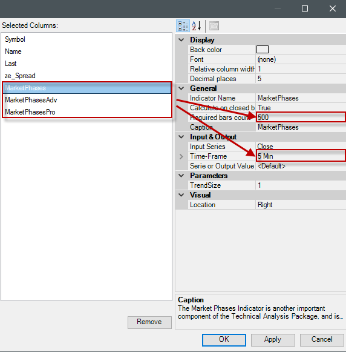

### MarketPhases Pro Description

**Phase5Level**
How far the price correction must be to become a valid market phase 5.

**Phase4Level**
How far the price correction must be to become a valid market phase 4.

##MarketValue
**The installation of the Technical Analysis Package is required in order to access this indicator.**

### Description
This indicator compares the value of a market with the current price of gold or the dollar index. This means that markets are placed in relation to the gold price or the dollar, whereby over- and undervaluation can be determined very well in instruments. 

A low MarketValue means that a market is cheap relative to gold/dollar index; vice versa, a higher value means that the market is relatively expensive. 

In general, commodities should be compared to the gold price, and financials to the dollar index. However, depending on the market environment, it may be useful to deviate from this rule.

The following parameters are available for the MarketValue: 

- **CompareTo:** select [Gold/Dollar Index] depending on which market the current symbol should be placed in relation to. 

- **EMA1:** this is a period that is necessary for calculating the data. If you do not have detailed information about how this indicator works, please leave this period on the default settings. (Default value = 21) 

- **EMA2:** this is an EMA period that is necessary for calculating the data. If you do not have detailed information about how this indicator works, please leave this period on the standard settings. (Default value = 3)

It is not yet possible to use the MarketValue indicator in the ConditionEscort, since a multi-instrument indicator cannot be depicted there. Since the MarketValue requires the price data from the current chart and also from gold i.e. the dollar index, this is a multi-instrument indicator, which, as mentioned, currently cannot be represented in the ConditionEscort.

### Parameters
to be announced

### Return value
to be announced

### Usage
to be announced

### Visualization


### Example
to be announced


##Momentum (MOM)
### Description
Momentum is one of the most popular indicators available, the first choice of many traders. This relatively simple indicator is so popular because it measures the attenuation of the motion without the need for complex formulas. The momentum indicator represents a whole family of indicators that measure a movement’s strength. Other representatives in this case are the RSI or CCI, and so on. In the illustration below, the indicator is a graph that oscillates around a zero point. There is no fixed scale in percentage terms, and the value can be quite far removed from the zero point; this usually happens when the price makes an exceptionally strong leap, which is why the indicator predominantly shows the direction in which the current prices are moving towards.


### Interpretation
Entry signals are generated when the indicator crosses the zero line.

See [*ROC*](#rate-of-change-roc).

### Further information
[http://de.wikipedia.org/wiki/Momentum_%28Chartanalyse%29](http://de.wikipedia.org/wiki/Momentum_%28Chartanalyse%29)

### Usage
```cs
Momentum(int period)
Momentum (IDataSeries input, int period)
Momentum (int period)[int barsAgo]
Momentum (IDataSeries input, int period)[int barsAgo]
```

### Return value
**double**

When using this method with an index (e.g. **Momentum**(14)\[**int** barsAgo\] ), the value of the indicator will be issued for the referenced bar.

### Parameters
input Input data series for the indicator

period Number of bars included in the calculations

### Visualization


### Example
```cs
//Output of the values for the momentum indicator.
Print("The current value for the momentum is " + Momentum(14)[0]);
```

##Money Flow Index (MFI)
### Description
The MFI is an oscillator that makes use of both volume and price to measure buying and selling pressure. MFI, which was developed by Gene Quong and Avrum Soudack, is also known as volume-weighted [*RSI*](#relative-strength-index-rsi). MFI starts with the typical price for each period. Money flow is then positive when this aforementioned typical price increases (buying pressure) and negative when it decreases (selling pressure). A ratio of positive-negative money flow is then inserted into an RSI formula to come up with an oscillator that fluctuates between 0 and 100. The MFI, which is a momentum oscillator linked to volume, is best used for identifying reversals and price extremes with a variety of different signals.


### Interpretation
The MFI is interpreted similarly to the RSI indicator. The MFI’s decisive factor is much stronger than the RSI’s when it comes to trend direction, due to the fact that volume is included in the calculation.

### Further information
VTAD: [http://vtadwiki.vtad.de/index.php/Money_Flow_Index](http://vtadwiki.vtad.de/index.php/Money_Flow_Index)

### Usage
```cs
MFI(int period)
MFI(IDataSeries input, int period)
MFI(int period)[int barsAgo]
MFI(IDataSeries input, int period)[int barsAgo]
```

### Return value
**double**

When using this method with an index (e.g. **MFI**(14)\[**int** barsAgo\] ), the value of the indicator will be issued for the referenced bar.

### Parameters
input Input data series for the indicator

period Number of bars included in the calculations

### Visualization


### Example
```cs
//Current MFI value
Print("The current value for the MFI is: " + MFI(14)[0]);
```

##Moving Averages
### Variants
[*DEMA*](#dema-double-exponential-moving-average) - Double Exponential Moving Average

[*EMA*](#ema-exponential-moving-average) - Exponential Moving Average

[*HMA*](#hma-hull-moving-average) - Hull Moving Average

[*KAMA*](#kama-kaufmans-adaptive-moving-average) - Kaufman's Adaptive Moving Average

[*MAMA*](#mama-mesa-adaptive-moving-average) - Mesa Adaptive Moving Average

[*SMA*](#sma-simple-moving-average) - Simple Moving Average

[*TEMA*](#tema-triple-exponential-moving-average) - Triple Exponential Moving Average

[*TMA*](#tma-triangular-moving-average) - Triangular Moving Average

[*TRIX*](#trix-triple-exponential-moving-average) - Triple Exponential Moving Average

[*T3*](#t3-triple-exponential-moving-average) - Triple Exponential Moving Average

[*VMA*](#vma-variable-moving-average) - Variable Moving Average

[*VWMA*](#vwma-volume-weighted-moving-average) - Volume Weighted Moving Average

[*WMA*](#wma-weighted-moving-average), [*VMA*](#vma-variable-moving-average) - Weighted Moving Average

[*ZLEMA*](#zlema-zero-lag-exponential-moving-average) - Zero Lag Exponential Moving Average

### Interpretation
The arithmetic average, also known as the moving average or simple moving average, smoothes the progression of the price for better trend detection. Moving averages are trend-following indicators; they follow the course and do not lead. IsSerieRising averages show uptrends, whereas falling averages display downtrends.
By varying the period input, the time delay of the average can be changed. The smaller the period interval, the quicker the reaction time will be, but as a consequence, the smoothing effect will also be diminished. The opposite is true when increasing the period selection. The most popular choices are: 38, 50, 100 and 200 days. The 200-day moving average in particular has a significant importance for institutional traders, since it displays the long-term trend. 200 trading days are equal to a trading year. When the 200 MA is broken, then buy/sell signals are generated.

### Applications
**Crossing of two averages**

The integration of multiple moving averages is used to identify trend sequences and minimize the number of false signals. When two arithmetic averages are used, whereby one is a short-term and the other a long-term, more interesting signals can be generated. One such application can be seen with Richard Donchian’s methodologies, such as using the 5 and 20-day averages.
The Double Crossover Method generates signals in the following way:

If the short-term average crosses the long-term average from below, this is called a Golden Cross, and a buy signal is generated. Higher trading volume reinforces the quality of the signal. The long-term average works as a support line in an uptrend.

If the short-term average crosses the long-term average from above, this is called a Death Cross. It generates a sell signal. Higher trading volume reinforces the signal quality. In a downtrend, the long-term average functions as a resistance line.

**Crossing of three moving averages**

Another method is to use three moving averages (Triple Crossover Method). This method was presented by R.C Allen, who used the 4, 9, and 18-day averages and suggested that a trend change is hinted at when the 4MA crosses the 9MA from bottom to top. An entry is only recommended when all lines are above the 18-day period. An exit is initiated when the 4-day MA moves below the 9-day MA.
(Source: VTAD)

##DEMA - Double Exponential Moving Average
### Description
The Double Exponential Moving Average is a technical indicator created by Patrick Mulloy. The calculation hereof is done using a simple as well as a double exponential moving average.

### Interpretation
The DEMA is a fast-working moving average that reacts quicker to market changes. The DEMA may be used as a stand-alone indicator or in tandem with other indicators.
The general interpretations are the same as for regular moving averages.

### Usage
```cs
DEMA(int period)
DEMA(IDataSeries input, int period)
DEMA(int period)[int barsAgo]
DEMA(IDataSeries input, int period)[int barsAgo]
```

### Return value
**double**

When using this method with an index (e.g. **DEMA**(20)\[**int** barsAgo\] ), the value of the indicator will be issued for the referenced bar.

### Parameters
input Input data series for the indicator

period Number of bars included in the calculations

### Visualization


### Calculation
```cs
Value.Set(2 * EMA(Inputs[0], Period)[0] - EMA(EMA(Inputs[0], Period), Period)[0]);
```

### Example
```cs
//Output the values for the DEMA
Print("The current DEMA value is " + DEMA(20)[0]);
```

##EMA - Exponential Moving Average
### Description
Exponential moving averages work to reduce lag by weighting recent prices more heavily. The weighting given to the most recent price depends on the number of periods in the moving average. Calculating an exponential moving average involves three steps. 1. Calculate the simple moving average. An exponential moving average (EMA) must start somewhere, therefore a simple moving average is used as the previous period's EMA in the beginning calculation. 2. Calculate the weighting multiplier. 3. Calculate the EMA.

### Interpretation
The EMA is used by many traders in the most varying of timeframes. It is especially meaningful within the 15, 60 and 240-minute charts. The EMA 200 line is also especially popular with traders.

If the price rises sharply and moves away quickly from the respective EMA line, it is possible to enter countertrend positions in order to profit from the potential return to the moving average.
General interpretations of the moving averages also apply to the EMA.

### Usage
```cs
EMA(int period)
EMA(IDataSeries input, int period)
EMA(int period)[int barsAgo]
EMA(IDataSeries input, int period)[int barsAgo]
```

### Return value
**double**

When using this method with an index (e.g. **EMA**(20)\[**int** barsAgo\] ), the value of the indicator will be issued for the referenced bar.

### Parameters
input Input data series for the indicator

period Number of bars included in the calculations

### Visualization
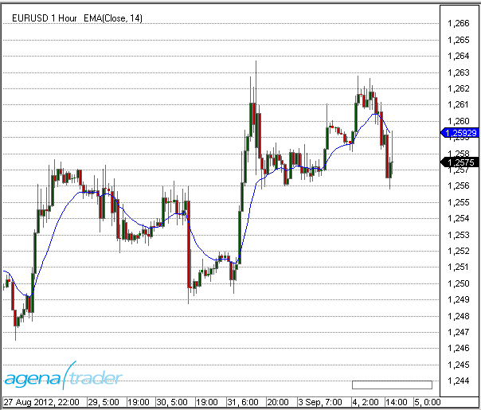

### Calculation
```cs
Value.Set(ProcessingBarIndex == 0 ? InSeries[0] : InSeries[0] * (2.0 / (1 + Period)) + (1 - (2.0 / (1 + Period))) * Value[1]);
```

### Example
```cs
//Output the value for the EMA
Print("The current EMA value is " + EMA(20)[0]);
```

##EMA MTF (MultiTimeFrame)
### Description
The EMA MTF indicator is a multi-timeframe version of the standard EMA indicator.
This indicator basically allows you to make calculationgs in a different timeframe than that of the current chart.

For more information, see [*EMA*](#ema-exponential-moving-average).

Also see [*BollingerMTF*](#bollingermtf), [*SmaMTF*](#smamtf).


### Visualization
A 5-minute chart with an EMA(20) calculated with hourly bars as the underlying input:


##HMA - Hull Moving Average
### Description
The Hull Moving Average, invented by Alan Hull, is a fast-working moving average that gets rid of almost all delays/lags (zero lag). The calculation is carried out using several weighted moving averages, thereby partially reducing the smoothing effect. Hull’s methodology uses square roots of the period instead of the actual period itself.

### Interpretation
The same interpretations as for the moving averages apply to the HMA, the only major distinction being the reduced lag. See [*Moving Averages*](#moving-averages).

### Usage
```cs
HMA(int period)
HMA(IDataSeries InSeries, int period)
HMA(int period)[int barsAgo]
HMA(IDataSeries InSeries, int period)[int barsAgo]
```

### Return value
**double**

When using this method with an index (e.g. **HMA**(21)\[**int** barsAgo\] ), the value of the indicator will be issued for the referenced bar.

### Parameters
input Input data series for the indicator

period Number of bars included in the calculations

### Visualization


### Calculation
```cs
double value1 = 2 * WMA(Inputs[0], (int)(Period / 2))[0];
double value2 = WMA(Inputs[0], Period)[0];
diffSeries.Set(value1 - value2);
Value.Set(WMA(diffSeries, (int) Math.Sqrt(Period))[0]);
```

### Example
```cs
//Output the value for the HMA
Print("The current HMA value is " + HMA(21)[0]);
```

##KAMA - Kaufman's Adaptive Moving Average
### Description
The KAMA is based on an EMA in which a trend efficiency ratio controls the weight of future price changes. This efficiency ratio (the squared efficiency factor) is a measure that can also be used by itself. The trend efficiency is the ratio of the absolute price change from the start to the end of the period, and the total of the absolute daily price changes. At higher trending efficiencies (i.e. straight price movements) without too much variation, the extra price carries a higher weighting, according to a shorter day period setting. Lower trending frequencies carry a smaller weighting.

### Interpretation
Kaufman mentions that a rising KAMA value can be interpreted as a buying signal, whilst falling KAMA values assume the prices to be falling.
Kaufman also defines a maximum and minimum value for the calculation of the smoothing components. The efficiency ratio is converted using specified maximum and minimum values, which are applied to newly incoming price changes. Kaufman uses 2 (short period) as a minimum value and 30 (long period) as a maximum value. The number of days for the determination of the efficiency ratio is one of the more important parameters for the KAMA.

For a more general interpretation of moving averages, please see the following chapter: [*Moving Averages*](#moving-averages).

### Further information
<http://www.investor-verlag.de/boersenwissen/kama/>

### Usage
```cs
KAMA(int fast, int period, int slow)
KAMA(IDataSeries input, int fast, int period, int slow)
KAMA(int fast, int period, int slow)[int barsAgo]
KAMA(IDataSeries input, int fast, int period, int slow)[int barsAgo]
```

### Return value
**double**

When using this method with an index (e.g. **KAMA**(2,10,30)\[**int** barsAgo\] ), the value of the indicator will be issued for the referenced bar.

### Parameters
input Input data series for the indicator

period Number of bars included in the calculations

fast Short period

slow Long period

### Visualization


### Example
```cs
//Output for the value of the Kaufman Moving Average(KAMA)
Print("The current value of the KAMA is " + KAMA(2,10,30)[0]);
```

##MAMA - Mesa Adaptive Moving Average
### Description
This automatically adapting moving average has a period length that is determined by means of various complex calculations. This complex indicator has its origins in publications by John Ehlers. Ehlers calculates cycles for the price movements to determine the length and intensity of single trend phases. Working with the length of the cycles, the weighting factor for the moving average can be established in several different ways.

**FAMA**
This indicator is a second line – the name FAMA can be found in various publications. This line is similar to the underlying exponential moving average and can be used as a trigger line.

### Interpretation
For more concise information, we recommend that you read Ehler’s paper.

General information about moving averages can be found here: [*Moving Averages*](#moving-averages).

### Further information
<http://www.tradesignalonline.com/de/lexicon/view.aspx?id=MAMA+adaptive+Moving+Average>

### Usage
```cs
MAMA(double fastLimit, double slowLimit)
MAMA(IDataSeries input, double fastLimit, double slowLimit)
MAMA(double fastLimit, double slowLimit)[int barsAgo]
MAMA(IDataSeries input, double fastLimit, double slowLimit)[int barsAgo]

//Value of the Following Adaptive Moving Average (FAMA)
MAMA(double fastLimit, double slowLimit).Fama[int barsAgo]
MAMA(IDataSeries input, double fastLimit, double slowLimit).Fama[int barsAgo]
```

### Return value
**double**

When using this method with an index (e.g. **MAMA**(0.5,0.05)\[**int** barsAgo\] ), the value of the indicator will be issued for the referenced bar.

### Parameters
input Input data series for the indicator

fastLimit Upper limit for the alpha value

slowLimit Lower limit for the alpha value

### Visualization


### Example
```cs
//Output values for (MAMA)
Print("The current value for the MAMA is " + MAMA(0.5, 0.05)[0]);
//Output values for (FAMA)
Print("The current value for the FAMA is " + MAMA(0.5, 0.05).Fama[0]);
```

##SMA - Simple Moving Average
### Description
The SMA is the most well-known average, representing the simplest method of displaying the trend direction in a chart. In mathematical terms, this is the arithmetic mean of a number of individual lengths. It is called “moving” because to establish an average, the oldest value is always sacrificed to make space for the new incoming price change. Fundamentally speaking, the period length influences the intensity of the smoothing. Shorter periods (such as 10 days) will mean that the indicator follows the price changes quite closely.
The SMA has a few disadvantages, which is why several adaptations of this indicator have been developed in the last few years. One of the biggest disadvantages is the fact that the indicator tends to lag, and the equal weighting for all data inputs across time intervals.
You can find more general interpretations and meanings here: [*Moving Averages*](#moving-averages).


### Further information
<http://www.forex-trading-online.de/indikatoren/simple-moving-average-sma>

<http://vtadwiki.vtad.de/index.php/SMA\#Average-Off-Berechnungsverfahren\_.28MMA.29>

### Usage
```cs
SMA(int period)
SMA(IDataSeries InSeries, int period)
SMA(int period)[int barsAgo]
SMA(IDataSeries InSeries, int period)[int barsAgo]
```

### Return value
**double**

When using this method with an index (e.g. **SMA**(14)\[**int** barsAgo\] ), the value of the indicator will be issued for the referenced bar.

### Parameters
input Input data series for the indicator

period Number of bars included in the calculations

### Visualization


### Calculation
Value.**Set**((last + InSeries\[0\] - InSeries\[Period\]) / Math.**Min**(ProcessingBarIndex, Period));

### Example
```cs
//Output of the SMA value
Print("The current SMA value is " + SMA(14)[0]);
```

##SMA MTF (MultiTimeFrame)
### Description
The SMA MTF – as is true for the other multi-timeframe indicator variations – allows traders to display the SMA of a specific timeframe on a chart of a different timeframe.

See [*BollingerMTF*](#bollingermtf), [*EmaMTF*](#ema-mtf-multitimeframe).

### Visualization
The image shows a 5-minute chart with an SMA (14) calculated on 4-hour bars


##SMMA - Smoothed Moving Average
### Description
The Smoothed Moving Average is combined from both Simple Moving Average and the Exponential Moving Average. Generally speaking, it is only used for higher period amounts/inputs. It normally has roughly half of the value of an EMA, meaning that an SMMA(20) is closer to an EMA(40).

### Interpretation
For more general information about moving averages, please see [*Moving Averages*](#moving-averages).

The SMMA is often used with the [*SuperTrend*](#supertrend) indicator.

### Further information
<http://www2.wealth-lab.com/wiki/SMMA.ashx>

### Usage
```cs
SMMA(int period)
SMMA(IDataSeries input, int period)
SMMA(int period)[int barsAgo]
SMMA(IDataSeries input, int period)[int barsAgo]
```

### Return value
**double**

When using this method with an index (e.g. **SMMA**(14)\[**int** barsAgo\] ), the value of the indicator will be issued for the referenced bar.

### Parameters
input Input data series for the indicator

period Number of bars included in the calculations

### Visualization


### Example
```cs
//Output for the value of the SMMA
Print("The current SMMA value is " + SMMA(14)[0]);
```

##TEMA - Triple Exponential Moving Average
### Description
The TEMA is combined from a single, a double and a triple EMA. This combo improves the delay between the indicator and price movements. The Triple Exponential Moving Average is quite efficient at smoothing price changes.

You can find more information about moving averages here: [*Moving Averages*](#moving-averages).

### Usage
```cs
TEMA(int period)
TEMA(IDataSeries input, int period)
TEMA(int period)[int barsAgo]
TEMA(IDataSeries input, int period)[int barsAgo]
```

### Return value
**double**

When using this method with an index (e.g. **TEMA**(14)\[**int** barsAgo\] ), the value of the indicator will be issued for the referenced bar.

### Parameters
input Input data series for the indicator

period Number of bars included in the calculations

### Visualization


### Example
```cs
//Output for the Triple Exponential Moving Average
Print("The current TEMA value is " + TEMA(14)[0]);
```

##TMA - Triangular Moving Average
### Description
This specifically weighted average has an extra smoothing component. The weightings are not linear, but instead take on a triangular pattern. To demonstrate, the weighting for a 7-period average would be 1,2,3,4,3,2,1. More weight is given to the median value of the time series, and the newest and oldest data is given less weight.

### Usage
```cs
TMA(int period)
TMA(IDataSeries input, int period)
TMA(int period)[int barsAgo]
TMA(IDataSeries input, int period)[int barsAgo]
```

### Return value
**double**

When using this method with an index (e.g. **TMA**(14)\[**int** barsAgo\] ), the value of the indicator will be issued for the referenced bar.

### Parameters
input Input data series for the indicator

period Number of bars included in the calculations

### Visualization


### Example
```cs
//Output for the value of the TMA
Print("The current value for the TMA is " + TMA(14)[0]);
```

##TRIX - Triple Exponential Moving Average
### Description
Jack Hutson developed this TRIX indicator, which is a 1-day rate-of-change indicator. What this means is that day 2 is divided by day 1, day 3 by day 2 and so on and so forth, and this is then applied to a triple exponential moving average of the closing prices. This results in a zero line fluctuating oscillator which is used as trend indicator thanks to its stability.


### Interpretation
A buy signal is created when the TRIX indicator crosses the zero line from bottom to top. A sell signal is generated when the zero line is broken in a downwards direction.

### Usage
```cs
TRIX(int period, int signalPeriod)
TRIX(IDataSeries input, int period, int signalPeriod)
TRIX(int period, int signalPeriod)[int barsAgo]
TRIX(IDataSeries input, int period, int signalPeriod)[int barsAgo]

//For the signal line
TRIX(int period, int signalPeriod).Signal[int barsAgo]
TRIX(IDataSeries input, int period, int signalPeriod).Signal[int barsAgo]
```

### Return value
**double**

When using this method with an index (e.g. **TRIX**(14, 3)\[**int** barsAgo\] ), the value of the indicator will be issued for the referenced bar.

### Parameters
input Input data series for the indicator

period Number of bars included in the calculations

signal period Number of bars included in the signal line calculation

### Visualization


### Example
```cs
//Output for the TRIX EMA
Print("The current TRIX value is " + TRIX(14, 3)[0]);

//Output for the TRIX signal line
Print("The current TRIX value is " + TRIX(14, 3).Signal[0]);
```

##T3 - Triple Exponential Moving Average
### Description
The Triple Exponential Moving Average T3 indicator (also dubbed the T3MA) is calculated by taking the weighted sums of a simple, a double, and a triple EMA. This produces a smooth, soft indicator line. The parameter tCount allows the trader to set the number of reiterations. The calculation is the same as the calculation for the DEMA, with the slight difference that here, a volume factor is also added. It accepts values between 0 and 1 (default: 0.7).

### Usage
```cs
T3(int period, int tCount, double vFactor)
T3(IDataSeries input, int period, int tCount, double vFactor)
T3(int period, int tCount, double vFactor)[int barsAgo]
T3(IDataSeries input, int period, int tCount, double vFactor)[int barsAgo]
```

### Return value
**double**

When using this method with an index (e.g. **T3**(14,3,0.7)\[**int** barsAgo\] ), the value of the indicator will be issued for the referenced bar.

### Parameters
input Input data series for the indicator

period Number of bars included in the calculations

tCount Number of iterations for the smoothing

vFactor Volume factor (multiplier)

### Visualization


### Example
```cs
//Output of the value for the T3 indicator
Print("The current T3 value is " + T3(14, 3, 0.7)[0]);
```

##VMA - Variable Moving Average
### Description
This variation of an EMA automatically smoothes any fluctuations in the market, and its sensitivity grows as more weight is placed on more recent data.

The VMA attempts to get rid of the disadvantages of other moving averages by automatically regulating the smoothing constant. This is why the VMA can be implemented for most of the market conditions, and is in a few cases actually better than other averages.

**Caution**
The VMA is not to be confused with the Volume Moving Average (VolMA)!

### Usage
```cs
VMA(int period, int volatilityPeriod)
VMA(IDataSeries input, int period, int volatilityPeriod)
VMA(int period, int volatilityPeriod)[int barsAgo]
VMA(IDataSeries input, int period, int volatilityPeriod)[int barsAgo]
```

### Return value
**double**

When using this method with an index (e.g. **VMA**(9,9)\[**int** barsAgo\] ), the value of the indicator will be issued for the referenced bar.

### Parameters
input Input data series for the indicator

period Number of bars included in the calculations

volatility period Number of bars included in the calculation for the signal line

### Visualization


### Example
```cs
//Output the VMA value
Print("The current VMA value is " + VMA(9, 9)[0]);
```

##VWMA - Volume Weighted Moving Average
### Description
VWMA is a non-cumulated smoothed average that is weighted based on the various volumes for the periods.

### Usage
```cs
VWMA(int period)
VWMA(IDataSeries input, int period)
VWMA(int period)[int barsAgo]
VWMA(IDataSeries input, int period)[int barsAgo]
```

### Return value
**double**

When using this method with an index (e.g. **VWMA**(14)\[**int** barsAgo\] ), the value of the indicator will be issued for the referenced bar.

### Parameters
input Input data series for the indicator

period Number of bars included in the calculations

### Visualization


### Example
```cs
//Output for the VWMA
Print("The current VWMA value is " + VWMA(14)[0]);
```

##WMA - Weighted Moving Average
### Description
The Weighted Moving Average is the most well-known of the weighted averages, and is implemented to identify and quickly react to price changes. Current prices are given higher weighting than older ones. In addition, bad signals in sideways markets are minimized. The WMA smoothes the price changes and makes more efficient trade identification possible.

### Further information
<http://www.tradesignalonline.com/de/lexicon/view.aspx?id=Moving+Average+Weighted+%28WMA%29>

### Usage
```cs
WMA(int period)
WMA(IDataSeries input, int period)
WMA(int period)[int barsAgo]
WMA(IDataSeries input, int period)[int barsAgo]
```

### Return value
**double**

When using this method with an index (e.g. **WMA**(14)\[**int** barsAgo\] ), the value of the indicator will be issued for the referenced bar.

### Parameters
input Input data series for the indicator

period Number of bars included in the calculations

### Visualization


### Example
```cs
//Output for the WMA
Print("The current value of the WMA is " + WMA(14)[0]);
```

##ZLEMA - Zero Lag Exponential Moving Average
### Description
The Zero Lag Exponential Moving Average is another variation of the EMA. Zero lag in this context signifies no delay, which means that the indicator adapts to the price changes more closely. The indicator does so by removing older price data and decreasing the cumulative effect in order to minimize the lag.

### Further information
FMLabs: <http://www.fmlabs.com/reference/default.htm?url=ZeroLagExpMA.htm>

### Usage
```cs
ZLEMA(int period)
ZLEMA(IDataSeries input, int period)
ZLEMA(int period)[int barsAgo]
ZLEMA(IDataSeries input, int period)[int barsAgo]
```

### Return value
**double**

When using this method with an index (e.g. **ZLEMA**(14)\[**int** barsAgo\] ), the value of the indicator will be issued for the referenced bar.

### Parameters
input Input data series for the indicator

period Number of bars included in the calculations

### Visualization


### Example
```cs
//Output for the value of the Zero Lag Exponential Moving Average
Print("The current ZLEMA value is " + ZLEMA(14)[0]);
```

##nBarsUp
### Description
The nBarsUp indicator looks for a specified number of rising closing prices. Other conditions can also be added to the search, for example:
Constantly rising bars, i.e. close < open (red candles)
Constantly rising highs
Constantly rising lows


### Usage
```cs
NBarsUp(int barCount, bool BarUp, bool higherHigh, bool higherLow)
NBarsUp(IDataSeries input, int barCount, bool BarUp, bool higherHigh, bool higherLow)
NBarsUp(int barCount, int barCount, bool BarUp, bool higherHigh, bool higherLow)[int barsAgo]
NBarsUp(IDataSeries input, int barCount, bool BarUp, bool higherHigh, bool higherLow)[int barsAgo]
```

### Return value
**double**

When using this method with an index (e.g. **NBarsUp**(...)\[**int** barsAgo\] ), the value of the indicator will be issued for the referenced bar.

1 – The condition applies
0 – The condition does not apply

### Parameters
input Input data series for the indicator

barCount Number of successively rising closing prices

barUp Additional condition (true): each close must be higher than the open (green bar)

higherHigh Additional condition (true): continuously rising highs

higherLow Additional condition (true): continuously rising lows

### Visualization


### Example
```cs
// Look for 3 successively rising closing prices
if (NBarsUp(3, true, true, true)[0] == 1)
Print("3 successively higher closing prices have occurred.");
```

##nBarsDown
### Description
The nBarsDown indicator looks for a specified number of falling closing prices.

The following conditions can also be included in the search:
-   Constantly falling bars
-   Constantly falling highs
-   Constantly falling lows

### Usage
```cs
NBarsDown(int barCount, bool BarDown, bool lowerHigh, bool lowerLow)
NBarsDown(IDataSeries input, int barCount, bool BarDown, bool lowerHigh, bool lowerLow)
NBarsDown(int barCount, bool BarDown, bool lowerHigh, bool lowerLow)[int barsAgo]
NBarsDown(IDataSeries input, bool barCount, int BarDown, bool lowerHigh, bool lowerLow)[int barsAgo]
```

### Return value
**double**

When using this method with an index (e.g. **NBarsDown**(...)\[**int** barsAgo\] ), the value of the indicator will be issued for the referenced bar.

1 – The condition applies
0 – The condition does not apply

### Parameters
input Input data series for the indicator

barCount Required number of successively lower closing prices

barDown Additional condition (true): each close must be lower than the open

lowerHigh Additional condition (true): continuously falling highs

lowerLow Additional condition (true); continuously falling lows

### Visualization


### Example
```cs
NBarsDown(int barCount, bool BarDown, bool lowerHigh, bool lowerLow)
NBarsDown(IDataSeries input, int barCount, bool BarDown, bool lowerHigh, bool lowerLow)
NBarsDown(int barCount, bool BarDown, bool lowerHigh, bool lowerLow)[int barsAgo]
NBarsDown(IDataSeries input, bool barCount, int BarDown, bool lowerHigh, bool lowerLow)[int barsAgo]
```

##OnBalanceVolume (OBV)
### Description
This indicator displays the buy or sell pressure. For each day with a positive close, the volume is added cumulatively, and it is subtracted for days with a close that is smaller than the open.

### Interpretation
Granville theorized that volume precedes price. OBV rises when volume on up days outpaces volume on down days. OBV falls when volume on down days is stronger. A rising OBV reflects positive volume pressure that can lead to higher prices. Conversely, falling OBV reflects negative volume pressure that can foreshadow lower prices. Granville noted in his research that OBV would often move before price. Expect prices to move higher if OBV is rising while prices are either flat or moving down. Expect prices to move lower if OBV is falling while prices are either flat or moving up.

The absolute value of OBV is not important. Chartists should instead focus on the characteristics of the OBV line. First define the trend for OBV. Second, determine if the current trend matches the trend for the underlying security. Third, look for potential support or resistance levels. Once broken, the trend for OBV will change and these breaks can be used to generate signals. Also notice that OBV is based on closing prices. Therefore, closing prices should be considered when looking for divergences or support/resistance breaks. And finally, volume spikes can sometimes throw off the indicator by causing a sharp move that will require a settling period. (Source: Stockcharts.com)

### Usage
```cs
OBV()
OBV(IDataSeries input)
OBV()[int barsAgo]
OBV(IDataSeries input)[int barsAgo]
```

### Return value
**double**

When using this method with an index (e.g. **OBV**()\[**int** barsAgo\] ), the value of the indicator will be issued for the referenced bar.

### Parameter
input Input data series for the indicator

### Visualization


### Example
```cs
//Output the value for the On Balance Volume (OBV)
Print("The current value for the OBV is " + OBV()[0]);
```

##OutsideBars
### Description
The Outside Bars indicator is in fact an outdated version of the [*InsideBarsMT*](#insidebarsmt).

##P123
**The installation of the Technical Analysis Package is required in order to access this indicator.**

### Description
The goal of the P123 indicator is to automatically detect a 1-2-3 pattern.

**The following features make it stand out:**

Innovative recognition of 4 different trend sizes

It recognizes points 1, 2, and 3 at the bar

Recognition of a trend continuation in the same direction as a trend break

Completely automatic adjustment of the search algorithm for all possible market conditions (no additional settings/inputs required)

Adaptive workflow, adjusting to any volatility fluctuations

Clear overview while simultaneously displaying the various trend sizes

Can be implemented within the Condition Escort and AgenaScript

The trend sizes are defined as follows:

T0 = large trend

T1 = medium-sized trend

T2 = small trend

T3 = smallest trend size

The smallest trend size (T3) cannot be detected on all trading instruments. Point 2 is often situated at the high of a bar, and point 3 at the low of the same bar. Depending on the timeframe and fluctuation range, T0 and T1 can be fused into one.

The indicator determines the selected timeframe of the chart, and then labels all trends and trend sizes accordingly. When there is low volatility, trend recognition is more sensitive, and the vice versa for higher volatility. The P123’s adaptive methods make for a balanced recognition of trend sizes.

**Important tip:**

In some cases, the large trend (T0) cannot be seen with the naked eye, which may be due to the fact that not enough candles are visible within the chart. A minimum of 500 candles should be loaded to ensure this is not the case.


### Interpretation
Trading signals often form at points 2 & 3: at point 3 as entry signals into a correction phase within a confirmed trend, and at point 2 as a sub-trend in the trend direction of the superior trade. The definition of a trend at points 1 to 3 can be read in "*Das große Buch der Markttechnik*" by Michael Voigt (German only).

### Visualization in the chart
The parameter input settings define which trend sizes are shown in the chart and whether or not they are connected by a line.

For the default settings, the trend T2 is enabled by default.

The depiction in the chart may change with the changing market movements. If the market moves below the last point 3 and breaks the uptrend, the point is marked with a “3?”. The newly created low becomes the new point 2 and the last point 2 becomes point 1.


The parameter settings are not relevant for the display in the chart and are primarily used for the Condition Escort.

The depiction in the chart is primarily influenced by the settings “Display 123” and “Display Lines”.


The settings highlighted in yellow have no influence on the chart. No changes need to be made.

### Usage in AgenaScript
When using P123 in AgenaScript, multiple public variables are available.

A notation such as \[barsAgo\] is not available for this. Parameter occurrences are used in the following manner:

**P123**(**int** trendSize). ... &lt;&lt;a public variable, see below&gt;&gt;

**P123**(**int** trendSize, **int** occurrence). ...

|                   |                                                                                                                                   |
|-------------------|-----------------------------------------------------------------------------------------------------------------------------------|
| Trend Direction   | 1 = uptrend -1 = downtrend 0 = no trend                                                                                           |
| IsTrendValid      | true = confirmed trend with a point sequence of at least 1 - 2 - 3 - 2
                      false = no confirmed trend (phases 1 and 2)                                                                                        |
| LastPoint         | last point of a trend, 1, 2 or 3                                                                                                  |
| LastPointPrice    | outputs the price value of the last market point                                                                                  |
| LastPointDateTime | outputs the date and time of the last market point                                                                                |
| P1Price           | outputs the value of the last point 1                                                                                             |
| P1DateTime        | outputs the value and date/time of the last point 1                                                                               |
| P2Price           | outputs the value of the last point 2                                                                                             |
| P2DateTime        | outputs the time and date of point 2                                                                                              |
| TempP3Price       | putputs the value of the temporary point “3?”                                                                                     |
| TempP3DateTime    | outputs the time and date of the temporary point “3?”                                                                             |
| ValidP3Price      | outputs the value of the last point 3. This is used as a stop placement. When this point is breached, a trend change is confirmed |
| ValidP3DateTime   | outputs the date and time for the last valid point 3                                                                              |

**Parameters**

trendsize: trend size from 0 .. 3

occurrence the occurrences of the youngest to the oldest point

**Example**

```cs
private void PrintOutTrendProperties(int trendSize)
{
  // Reverse order of prints fills output window in correct order
  Print("");
  Print("valid P3 date: " + P123(trendSize).ValidP3DateTime);
  Print("valid P3 price: " + P123(trendSize).ValidP3Price);
  Print("temp P3 date: " + P123(trendSize).TempP3DateTime);
  Print("temp P3 price: " + P123(trendSize).TempP3Price);
  Print("P2 date: " + P123(trendSize).P2DateTime);
  Print("P2 price: " + P123(trendSize).P2Price);
  Print("P1 date: " + P123(trendSize).P1DateTime);
  Print("P1 price: " + P123(trendSize).P1Price);
  Print("last point date: " + P123(trendSize).LastPointDateTime);
  Print("last point price: " + P123(trendSize).LastPointPrice);
  Print("last point: " + P123(trendSize).LastPoint);
  Print("is trend valid: " + P123(trendSize).IsTrendValid);
  Print("trend direction: " + P123(trendSize).TrendDirection);
}
```

### Utilization within the Condition Escort
All public variables are available to you inside the Condition Escort as data series; they can be found under „Series & Output Values“.
The name has an underscore ("\_") suffix in order to differentiate it.

The parameters “trendSize” and “occurrence” can be found within the Condition Escort.

### P123Pro
The parameter TrendSize can be found under the parameter settings (see figure). It is only intended to be used within the Condition Escort. This parameter is not relevant for display in the chart. The display is only controlled by the following settings: "Display 123" and "Display Lines".

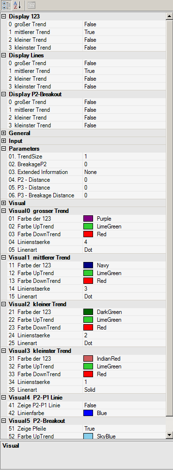

You can see in the respectful description fields for each parameter to which extend the particular parameters may influence the chart or Condition Escort as well as AgenaScript.

### Usage in the AgenaScript
For the AgenaScript purposes several data series of the same type are doubled. For each of these data series the common notation with ...[barsAgo] can be used.

|                |                                                                                         |
|----------------|-----------------------------------------------------------------------------------------|
| TrendDirection | 1 = Uptrend -1 = Downtrend 0 = no trend defined according to the market technique       |
| IsP21          | If a bar represents an old point 2 and at the same time a new point 1, it will be labelled in the chart as "(2) 1". The value of this bar (and all subsequent bars up to the next point 2) will be 1, and 0 otherwise.         |
| IsTrendValid   | 1 = defines a confirmed trend, i.e. at least a point sequence 1 - 2 - 3 - 2. 0 = there is no confirmed trend yet. (Phase 1 and 2 according to market technique)                                                              |
| LastPoint      | Provides the latest point of the trend, i.e. 1, 2, or 3                                 |
| LastPointPrice | Provides the corresponding market value of the latest point according to the market technique      |
| LastPointDateTime | Provides the corresponding date and time related to the latest point according to the market technique        |
| LastPointExtInfo | Provides the corresponding label of the latest point according to the market technique. The labelling should be additionally defined in Parameter tab. The slope is a chart-only feature therefore it is neither in Conditions, nor in the AgenaScript available.                                                                                                 |
| P1Price        | Provides the market value of the latest point 1                                         |
| P1DateTime     | Provides the date and time of the latest point 2                                        |
| PriorP2Price   | efert die Datums- und Zeitangabe des vorletzten Punkt 2                                 |
| TempP3Price    | Provides the date and time of the second last point 2                                   |
| TempP3DateTime | Provides the date and time of the last preliminary point 3                              |
| ValidP3Price   | Provides the market value of the last valid point 3. This market value defines the stop movement according to the market techniques. When this point is crossed, there is a trend break from the market technique perspective.       |
| ValidP3DateTime| Provides the date and time of the last valid point 3                                    |

### Parameters
|                |                                                                                         |
|----------------|-----------------------------------------------------------------------------------------|
| trendsize      | Trend size of 0 .. 3                                                                 |
| breakageP2     | Shows an arrow in the chart, when a break of P2 occurs or has been already completed. The figure is expressed as a percentage between -100 and +100. -20 alerts e.g. 20% before the P2 will be reached                        |
| extInfo        | Selection of a labelling                                                                 |
| p2Distance     | **Uncertainty:** this is a factor (between 0 and 1) that defines, how far has to be the P2 from the "old" valid P2 in order to be treated as valid. The previous movement is decisive in this case.                            |
| p3Distance     | **Uncertainty:** this is a factor (between 0 and 1) that defines, how far has to be the P3 from the "old" valid P2 in order to be treated as valid. The previous movement is decisive in this case..                          |
| p3BreakageDistance | **Uncertainty:** this is a factor (between 0 and 1) that defines when a trend brake is valid. The previous movement is decisive in this case. So, for instance, the breakout of the latest P3 (with one tick only) will not be considered as the breakout anymore.                                  |

### Examples
```cs
private void PrintOutTrendProperties(int trendSize)
private void PrintOutTrendProperties(int trendSize)
{
	// revers order of prints fills output window in correct order
	Print("");
	Print("IsP21: " +  P123Pro(trendSize).IsP21[0]);
	Print("valid P3 date: " +  P123Pro(trendSize).ValidP3DateTime[0]);
	Print("valid P3 price: " +  P123Pro(trendSize).ValidP3Price[0]);
	Print("temp P3 date: " +  P123Pro(trendSize).TempP3DateTime[0]);
	Print("temp P3 price: " +  P123Pro(trendSize).TempP3Price[0]);
	Print("P2 date: " +  P123Pro(trendSize).P2DateTime[0]);
	Print("P2 price: " +  P123Pro(trendSize).P2Price[0]);
	Print("P1 date: " +  P123Pro(trendSize).P1DateTime[0]);
	Print("P1 price: " +  P123Pro(trendSize).P1Price[0]);
	Print("last point date: " +  P123Pro(trendSize).LastPointDateTime[0]);
	Print("last point price: " +  P123Pro(trendSize).LastPointPrice[0]);
	Print("last point: " +  P123Pro(trendSize).LastPoint[0]);
	Print("Is trend valid: " +  P123Pro(trendSize).IsTrendValid[0]);
	Print("Trend direction: " +  P123Pro(trendSize).TrendDirection[0]);
	Print("P2Breakout: " +  P123Pro(trendSize).P2Breakout[0]);
	Print("Extended Information: " +  P123Pro(trendSize).LastPointExtInfo[0]);
}
```
### Usage in the Condition Escort
All data series (excluding the DateTime series) are available in the Condition Escort under the "Series & Output Values".

Logical variables (true and false) are replaced by the numbers 1 and 0. The "TrendSize" parameter is available in the Condition Escort as well. The description you will find below.


### Examples
Inquiry whether the currently active in the chart middle trend is a downtrend: 
P123Pro(Close, 1).TrendDirection[0] - Inh. TimeFrame   ==   1

Inquiry whether the latest point of the currently active in the chart smallest trend is a Point2: 
P123Pro(Close, 3).LastPoint[0] - Inh. TimeFrame   ==   2

Inquiry whether the latest bar under the valid point 3 (not the 3?) of the small trend has been closed: 
P123Pro(Close, 2).isTrendValid[0] - Inh. TimeFrame   ==   1 
UND (also neue Zeile)
Close[0] - Inh. TimeFrame   <   P123Pro(Close, 2).ValidP3Price[0] - Inh. TimeFrame 

##Parabolic SAR
### Description
Welles Wilder came up with the Parabolic SAR, which denotes a price and time-based trading system. Wilder named this the "Parabolic Time/Price System." SAR signifies "stop and reverse," which is the name of the actual indicator used in his system, where **SAR trails price as the trend extends over time**. When prices are rising, the indicator is below them, and when prices are falling, it is above them. Therefore the indicator stops and reverses when the price trend reverses and breaks either above or below the indicator.

Wilder used his new book, New Concepts in Technical Trading Systems, to introduce the Parabolic Time/Price System in 1978. The book also discusses RSI, Average True Range, and the Directional Movement Concept (ADX). Although they were created before the computer age, Wilder's indicators function equally well today and have a high reputation.

SAR follows the price, and can be considered a trend-following indicator. If a downtrend reverses and starts up, SAR follows the prices just like a trailing stop. This stop continues to rise so long as the uptrend remains intact, which means that the SAR never decreases in an uptrend and is always protecting profits as prices move forwards. Once the price stops rising and reverses below SAR, a downtrend starts and SAR is above the price. SAR follows prices lower like a trailing stop, as mentioned before. The stop continuously falls as long as the downtrend continues to exist. Due to the fact that SAR never rises in a downtrend, it always protects profits on short positions.


### Further information
VTAD: <http://vtadwiki.vtad.de/index.php/Parabolic\_SAR>

Wikipedia: <http://en.wikipedia.org/wiki/Parabolic\_SAR>

### Usage
```cs
ParabolicSAR(double acceleration, double accelerationStep, double accelerationMax)
ParabolicSAR(IDataSeries input, double acceleration, double accelerationStep, double accelerationMax)
ParabolicSAR(double acceleration, double accelerationStep, double accelerationMax)[int barsAgo]
ParabolicSAR(IDataSeries input, double acceleration, double accelerationStep, double accelerationMax)[int barsAgo]
```

### Return value
**double**

When using this method with an index (e.g. **ParabolicSAR**(...)\[**int** barsAgo\] ), the value of the indicator will be issued for the referenced bar.

### Parameters
|                  |                                     |
|------------------|-------------------------------------|
| acceleration     | Acceleration                        |
| accelerationStep | Increment of the acceleration       |
| accelerationMax  | Maximum acceleration                |
| InSeries         | Input data series for the indicator |

### Visualization


### Example
```cs
//Output of the value for the PSAR
Print("The current value for the Parabolic SAR is " + ParabolicSAR(0.02, 0.2, 0.02)[0]);
```

##Percentage Price Oscillator (PPO)
### Description
The Percentage Price Oscillator displays the percentage difference between two moving averages. It is classed as a momentum indicator and is similar to the MACD in its construction.

### Interpretation
The PPO can be used for divergence analysis. The divergences have the advantage of having a higher percentual hit rate. On the downside, they often appear too early and thus are hard for newer traders to assess properly.

### Usage
```cs
PPO(int fast, int slow, int smooth)
PPO(IDataSeries input, int fast, int slow, int smooth)
PPO(int fast, int slow, int smooth)[int barsAgo]
PPO(IDataSeries input, int fast, int slow, int smooth)[int barsAgo]

//For the smoothed value
PPO(int fast, int slow, int smooth).Smoothed[int barsAgo]
PPO(IDataSeries input, int fast, int slow, int smooth).Smoothed[int barsAgo]
```

### Return value
**double**

When using this method with an index (e.g. **PPO**(12,26,9)\[**int** barsAgo\] ), the value of the indicator will be issued for the referenced bar.

### Parameters
input Input data series for the indicator

fast Number of bars for the calculation of the fast EMA

slow Number of bars for the calculation of the slow EMA

smooth Number of bars for the calculation of the EMA signal line

### Visualization


### Example
```cs
//Output for the PPO
Print("The current value for the PPO is " + PPO(12, 26, 9)[0]);

//Output for the value of the PPO smoothed
Print("The current value for the PPO is " + PPO(12, 26, 9).Smoothed[0]);
```

##PercentEnvelopes
### Description
The Percent Envelopes indicator draws an upper and a lower band around a predefined value with a distance of a specified percentage value. The trader can specify which data series the entry value should be (highs, lows, closing price, another indicator etc.).

It is possible to use an SMA as the entry value. In this case, the upper and lower bands will be displayed with a distance of 1.5%.

### Interpretation
Similarly to the Bollinger Bands, the Percent Envelope indicator can be used to make buy or sell decisions and to determine whether the price is under- or overvalued.

The Percent Envelope should never be used to make decisions based solely on the output, but should be used in conjunction with other indicators to confirm signals.

### Usage
```cs
PercentEnvelopes(double percent)
PercentEnvelopes(IDataSeries input, double percent)

//For the upper band
PercentEnvelopes(double percent).UpperPercentBand[int barsAgo]
PercentEnvelopes(IDataSeries input, double percent).UpperPercentBand[int barsAgo]

//For the lower band
PercentEnvelopes(double percent).LowerPercentBand[int barsAgo]
PercentEnvelopes(IDataSeries input, double percent).LowerPercentBand[int barsAgo]
```

### Return value
**double**

When using this method with an index (e.g. **PercentEnvelopes**(2)\[**int** barsAgo\] ), the value of the indicator will be issued for the referenced bar.

### Parameters
input Input data series for the indicator

percent Difference in % for the bands (from the input value)

### Visualization


### Example
```cs
//Output for the upper band
Print("Value of the upper percent band is: " + PercentEnvelopes(3).UpperPercentBand[0]);

//Output for the lower band
Print("Value of the lower percent band is: " + PercentEnvelopes(3).LowerPercentBand[0]);
```

##Pivot Points
### Description
This indicator, based on the price zone approach invented by Dr. Bruce Gould, has been honed over the years. In the beginning, the price zones were calculated using the price developments of the last 2-3 years. Nowadays, however, the practical concept of pivot points is taken from the calculation of price zones in the daily chart, using the previous day’s periods as the basis. The goal hereby is to determine price levels that one could use as potential resistance zones (R1..R3) or support zones (S1..S3). The following methods can be used to calculate the indicator: Classic, Floor, Woodie, Camarilla, Fibonacci. The Classic and Floor methods are often wrongly named within literature, which is why in AgenaTrader you will find that the Classic method is labeled as “Floor” and vice versa. The indicator displays the pivot points for intraday charts, and the parameter “ShowPrices” allows you to display the price on the levels. The parameter “DaysBack” allows you to set the number of periods in the past that should be used for the calculation. The line coloring can be defined manually

### Interpretation
Traders prefer to sell above the resistance lines 1 & 2 (e.g. to build up short positions), and to start building up tactical long positions at the support lines.

### Further information
<http://www.finanznachrichten.de/nachrichten-2008-01/9833653-was-sind-pivot-punkte-und-wie-kann-ich-sie-handeln-005.htm>

<http://www.aktienboard.com/forum/f38/7-kapitel-pivot-points-t36428/>

<http://www.forexschule.com/schule/wie-man-mit-hilfe-von-pivot-punkten-handelt-50>

### Usage
```cs
PivotPoints()
PivotPoints(PivotPointsMode mode)
PivotPoints(PivotPointsMode mode, int LineWidth, bool ShowPrices, int DaysBack, Color RColor, Color PPColor, Color SColor)
PivotPoints(IDataSeries input, PivotPointsMode mode, int LineWidth, bool ShowPrices, int DaysBack, Color RColor, Color PPColor, Color SColor)
PivotPoints()[barsAgo]
PivotPoints(PivotPointsMode mode)[barsAgo]
PivotPoints(PivotPointsMode mode, int LineWidth, bool ShowPrices, int DaysBack, Color RColor, Color PPColor, Color SColor)[barsAgo]
PivotPoints(IDataSeries input, PivotPointsMode mode, int LineWidth, bool ShowPrices, int DaysBack, Color RColor, Color PPColor, Color SColor)[barsAgo]
```

### Return value
This class has the following public methods (as data series), which all return double values:

**PP, S1, S2, S3, R1, R2 ,R3**

### Example:
```cs
PivotPoints().PP[int barsAgo]
PivotPoints(PivotPointsMode.Classic).S3[int barsAgo]
```

### Parameters
|                 |                                                                                   |
|-----------------|-----------------------------------------------------------------------------------|
| InSeries        | Input data series for the indicator                                               |
| PivotPointsMode | Calculatory method
PivotPointsMode.Classic
PivotPointsMode.Floor
PivotPointsMode.Woodie
PivotPointsMode.Camarilla
PivotPointsMode.Fibonacci
Default: floor                                                                     |
| LineWidth       | Default: 1                                                                        |
| ShowPrices      | Shows prices next to the lines
Default: false                                                                     |
| DaysBack        | The number of historical periods to be included in the display of the pivot lines
                   Default: 0                                                                         |
| RColor          | Resistance line color                                                             |
| PPColor         | Pivot line color                                                                  |
| SColor          | Support line color                                                                |

### Visualization


### Example
```cs
//Output current pivot point
Print("The floor pivot point is located at: " + PivotPoints()[0]);
//Output first support (S1)
Print("The first pivot support (S1) is at: " + PivotPoints().S1[0]);
```

### Calculation
H=yesterday’s high, L=yesterday’s low, O=yesterday’s open, C=yesterday’s close

Range = H-L

**Classic**

pp = (H + L + C)/3

r1 = 2\*pp - L

s1 = 2\*pp - H

r2 = pp - s1 + r1

s2 = pp - r1 + s1

r3 = H + 2\*(pp - L)

s3 = L - 2\*(H - pp)

**Floor**

pp = (H + L + C)/3

r1 = 2\*pp - L

s1 = 2\*pp - H

r2 = pp + Range

s2 = pp - Range

r3 = pp + 2\*Range

s3 = pp - 2\*Range

**Woodie**

pp = (H + L + 2\*C)/4

r1 = 2\*pp - L

s1 = 2\*pp - H

r2 = pp + H - L

s2 = pp - H + L

r3 = 0.0

s3 = 0.0

**Camarilla**

pp = (H + L + C)/3

r1 = C + Range \* 1.1 / 12

s1 = C - Range \* 1.1 / 12

r2 = C + Range \* 1.1 / 6

s2 = C - Range \* 1.1 / 6

r3 = C + Range \* 1.1 / 4

s3 = C - Range \* 1.1 / 4

**Fibonacci**

pp = (H + L + C)/3

r1 = pp + 0.382 \* Range

s1 = pp - 0.382 \* Range

r2 = pp + 0.618 \* Range

s2 = pp - 0.618 \* Range

r3 = pp + 0.764 \* Range

s3 = pp - 0.764 \* Range

##Polarized Fractal Efficiency (PFE)
### Description
Hans Hannula developed the PFE, which is categorized as a momentum indicator. It uses the methods of fractal geometry and chaos theory to determine the price efficiency of the movements.

### Interpretation
When the PFE zigzags around the zero line, no trend is present. If the PFE is equally formed and running above the zero line, the market is in an uptrend. The higher the value, the stronger the uptrend.

### Usage
```cs
PFE(int period)
PFE(IDataSeries input, int period)
PFE(int period)[int barsAgo]
PFE(IDataSeries input, int period)[int barsAgo]
```

### Return value
**double**

When using this method with an index (e.g. **PFE**(20)\[**int** barsAgo\] ), the value of the indicator will be issued for the referenced bar.

### Parameters
input Input data series for the indicator

period Number of bars included in the calculations

### Visualization


### Example
```cs
//Output for the value of the Polarized Fractal Efficiency (PFE)
Print("The current value for the PFE is: " + PFE(20)[0]);
```

## Price Oscillator
### Description
This indicator is based on the difference between two moving averages. The difference is measured in absolute values, not in percentages.

### Usage
```cs
PriceOscillator(int fast, int slow, int smooth)
PriceOscillator(IDataSeries input, int fast, int slow, int smooth)
PriceOscillator(int fast, int slow, int smooth)[int barsAgo]
PriceOscillator(IDataSeries input, int fast, int slow, int smooth)[int barsAgo]
```

### Return value
**double**

When using this method with an index (e.g. **PriceOscillator**(12,26,9)\[**int** barsAgo\] ), the value of the indicator will be issued for the referenced bar.

### Parameters
input Input data series for the indicator

fast Number of bars used for the calculation of the fast EMA

slow Number of bars used for the calculation of the slow EMA

smooth Number of bars used for the calculation of the EMA signal line

### Visualization


### Example
```cs
//Output for the value of the price oscillator
Print("The current value for the PPO is " + PriceOscillator(12, 26, 9)[0]);
//Output for the value of the smooth price oscillator
Print("The current value for the smooth is " + PriceOscillator(12, 26, 9).Smoothed[0]);
```
## Rainbow
### Description
The rainbow indicator is represented by the set of the moving average indicator lines. Each of these lines is placed closer or further from the chart depending on the time period taken into the account for calculation of moving averages.

### Introduction
The rainbow indicator has some advantages comparing to the single moving average lines because it shows better, where the trend reversal occurs. When divergence in all lines is substantial - this is a signal of a strong up- or downtrend movement.
By default red lines are the closest to the chart and represent the moving average line with the smallest time period.  Yellow lines indicate short-term trends. Blue display the area for short-term traders’ activity. Green is typify for medium-term trends. Pink lines can be usefull for traders who hold positions for a long period.

### Return value
Colors:

Yellow ЕМА: 2,3, 4, 5, 6, 7, 8, 9, 10, 11, 12, 13, 14, 15;
Blue ЕМА: 17, 19, 21, 23, 25, 27, 29, 31, 33, 35, 37, 39, 41;
Green ЕМА: 44, 47, 50, 53, 56, 59, 62, 65, 68, 71, 74;
Red ЕМА: 78, 82, 86, 90, 94, 98, 102, 106, 110, 114, 118, 122;
Pink ЕМА: 125, 130, 135, 140, 145, 150, 155, 160, 165, 170, 175, 180, 185, 190, 195, 200.

### Parameters
|                |                                                                                                                    |
|----------------|--------------------------------------------------------------------------------------------------------------------|
| MA Type        | Allows to select between the types of the moving average lines that shape a rainbow indicator. Default setting is the EMA (exponential moving average) but it is possible to choose a simple (SMA), hull (HMA) and weighted (WMA) moving average lines  |
| Low MA Period  |  Shows the smallest amount of time periods for which the moving average will be calculated. For example, the setting “2” for the daily chart indicates the two latest daily closing prices.                                                                |
| High MA Period | Shows the largest amount of time periods for which the moving average will be calculated.                          |
| Step           | Defines the amount of moving average lines shown on a chart within the rainbow indicator. The smaller is this number the larger amount of lines will be plotted. In our example, step 2 would mean that the indicator will contain 80 EMA lines: EMA(2), EMA(4), EMA(6) and so on.                                                                                                             |

### Visualisation


##Range
### Description
Range delivers the span/difference between the high and low in ticks for each bar. The range is always greater than or equal to 0.

### Usage
```cs
Range()
Range(IDataSeries input)
Range()[int barsAgo]
Range(IDataSeries input)[int barsAgo]
```

### Return value
**double**

When using this method with an index (e.g. **Range**()\[**int** barsAgo\] ), the range value for the referenced bar will be outputted.

### Parameter
input Input data series for the indicator

### Visualization


### Example
```cs
//Output for the value of the range
Print("The current bar has a range of: " + Range()[0]);

//Identical output
Print("The current bar has a range of: " + High[0] - Low[0]);
```

##Range Indicator (RIND)
### Description
Jack Weinberg created the Range Indicator (RIND), which was first published in 1954. The RIND compares the intraday span (range) between the high and low to the span (range) between the current closing price and the closing price from the day before.

### Interpretation
When the span between the current close and the previous days close is bigger than the intraday span between high and low, the indicator will display a high value. This signals a potential trend change...

### Further information
<http://www.fmlabs.com/reference/default.htm?url=RangeIndicator.htm>

### Usage
```cs
RIND(int periodQ, int smooth)
RIND(IDataSeries input, int periodQ, int smooth)
RIND(int periodQ, int smooth)[int barsAgo]
RIND(IDataSeries input, int periodQ, int smooth)[int barsAgo]
```

### Return value
**double**

When using this method with an index (e.g. **RIND**(3,10)\[**int** barsAgo\] ), the value of the indicator will be issued for the referenced bar.

### Parameters
input Input data series for the indicator

periodQ Number of bars used for the short-term stochastic

smooth Number of bars used for smoothing the indicator (using an EMA)

### Visualization


### Example
```cs
//Output
Print("The current value for the PFE is: " + RIND(3, 10)[0]);
```

##Rate of Change (ROC)
### Description
The Rate of Change Indicator is a simple yet effective momentum oscillator. It measures the relative percentage change of the prices from one period to the next.
The calculation looks at the current price and compares it to the price of n periods ago.

### Interpretation
As long as the ROC is above 0, the uptrend is intact.
As long as the ROC is below 0, the downtrend is intact.
Divergences between the indicator and the price development can hint to a trend change.

### Further information
VTAD: [http://vtadwiki.vtad.de/index.php/RoC](http://vtadwiki.vtad.de/index.php/RoC)

### Usage
```cs
ROC(int period)
ROC(IDataSeries input, int period)
ROC(int period)[int barsAgo]
ROC(IDataSeries input, int period)[int barsAgo]
```

### Return value
**double**

When using this method with an index (e.g. **ROC**(14)\[**int** barsAgo\] ), the value of the indicator will be issued for the referenced bar.

### Parameters
input Input data series for the indicator

period Number of bars included in the calculations

### Visualization


### Example
```cs
//Output of the value for the ROC indicator
Print("The current ROC value is: " + ROC(14)[0]);
```

##Relative Spread Strength (RSS)
### Description
The Relative Spread Strength Indicator was developed in 2006. It uses the difference of two SMAs to calculates the value of the RSI.

### Interpretation
Values above 70 and below 30 mean that the price has the potential of turning. Trades should not be entered into at these points. When it comes to extreme values, you might want to check smaller timeframes for clearer trading signals.

In the long-term analysis, the following methodology should be applied:

-   below 30: long entry
-   above 70: for more than 5 days: exit long

-   above 95: short entry
-   below 30: for more than 5 days: exit short

### Usage
```cs
RSS(int eMA1, int eMA2, int length)
RSS(IDataSeries input, int eMA1, int eMA2, int length)
RSS(int eMA1, int eMA2, int length)[int barsAgo]
RSS(IDataSeries input, int eMA1, int eMA2, int length)[int barsAgo]
```

### Return value
**double**

When using this method with an index (e.g. **RSS**(10,40,5)\[**int** barsAgo\] ), the value of the indicator will be issued for the referenced bar.

### Parameters
input Input data series for the indicator

length Number of bars used in the calculation

eMA1 Number of periods for the first EMA

eMA2 Number of periods for the second EMA

### Visualization


### Example
```cs
//Output for the RSS
Print("The current RSS is " + RSS (10, 40, 5)[0]);
```

##Relative Strength Index (RSI)
### Description
J. Welles Wilder, the creator of several indicators, also developed the RSI, which is one of the most popular, useful momentum oscillators. It compares the size of the most recent profits with the size of the most recent losses, which means that it assesses the relationships between the up and down closing prices. The values are shown between 0 and 100.

### Interpretation
Traditionally, and according to Wilder, RSI is considered overbought when above 70 and oversold when below 30. Signals can also be generated by searching for divergences, failure swings and centerline crossovers. RSI can also be used to identify the general trend. These traditional levels can also be adjusted to better fit the security or analytical requirements. Raising overbought to 80 or lowering oversold to 20 will reduce the number of overbought/oversold readings. Short-term traders sometimes use 2-period RSI to look for overbought readings above 80 and oversold readings below 20.

### Further information
<http://technische-analyse.eu/index.php?title=RSI>

### Usage
```cs
RSI(int period, int smooth)
RSI(IDataSeries input, int period, int smooth)
RSI(int period, int smooth)[int barsAgo]
RSI(IDataSeries input, int period, int smooth)[int barsAgo]

//For the average value
RSI(int period, int smooth).Avg[int barsAgo]
RSI(IDataSeries input, int period, int smooth).Avg[int barsAgo]
```

### Return value
**double**

When using this method with an index (e.g. **RSI**(14,3)\[**int** barsAgo\] ), the value of the indicator will be issued for the referenced bar.

### Parameters
input Input data series for the indicator

period Number of bars included in the calculations

smooth Number of periods for the smoothing

### Visualization


### Example
```cs
//Output for the RSI
Print("The current value for the RSI is: " + RSI(14, 3)[0]);

//Output for the average line
Print("The current value for the AVG line is: " + RSI(14, 3).Avg[0]);
```

##Relative Strength Levy (RSL)
### Description
The concept of the Relative Strength according to R.A. Levy is that the past developments play a very important role in the strength that will be seen in the future. The current performance is compared to the past performance.

The calculation involves taking the weekly closes (or daily closes) and dividing them by the arithmetic mean of the closing prices for the examined period. The result is then balanced around the 10 marker, and an ordered list is created where the value of the highest RSL fills the first place.


### Usage
```cs
RSL(int period)
RSLDataSeries input, int period)
RSLnt period)[int barsAgo]
RSL(IDataSeries input, int period)[int barsAgo]
```

### Return value
**double**

When using this method with an index (e.g. **RSL**(27)\[**int** barsAgo\] ), the value of the indicator will be issued for the referenced bar.

### Parameters
input Input data series for the indicator

period Number of bars included in the calculations

### Visualization


### Example
```cs
//RSL value output
Print("The Relative Strength as calculated by Levy is " + RSL(27)[0]);
```

##Relative Volatility Index (RVI)
### Description
The Relative Volatility Index (RVI) has many similarities to the RSI indicator. Donald Dorsey developed the RVI, which uses the standard deviation instead of the daily price span. To determine the underlying volatility of the instrument, the RVI uses the standard deviation over a period of 10. The RSI indicator is then used on the results, which normalizes them. What comes from this is displayed on a scale of 1 to 100.

### Interpretation
Values above 50 assume an increase in volatility. Values below 50 imply a drop in volatility. Dorsey recommends using the indicator as a filter for other indicators.

### Further information
<http://vtadwiki.vtad.de/index.php/Relative\_Volatility\_Index\_%28RVI%29>

### Usage
```cs
RVI(int period)
RVI(IDataSeries input, int period)
RVI(int period)[int barsAgo]
RVI(IDataSeries input, int period)[int barsAgo]
```

### Return value
**double**

When using this method with an index (e.g. **RVI**(14)\[**int** barsAgo\] ), the value of the indicator will be issued for the referenced bar.

### Parameters
input Input data series for the indicator

period Number of bars included in the calculations

### Visualization


### Example
```cs
//Output of the RVI value
Print("The current value for the RVI is: " + RVI(14)[0]);
```

##ReversalBars
**The installation of the Technical Analysis Package is required in order to access this indicator.**

### Description
The Reversal Bars indicator helps the trader find reversal bars within a chart.
The indicator has a plot, and outputs the value 1 for long reversal bars, -1 for short reversal bars and 0 when there are none present. Traders can make several adjustments such as colors, arrows that are shown, etc.

### Interpretation
The interpretation of reversal bars is described in M. Voight’s book.

### Usage
```cs
Reversalbars()
Reversalbars(IDataSeries input)
Reversalbars()[int barsAgo]
Reversalbars(IDataSeries input)[int barsAgo]
Reversalbars(int tolerance)
Reversalbars(IDataSeries input, int tolreance)
Reversalbars(int tolerance)[int barsAgo]
Reversalbars(IDataSeries input, int tolerance)[int barsAgo]
```

### Return value
**double**

1 = long reversal bar

-1 = short reversal bar

0 = no reversal bar

When using this method with an index (e.g. **Reversalbars**()\[**int** barsAgo\] ), the value of the indicator will be issued for the referenced bar.

### Parameters
input Input data series for the indicator

tolerance See the following description below

### Visualization


### The tolerance parameter
The reversal bars must exceed their previous bars by at least 1 tick. The tolerance parameter allows you to define/add a certain number of ticks; the parameter is set to 0 by default, but in a sideways market this will lead to a relatively large number of reversal bars being marked.


### Example
```cs
// Set CalculateOnClosedBar = true !!
if (Reversalbars()[0] == 1.0)
Print("The last bar is a long reversal bar.");
```

##R-Squared
### Description
This indicator belongs to the linear regression series. R-Squared is the correlation coefficient that specifies the quality of the linear regression line.

It is the calculation that gives R-Squared its name – the value is the square of the correlation coefficient, which in mathematics is prefixed with the Greek letter Rho (P).

See [*Linear Regression*](#linearregression), [*LinRegSlope*](#linregslope), [*LinRegIntercept*](#linregintercept).

### Interpretation
The value of the oscillator fluctuates between 0 and 1. By default, the upper boundary line is located at 0.75, and the lower border is at 0.2.
If the prices are in a sideways movement, the data is scattered around the regression line. R-Squared will have a value of 0 in the aforementioned situation.
In a strong trend phase, the prices will remain within a tight range for an extended period of time; if these are located close to the regression line then the R-Squared indicator will have a value of 1. Stanley Kroll and Tuchar Chande used the correlation coefficient as a trend filter in their book “*The new technical trader*”.

### Further information
<http://www.blastchart.com/Community/IndicatorGuide/Indicators/LinearRegressionRSquared.aspx>

### Usage
```cs
RSquared(int period)
RSquared(IDataSeries input, int period)
RSquared(int period)[int barsAgo]
RSquared(IDataSeries input, int period)[int barsAgo]
```

### Return value
**double**

When using this method with an index (e.g. **RSquared**(8)\[**int** barsAgo\] ), the value of the indicator will be issued for the referenced bar.

### Parameters
input Input data series for the indicator

period Number of bars included in the calculations

### Visualization


### Example
```cs
//Output for the value of R-Squared
Print("The current value of R-Squared is: " + RSquared(8)[0]);
```

##StandardDeviation(StdDev)
### Description
The Standard Deviation  (StdDev) is a tool used in statistics and probability calculation. It measures the dispersion of the values of a random variable around its median value. The Standard Deviation is used for the calculation of many indicators, such as, for example, the Bollinger Bands.

### Interpretation
A lower standard deviation implies that the data points are located very close to their median value. The trading application assumes that prices will return to their median value.

### Further information
VTAD: <http://vtadwiki.vtad.de/index.php/Standard\_Abweichung>

### Usage
```cs
StdDev (int period)
StdDev (IDataSeries input, int period)
StdDev (int period)[int barsAgo]
StdDev (IDataSeries input, int period)[int barsAgo]
```

### Return value
**double**

When using this method with an index (e.g. **StdDev**(14)\[**int** barsAgo\] ), the value of the indicator will be issued for the referenced bar.

### Parameters
input Input data series for the indicator

period Number of bars included in the calculations

### Visualization


### Example
```cs
//Output for the StdDev
Print("The current value for the standard deviation is: " + StdDev(14)[0]);
```

##Standard Error (StdError)
### Description
Jon Anderson came up with the Standard Error Bands, which are similar to the Bollinger Bands, but with a different calculation. An upper and a lower boundary around a middle line create the bands – this is also known as the linear regression. The lower standard error band results from the subtraction of two standard errors from the final value of the regression line. Because individual closing prices can have a huge influence on the values of the bands, it is necessary to use a Simple Moving Average to smooth the data.

### Interpretation
One of the applications of the standard error bands is the tightening of the bands when prices rise/fall. If the bands tighten, it signifies that a trend is currently in place. A strong trend will continue to tighten the bands.

### Further information
<http://www.forexrealm.com/technical-analysis/technical-indicators/standard-error-bands.html>

### Usage
```cs
StdError(int period)
StdError(IDataSeries input, int period)
StdError(int period)[int barsAgo]
StdError(IDataSeries input, int period)[int barsAgo]

//Upper band
StdError(int period).Upper[int barsAgo]
StdError(IDataSeries input, int period).Upper[int barsAgo]

//Lower band
StdError(int period).Lower[int barsAgo]
StdError(IDataSeries input, int period).Lower[int barsAgo]
```

### Return value
**double**

When using this method with an index (e.g. **StdError**(21)\[**int** barsAgo\] ), the value of the indicator will be issued for the referenced bar.

### Parameters
input Input data series for the indicator

period Number of bars included in the calculations

### Visualization


### Example
```cs
//Output for the values of the middle line
Print("The middle line is currently at: " + StdError(21)[0]);

//Output for the lower band
Print("The lower band of the standard error is currently at: " + StdError(21).Lower[0]);

//output for the upper band
Print("The upper band of the standard error is currently at: " + StdError(21).Upper[0]);
```

##Stochastics
### Description
The stochastic indicator was developed by George C. Lane in the 1950s. It belongs to the class “momentum indicators” (oscillators) and represents the current closing price in relation to a high or low area over a defined number of periods.
The stochastic indicator is based on the observation that in an uptrend, the closing price is close to the daily high, while in a downtrend, the closing price is closer to the daily low.
The stochastic indicator consists of two exponential Average Lines (%K and %D), both of which range between 0 and 100.
There are two types of stochastic: the classic slow stochastic and the fast stochastic.

**Fast stochastic:**
The %D line is the smoothing average of the %K line

**Slow stochastic:**
The %D is the basis on which the smoothing average is calculated. The slow stochastic smoothes the fast stochastic, thus stabilizing the oscillator.

### Interpretation
The closing prices found in the upper area imply an accumulation (buying pressure); the lower area represents selling pressure.
The stochastic indicator is a classic oscillator, and is primarily used in sideways markets in order to determine the reversal points. Days with a stable trend will not provide the indicator with any relevant or valuable results/information.

### Further information
VTAD: <http://vtadwiki.vtad.de/index.php/Stochastik>

### Usage
```cs
Stochastics(int periodD, int periodK, int smooth)
Stochastics(IDataSeries input, int periodD, int periodK, int smooth)

//For the %D line
Stochastics(int periodD, int periodK, int smooth).D[int barsAgo]
Stochastics(IDataSeries input, int periodD, int periodK, int smooth).D[int barsAgo]

//For the %K line
Stochastics(int periodD, int periodK, int smooth).K[int barsAgo]
Stochastics(IDataSeries input, int periodD, int periodK, int smooth).K[int barsAgo]
```

### Return value
**double**

When using this method with an index (e.g. **Stochastics**(7,14,3)\[**int** barsAgo\] ), the value of the indicator will be issued for the referenced bar.

### Parameters
input Input data series for the indicator

periodD Number of periods to be used for the %K smoothing

periodK Number of bars included in the %K calculation

smooth Number of periods for the smoothing of %D

### Visualization


### Example
```cs
//Output for the %K line
Print("The stochastic line %K is currently at: " + Stochastics(3, 14, 7).K[0]);

//Output for the %D line
Print("The stochastic line %D is currently at: " + Stochastics(3, 14, 7).D[0]);
```

##Stochastics Fast
### Description
See [*stochastics*](#stochastics).

### Interpretation
Closing prices that are constantly in the upper area indicate accumulation (i.e. buying pressure), whilst the distribution (i.e. selling pressure) is shown by an indicator value in the lower area.

### Further information
VTAD: [http://vtadwiki.vtad.de/index.php/Stochastik](http://vtadwiki.vtad.de/index.php/Stochastik)

Charttec: [http://www.charttec.de/html/indikator_stochastics.php](http://www.charttec.de/html/indikator_stochastics.php)

### Usage
```cs
StochasticsFast(int periodD, int periodK)
StochasticsFast(IDataSeries input, int periodD, int periodK)

//For the %D line
StochasticsFast(int periodD, int periodK).D[int barsAgo]
StochasticsFast(IDataSeries input, int periodD, int periodK).D[int barsAgo]

//For the %K line
StochasticsFast(int periodD, int periodK).K[int barsAgo]
StochasticsFast(IDataSeries input, int periodD, int periodK).K[int barsAgo]
```

### Return value
**double**

When using this method with an index (e.g. **StochasticsFast**(7,14)\[**int** barsAgo\] ), the value of the indicator will be issued for the referenced bar.

### Parameters
input Input data series for the indicator

periodD Number of periods for the smoothing of %K

periodK Number of periods included in the calculation of %K

### Visualization


### Example
```cs
//Output for the %K line of the fast stochastic
Print("The stochastic line %K is currently at: " + StochasticsFast(3, 14).K[0]);

//Output %D line
Print("The stochastic line %D is currently at: " + StochasticsFast(3, 14).D[0]);
```

##Stochastics RSI (StochRSI)
### Description
Stochastics RSI is a calculation of the stochastic based on the RSI indicator.

### Interpretation
The indicator provides fast and precise extreme values/points in the price movements. The StochRSI can be used as a trend filter in higher timeframes as well as a tool for better entry timing.

### Further information
[http://www.investopedia.com/terms/s/stochrsi.asp#axzz263tizhIG](http://www.investopedia.com/terms/s/stochrsi.asp#axzz263tizhIG)

### Usage
```cs
StochRSI(int period)
StochRSI(IDataSeries input, int period)
StochRSI(int period)[int barsAgo]
StochRSI(IDataSeries input, int period)[int barsAgo]
```

### Return value
**double**

When using this method with an index (e.g. **StochRSI**(14)\[**int** barsAgo\] ), the value of the indicator will be issued for the referenced bar.

### Parameters
input Input data series for the indicator

period Number of bars included in the calculations

### Visualization


### Example
```cs
//Output for the StochRSI
Print("The current value for the StochRSI is: " + StochRSI(14)[0]);
```

##Summation (SUM)
### Description
Summation is the sum over a predefined number of periods.

### Usage
```cs
SUM(int period)
SUM(IDataSeries input, int period)
SUM(int period)[int barsAgo]
SUM(IDataSeries input, int period)[int barsAgo]
```

### Return value
**double**

When using this method with an index (e.g. **SUM**(14)\[**int** barsAgo\] ), the value of the indicator will be issued for the referenced bar.

### Parameters
input Input data series for the indicator

period Number of bars included in the calculations

### Visualization


### Example
```cs
// Sum of the volume for the last 10 trading days
Print(SUM(Volume,10)[0]);
```

##SuperTrend
### Description
The SuperTrend indicator was invented by a French trader. SuperTrend is similar to the Parabolic Stop and Reverse System (Parabolic SAR), and is based on the median values of the candles. It measures volatility as a span between high and low, not taking potential price gaps into account. The indicator, which originates from a starting value, continues to proceed in one direction until the market changes direction, combined with rising volatility. This causes the indicator to adjust its starting value to match that of the counter-direction. The indicator is programmed in such a way that nothing but the trend direction can bring about a change. Dropping volatility combined with movements against the trend direction cause the indicator to move horizontally.


### Interpretation
There are multiple interpretations and applications for the SuperTrend. Forex traders prefer to trade the crosses directly. This way, the system will continuously be inside the market and only needs to be complemented by a stop and further trading logic settings.
Analytically speaking, the SuperTrend indicator is only able to provide information about the current trend. If the market is above the indicator, then an uptrend exists, otherwise a downtrend is in force.
The indicator can be used as an exit for additional trading systems, meaning that an open position can be closed if a trend change occurs.

### Usage
```cs
SuperTrend(SuperTrendMode stMode, int length, double multiplier, SuperTrendMAType maType, int smooth)
SuperTrend(IDataSeries input, SuperTrendMode stMode, int length, double multiplier, SuperTrendMAType maType, int smooth)
SuperTrend(SuperTrendMode stMode, int length, double multiplier, SuperTrendMAType maType, int smooth)[int barsAgo]
SuperTrend(IDataSeries input, SuperTrendMode stMode, int length, double multiplier, SuperTrendMAType maType, int smooth)[int barsAgo]

//For the values of the uptrend:
SuperTrend(SuperTrendMode stMode, int length, double multiplier, SuperTrendMAType maType, int smooth).UpTrend[int barsAgo]
SuperTrend(IDataSeries input, SuperTrendMode stMode, int length, double multiplier, SuperTrendMAType maType, int smooth).UpTrend[int barsAgo]

//For the values of the downtrend:
SuperTrend(SuperTrendMode stMode, int length, double multiplier, SuperTrendMAType maType, int smooth).DownTrend[int barsAgo]
SuperTrend(IDataSeries input, SuperTrendMode stMode, int length, double multiplier, SuperTrendMAType maType, int smooth).DownTrend[int barsAgo]
```

### Return value
**double**

When using this method with an index (e.g. **SuperTrend**(...).UpTrend\[**int** barsAgo\] ), the value of the indicator will be issued for the referenced bar.

### Parameters
|            |                                                                                                                                                                        |
|------------|------------------------------------------------------------------------------------------------------------------------------------------------------------------------|
| InSeries   | Input data series for the indicator                                                                                                                                    |
| maType     | For the calculation of the MA, the following methods can be used:
SuperTrendMAType.HMA
SuperTrendMAType.SMA
SuperTrendMAType.SMMA
SuperTrendMAType.TEMA
SuperTrendMAType.TMA
SuperTrendMAType.VMA
SuperTrendMAType.VWMA
SuperTrendMAType.WMA

Also see: [*HMA*](#hma-hull-moving-average), [*SMA*](#sma-simple-moving-average), [*SMMA*](#smma-smoothed-moving-average), [*TEMA*](#tema-triple-exponential-moving-average), [*TMA*](#tma-triangular-moving-average), [*VMA*](#vma-variable-moving-average), [*VWMA*](#vwma-volume-weighted-moving-average), [*WMA*](#wma-weighted-moving-average).
Default:
              HMA  |
| multiplier | This is a multiplier for the internal calculation of the offset. This is only used when the method is set to ATR and DualThrust.
(In the adaptive mode, the multiplier uses the Homodyne Discriminator)
Default: 2.618      |
| Period     | Number of bars used for the calculation of the moving average
Default: 14    |
| smooth     | Values for additional smoothing
If no smoothing is necessary, this value can be set to 1
Default: 14     |
| stMode     | The following methods can be chosen:
SuperTrendMode.ATR, SuperTrendMode.DualThrust,  SuperTrendMode.Adaptive
The Period Parameter will have a huge influence when the DualThrustMode is selected. The smaller the period, the tighter the indicator will follow price developments.
Default: SuperTrendMode.ATR     |

### Visualization


### Example
```cs
if (Close[0] > SuperTrend(SuperTrendMAType.HMA, SuperTrendMode.ATR, 14, 2.618, 14).UpTrend[0])
  Print("The market is in an uptrend.");
if (Close[0] < SuperTrend(SuperTrendMAType.HMA, SuperTrendMode.ATR, 14, 2.618, 14).DownTrend[0])
  Print("The market is in a downtrend.");
```

##SupportResistanceAreas
### Description
This indicator draws support and resistance areas in the chart. There are 4 different types of possible supports and resistances, which are differentiated by various colors.

Support due to a lower high (ColorLowerHigh)

Support due to a lower low (ColorLowerLow)

Resistance due to a higher high (ColorHigherHigh)

Resistance due to a higher low (ColorHigherLow)

### Interpretation
S/R zones play an important role in technical analysis. Clearly defined and identifiable support areas provide favorable entry opportunities, while resistance areas provide target zones to exit those trades.
Once broken, these areas tend to reverse their function, meaning that a broken support zone becomes a resistance zone.

<http://finanzportal.wiwi.uni-saarland.de/tech/Kapitel5\_4.htm>

### Parameters
|                   |                                                                                                  |
|-------------------|--------------------------------------------------------------------------------------------------|
| ATRRangeFactor    | Settings for the width of the support/resistance area as calculated by the ATR.                  
                     The smallest configurable value is 0.1; default is 0.3                                            |
| Levels            | This setting defines how many S/R zones of the same type are displayed. The default is 3         |
| Opacity           | Transparency of the bars to be drawn into the chart; 0 (transparent) – 255 (completely visible).
                     Default is 70                                                                                     |
| SensibilityFactor | Defines the sensitivity of the S/R search.                                                       
                     The smallest setting is 1; the default is 5                                                       |

### Visualization


##Swing
### Description
Based on the strength of the swing highs or the swing lows, the swing indicator draws a line at these points. The number of bars to the left and right of the extreme point is the determining factor for the strength. Methods for these indicators can also be implemented for other scripts.

### Interpretation
The methods for these indicators can be used in scripts to determine the last extreme point and its corresponding price value. The highs and lows of these points may then be used as entry, stop or target markers.

### Usage
```cs
//For a high
Swing(int strength).SwingHighBar(int barsAgo, int instance, int lookBackPeriod)
Swing(IDataSeries input, int strength).SwingHighBar(int barsAgo, int instance, int lookBackPeriod)

//For a low
Swing(int strength).SwingLowBar(int barsAgo, int instance, int lookBackPeriod)
Swing(IDataSeries input, int strength).SwingLowBar(int barsAgo, int instance, int lookBackPeriod)
```

### Return value
**double**

When using this method with an index (e.g. **Swing**(5)\[**int** barsAgo\] ), the value of the indicator will be issued for the referenced bar.

**When the current bar is smaller than the parameter strength, or if no swing high/low has been found, the return value is -1.**

### Parameters
|                |                                                                                                              |
|----------------|--------------------------------------------------------------------------------------------------------------|
| barsAgo        | Starting point for the search                                                                                |
| InSeries       | Input data series for the indicator                                                                          |
| instance       | The number of occurrences of extreme points (1 is the last occurrence, 2 is the second last occurrence etc.) |
| length         | Number of bars included in the calculation                                                                   |
| lookBackPeriod | Number of bars in the past in which swing points will be searched for (search area)                          |
| strength       | Number of bars to the left and right of the extreme points                                                   |

### Visualization


### Example
```cs
// Position and price of the last swing high
int barsAgo = Swing(5).SwingHighBar(0, 1, 10);
Print("The last swing high was " + barsAgo + " bars ago.");
Print("The last swing high was at " + High[barsAgo]);
```

##Time-Series-Forecast (TSF)
### Description
The Time-Series-Forecast is quite similar to a moving average. Here, the trend is established based on a regression equation that uses the smallest square formula. The goal of the TSF is to anticipate future price movements with the help of currently existing data.

### Interpretation
The TSF reacts faster than the moving averages. These always have time delays when depicting the pre-existing trends. The TSF formula never allows the distance to the current price to become too large, thus permitting sharper trade reversal recognition.

An entry is placed when the price breaks the TSF line from bottom to top.

### Further information
<http://en.wikipedia.org/wiki/Time\_series>

### Usage
```cs
TSF(int forecast, int period)
TSF(IDataSeries input, int forecast, int period)
TSF(int forecast, int period)[int barsAgo]
TSF(IDataSeries input, int forecast, int period)[int barsAgo]
```

### Return value
**double**

When using this method with an index (e.g. **TSF**(3,14)\[**int** barsAgo\] ), the value of the indicator will be issued for the referenced bar.

### Parameters
forecast Number of bars used for the forecast

input Input data series for the indicator

period Number of bars included in the calculations

### Visualization


### Example
```cs
//Output the TSF values
Print("The current value for the TSF is: " + TSF(3, 14)[0]);
```

##Tools
##Constant Lines
### Description
The Constant Lines tool can draw a maximum of four freely configurable horizontal lines within a chart. In general, it is used to label certain price levels in order to keep an eye on them.

### Usage
```cs
ConstantLines(double line1Value, double line2Value, double line3Value, double line4Value)
ConstantLines(double line1Value, double line2Value, double line3Value, double line4Value)[barsAgo]
ConstantLines(double line1Value, double line2Value, double line3Value, double line4Value).Line1[barsAgo]
ConstantLines(double line1Value, double line2Value, double line3Value, double line4Value).Line2[barsAgo]
ConstantLines(double line1Value, double line2Value, double line3Value, double line4Value).Line3[barsAgo]
ConstantLines(double line1Value, double line2Value, double line3Value, double line4Value).Line4[barsAgo]
```

### Return value
**double**

When using this method with an index (e.g. **ConstantLines**(1,2,3,4)\[**int** barsAgo\] ), the value of the indicator will be issued for the referenced bar.

### Visualization


##CurrentDayOHL
### Description
This function delivers the values for the open, high and low of the current day i.e. session.

CurrentDayOHL is intended for use with intraday data series.

See [*PriorDayOHLC*](#priordayohlc), [*DayLines*](#daylines).

### Parameter
input Input data series for the indicator

### Return value
**double**

When using this method with an index (e.g. **CurrentDayOHL**.CurrentOpen(...)\[**int** barsAgo\] ), the value of the indicator will be issued for the referenced bar.

### Usage
```cs
CurrentDayOHL()
CurrentDayOHL(IDataSeries input)

//For the open value
CurrentDayOHL().CurrentOpen[int barsAgo]
CurrentDayOHL(IDataSeries input).CurrentOpen[int barsAgo]

//For the high value
CurrentDayOHL().CurrentHigh[int barsAgo]
CurrentDayOHL(IDataSeries input).CurrentHigh[int barsAgo]

//For the low value
CurrentDayOHL().CurrentLow[int barsAgo]
CurrentDayOHL(IDataSeries input).CurrentLow[int barsAgo]
```

### Visualization


### Example
```cs
Print("The low of the current session is at " + CurrentDayOHL().CurrentLow[0]);
```

##Daily Performance
### Description
This indicator delivers information concerning the changes in the price movements based on either a past close or a current-day open in comparison to the current price level.

The Daily Performance can be displayed in points, ticks, percent, or a currency value.

Colors and other settings can be freely adjusted.

See [*Momentum*](#momentum), [*ROC*](#rate-of-change-roc).

**Regarding usage with a scanner:**
To get a list of your favorite stocks and their daily percentual changes, please set CalculateOnClosedBar to “False”, TimeFrame to “1 Day”, Calculation mode to “Percent” and Days ago to “0”.


The result will look similar to this:

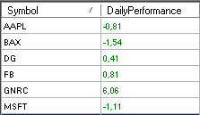

### Usage
```cs
DailyPerformance(DailyPerformanceReference reference, DailyPerformanceCalculationMode mode, int daysAgo)
DailyPerformance(IDataSeries input,DailyPerformanceReference reference, DailyPerformanceCalculationMode mode, int daysAgo)
DailyPerformance(DailyPerformanceReference reference, DailyPerformanceCalculationMode mode, int daysAgo)[int barsAgo]
DailyPerformance(IDataSeries input,DailyPerformanceReference reference, DailyPerformanceCalculationMode mode, int daysAgo)[int barsAgo]
```

### Return value
**double**

When using this method with an index (e.g. **DailyPerformance**(...)\[**int** barsAgo\] ), the value of the indicator will be issued for the referenced bar.

### Parameters
input Input data series for the indicator

reference Possible values are:
-   DailyPerformanceReference.Open
-   DailyPerformanceReference.PreviousClose

mode Possible values are:
-   DailyPerformanceCalculationMode.Points
-   DailyPerformanceCalculationMode.Ticks
-   DailyPerformanceCalculationMode.Percent
-   DailyPerformanceCalculationMode.Currency

daysAgo Number of days in the past

### Visualization


### Example
```cs
//How many ticks are between today’s open and the current price?
DailyPerformance(DailyPerformanceReference.Open, DailyPerformanceCalculationMode.Ticks, 1)[0]

//By how much percent did the stock rise/fall since the last closing price?
DailyPerformance(DailyPerformanceReference.PreviousClose, DailyPerformanceCalculationMode.Percent, 1)[0]

//By how many points/ticks did the future deviate from the start of the trading week to the current value?
DailyPerformance(DailyPerformanceReference.PreviousClose, DailyPerformanceCalculationMode.Points, 3)[0]

//How many EURO/USD does the performance equal?
DailyPerformance(DailyPerformanceReference.PreviousClose, DailyPerformanceCalculationMode.Currency, 3)[0]

//How big is the overnight gap in comparison to the opening price?
DailyPerformance(DailyPerformanceReference.PreviousClose, DailyPerformanceCalculationMode.Points, 1)[0]
```

##DayLines
### Description
The DayLines indicator draws lines for the previous day’s high, low, and close. It also draws a line for the current day’s open. These lines often show a reaction to the market.
Each line can be turned on or off, and the colors and line strengths can be freely set.

See [*CurrentDayOHL*](#currentdayohl), [*PriorDayOHLC*](#priordayohlc).

### Visualization


##DayLinesAdv
### Description
DayLinesAdv draws horizontal lines for the previous day’s high, low, and close, as well as the current day’s open.

[*CurrentDayOHL*](#currentdayohl), [*PriorDayOHLC*](#priordayohlc).

**DaysBack parameter**

The DaysBack parameter sets the number of days in the past for which the lines are to be placed onto the chart.

**Include Weekends parameter**
This parameter manages the interaction with weekend price data. If IncludeWeekends = true, the price data for a trading session resulting from the weekend data is added to the last trading session.

This is generally applicable to traders in different time zones. For example, a trader located in Germany will receive EURUSD data that beginning on Sunday evenings in America.
To add the couple of hours that are transcribed on Sunday to the previous Friday’s session, you simply need to set IncludeWeekends = true.
The first picture shows IncludeWeekends = false:


The second picture shows IncludeWeekends = true:


**Show Prices parameter**
If set to “true”, prices are displayed in addition to the line itself.


**Extend high lines and Extend low lines parameters.**
If set to “true”, the highs and lows that have not yet been „breached“ by the price will be extended onto the right-hand side of the chart using dotted lines.


##GetDayBar
### Description
The function GetDayBar() outputs all values (open, high, low, close, time, median, typical, volume, and weighted) for a specified past or current day i.e. session. GetDayBar() is not intended to be used inside the chart. For this purpose, DayLinesAdv should be used instead. GetDayBar is mainly used as a high-performance replacement for [*PriorDayOHLC*](#priordayohlc).

Several data feed providers also offer historical data, in which case we recommend that you use GetDayBar. If it is intraday data that is offered, it still works adequately to use [*PriorDayOHLC*](#priordayohlc).

If the outputted data varies, the main cause is normally assumed to be the difference between Session Begin and Session End.


### Parameters
daysAgo Number of days in the past
(0 for the current value)

### Return value
DateTime for time
double for all other values

For **daysAgo = 0,** the following applies:
Close = current price (for CalculateOnClosedBar = false)
Time = time of the current day’s open
All other values are calculated using intraday data.

### Usage
```cs
GetDayBar (int daysAgo)
```

### Example
```cs
[TimeFrameRequirements("1 day")]
public class xy : UserIndicator
{
  int daysAgo = 5;
  double historicalClose = Instrument.Round2TickSize(GetDayBar(daysAgo).Close);
}

protected override void OnStart()
{
  Print("The closing price from " + daysAgo + " days ago was at " + historicalClose);
}
```

**Important:**
The attribute *TimeFrameRequirements* must also always be used for the class doing the calling up (in the above example, class xy) if the indicator uses *Multibars*.

##Info
### Description
Info is not an indicator in the classic sense of the word, but is actually more similar to a tool. Depending on the underlying instrument, the background of the chart may show additional information.

### Visualization


##Maximum (MAX)
### Description
Max (MAX) delivers the highest value for a predefined number of periods.

### Usage
```cs
MAX(int period)
MAX (IDataSeries input, int period)
MAX (int period)[int barsAgo]
MAX (IDataSeries input, int period)[int barsAgo]
```

### Return value
**double**

When using this method with an index (e.g. **MAX**(Close, 10)\[**int** barsAgo\] ), the value of the indicator will be issued for the referenced bar.

### Parameters
input Input data series for the indicator

period Number of bars included in the calculations

### Visualization


### Example
```cs
// Output of the highest value of the last 20 periods
// The output is identical to high [GetSerieHighestValue(High,20)]
Print("The highest value of the last 20 periods is " + MAX(High, 20)[0]);
```

##Minimum (MIN)
### Description
Minimum (MIN) outputs the lowest value for a predefined number of periods.

### Usage
```cs
MIN (int period)
MIN (IDataSeries input, int period)
MIN (int period)[int barsAgo]
MIN (IDataSeries input, int period)[int barsAgo]
```

### Return value
**double**

When using this method with an index (e.g. **MIN**(Close, 10)\[**int** barsAgo\] ), the value of the indicator will be issued for the referenced bar.

### Parameters
input Input data series for the indicator

period Number of bars included in the calculations

### Visualization


### Example
```cs
// Outputs the lowest value for the last 20 periods
Print("The lowest value of the last 20 periods is " + MIN(Low, 20)[0]);
```

##MTFBoxes
### Description
What MTFBoxes does is to draw a colored area behind the bars that signify a candle from a higher timeframe. This therefore makes it possible to depict an hourly candle inside a 5-minute chart. The area would contain all 5-minute bars that are located within said hourly candle.

The area turns greener if the candle of the higher timeframe is rising. A Doji would be shown in grey.

### Parameters
TimeFrame Timeframe of the “virtual” candle (second, minute, hour, day, week, month)
TimeFrameValue Value of the timeframe (number)

### Visualization


##PriceLine
### Description
PriceLine is not so much an indicator, but more of a tool.
It places a horizontal line on top of the current market price within the chart.
The colors and line widths are freely configurable.

### Visualization


##PriorDayOHLC
### Description
PriorDayOHLC shows the values for yesterday’s (i.e. the previous session’s) open, high, low, and close. PriorDayOHLC works best when used together with the intraday data series.

**PriorDayOHLCext**
PriorDayOHLCext For people in different time zones, PriorDayOHLCext makes it possible to set the IncludeWeekend parameter to “true”, which is helpful because all data originating from a Saturday or Sunday is treated as if it comes from the previous Friday’s session.

See [*CurrentDayOHL*](#currentdayohl), [*DayLines*](#daylines).

### Parameter
input Input data series for the indicator

### Return value
**double**

When using this method with an index (e.g. **PriorDayOHLC**().PriorHigh\[**int** barsAgo\] ), the value of the indicator will be issued for the referenced bar.

### Usage
```cs
PriorDayOHLC()
PriorDayOHLC(IDataSeries input)

//For the value of open
PriorDayOHLC().PriorOpen[int barsAgo]
PriorDayOHLC(IDataSeries input).PriorOpen[int barsAgo]

//For the value of high
PriorDayOHLC().PriorHigh[int barsAgo]
PriorDayOHLC(IDataSeries input).PriorHigh[int barsAgo]

//For the value of low
PriorDayOHLC().PriorLow[int barsAgo]
PriorDayOHLC(IDataSeries input).PriorLow[int barsAgo]

//For the value of close
PriorDayOHLC().PriorClose[int barsAgo]
PriorDayOHLC(IDataSeries input).PriorClose[int barsAgo]
```

### Visualization


### Example
```cs
// Value from the previous trading day
Print("Yesterday’s open was " + PriorDayOHLC().PriorOpen[0]);
Print("Yesterday’s high was " + PriorDayOHLC().PriorHigh[0]);
Print("Yesterday’s low was " + PriorDayOHLC().PriorLow[0]);
Print("Yesterday’s close was " + PriorDayOHLC().PriorClose[0]);
```

##PriorDayOHLCext
See [*PriorDayOHLC*](#priordayohlc).

##SessionBreakLines
### Description
The indicator SessionBreakLines draws a vertical line at the first candle of a new trading session.
What is special about this indicator is that you can manually set how the so-called “weekend sessions” should be handled. If the parameter IncludeWeekends is set to “true”, then the Sunday sessions will be added to the Friday’s session.
See [*PriorDayOHLC*](#priordayohlc).

### Visualization


##ShowBidAsk
### Description
The ShowBidAsk indicator displays the current bid and ask prices as well as the corresponding volume within the lower part of the chart. It also shows changes in volume even if a trade has not occurred.

### Visualization


##TickCounter
### Description
TickCounter provides information regarding the current number of ticks that are contained within the bar. The indicator can not only count starting from 0, but can also be set to count from a specified number down to 0. TickCounter can display the value either as absolute or as a percentage. It only works with candle charts in which the bars are established based on a fixed number of ticks.

When programming your own scripts, please use Bars, TicksCountForLastBar or Bars, LastBarCompleteness.

### Visualization
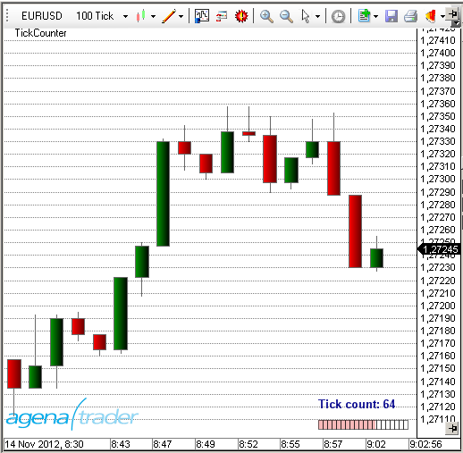

##True Strength Index (TSI)
### Description
The True Strength Index (TSI) is a momentum indicator. It is used as an indicator for trend direction and for displaying overbought or oversold conditions.
As a rule, momentum oscillators preemptively indicate price changes, whereas moving averages generally lag behind the price. The TSI brings together the advantages of these two indicator groups.

### Interpretation
The TSI line moves between 100 and -100. Most values are between +25 and -25. These trigger lines can be used to anticipate overbought or oversold situations. A rising TSI signals an uptrend, while falling TSI suggests a downtrend.

### Further information
[http://en.wikipedia.org/wiki/True_strength_index](http://en.wikipedia.org/wiki/True_strength_index)

### Usage
```cs
TSI(int fast, int slow)
TSI(IDataSeries input, int fast, int slow)
TSI(int fast, int slow)[int barsAgo]
TSI(IDataSeries input, int fast, int slow)[int barsAgo]
```

### Return value
**double**

When using this method with an index (e.g. **TSI**(3,14)\[**int** barsAgo\] ), the value of the indicator will be issued for the referenced bar.

### Parameters
input Input data series for the indicator

fast Number of bars included in the calculation of the fast EMA

slow Number of bars included in the calculation of the slow EMA

### Visualization


### Example
```cs
//Output of the current value for the True Strength Index (TSI)
Print("The current value for the TSI is " + TSI(3, 14)[0]);
```

##Ultimate Oscillator
### Description
Larry Williams developed the Ultimate Oscillator, which was first published in 1985. The Ultimate Oscillator is calculated by means of taking the weighted sum of three oscillators in different timeframes. These three timeframes are the short-term, middle and long-term market cycles. The typical period lengths used are 7, 14 and 28, and the value of the indicator moves between 0 and 100. Values above 70 signify an overbought situation, and values below 30 show that it is oversold.

### Interpretation
Williams defined the following criteria for a buy signal:

A bullish divergence between price and oscillator can be observed, meaning that the market makes a new low but the oscillator remains unchanged.

While this divergence is forming, the oscillator falls below 30.

The oscillator will then resume its upward move towards the high at which it peaked before the divergence began forming.

The buy signal is created when the price breaches that last high.

The long position is closed if the oscillator rises above 70 or if the oscillator rises above 50 and then falls back below 45.
A sell signal consists of bearish divergences forming above 70. These positions are closed once the 30 level marker is breached.

### Usage
```cs
UltimateOscillator(int fast, int intermediate, int slow)
UltimateOscillator(IDataSeries input, int fast, int intermediate, int slow)
UltimateOscillator(int fast, int intermediate, int slow)[int barsAgo]
UltimateOscillator(IDataSeries input, int fast, int intermediate, int slow)[int barsAgo]
```

### Return value
**double**

When using this method with an index (e.g. **UltimateOscillator** (5)\[**int** barsAgo\] ), the value of the indicator will be issued for the referenced bar.

### Parameters
|              |                                                                   |
|--------------|-------------------------------------------------------------------|
| input        | Input data series for the indicator                               |
| fast         | Number of bars for the calculation of the short-term oscillator   |
| intermediate | Number of bars for the calculation of the intermediate oscillator |
| slow         | Number of bars for the calculation of the slow indicator          |

### Visualization


### Example
```cs
// Output of the values for the UltimateOscillator with settings of 7,14,28
Print("The current value for the Ultimate Oscillator is " + UltimateOscillator(7, 14, 28)[0]);
```

##Volume (VOL)
### Description
This is the volume for the shares, futures, ETFs and so on that are traded within a specified time period.


### Further information
[http://de.wikipedia.org/wiki/Volumenanalyse](http://de.wikipedia.org/wiki/Volumenanalyse)

### Usage
```cs
VOL()
VOL(IDataSeries input)
VOL()[int barsAgo]
VOL(IDataSeries input)[int barsAgo]
```

### Return value
**double**

When using this method with an index (e.g. **VOL**()\[**int** barsAgo\] ), the value of the indicator will be issued for the referenced bar.

### Parameter
input Input data series for the indicator

### Visualization


### Example
```cs
//Output of the current volume
Print("The current volume is " + VOL()[0]);
```

##Volume Moving Average (VOLMA)
### Description
The VOLMA calculation is carried out by applying an exponential moving average to the respective volume of each period, that is to say its EMA (volume).

**Caution:**
In trading literature, the Volume Moving Average is often confused with the abbreviation for the Variable Moving Average (VMA).

### Interpretation
The VOLMA indicator helps you to find and assess the relative volume of a period.

Some simple guidelines should be followed:

The volume should be above the VOLMA at a break

After a volume spike (high), an exhaustion phase will kick in. The exhaustion can lead to a complete reversal of the price movement. Generally speaking, however, this is simply a resting phase

After three successive volume spikes, it becomes much less likely that the situation will continue in the same direction

Here, you can find more general information about *Moving Averages*.

### Further information
Volumen-Analyse.de: [http://www.volumen-analyse.de](http://www.volumen-analyse.de)

### Usage
```cs
VOLMA(int period)
VOLMA(IDataSeries input, int period)
VOLMA(int period)[int barsAgo]
VOLMA(IDataSeries input, int period)[int barsAgo]
```

### Return value
**double**

When using this method with an index (e.g. **VOLMA**(14)\[**int** barsAgo\] ), the value of the indicator will be issued for the referenced bar.

### Parameters
input Input data series for the indicator

period Number of bars included in the calculations

### Visualization


### Example
```cs
//Output for the value of the Volume Moving Average (VOLMA)
Print("The current VOLMA value is " + VOLMA(14)[0]);
```

##Volume Oscillator
### Description
The Volume Oscillator makes use of the difference between the moving averages based on the trading volume, with a similar result to the MACD or to any other oscillator in which moving averages are used for calculation.

### Interpretation
The Volume Oscillator is used to determine the trend strength. If developments in the price of the share are accompanied by disproportionate volume oscillator values, this should be regarded as highly relevant. In this way, the indicator can be used to filter out false signals.
Values above zero mean that the shortest moving average of the volume is above the long-term moving average. IsSerieRising prices with a higher short-term volume indicate a bullish scenario.

### Usage
```cs
VolumeOscillator(int fast, int slow)
VolumeOscillator(IDataSeries input, int fast, int slow)
VolumeOscillator(int fast, int slow)[int barsAgo]
VolumeOscillator(IDataSeries input, int fast, int slow)[int barsAgo]
```

### Return value
**double**

When using this method with an index (e.g. **VolumeOszillator**(12,26)\[**int** barsAgo\] ), the value of the indicator will be issued for the referenced bar.

### Parameters
input Input data series for the indicator

fast Number of bars for the calculation of the fast moving average

slow Number of bars for the calculation of the slow moving average

### Visualization


### Example
```cs
//Output of the current value for the Volume Oscillator
Print("The current value for the Volume Oscillator is: " + VolumeOszillator(12,26)[0]);
```

##Volume Profile
### Description
The VolumeProfile indicator displays the real-time volume profile as a vertical histogram on the chart. In this histogram, every bar depicts the cumulative traded volume for a certain price level. The starting bar for the calculations is labeled with a “#”.
These bars inside the histogram have various colors: green indicates executions at or above the ask, which are interpreted as buys. Red means trades at or below the bid, which are interpreted as sells. Grey signifies neutral executions.
It is important to note that the Volume Profile indicator only works together with a real-time data feed. After changes have been made in the properties window, the indicator is restarted and all values that have been calculated up to this point are lost.

See: [*VolumeZones*](#volumezones)

### Interpretation
Prices with especially high trading volume will have a more satiated accumulation and distribution at their respective levels. This leads to price resistance/support zones being formed.

### Visualization
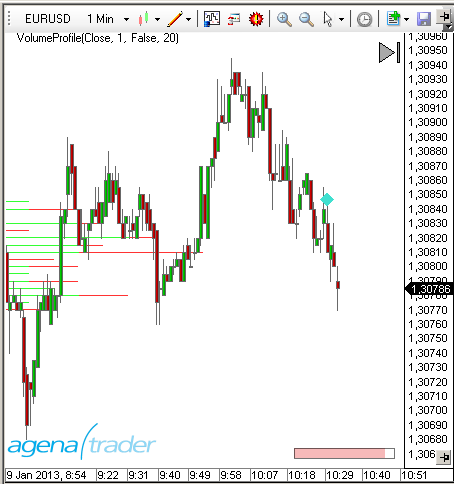

##Volume Rate of Change (VROC)
### Description
The Volume Rate of Change (VROC) is almost exactly the same as the ROC indicator, with the exception that instead of price data, volume data (VOL) is used. A smoothing component is also applied.

### Further information
[http://www.shareholder24.de/boersensoftware-wiki/pages/viewpage.action?pageId=9207904](http://www.shareholder24.de/boersensoftware-wiki/pages/viewpage.action?pageId=9207904)

### Usage
```cs
VROC(int period, int smooth)
VROC(IDataSeries input, int period, int smooth)
VROC(int period, int smooth)[int barsAgo]
VROC(IDataSeries input, int period, int smooth)[int barsAgo]
```

### Return value
**double**

When using this method with an index (e.g. **VROC**(14,3)\[**int** barsAgo\] ), the value of the indicator will be issued for the referenced bar.

### Parameters
input Input data series for the indicator

period Number of bars included in the calculations

smooth Number of Bars included in the calculation for the smoothing

### Visualization


### Example
```cs
//Output of the current value for the Volume ROC
Print("The current value for the Volume ROC is: " + VROC(14, 3)[0]);
```

##VolumeArea
**The installation of the Technical Analysis Package is required in order to access this indicator.**

### Description
Similarly, with this indicator you can also have your own volume profiles displayed. Here you can now determine the start and end time completely freely by clicking on your desired position. There are no restrictions as to where the calculation should start and end. In the upper right corner you have the setting options with which you can switch between the profile types (for a description of these, read more under VolumeSessionPro). With a click on the little red “+” under the profile settings, you can add a further volume profile to your chart; you do so by once again determining the start and end time by left-clicking.
 The settings and the display of the indicator are exactly equivalent to the VolumeSessionPro: via ProfileType you select which calculation method should be used; via ValueArea you determine the percentage for what portion of the volume area should be colored with the highest activity. 
The most effective way of working with the VolumeArea is to place this indicator in the action bar and assign it a hot key. In this way, if necessary, the indicator can be quickly called up and you can specify the desired volume area.


### Parameters
to be announced

### Return value
to be announced

### Usage
to be announced

### Visualization


### Example
to be announced

##VolumeGraph
**The installation of the Technical Analysis Package is required in order to access this indicator.**

### Description
This indicator contains a normal volume histogram, but here, the coloring takes place based on price trends. The VolumeGraph determines short- or long-term price trends; you can set the sensitivity for this using the parameter “SlopeLength”. A high value delivers long-term trends; low values represent short-term price trends. Using the setting “Exponential”, you can select whether the calculation for trend determination should be based on an exponential (=True) or linear (=False) algorithm. This is about the fine-tuning, and no large changes should be expected with this parameter. In addition, the volume histogram also contains a moving average, for which you can enter the period using the parameter “AvgLength”.

### Parameters
to be announced

### Return value
to be announced

### Usage
to be announced

### Visualization


### Example
to be announced

##VolumeKeltnerChannels
**The installation of the Technical Analysis Package is required in order to access this indicator.**

### Description
The VolumeKeltnerChannels are a great tool to determine very high or very low volume in comparison to past periods. Beginning with an upper Keltner channel line calculated with volume data, this line is shifted ever further upwards or downwards using special multipliers. Volume that is higher than the highest Keltner channel line can be interpreted as extremely high volume that shows that huge numbers of trades have been carried out in the current price period and that an unusually large number of traders are buying or selling positions at the current price level.

### Parameters
to be announced

### Return value
to be announced

### Usage
to be announced

### Visualization


### Example
to be announced


##VolumeRiseFall
**The installation of the Technical Analysis Package is required in order to access this indicator.**

### Description
The VolumeRiseFall indicator is a normal volume display as volume bars, with, however, a different coloring than normal. A volume bar is drawn in green when the volume of this bar is higher than the volume of the previous bar, meaning that rising volume is present. A volume bar is drawn in gray when the volume of this bar is lower than the volume of the previous bar, thereby showing falling volume.

### Parameters
to be announced

### Return value
to be announced

### Usage
to be announced

### Visualization


### Example
to be announced

##VolumeSentimentLong
**The installation of the Technical Analysis Package is required in order to access this indicator.**

### Description
This indicator detects bullish volume activity based on the analysis of the volume of a period, the price span of a bar and the close of the bar (=VolumeSpreadAnalysis). 

It screens for 3 signals (listed are the sub-criteria that must be met for the respective signal):

- SellingClimax (dark green)
 6.11..1. Lowest low since 50 periods 
 6.11..2. Bar with large range 
 6.11..3. Extremely high volume 
 
- DemandComingIn (lime green) 
 6.11..1. UpBar (current close larger than previous close) 
 6.11..2. Previous Bar: DownBar (close smaller than previous close) 
 6.11..3. Previous Bar: Bar with large range 
 6.11..4. Previous Bar: Above-average high volume
 
- BagHolding (light green) 
 6.11..1. Lowest low since 50 periods 
 6.11..2. DownBar 
 6.11..3. Bar with small range 
 6.11..4. Above-average high volume 
 6.11..5. Close larger than or equal to the middle of the bar
 
The VolumeSentiments provide the foundation for the calculation of the volume condition; see point 5. When a bullish VolumeSentiment occurs, the bar is colored in the respective color of the signal; you can change this color in the parameter setting

### Parameters
to be announced

### Return value
to be announced

### Usage
to be announced

### Visualization


### Example
to be announced

##VolumeSentimentShort
**The installation of the Technical Analysis Package is required in order to access this indicator.**

### Description
This indicator is the counterpart to the VolumeSentimentLong and detects bearish volume activity based on the analysis of the volume of a period, the price span of a bar and the close of the bar (=VolumeSpreadAnalysis). 

It screens for 3 signals (listed are the sub-criteria that must be met for the respective signal):

- BuyingClimax (dark red) 
 6.12..1. Highest high since 50 periods 
 6.12..2. Bar with large range 
 6.12..3. Extremely high volume 

- SupplyComingIn (red) 
 6.12..1. DownBar 
 6.12..2. Previous Bar: UpBar 
 6.12..3. Previous Bar: Bar with large range 
 6.12..4.Previous Bar: Above-average high volume

- EndOfRisingMarket (coral) 
 6.12..1. Highest high since 50 periods 
 6.12..2. UpBar 
 6.12..3. Bar with small range 
 6.12..4.Above-average high volume 
 6.12..5.Close smaller than or equal the middle of the bar
 
The VolumeSentiments provide the foundation for the calculation of the volume conditions; see point 5. When a bearish VolumeSentiment occurs, the bar is colored in the respective color of the signal; you can change this color in the parameter settings.

### Parameters
to be announced

### Return value
to be announced

### Usage
to be announced

### Visualization


### Example
to be announced

##VolumeSessionPro 
**The installation of the Technical Analysis Package is required in order to access this indicator.**

### Description
This indicator is equivalent to the well-known VolumeProfile indicator with a display for a specific time span (session). You can determine the start time and the length of a session however you wish. For each session, the VolumeProfile is then shown. Use this indicator only in timeframes smaller than 1 day; the smaller the timeframe selected, the more detailed the display of the VolumeProfile. The price at which the most volume was traded in the respective session is shown as a red bar. The price area in which, for example, 70% of the trading activity for the respective session took place, is colored light blue. You can determine this percentage yourself as you wish under the parameter “ValueArea”. Furthermore, you have four different options for displaying the volume information:

Furthermore, you have four different options for displaying the volume information: 

**4.1.1. VOC (Volume on close):** Loads the entire volume of a bar at the closing price of this bar – e.g. if a 5-minute bar has a volume of 280 and a range of 1.5 points with a closing price at 1534.25, all 280 volume units are counted at the closing price of 1534.24.

**4.1.2. TPO (Time price opportunity):** This method does not take the actual traded volume into account, but instead counts an individual volume unit for each price in the traded range of the bar – e.g. if a 5-minute bar has its high at 1534 and its low at 1532.5, then one volume unit is counted for each of the following prices: 1532.50, 1532.75, 1533.0, 1533.25, 1533.50, 1533.75, and 1534. 

**4.1.3. VWTPO (Volume weighted time price opportunity):** This version distributes the traded volume of a bar across its price range – e.g. if a 5-minute bar exhibits a volume of 280 with a range of 1.5 points, with its high at 1534 and low at 1532.5, then 40 volume units (=280/7) are added to each of the seven prices in this range: 1532.50, 1532.75, 1533.0, 1533.25, 1533.50, 1533.75, and 1534.

**4.1.4. VTPO (Volume time price opportunity):** Here, the traded volume is added to each price of the range – e.g. if a 5-minute bar has 280 volume units, a range of 1.5 points with a high at 1534 and low at 1532.5, then 280 volume units are added to each of the seven prices of the range:: 1532.50, 1532.75, 1533.0, 1533.25, 1533.50, 1533.75, and 1534.


### Parameters
to be announced

### Return value
to be announced

### Usage
to be announced

### Visualization


### Example
to be announced

##VolumeTickSpeed 
**The installation of the Technical Analysis Package is required in order to access this indicator.**

### Description
**ATTENTION!** You can only use this indicator in the tick chart! The indicator measures the number of ticks that are traded during a number of seconds defined by the user. You can set the number of seconds under the parameter “Period”. A high tick speed can, therefore, be equated with high trading intensity, which can in turn often be observed at turning points in the market. With the parameter “LimitValue”, you can specify from which number of ticks during the selected period the background should be colored in order to display extreme values.


### Parameters
to be announced

### Return value
to be announced

### Usage
to be announced

### Visualization


### Example
to be announced

##VolumeUDR 
**The installation of the Technical Analysis Package is required in order to access this indicator.**

### Description
The VolumeUpDownRatio is the relationship between UpVolume and DownVolume, displayed as an oscillator. Volume is classified as UpVolume when the current close of the price candle is located above the close of the prior candle; the opposite applies for DownVolume. Values above 80 are to be graded as a bearish signal; values under 20 as a bullish signal. Besides this, a moving average can be shown, which can serve as an additional signal generator. 

- Using “DrawCandleOutline”, you can have the border of your candles colored accordingly when bullish/bearish extreme values occur.

- PriceWeightChange regulates whether you would like to have the weighted change of the market price flow into the calculation of the indicator.


### Parameters
to be announced

### Return value
to be announced

### Usage
to be announced

### Visualization
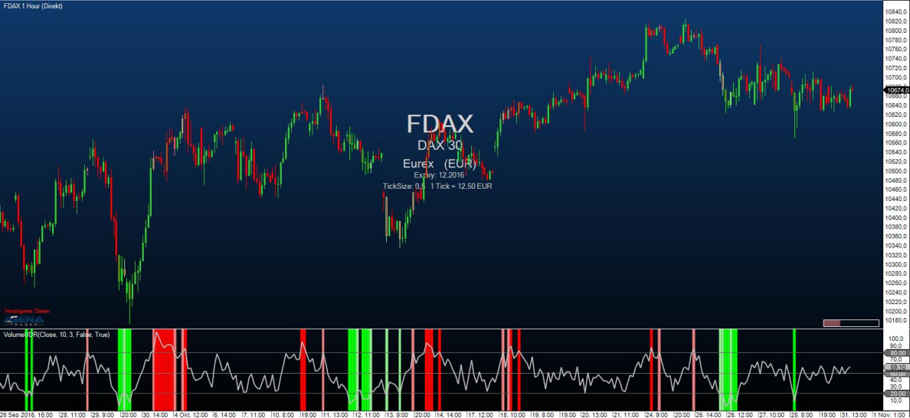

### Example
to be announced

##VolumeUpDown
### Description
This indicator is a variation of the volume indicator, with the slight difference that the volume bars are shown in different colors depending on whether the price movement forms an up or down bar. An up (rising) bar shows the volume in green, while a down (falling) bar shows the volume in red. A Doji, where open = close, shows the volume in blue.

### Usage
```cs
VolumeUpDown()
VolumeUpDown(IDataSeries input)
VolumeUpDown()[int barsAgo]
VolumeUpDown(IDataSeries input)[int barsAgo]
```

### Return value
**double**

When using this method with an index (e.g. **VolumeUpDown**()\[**int** barsAgo\] ), the value of the indicator will be issued for the referenced bar.

### Parameter
input Input data series for the indicator

### Visualization


### Example
```cs
//Output of the current volume
Print("The current volume is " + VolumeUpDown()[0]);
```

##Volume Zones
### Description
This indicator draws a histogram on the left side of the chart. This histogram contains the historical volume, and inside the histogram, the length of the bars shows the cumulative volume. Traders can configure the price series (open, high, low etc.) with the help of the properties dialog box.
An up bar (where the close is above the open) shows the bar in green, and falling bars are displayed in red. The indicator is only designed to be used with historical data. In order to view volume changes in real-time, it is wise to consider using the VolumeProfile.

##VolumeZoneOscillator
**The installation of the Technical Analysis Package is required in order to access this indicator.**

### Description
The VolumeZoneOscillator divides the volume activity into UpVolume and DownVolume, similarly to the VolumeUDR. Volume is ranked as UpVolume when the current closing price is located above the prior closing price; vice versa for DownVolume. The oscillator calculated hereby outputs relative percentage values. An instrument is in a positive trend when the VolumeZoneOscillator rises above a level of 5% and vice versa in a negative trend, when it falls below -5%. Values above 40% show overbought situations, while values above 60% are an indication for an extreme exaggeration in the market. On the other hand, values smaller than -40% are deemed oversold and values smaller than -60% to be classified as enormously oversold and exaggerated.

### Parameters
to be announced

### Return value
to be announced

### Usage
to be announced

### Visualization


### Example
to be announced

##Williams %R
### Description
Larry Williams developed the Williams %R. It is a momentum indicator, and is the inverse of the Fast Stochastic Oscillator. Williams %R, which is also called simply %R, reflects the level of the close relative to the highest high for the look-back period. The Stochastic Oscillator, on the other hand, reflects the level of the close relative to the lowest low. %R multiplies the raw value by -100 as a means of correcting for the inversion. This means that the Fast Stochastic Oscillator and Williams %R actually produce the exact same lines, with different scaling. The Williams %R fluctuates between 0 and -100. Values between 0 to -20 are deemed overbought, and values from -80 to -100 are seen as oversold. Naturally, signals taken from the Stochastic Oscillator can also be applied to Williams %R.

### Interpretation
As with the Stochastic Oscillator, Williams %R reflects the level of the close relative to the high-low range over a given period of time. Assume that the highest high equals 110, the lowest low equals 100 and the close equals 108. The high-low range is 10 (110 - 100), which is the denominator in the %R formula. The highest high less the close equals 2 (110 - 108), which is the numerator. 2 divided by 10 equals 0.20. Multiply this number by -100 to get -20 for %R. Williams %R would equal -30 if the close was 103 (0.30 x -100).

The centerline, -50, is an important level to watch. Williams %R moves between 0 and -100, which makes -50 the midpoint. Think of it as the 50 yard line in football. The offense has a higher chance of scoring when it crosses the 50 yard line. The defense has an edge as long as it prevents the offense from crossing the 50 yard line. A Williams %R cross above -50 signals that prices are trading in the upper half of their high-low range for the given look-back period. This suggests that the cup is half full. Conversely, a cross below -50 means prices are trading in the bottom half of the given look-back period. This suggests that the cup is half empty.

Low readings (below -80) indicate that the price is near its low for the given time period. High readings (above -20) indicate that the price is near its high for the given time period.

### Further information
<http://www.broker-test.de/finanzwissen/technische-analyse/williams-percent-r/>

### Usage
```cs
WilliamsR(int period)
WilliamsR(IDataSeries input, int period)
WilliamsR(int period)[int barsAgo]
WilliamsR(IDataSeries input, int period)[int barsAgo]
```

### Return value
**double**

When using this method with an index (e.g. **WilliamsR**(14)\[**int** barsAgo\] ), the value of the indicator will be issued for the referenced bar.

### Parameters
input Input data series for the indicator

period Number of bars included in the calculations

### Visualization


### Example
```cs
WilliamsR(int period)
WilliamsR(IDataSeries input, int period)
WilliamsR(int period)[int barsAgo]
WilliamsR(IDataSeries input, int period)[int barsAgo]
```
##WyckoffWave

**The installation of the Technical Analysis Package is required in order to access this indicator.**

### Description
The WyckoffWave indicator adds the volume for each following bar until a price wave is over / finished. You can set the sensitivity of the price waves. When the  volume of a wave rises to particularly high values, is it very often because a turning point in the chart has been reached. When the volume bars are colored red, we are dealing with a short wave; green volume bars indicate a long wave. 

Using the parameter “MedianPeriod” you can select how sensitively the indicator should determine the individual price waves. The smaller the value, the larger the price waves that the indicator calculates. 

The parameter Poles serves to fine-tune the display of the volume waves; you can select a parameter between 1-4. Changing this value usually causes only imperceptible changes.

### Parameters
to be announced

### Return value
to be announced

### Usage
to be announced

### Visualization


### Example
to be announced


##ZigZag
### Description
The ZigZag indicator searched for extreme points in different timeframes. It finds the extreme points by using threshold values that traders themselves define. These specified threshold values determine the extent to which the market direction needs to change before the ZigZag line alters its orientation and forms a further extreme point.

### Interpretation
The previous extreme values (local highs or lows) are ideally suited for either entries or stop targets.

**Caution:** The ZigZag is not an indicator in the common sense. Position and direction of the zigzag can change retrospectively (repainting indicator).

### Further information
<http://www.robotrading.de/indikatoren/zig-zag-indikator-zeigt-hoch-und-tief-punkte-im-forex-markt>

### Usage
```cs
//For the upper extreme value
ZigZag(DeviationType deviationType, double deviationValue, bool useHighLow).ZigZagHigh[int barsAgo]
ZigZag(IDataSeries input, DeviationType deviationType, double deviationValue, bool useHighLow).ZigZagHigh[int barsAgo]

//For the lower extreme value
ZigZag(DeviationType deviationType, double deviationValue, bool useHighLow).ZigZagLow[int barsAgo]
ZigZag(IDataSeries input, DeviationType deviationType, double deviationValue, bool useHighLow).ZigZagLow[int barsAgo]
```

### Return value
**double**

When using this method with an index (e.g. **ZigZag**(...)\[**int** barsAgo\] ), the value of the indicator will be issued for the referenced bar.

A return value of 0 indicates that no high or low point has been found yet.

### Parameters
|                |                                                                                                                    |
|----------------|--------------------------------------------------------------------------------------------------------------------|
| input          | Input data series for the indicator                                                                                |
| deviationType  | The change in points or percent
DeviationType.Points and DeviationType.Percent       |
| deviationValue | Value of the deviation                                                                                             |
| useHighLow     | Defines whether the high/low of a bar will be used for extreme values or if you want to use closing prices instead |

### Visualization


### Example
```cs
//Output of the market value for the last high point
Print("The last high of the ZigZag indicator was at " + ZigZag(DeviationType.Percent, 1, true).ZigZagHigh[0]);

// Output of the market value for the last low point
Print("The last low of the ZigZag indicator was at " + ZigZag(DeviationType.Percent, 1, true).ZigZagLow[0]);
```
